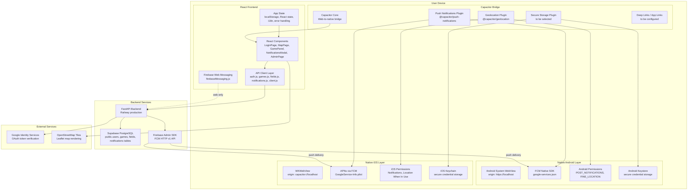

# Mobile Application Architecture

**ISSUE:** 181
**Date:** 2026-06-30
**Status:** Approved architecture reference
**Scope:** Documentation only - no code implementation

---

## 1. Purpose

This document defines the official mobile application architecture for Yesh Mishak. It establishes layer boundaries, data flow ownership, integration responsibilities, and architectural guardrails that apply to all mobile platform work (Android, iOS, and mobile web).

This document is the authoritative reference for:

- Where business logic lives (and where it must not live)
- How each system layer communicates with the others
- Which layer owns each cross-cutting concern (auth, push, GPS, storage)
- What native code is allowed to do and what it must delegate

All implementation work for Android and iOS projects must conform to this architecture.

---

## 2. Architecture Principles

1. **React is the application layer.** All UI rendering, state management, user interaction handling, and API communication happen in React code. Native layers do not render application UI.

2. **Backend is the source of truth.** Auth decisions, game state, field data, notification targeting, permissions, and business rules are owned by the FastAPI backend. The frontend displays backend state; it does not independently determine it.

3. **Capacitor is a bridge, not a business logic layer.** Capacitor connects React to native OS capabilities (push tokens, GPS hardware, secure storage, deep link routing). It does not contain application logic, validation rules, or data transformation.

4. **Native layers are thin.** Android and iOS native code handles only OS-level integration that Capacitor plugins expose. Native code must not duplicate business rules, maintain independent state, or bypass the React/backend contract.

5. **No duplicated business rules.** A rule that exists in the backend must not be re-implemented in React, Capacitor, or native code. If the frontend needs a decision, it asks the backend.

6. **Security-sensitive operations happen server-side.** Token verification, password hashing, account linking, permission checks, and notification targeting are backend responsibilities. The frontend and native layers handle credential transport, not credential evaluation.

---

## 3. Layer Model

### 3.1 Architecture Diagram



### 3.2 Layer Responsibility Table

| Layer | Responsibilities | Must Not Do |
| :--- | :--- | :--- |
| **React Frontend** | Render UI; manage component state; call backend APIs via axios; handle i18n (Hebrew/English); manage localStorage session; request browser/native permissions; display map via Leaflet; show notifications UI | Verify tokens; hash passwords; enforce business rules independently; access native APIs directly (use Capacitor plugins) |
| **API Client** (`frontend/src/api/`) | Build HTTP requests; attach JWT Bearer token; handle 401 auto-logout; provide retry logic for safe reads | Make auth decisions; cache business state beyond request deduplication; call Supabase directly |
| **Capacitor Bridge** | Expose native capabilities to React via JavaScript API; forward push tokens; provide GPS coordinates; provide secure storage access; handle deep link entry | Contain business logic; transform API responses; make auth decisions; store application state |
| **Native Android** | Host WebView (`https://localhost` origin); receive FCM push via native SDK; manage OS-level permissions; provide Android Keystore access; handle app lifecycle (background/resume) | Render application UI; call backend APIs directly; duplicate game/field/auth logic; store business data outside React/backend |
| **Native iOS** | Host WKWebView; receive APNs push via FCM; manage OS permissions; provide Keychain access; handle app lifecycle | Same restrictions as Android |
| **FastAPI Backend** | Authenticate users (password + Google OAuth); issue and verify JWTs; enforce game rules (join/leave/create/close/extend); manage fields; target and send push notifications via FCM; enforce rate limits and brute-force protection; manage admin operations | Render UI; know about Capacitor or native code; depend on client-side state |
| **Supabase** | Store persistent data (`public.users`, games, fields, notifications, preferences); enforce RLS policies | Make business decisions (those are in FastAPI); authenticate users (the app uses its own auth, not Supabase Auth) |
| **Firebase/FCM** | Deliver push notifications to devices; manage device token lifecycle | Make notification targeting decisions (backend decides who receives what) |

---

## 4. Data Flow

### 4.1 App Startup

```
1. Native shell launches WebView
2. WebView loads built React app from bundled dist/
3. React checks localStorage for access_token
4. If token exists:
   a. Decode JWT subject (user ID) client-side (no verification - display only)
   b. Restore user session from localStorage (id, name, email, username)
   c. Navigate to MapPage
   d. Start foreground push notification listener (web: Firebase Messaging; native: Capacitor plugin)
5. If no token:
   a. Show language selection (if first launch)
   b. Show onboarding (if not completed)
   c. Show LoginPage
6. MapPage loads fields from GET /fields/ with map bounds
7. MapPage requests GPS position via navigator.geolocation (web) or Capacitor Geolocation (native)
```

### 4.2 Authentication

```
Password Login:
1. User enters username or email + password in LoginPage
2. Frontend POST /auth/login { username, password }
3. Backend looks up public.users by username; if not found and input contains @, tries email
4. Backend verifies password_hash with bcrypt
5. Backend issues JWT (sub=user_id, email, iat, exp)
6. Frontend stores access_token + user info in localStorage
7. Frontend dispatches auth-session-changed event
8. App navigates to MapPage

Google OAuth:
1. LoginPage loads Google Identity Services script
2. User clicks Google Sign-In button
3. Google returns credential JWT client-side
4. Frontend POST /auth/google { token: googleIdToken }
5. Backend verifies token via google.oauth2.id_token.verify_oauth2_token
6. Backend checks email_verified claim (AUTH-001 fix)
7. Backend finds or creates user in public.users by email
8. Backend issues JWT
9. Frontend stores session (same as password flow)

Registration:
1. User fills form: full_name, username, email, phone_number, password, password_confirm
2. Frontend POST /auth/register { ... }
3. Backend validates uniqueness (username, email, phone_number) against public.users
4. Backend hashes password, inserts into public.users
5. Backend issues JWT
6. Frontend stores session

Logout:
1. Frontend POST /auth/logout (server invalidates tokens_valid_after)
2. Frontend clears localStorage (access_token, user info)
3. Frontend dispatches auth-session-changed event
4. App shows LoginPage

Auto-logout on 401:
1. API client interceptor detects 401 response
2. Clears localStorage
3. Dispatches auth-session-changed event
4. User sees LoginPage
```

### 4.3 Games

```
View active/upcoming games:
1. FieldDetailsPanel fetches field details via GET /fields/{id}
2. Active game data is embedded in field response
3. User sees game card with participants, time, status

Create game:
1. Organizer fills OpenGameModal form
2. Frontend POST /games/ { field_id, sport_type, date, time, ... }
3. Backend validates, creates game, triggers game-created notifications
4. UI refreshes field details

Join game:
1. Player clicks Join in GamePanel
2. Frontend POST /games/{id}/join { user_id }
3. Backend validates capacity, status, creates player-joined notification
4. UI updates participant list

Leave/Extend/Close:
1. Similar pattern: Frontend POST /games/{id}/{action}
2. Backend validates permissions and state transitions
3. Backend creates relevant notifications
4. UI refreshes
```

### 4.4 Fields

```
Load fields on map:
1. MapPage moves/zooms
2. Debounced GET /fields/?north=X&south=X&east=X&west=X
3. Response: array of fields with position, name, sport_type, active_game
4. React renders stadium markers on Leaflet map
5. Fields are cached in localStorage for instant display on next load

Add field:
1. User opens AddFieldModal
2. Optionally uses GPS for current location
3. Fills name, city, sport_type, location
4. Frontend POST /fields/ { ... }
5. Backend creates field in Supabase
6. Map refreshes

Report field:
1. User opens FieldReportModal
2. Selects category (wrong_location, field_closed, etc.)
3. Frontend POST /field-reports/ { field_id, category, description }
4. Backend stores report for admin review
```

### 4.5 Notifications

```
In-app notifications:
1. MapPage polls GET /notifications/unread-count every 20s (production)
2. User opens NotificationInboxModal
3. GET /notifications returns notification list
4. User reads notification: PATCH /notifications/{id}/read
5. Mark all read: PATCH /notifications/read-all

Push notification registration (web):
1. After login, startForegroundPushNotifications() runs
2. Checks serviceWorker and Notification API support
3. Registers firebase-messaging-sw.js service worker
4. Gets FCM token via getToken() with VAPID key
5. Frontend POST /notifications/push-token { token }
6. Backend stores token for the user

Push notification registration (native - Capacitor):
1. After login, Capacitor PushNotifications plugin requests permission
2. Native FCM SDK obtains device token
3. Plugin returns token to React via listener
4. Frontend POST /notifications/push-token { token }
5. Backend stores token (same endpoint, same format)

Push notification delivery:
1. Backend event occurs (game created, player joined, game closing, etc.)
2. Backend determines notification candidates based on preferences (radius, city, field)
3. Backend calls FCM HTTP v1 API via firebase_push.py
4. FCM delivers to device (web: service worker; native: OS notification tray)

Notification preferences:
1. User opens NotificationsModal (preferences)
2. Configures: enabled, sport_type, notification_type (radius/city/field), radius_km, location
3. Frontend PUT /notifications/preferences { ... }
4. Backend stores preferences; uses them for future targeting
```

---

## 5. Authentication Architecture

### 5.1 Login Ownership

| Concern | Owner |
| :--- | :--- |
| Login form UI | React (LoginPage.jsx) |
| Username/email + password validation | Backend (POST /auth/login) |
| Google OAuth token verification | Backend (POST /auth/google, google.py) |
| Password hashing (bcrypt) | Backend (passwords.py) |
| JWT creation | Backend (jwt.py) |
| JWT decode for display (user ID extraction) | Frontend (auth.js - no verification, display only) |
| JWT verification for protected endpoints | Backend (dependencies.py) |
| Session storage | Frontend (localStorage on web; must migrate to secure storage on native) |
| Token refresh | Not implemented - JWT expires after 7 days (configurable) |
| Brute-force protection | Backend (brute_force.py, rate_limit.py) |

### 5.2 Backend Token Responsibility

The backend is the sole issuer and verifier of JWTs:

- **Issuing:** `create_access_token(subject, email)` in `backend/app/auth/jwt.py`
- **Verification:** `decode_access_token(token)` called by `require_active_user` dependency
- **Invalidation:** `tokens_valid_after` column in `public.users` - backend checks JWT `iat` against this timestamp
- **Algorithm:** HS256 with `JWT_SECRET` env var
- **Expiry:** Configurable via `JWT_EXPIRE_MINUTES` (default: 10080 = 7 days)

### 5.3 Mobile Secure Storage

On web, the JWT is stored in `localStorage`. This is acceptable for browsers but insufficient for native mobile apps where `localStorage` is backed by unencrypted WebView storage.

**Required for native:** A Capacitor secure storage plugin must be selected and integrated to store the JWT and any sensitive session material. The plugin must use:

- Android Keystore on Android
- iOS Keychain on iOS

The React API client (`client.js`) must be adapted to read the token from secure storage instead of (or in addition to) `localStorage` when running inside Capacitor.

### 5.4 Logout and Session Clear

Logout performs two actions:

1. **Server-side:** POST /auth/logout sets `tokens_valid_after` to current time, invalidating all previously issued JWTs for the user
2. **Client-side:** Clears `access_token`, `currentUserId`, `currentUserName`, `currentUserEmail`, `currentUsername` from localStorage; dispatches `auth-session-changed` event

On native, logout must additionally clear the secure storage credential.

---

## 6. Notifications Architecture

### 6.1 In-App Notifications

In-app notifications are stored in the Supabase `notifications` table. The React frontend polls `GET /notifications/unread-count` on a 20-second interval and displays a badge on the notification bell icon. The full notification list is fetched on demand when the user opens the inbox modal.

The backend creates notification records when game events occur (game created, player joined, game extended, game closed). Notification targeting uses user preferences (radius-based, city-based, or field-specific).

### 6.2 Push Notification Responsibility Boundaries

| Concern | Owner |
| :--- | :--- |
| Decide who receives a notification | Backend (notification_templates.py, notifications.py) |
| Compose notification content | Backend (notification_templates.py) |
| Deliver notification to device | Backend via FCM HTTP v1 API (firebase_push.py) |
| Request push permission from user | Frontend (web: Notification API; native: Capacitor plugin) |
| Obtain device push token | Frontend (web: Firebase getToken; native: FCM native SDK via Capacitor) |
| Send push token to backend | Frontend (POST /notifications/push-token) |
| Store push tokens per user | Backend (Supabase) |
| Display push in OS notification tray | OS (web: service worker; native: FCM/APNs) |
| Handle push tap / deep link | Frontend (to be implemented for native) |
| Clean up invalid tokens | Backend (firebase_push.py removes UNREGISTERED/INVALID tokens) |

### 6.3 Token Registration Ownership

The frontend is responsible for obtaining and submitting push tokens to the backend. The backend stores tokens per user and uses them for delivery. When a token becomes invalid (device unregistered, app uninstalled), the backend detects the FCM error code and removes the token.

On web, the token is a Firebase Messaging token obtained via the VAPID key and service worker.

On native, the token is a native FCM device token (Android) or APNs device token mapped through FCM (iOS). Both formats are compatible with the backend's FCM HTTP v1 API - no backend changes are required.

### 6.4 Web vs Native Push

| Aspect | Web | Native (Capacitor) |
| :--- | :--- | :--- |
| Permission API | `Notification.requestPermission()` | `PushNotifications.requestPermissions()` |
| Token source | Firebase Web SDK `getToken()` | Native FCM SDK via `PushNotifications.register()` |
| Background delivery | Service worker (`firebase-messaging-sw.js`) | OS notification tray (FCM/APNs native) |
| Foreground delivery | `onMessage()` listener creates `Notification` | `pushNotificationReceived` listener |
| Service worker required | Yes | No (not supported in WebView) |
| Backend endpoint | Same: POST /notifications/push-token | Same: POST /notifications/push-token |

---

## 7. Native Integrations

### 7.1 GPS / Geolocation

**Current web implementation:** Uses `navigator.geolocation.getCurrentPosition()` in three places:

- `MapPage.jsx` - center map on user location
- `AddFieldModal.jsx` - use current location for new field
- `NotificationsModal.jsx` - use current location for radius-based notification preferences

**Native adaptation:** On Capacitor, `navigator.geolocation` works but has limitations (no background tracking, limited permission control). The `@capacitor/geolocation` plugin provides a more reliable native API with proper permission handling.

| Concern | Owner |
| :--- | :--- |
| Request location permission | Frontend via Capacitor Geolocation plugin |
| Obtain coordinates | Frontend via Capacitor Geolocation plugin |
| Use coordinates for map centering | Frontend (MapPage.jsx) |
| Use coordinates for field creation | Frontend (AddFieldModal.jsx) |
| Use coordinates for notification preferences | Frontend (NotificationsModal.jsx) |
| Store/validate location data | Backend (field lat/lng, notification preference lat/lng) |
| Declare Android permissions | Native (AndroidManifest.xml: ACCESS_FINE_LOCATION) |
| Declare iOS permissions | Native (Info.plist: NSLocationWhenInUseUsageDescription) |

### 7.2 Push Notifications

See Section 6 for full details. Summary of native integration points:

- **Android:** `google-services.json` in `android/app/`; `@capacitor/push-notifications` plugin; `POST_NOTIFICATIONS` permission in AndroidManifest.xml (already added)
- **iOS:** `GoogleService-Info.plist` in iOS project; same Capacitor plugin; notification permission requested at runtime

### 7.3 Secure Storage

Not yet implemented. Required for storing JWT tokens on native platforms.

| Requirement | Detail |
| :--- | :--- |
| Storage mechanism (Android) | Android Keystore via Capacitor secure storage plugin |
| Storage mechanism (iOS) | iOS Keychain via Capacitor secure storage plugin |
| What is stored | JWT access_token; potentially user session metadata |
| When written | After successful login (password or Google OAuth) |
| When cleared | On logout; on 401 auto-logout |
| Plugin selection | Open decision - see Section 13 |

### 7.4 Deep Links

Not yet implemented. Required for handling links that open the app to a specific screen.

| Concern | Detail |
| :--- | :--- |
| Entry point | Native OS intercepts URL matching configured pattern |
| URL scheme | Custom scheme (e.g., `yeshmishak://`) or Android App Links / iOS Universal Links |
| Routing | Native layer passes URL to Capacitor; Capacitor fires event; React resolves to internal route |
| Supported targets | Field details (`/field/{id}`), game details, notification deep link |
| Business logic | None in native - React reads the URL parameters and fetches data from backend |

---

## 8. Backend API Role

### 8.1 Backend is Source of Truth

The FastAPI backend (`backend/app/`) is the authoritative system for:

| Domain | Backend Responsibility | Frontend Role |
| :--- | :--- | :--- |
| **Users** | Create, authenticate, moderate, restrict | Display user info; send credentials |
| **Games** | Create, join, leave, extend, close; enforce capacity limits, time rules, status transitions | Display game state; send user actions |
| **Fields** | Create, store, serve by bounds; manage reports | Display on map; send new field data |
| **Notifications** | Target recipients, compose content, deliver via FCM, store read/unread state | Display inbox; mark read; submit push token |
| **Auth** | Hash passwords, verify Google tokens, issue/verify JWTs, enforce brute-force limits | Transport credentials; store JWT |
| **Admin** | User moderation, game management, field management, stats | Display admin UI; send admin actions |
| **Content moderation** | Validate game descriptions, detect duplicates | Submit text for validation |

### 8.2 Rules for Frontend/Native Code

1. **Do not bypass backend validation.** Client-side validation (e.g., form field length) is for UX convenience only. The backend re-validates everything.
2. **Do not cache business decisions.** The frontend may cache display data (field list, notification count) but must not cache auth decisions, permission checks, or game state transitions.
3. **Do not implement game rules in native code.** Join/leave/extend/close logic, capacity limits, time calculations, and status transitions exist only in the backend.
4. **Do not call Supabase directly from the frontend.** All data access goes through the FastAPI backend. The frontend does not have Supabase credentials.
5. **Do not duplicate notification targeting.** The backend decides who receives notifications based on stored preferences. The frontend submits preferences and tokens; it does not decide delivery.

### 8.3 Platform Identity

Both Android and iOS use the same application identifier:

| Platform | Identifier Type | Value |
| :--- | :--- | :--- |
| Capacitor (shared) | `appId` | `com.yeshmishak.app` |
| Android | `applicationId` | `com.yeshmishak.app` |
| iOS | Bundle Identifier | `com.yeshmishak.app` |

The shared `appId` in `frontend/capacitor.config.ts` is the source of truth. When Capacitor generates platform projects (`npx cap add android`, `npx cap add ios`), it applies this value as the Android `applicationId` and iOS Bundle Identifier respectively.

These identifiers are permanent - changing them after publication on Google Play or the App Store creates a new app listing. See ISSUE-182 (Android) and ISSUE-183 (iOS) in `docs/product-decisions.md` for full rationale.

### 8.4 Environment Strategy

Development, staging, and production environments use separate backends, Supabase projects, Firebase projects, and suffixed app identifiers (`.dev`, `.staging`) for non-production builds. Environment selection is build-time only.

See `docs/mobile-environment-strategy.md` for the full environment strategy (ISSUE-184).

### 8.5 Configuration Management

API URLs, Firebase config, Supabase credentials, and feature flags are managed through environment variables. Secrets never appear in frontend/mobile code. A hardcoded configuration audit confirmed compliance.

See `docs/mobile-configuration-strategy.md` for the full configuration strategy (ISSUE-185).

### 8.6 Plugin Governance

Native plugin adoption follows a governance policy requiring explicit owner approval, a completed proposal template, minimal permissions, and security/privacy review. The default rule is to prefer web APIs over native plugins.

See `docs/native-plugin-governance-policy.md` for the full governance policy (ISSUE-186).

### 8.7 Build Strategy

Four build types (Debug, Internal Testing, Beta, Release) map to isolated environments with distinct identifiers, signing, and distribution channels. A 21-point release safety checklist gates production builds.

See `docs/mobile-build-strategy.md` for the full build strategy (ISSUE-187).

### 8.8 React/Vite/Capacitor Compatibility

The React 19 + Vite 8 frontend has been audited for Capacitor WebView compatibility. Build output aligns with Capacitor `webDir`, routing is compatible, and most browser APIs work in WebView. Web push and Google Sign-In require native code paths.

See `docs/react-vite-capacitor-compatibility-report.md` for the full compatibility audit (ISSUE-189).

### 8.9 Capacitor Version Strategy

The project targets Capacitor 8.x. All official Capacitor packages must remain on the same major version. Upgrades require a dedicated issue with migration guide review, plugin audit, and build validation.

See `docs/capacitor-version-strategy.md` for the full version strategy (ISSUE-190).

---

## 9. Out of Scope

This document defines architecture only. The following are explicitly out of scope:

| Item | Status |
| :--- | :--- |
| Code implementation | Not part of this issue |
| Android project creation | Already done (PR #740); no changes here |
| iOS project creation | Deferred to a future issue |
| Firebase configuration | Requires Firebase Console access; separate issue |
| Capacitor plugin installation | Separate implementation issues |
| Backend code changes | No changes required for architecture documentation |
| Environment variable changes | Separate DevOps task |
| Signing key generation | Separate DevOps task |
| Store submission | Separate release task |

---

## 10. Risks and Guardrails

### 10.1 Identified Risks

| # | Risk | Severity | Mitigation |
| :--- | :--- | :--- | :--- |
| R-01 | localStorage JWT storage is insecure on native platforms | High | Implement secure storage plugin before production native release |
| R-02 | No Capacitor 8-compatible Google Sign-In plugin exists | High | Evaluate Android Credential Manager API, plugin fork, or WebView OAuth redirect as alternatives |
| R-03 | Firebase Web Messaging (service worker) does not work in Capacitor WebView | Medium | Already mitigated: `@capacitor/push-notifications` plugin installed; React code must detect native vs web and use the correct push path |
| R-04 | CORS does not include Capacitor WebView origin (`https://localhost`) | High | Must add to Railway CORS_ORIGINS before native app can call backend |
| R-05 | `google-services.json` not present in Android project | High | Must download from Firebase Console before native push works |
| R-06 | Deep link routing not designed | Medium | Define URL scheme and route mapping before implementing |
| R-07 | No token refresh mechanism | Low | JWT expires after 7 days; user must re-login. Acceptable for initial launch; token refresh can be added later |
| R-08 | Web push and native push code paths may diverge | Medium | Create a shared abstraction in React that detects platform and delegates to the correct push registration method |

### 10.2 Guardrails

1. **Code review gate:** Any PR that adds logic to `frontend/android/` or a future `frontend/ios/` directory beyond plugin configuration must be reviewed for business logic leakage.
2. **No direct Supabase access from frontend:** The frontend package.json must not add `@supabase/supabase-js` as a dependency.
3. **Backend API contract:** Native platforms use the same backend API endpoints as the web app. No native-specific backend endpoints should be created unless absolutely necessary (and documented here first).
4. **Single push token endpoint:** Both web and native push tokens are submitted to the same `POST /notifications/push-token` endpoint. The backend does not need to distinguish token types because FCM handles both.

---

## 11. Open Decisions

| # | Decision Needed | Context | Owner |
| :--- | :--- | :--- | :--- |
| OD-01 | Capacitor secure storage plugin selection | Options: `@capacitor/preferences` (not encrypted), `@capacitor-community/secure-storage` (encrypted), `@aparajita/capacitor-secure-storage` (Keystore/Keychain). Must be encrypted for JWT storage. | Mobile engineer |
| OD-02 | Google Sign-In strategy for Capacitor 8 | Options: (a) Android Credential Manager API via custom plugin, (b) fork `@codetrix-studio/capacitor-google-auth` for Capacitor 8, (c) WebView-compatible OAuth redirect flow. Each has different complexity and maintenance burden. | Mobile engineer |
| OD-03 | Deep link URL scheme | Options: (a) custom scheme `yeshmishak://`, (b) Android App Links with `yesh-mishak.vercel.app` domain, (c) both. App Links require `.well-known/assetlinks.json` hosted on the domain. | Product owner |
| OD-04 | Platform detection strategy for push notifications | React code must detect whether it is running in a Capacitor WebView or a regular browser to choose the correct push registration path (Firebase Web vs Capacitor plugin). `Capacitor.isNativePlatform()` is the standard approach. | Mobile engineer |

---

## 12. Final Approval Checklist

| # | Criteria | Status |
| :--- | :--- | :--- |
| 1 | All system layers documented (React, Capacitor, Android, iOS, Backend, External) | Done |
| 2 | Layer responsibilities and restrictions defined | Done |
| 3 | Architecture diagram provided (Mermaid) | Done |
| 4 | Data flows documented (startup, auth, games, fields, notifications) | Done |
| 5 | Authentication architecture with ownership table | Done |
| 6 | Notification architecture with responsibility boundaries | Done |
| 7 | Native integrations documented (GPS, push, storage, deep links) | Done |
| 8 | Backend API role and frontend/native rules defined | Done |
| 9 | Out-of-scope section present | Done |
| 10 | Risks identified with severity and mitigation | Done |
| 11 | Open decisions isolated to dedicated section | Done |
| 12 | No TODO placeholders | Done |
| 13 | No undefined layer ownership | Done |
| 14 | No code implementation included | Done |
| 15 | Plain ASCII punctuation used | Done |
