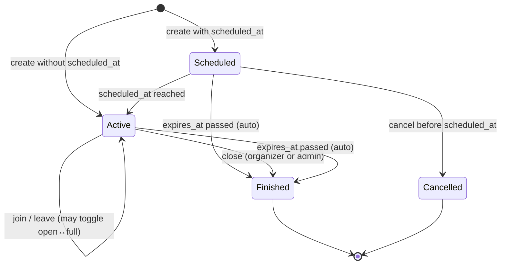

# Product Decisions & Specifications

This document is the official source of truth for approved product decisions, specifications, catalogs, statuses, dependencies, and scope boundaries in the project.

## Documentation Rules

* Every meaningful product/specification decision must be added to this document.
* Every future specification issue must update this document.
* Issues that depend on previous decisions must reference the relevant section.
* Do not change approved decisions silently.
* If a decision changes, add an update note explaining what changed and why.
* This document is intended for project team members, Codex, and future developers.
* This document is not a place for random ideas, temporary notes, or unapproved features.

---

# ISSUE-006 — Define Field Reporting Categories

## Type

Product decision / catalog definition.

## Background

There was no structured way to report problems with fields.

Before building a field reporting system, the official report categories must be defined.

## Goal

Create a fixed official catalog of field report categories.

## Decision

ISSUE-006 is a decision/specification task only.

No code changes are required for ISSUE-006.

The official field report category catalog is approved as follows:

| Hebrew Label  | Internal Key           | Meaning                                                                                         |
| ------------- | ---------------------- | ----------------------------------------------------------------------------------------------- |
| מיקום שגוי    | `wrong_location`       | The field exists, but the map location is incorrect.                                            |
| מגרש לא קיים  | `field_does_not_exist` | The field shown in the app does not exist in reality.                                           |
| מגרש סגור     | `field_closed`         | The field exists, but is closed and cannot currently be used.                                   |
| מגרש בשיפוצים | `under_renovation`     | The field exists but is temporarily under renovation or unusable.                               |
| מגרש פרטי     | `private_field`        | The field is private and not open to the public.                                                |
| כפילות מגרש   | `duplicate_field`      | The same field appears more than once in the app.                                               |
| מידע שגוי     | `wrong_information`    | Field details are incorrect, such as name, sport type, lighting, facilities, or other metadata. |
| אחר           | `other`                | The issue does not fit any of the defined categories.                                           |

## Acceptance Criteria

* All required categories are defined.
* No duplicate categories exist.
* Each category has a clear purpose.
* The catalog is approved for future development.

## Scope

Included:

* Define official categories.
* Define internal keys.
* Define category meanings.

Excluded:

* No database changes.
* No API endpoints.
* No frontend UI.
* No admin dashboard.
* No tests.

## Status

Approved.

---

# ISSUE-007 — Create Field Reports Database Schema

## Type

Database infrastructure specification.

## Dependency

Depends on ISSUE-006.

The `category` field must use the approved category catalog from ISSUE-006.

## Background

A field reporting system cannot be built without a dedicated database structure.

## Goal

Create the database foundation for storing field reports.

## Decision

Create a dedicated database table for field reports.

Table name:

`field_reports`

## Required Columns

| Column        | Type          | Required | Notes                                                   |
| ------------- | ------------- | -------- | ------------------------------------------------------- |
| `id`          | `uuid`        | yes      | Primary key.                                            |
| `field_id`    | `uuid`        | yes      | References `fields(id)`.                                |
| `user_id`     | `uuid`        | yes      | References `users(id)`.                                 |
| `category`    | `text`        | yes      | Must match one of the approved ISSUE-006 category keys. |
| `description` | `text`        | no       | Free text description from the reporting user.          |
| `status`      | `text`        | yes      | Default value: `open`.                                  |
| `created_at`  | `timestamptz` | yes      | Default value: `now()`.                                 |
| `reviewed_at` | `timestamptz` | no       | Nullable. Set when the report is reviewed.              |
| `reviewed_by` | `uuid`        | no       | Nullable. References `users(id)`.                       |

## Approved Category Values

The `category` column must allow only these values:

* `wrong_location`
* `field_does_not_exist`
* `field_closed`
* `under_renovation`
* `private_field`
* `duplicate_field`
* `wrong_information`
* `other`

## Approved Status Values

The `status` column must allow only these values:

| Label     | DB Value    |
| --------- | ----------- |
| Open      | `open`      |
| In Review | `in_review` |
| Resolved  | `resolved`  |
| Rejected  | `rejected`  |

## Constraints

* `category` must be one of the approved ISSUE-006 category values.
* `status` must be one of the approved status values.
* Invalid category values must be rejected.
* Invalid status values must be rejected.
* `reviewed_at` may be null.
* `reviewed_by` may be null.
* `status` must default to `open`.

## Recommended Indexes

Add useful indexes for future filtering and admin review:

* `field_id`
* `user_id`
* `status`
* `created_at`
* optionally `field_id, status`

## Implementation Details

Implemented as database/schema infrastructure only.

Migration file:

`backend/migrations/field_reports.sql`

Schema file:

`backend/schema.sql`

Implemented table:

`field_reports`

Implemented constraints:

* `category` is restricted to the approved ISSUE-006 category values.
* `status` is restricted to `open`, `in_review`, `resolved`, and `rejected`.
* `status` defaults to `open`.
* `field_id` references `fields(id)` and cascades on field deletion.
* `user_id` references `users(id)` and cascades on user deletion.
* `reviewed_by` references `users(id)` and is set to null if the reviewer user is deleted.
* `reviewed_at` is nullable.
* `reviewed_by` is nullable.

Implemented indexes:

* `idx_field_reports_field_id`
* `idx_field_reports_user_id`
* `idx_field_reports_status`
* `idx_field_reports_created_at`
* `idx_field_reports_field_id_status`

## Acceptance Criteria

* The `field_reports` table exists.
* The migration exists.
* The database schema is updated.
* Valid reports can be inserted.
* Reports can be selected after insert.
* Invalid categories are rejected.
* Invalid statuses are rejected.
* Default status is `open`.
* `reviewed_at` and `reviewed_by` can remain null.

## Scope

Included:

* Database migration.
* Schema update if the project keeps `schema.sql` in sync.
* Insert/select validation.
* Backend DB tests if the existing project test structure supports it.

Excluded:

* No frontend UI.
* No report button.
* No report modal.
* No API endpoints unless created in a separate issue.
* No admin dashboard.
* No notifications.
* No image uploads.
* No comments system.
* No severity system.
* No duplicate report aggregation.

## Status

Implemented.

---

# Global Rule For Future Specification Tasks

---

# ISSUE-008 — Create Submit Field Report API

## Type

Backend API implementation.

## Dependency

Depends on ISSUE-007.

The API writes to the `field_reports` table defined in ISSUE-007 and uses the approved ISSUE-006 category catalog.

## Goal

Allow an authenticated user to submit a field report.

## Decision

Create a backend endpoint:

`POST /field-reports`

The endpoint creates a field report with:

* `field_id` from the request.
* `user_id` from the authenticated user.
* `category` from the approved field report category catalog.
* optional `description`.
* `status` controlled by the database default.
* `created_at` controlled by the database.
* `reviewed_at` left null.
* `reviewed_by` left null.

## Request Body

Allowed client fields:

* `field_id`
* `category`
* `description`

Client-controlled review fields are not allowed:

* `status`
* `reviewed_at`
* `reviewed_by`

## Validation

* User must be authenticated.
* `field_id` must exist.
* `category` must be one of the approved ISSUE-006 category values.
* Invalid categories return a validation error.
* Missing fields return a not found error.
* Database insert failures return a clean API error.

## Scope

Included:

* Backend API endpoint.
* Request validation.
* Field existence validation.
* Authenticated user ownership.
* Backend tests for success and error cases.

Excluded:

* No frontend UI.
* No report button.
* No report modal.
* No admin dashboard.
* No notifications.
* No image uploads.
* No comments system.
* No severity system.
* No duplicate report aggregation.

## Status

Implemented.

---

# ISSUE-010 — Create Admin Field Reports Queue

## Type

Admin workflow / frontend and backend API implementation.

## Dependency

Depends on ISSUE-008.

The queue reads reports from the `field_reports` table defined in ISSUE-007 and displays categories from the approved ISSUE-006 catalog.

## Goal

Allow admins to view and triage user-submitted field reports from the existing admin panel.

## Decision

Create an admin-only field reports queue in the admin panel.

Backend endpoint:

`GET /admin/field-reports`

The endpoint is protected by the existing admin authorization requirement and returns reports sorted newest first.

Returned fields include:

* report id
* field id
* field name
* reporter user id
* reporter display name when available
* reporter email when available
* category
* description
* status
* created_at
* reviewed_at
* reviewed_by

## Admin Queue Display

The admin queue displays:

* Field Name
* Report Category
* Reporter
* Date
* Status
* Description

Reports are sorted newest first.

## Filters

The queue supports these status filters:

* All
* Open
* In Review
* Resolved
* Rejected

## Scope

Included:

* Admin-only backend list endpoint.
* Enriched field and reporter data for the queue.
* Admin panel queue UI.
* Status filters.
* Newest-first sorting.
* Backend and frontend tests, including 20-report display coverage.

Excluded:

* No schema changes.
* No frontend field report submission changes.
* No report status update actions.
* No report assignment workflow.
* No notifications.
* No image uploads.
* No duplicate report aggregation.

## Status

Implemented.

---

# ISSUE-011 - Field Report Resolution Workflow

## Decision

Admins can update the lifecycle status of existing field reports from the admin API.

## Backend API Contract

`PATCH /admin/field-reports/{report_id}/status`

Request body:

```json
{ "status": "in_review" }
```

Accepted update statuses:

* `in_review`
* `resolved`
* `rejected`

`open` remains the default creation status and a valid filter/list status, but admins do not set a report back to `open` through the resolution endpoint.

## Review Metadata

Every successful status update persists:

* `status`
* `reviewed_at`
* `reviewed_by`

`reviewed_by` is the authenticated admin user's `users.id`.

## Authorization

The endpoint uses the existing admin authorization requirement. Non-admin users cannot update report status.

## Scope

Included:

* Admin-only backend status update endpoint.
* Status validation.
* Database persistence through the existing `field_reports` table.
* Review metadata updates.
* Backend tests for allowed statuses, invalid status rejection, non-admin rejection, and persisted reviewer metadata.

Excluded:

* No schema changes.
* No frontend status action UI.
* No notifications.
* No report assignment workflow.
* No transition-history audit table.

## Status

Implemented.

---

# ISSUE-013 - Pre-Launch User Management Requirements

## Decision

Ban, Unban, and Suspend are required before launch.

Promote Admin and Demote Admin are not required as regular Admin UI features before launch. Admin role changes should remain manual or super-admin controlled until audit logging, stronger permission controls, and recovery safeguards exist.

## Source Document

See `docs/user-management-requirements.md`.

## Status

Decided.

---

# ISSUE-014 - Admin User List Display

## Decision

The Admin Users list displays User ID, Username, Email, Phone, Created Date, and Status.

The current users data model has no persisted account restriction/status field. Until Ban, Unban, or Suspend are implemented, the Admin Users list displays `Active` as an MVP account-status fallback for users without a real status value.

## Status

Implemented.

---

# ISSUE-015 - Admin User Moderation Actions

## Decision

Admin users can Ban, Unban, Suspend, and Unsuspend regular (non-admin) users. Every action writes an audit log row. Promote Admin and Demote Admin remain out of scope per ISSUE-013.

## DB Shape

### users table additions

* `status text not null default 'active'` — accepted values: `active`, `banned`, `suspended`.
* `restriction_reason text` — required for ban/suspend, cleared on unban/unsuspend.
* `restricted_at timestamptz` — when the current restriction was applied.
* `restricted_by uuid references users(id)` — which admin applied the current restriction.

### user_moderation_audit table

* `id uuid primary key`
* `target_user_id uuid not null references users(id)` — the user being moderated.
* `actor_user_id uuid references users(id)` — the admin performing the action.
* `action_type text not null` — accepted values: `ban`, `unban`, `suspend`, `unsuspend`.
* `reason text` — required for ban/suspend, optional for unban/unsuspend.
* `previous_status text not null` — status before the action.
* `new_status text not null` — status after the action.
* `created_at timestamptz not null default now()`.

## API Contract

* `POST /admin/users/{user_id}/ban` — body `{ "reason": "..." }` (required).
* `POST /admin/users/{user_id}/unban` — body `{ "reason": "..." }` (optional).
* `POST /admin/users/{user_id}/suspend` — body `{ "reason": "..." }` (required).
* `POST /admin/users/{user_id}/unsuspend` — body `{ "reason": "..." }` (optional).

All return `{ "message": "...", "user": { ... } }`.

## Enforcement

Banned and suspended users are blocked from all normal authenticated user workflows via `require_active_user`. Admin endpoints use `require_admin` which does not block restricted admins (admins are never the target of these actions).

## What is included

* Ban, Unban, Suspend, Unsuspend endpoints.
* Audit log table and per-action audit rows.
* Server-side restriction enforcement on all user routes.
* Admin UI actions (Ban/Suspend for active users, Unban for banned, Unsuspend for suspended).
* Hebrew and English labels.

## What is explicitly excluded

* Promote Admin.
* Demote Admin / Remove Admin.
* Role management UI.
* Suspension duration / auto-unsuspend.

## Dependencies

* ISSUE-013 (pre-launch user management decision).
* ISSUE-014 (admin user list display — now extended with real status).

## Status

Implemented.

---

# ISSUE-016 - Future Scheduled Game Cancellation

## Decision

Future scheduled games can be cancelled before their `scheduled_at` start time.

Cancellation is different from closing:

* `close` is an active or started game lifecycle action.
* `cancel` means a future scheduled game will not happen.

## Who can cancel

* The game creator/organizer can cancel their own future scheduled game before `scheduled_at`.
* Admins can cancel any future scheduled game before `scheduled_at`.
* Regular participants cannot cancel the game.

## Cancelled game behavior

* A cancelled game must not be hard deleted.
* A cancelled game remains available for future history, audit, and admin views.
* A cancelled game must not appear in active games.
* A cancelled game must not appear in upcoming joinable games.
* A cancelled game must not appear in field details as an available upcoming game.
* A cancelled game should use a clear `cancelled` status.

Future implementation should preserve:

* `cancelled_at`
* `cancelled_by`
* `cancelled_by_role` or equivalent actor context
* Optional cancellation reason

## Participant notifications

Participants should be notified when a future scheduled game is cancelled.

Notification rules:

* If the creator cancels, notify all participants except the cancelling creator.
* If an admin cancels, notify all participants and the creator.
* If there are no participants, cancellation still succeeds without notifications.

Notification type:

* `scheduled_game_cancelled`

Notification payload should include:

* `game_id`
* `field_id`
* `scheduled_at`
* `cancelled_by`
* `cancelled_by_role`, where available

## Open questions

None. ISSUE-016 leaves no open product questions about future scheduled game cancellation.

## Status

Decided.

---

# ISSUE-017 - Scheduled Game Cancellation Implementation

## Decision

Implements ISSUE-016 product decision. Future scheduled games can be cancelled before `scheduled_at` by the creator or an admin.

## DB Shape

### games table additions

* `cancelled_at timestamptz` — when the cancellation occurred.
* `cancelled_by uuid references users(id)` — who cancelled.
* `cancelled_by_role text` — `"creator"` or `"admin"`.
* `cancel_reason text` — optional free-text reason.

The existing `status` check constraint already includes `'cancelled'`. No constraint change needed.

## API Contract

* `POST /games/{game_id}/cancel` — creator cancels own future scheduled game. Body: `{ "reason": "..." }` (optional).
* `POST /admin/games/{game_id}/cancel` — admin cancels any future scheduled game. Body: `{ "reason": "..." }` (optional).

Both return `{ "message": "Game cancelled", "game": { ... } }`.

### Validation

* Game must be in `open` or `full` status.
* Game must have a `scheduled_at` value (non-scheduled games cannot be cancelled).
* `scheduled_at` must be in the future.
* Creator endpoint: caller must be `created_by`.
* Admin endpoint: caller must have admin role.

## Notification

* Type: `scheduled_game_cancelled`.
* Creator cancels: all participants except creator are notified.
* Admin cancels: all participants and creator are notified.
* No participants: cancellation still succeeds silently.
* Notification payload includes `game_id`, `field_id`, `scheduled_at`, `cancelled_by`, `cancelled_by_role`.

## Filtering

Cancelled games are automatically excluded from `/games/active`, `/games/upcoming`, and field details `upcoming_games` because these queries filter by `ACTIVE_GAME_STATUSES = ["open", "full"]`.

## Dependencies

* ISSUE-016 (product decision).

## Status

Implemented.

---

# ISSUE-019 - Game Lifecycle State Documentation

## Type

Product architecture documentation.

## Dependencies

* ISSUE-016 (cancellation product decision).
* ISSUE-017 (cancellation implementation).

## Goal

Define the official game lifecycle state model so all developers use consistent terminology and understand how games move through states.

## DB Status Values

The `games.status` column accepts exactly four values (enforced by check constraint):

| DB Status     | Terminal? | Description                                    |
| ------------- | --------- | ---------------------------------------------- |
| `open`        | No        | Game exists and has room for more players.     |
| `full`        | No        | Game exists and player count equals max.       |
| `finished`    | Yes       | Game has ended (expired, closed, or finished). |
| `cancelled`   | Yes       | Scheduled game was cancelled before start.     |

Code constant: `ACTIVE_GAME_STATUSES = ["open", "full"]`.

## Lifecycle States

The system uses six lifecycle concepts. Some are real DB statuses, some are derived from timestamps, and some are actions/events.

### 1. Scheduled (derived state)

**What it is:** A game that has not started yet.

**Nature:** Derived state, not a separate DB status. The DB status is `open` or `full`.

**Condition:** `scheduled_at` is not null AND `scheduled_at` is in the future AND `status` is `open` or `full`.

**Code:** `is_game_upcoming(game)` returns `True` when `scheduled_at > now`.

**Appears in:** `/games/upcoming` endpoint. Also visible in admin games list as an active game.

**Does NOT appear in:** `/games/active` endpoint (filtered out by `is_game_started` returning `False`).

**Timestamps:** `scheduled_at` is set at creation. `started_at` is set to `scheduled_at`. `expires_at` is set to `scheduled_at + 2 hours`.

**Exit transitions:**
* Time passes and `scheduled_at <= now` → game becomes **Active**.
* Creator or admin cancels before `scheduled_at` → game becomes **Cancelled**.
* `expires_at` passes (only possible if `expires_at` was not extended) → auto-finished to **Finished**.

### 2. Active (derived state)

**What it is:** A game currently in progress that players can join, leave, or interact with.

**Nature:** Derived state. The DB status is `open` or `full`.

**Condition:** `status` is `open` or `full` AND the game is not expired AND either `scheduled_at` is null (instant game) or `scheduled_at <= now`.

**Code:** `is_game_started(game)` returns `True` when `scheduled_at` is null or `scheduled_at <= now`. `is_game_expired(game)` returns `False`.

**Appears in:** `/games/active` endpoint. Also visible in admin games list.

**Available actions:** Join, Leave, Close, Extend.

**Timestamps:** `started_at` marks when the game began (either `now()` for instant games or `scheduled_at` for scheduled games). `expires_at` marks when the game auto-finishes (default: `started_at + 2 hours`).

**Exit transitions:**
* Organizer or admin closes the game → **Finished** (via Close action).
* `expires_at` passes → auto-finished to **Finished** (via `finish_expired_games`).
* Organizer extends → remains **Active** with updated `expires_at` (via Extend action).

### 3. Extended (action/event)

**What it is:** The act of pushing a game's end time further into the future.

**Nature:** An action/event, not a DB status or derived state. After extending, the game remains `open` or `full`.

**Condition:** Game must be active (status `open`/`full`, not expired). Only the organizer (`created_by`) or an admin can extend.

**Effect:** `expires_at` is updated to `current expires_at + 1 hour`. No status change occurs.

**API:** `POST /games/{game_id}/extend` (organizer), `POST /admin/games/{game_id}/extend` (admin).

**Notification:** `game_extended` notification sent to participants.

### 4. Finished (DB status)

**What it is:** A game that has ended, either naturally or by explicit close action.

**Nature:** Real DB status value (`finished`). Terminal state — no transitions out.

**Entry conditions (any of these):**
* Organizer calls `POST /games/{game_id}/close`.
* Admin calls `POST /admin/games/{game_id}/close`.
* `expires_at` passes and `finish_expired_games` auto-transitions the game.

**Appears in:** Admin finished games list. Does NOT appear in `/games/active` or `/games/upcoming`.

**Timestamps:** `expires_at` may or may not have passed. There is no dedicated `finished_at` column; the transition is inferred from the status change.

### 5. Closed (action)

**What it is:** The explicit action of ending a game early, before `expires_at`.

**Nature:** An action, not a separate DB status. The close action sets `status = 'finished'`.

**Who can close:**
* The game organizer (`created_by`) via `POST /games/{game_id}/close`.
* An admin via `POST /admin/games/{game_id}/close`.

**Precondition:** Game must be active (`open`/`full`, not expired). Checked by `ensure_game_is_actionable`.

**Result:** Game enters the **Finished** DB status. A `game_closed` notification is sent to participants.

**Difference from Finished:** "Closed" is how you get to "Finished" manually. "Finished" is also reached automatically when `expires_at` passes. Both result in the same terminal DB status `finished`.

### 6. Cancelled (DB status)

**What it is:** A scheduled game that was called off before its start time.

**Nature:** Real DB status value (`cancelled`). Terminal state — no transitions out.

**Condition:** Game must have `scheduled_at` in the future AND status must be `open` or `full` at the time of cancellation.

**Who can cancel:**
* The game organizer via `POST /games/{game_id}/cancel`.
* An admin via `POST /admin/games/{game_id}/cancel`.

**Cancellation metadata columns:**
* `cancelled_at` — when the cancellation occurred.
* `cancelled_by` — user ID of who cancelled.
* `cancelled_by_role` — `"creator"` or `"admin"`.
* `cancel_reason` — optional free text.

**Appears in:** Admin finished games list (alongside `finished` games). Does NOT appear in `/games/active` or `/games/upcoming`.

**Notification:** `scheduled_game_cancelled` sent to participants. Creator cancellation excludes the creator from notifications. Admin cancellation notifies all participants including the creator.

**Difference from Close/Finished:** Cancellation is only for future scheduled games that have not started. Closing is for active/started games. Both are terminal but use different DB status values (`cancelled` vs `finished`).

## Timestamp Roles

| Column         | Set when                                       | Purpose                                                     |
| -------------- | ---------------------------------------------- | ----------------------------------------------------------- |
| `scheduled_at` | Game creation (if scheduled)                   | Future start time. Null for instant games.                  |
| `started_at`   | Game creation                                  | `scheduled_at` for scheduled games, `now()` for instant.    |
| `expires_at`   | Game creation, updated on extend               | Auto-finish deadline. Default: `started_at + 2 hours`.      |
| `cancelled_at` | Cancellation action                            | When the game was cancelled. Null if not cancelled.         |

## Visibility Rules

| Query                  | Filter logic                                                          | Shows                        |
| ---------------------- | --------------------------------------------------------------------- | ---------------------------- |
| `/games/active`        | `status in (open, full)` AND not expired AND `is_game_started = True` | Currently playable games     |
| `/games/upcoming`      | `status in (open, full)` AND not expired AND `is_game_upcoming = True`| Future scheduled games       |
| `/admin/games?active`  | `status in (open, full)` AND not expired                              | All non-terminal games       |
| `/admin/games?finished`| `status in (finished, cancelled)`                                     | All ended/cancelled games    |
| Field upcoming games   | `status in (open, full)` for the field                                | Active + upcoming for field  |

Cancelled and finished games are automatically excluded from active/upcoming queries because they are not in `ACTIVE_GAME_STATUSES`.

## State Flow Diagram



## Key Clarifications

1. **Scheduled vs Active:** Both use DB status `open` or `full`. The difference is whether `scheduled_at` is in the future (Scheduled) or in the past/null (Active). There is no `scheduled` DB status value.

2. **Closed vs Finished:** "Closed" is the user action (`POST .../close`). "Finished" is the resulting DB status. A game can also become `finished` automatically when `expires_at` passes, without anyone explicitly closing it.

3. **Cancellation vs Close:** Cancellation applies only to future scheduled games before `scheduled_at`. Closing applies to active/started games. They produce different terminal DB statuses (`cancelled` vs `finished`) and different notifications (`scheduled_game_cancelled` vs `game_closed`).

4. **Extended is not a state:** Extending updates `expires_at` by +1 hour. The game remains `open` or `full`. There is no `extended` DB status.

5. **Auto-finish:** `finish_expired_games()` runs on every active/upcoming query. If `expires_at` has passed, the game is silently transitioned to `finished`. This is the garbage-collection mechanism for games that were never explicitly closed.

## Status

Documented.

---

# ISSUE-024 - Game Visibility Rules Specification

## Type

Product specification / visibility rules.

## Dependencies

* ISSUE-019 (game lifecycle state documentation — defines the state model this spec builds on).
* ISSUE-017 (cancellation implementation — introduced the `cancelled` status).

## Background

The project needed an explicit specification of which games appear in which context. While ISSUE-019 documented the state model and included a brief visibility table, no dedicated product decision existed to cover all contexts, edge cases, and the relationship between backend filtering and frontend display logic.

## Goal

Define clear, unambiguous visibility rules for every context where games are displayed.

## Current Behavior Audit

The following behavior was confirmed by inspecting backend endpoints, frontend components, and existing tests.

### Backend endpoints

| Endpoint | DB query filter | Post-query filter | Result |
| --- | --- | --- | --- |
| `GET /games/active` | `status IN ('open', 'full')` | `finish_expired_games` then `is_game_started` (started or instant) | Currently playable, non-expired games |
| `GET /games/upcoming` | `status IN ('open', 'full')` | `finish_expired_games` then `is_game_upcoming` (`scheduled_at > now`) | Future scheduled games only |
| `GET /fields` / `GET /fields/{id}` | `status IN ('open', 'full')` per field | `finish_expired_games` then split by `is_game_started` / `is_game_upcoming` | `active_game` (single) + `upcoming_games` (list) per field |
| `GET /admin/games` (no filter) | `status IN ('open', 'full')` + `status IN ('finished', 'cancelled')` | None | `{ active: [...], finished: [...] }` |
| `GET /admin/games?status=active` | `status IN ('open', 'full')` | None | Active games only |
| `GET /admin/games?status=finished` | `status IN ('finished', 'cancelled')` | None | Finished + cancelled games |

### Frontend components

| Component | Data source | What is shown |
| --- | --- | --- |
| Map markers (MapPage) | `GET /fields` → `active_game` per field | Only fields with an active (started, non-expired) game show a game marker |
| Field details (FieldDetailsPanel) | `active_game` + `upcoming_games` from field data | Active game panel + upcoming games list. No finished/cancelled games. |
| Game panel (GamePanel) | Renders a single game | Uses `ACTIVE_GAME_STATUSES = Set(['open', 'full'])` to determine if action buttons (join/leave/close/extend) are shown. Finished/cancelled games would render without action buttons if ever passed to this component. |
| Admin games (AdminGames) | `GET /admin/games` | Two sections: "Active Games" and "Finished Games" (includes cancelled). Admin can close/extend active games. |

### Contexts with no current implementation

| Context | Status |
| --- | --- |
| User's own game history / profile | No endpoint or UI exists. Not implemented. |
| Search / query by arbitrary filters | No endpoint exists. Not implemented. |

## Decision — Visibility Rules

### 1. Map / Active Games List

**Rule:** Show only currently playable games.

**Filter:** `status IN ('open', 'full')` AND not expired AND game has started (`scheduled_at` is null or `scheduled_at <= now`).

**Excludes:** Finished, cancelled, expired, and future scheduled games.

**Implementation:** `GET /games/active` + field `active_game` payload. **Matches current behavior.**

### 2. Field Details

**Rule:** Show the field's current active game (if any) and its upcoming scheduled games.

**Filter:** Same as Map for active game. Upcoming: `status IN ('open', 'full')` AND `scheduled_at > now`.

**Excludes:** Finished, cancelled, and expired games.

**Implementation:** `GET /fields/{id}` returns `active_game` + `upcoming_games`. **Matches current behavior.**

### 3. Upcoming Games

**Rule:** Show only future scheduled games that have not started and are not cancelled/finished.

**Filter:** `status IN ('open', 'full')` AND `scheduled_at > now`.

**Excludes:** Finished, cancelled, expired, instant (non-scheduled) games, and scheduled games whose `scheduled_at` has passed.

**Implementation:** `GET /games/upcoming`. **Matches current behavior.**

### 4. User's Own Games / History

**Rule (for future implementation):** When a user profile or "my games" feature is built:

* **Active/upcoming section:** Show the user's current and upcoming games (`status IN ('open', 'full')`, not expired, user is in `game_players`).
* **History section:** Show the user's finished and cancelled games, clearly labeled as past games. Sorted newest first.
* Finished and cancelled games must never appear in the active/upcoming section.

**Current status:** Not implemented. No endpoint or UI exists. This is a future feature.

### 5. Admin Panel

**Rule:** Admins see all games, grouped by lifecycle state.

* **Active tab:** `status IN ('open', 'full')`, not expired. Includes both started and scheduled.
* **Finished tab:** `status IN ('finished', 'cancelled')`. Sorted newest first, with a display limit.

**Implementation:** `GET /admin/games`. **Matches current behavior.**

### 6. Notifications / Reminders

**Rule:** Notifications reference games by ID regardless of status. A notification about a cancelled game is still valid and should be delivered/viewable — the notification itself is the record that the event happened.

* `game_created` — sent when an open/full game is created near a user's preference area.
* `game_closed` — sent when an active game is closed/finished.
* `game_extended` — sent when an active game's `expires_at` is extended.
* `player_joined_game` — sent when a player joins an active game.
* `scheduled_game_reminder` — sent ~1 hour before `scheduled_at` for upcoming games.
* `scheduled_game_cancelled` — sent when a future scheduled game is cancelled.

Notifications are never filtered by game status — they are historical records. **Matches current behavior.**

### 7. Search / Query Endpoints

**Rule (for future implementation):** If a search or filtered query endpoint is added:

* Default search should only return active and upcoming games (`status IN ('open', 'full')`, not expired).
* Admin search may include all statuses with an explicit filter parameter.
* Finished/cancelled games should not appear in user-facing search results unless the user explicitly requests history.

**Current status:** Not implemented. No search endpoint exists.

## Summary Table

| Context | Open | Full | Finished | Cancelled | Scheduled (future) | Expired (auto-finished) |
| --- | --- | --- | --- | --- | --- | --- |
| Map / active list | Yes (if started) | Yes (if started) | No | No | No | No |
| Field details — active | Yes (if started) | Yes (if started) | No | No | No | No |
| Field details — upcoming | No | No | No | No | Yes | No |
| Upcoming games list | No | No | No | No | Yes | No |
| User history (future) | No | No | Yes (labeled) | Yes (labeled) | No | No |
| Admin — active tab | Yes | Yes | No | No | Yes | No |
| Admin — finished tab | No | No | Yes | Yes | No | N/A (becomes finished) |
| Notifications | N/A — notifications are status-independent historical records | | | | | |

## Implementation Gap Analysis

| Gap | Severity | Follow-up |
| --- | --- | --- |
| No implementation gaps found | N/A | Current backend and frontend behavior matches all defined rules |
| 7 extend-notification tests use hardcoded `expires_at` dates without mocking `get_now`, causing time-sensitive failures | Low (test-only) | Fix by adding `get_now` mock to extend notification test fixtures (not a visibility issue) |
| User history/profile not implemented | N/A (future feature) | Implement when user profile feature is planned |

## Scope

Included:

* Audit of all backend query endpoints.
* Audit of frontend display components.
* Explicit visibility rules for every context.
* Future guidance for unimplemented features.

Excluded:

* No code changes.
* No migration changes.
* No frontend changes.
* No new endpoints.

## Status

Documented.

---

# ISSUE-027 - Game History Requirements Specification

## Type

Product specification / requirements definition.

## Dependencies

* ISSUE-019 (game lifecycle state documentation — defines the state model and statuses).
* ISSUE-024 (game visibility rules — defines current endpoint filtering).

## Background

The product currently has no concept of "game history" for users. There is no endpoint, UI, or product definition for what a user should see when reviewing their past or current game activity. Before building a "My Games" feature, the product rules must be defined.

## Current Behavior Audit

### What exists today

| Feature | Status |
| --- | --- |
| `/games/active` — list of currently playable games (all users, all fields) | Implemented |
| `/games/upcoming` — list of future scheduled games (all users, all fields) | Implemented |
| `/fields/{id}` — active game + upcoming games per field | Implemented |
| `/admin/games` — admin view of active + finished/cancelled games | Implemented |
| User profile / "My Games" endpoint | **Not implemented** |
| User game history endpoint | **Not implemented** |
| User game history UI | **Not implemented** |

### How user–game relationships are tracked

| Relationship | How it is stored | Notes |
| --- | --- | --- |
| Creator | `games.created_by = user_id` | Permanent. Survives game lifecycle. |
| Current participant | `game_players` row with `user_id` | Row exists as long as user is in the game. |
| Left participant | **Not tracked** | `leave_game` deletes the `game_players` row. No `left_at` column exists. Once a user leaves, there is no record of past participation. |

### Game statuses (from ISSUE-019)

| Status | Terminal? | Meaning |
| --- | --- | --- |
| `open` | No | Game has room for players. |
| `full` | No | Game is at max capacity. |
| `finished` | Yes | Game ended (expired, closed manually, or auto-finished). |
| `cancelled` | Yes | Scheduled game was cancelled before start. |

Derived states: **Scheduled** (`open`/`full` with `scheduled_at > now`), **Active** (`open`/`full`, started, not expired), **Expired** (auto-transitions to `finished`).

## Decision — Game History Sections

User game activity is split into four clearly separated sections. The term "history" is avoided as an umbrella label — instead, each section has a specific name and purpose.

### Section 1: My Active Games

**What it shows:** Games the user is currently playing or participating in that are in progress right now.

**Filter:** User is in `game_players` (or is `created_by`) AND `status IN ('open', 'full')` AND game has started (`scheduled_at` is null or `scheduled_at <= now`) AND not expired.

**Sort:** By `started_at` ascending (earliest-started first, so the user sees which games end soonest).

**Edge cases:**
* Full game where user is a participant — included (user is still in the game).
* Expired game — excluded (auto-finished by `finish_expired_games` before query returns).

### Section 2: My Upcoming Games

**What it shows:** Future scheduled games the user has joined or created that have not started yet.

**Filter:** User is in `game_players` (or is `created_by`) AND `status IN ('open', 'full')` AND `scheduled_at > now`.

**Sort:** By `scheduled_at` ascending (nearest upcoming game first).

**Edge cases:**
* Scheduled game that was cancelled — excluded (`status = 'cancelled'`, not in `ACTIVE_GAME_STATUSES`).

### Section 3: My Past Games

**What it shows:** Games the user participated in (or created) that have ended normally.

**Filter:** User is in `game_players` (or is `created_by`) AND `status = 'finished'`.

**Sort:** By `expires_at` descending (most recently ended first).

**Includes:**
* Games the user created and that finished (expired or closed).
* Games the user joined and that finished, and where the user was still a participant when the game ended.
* Games that were auto-finished by expiration.
* Games that were manually closed by the organizer or admin.

**Does not include:**
* Cancelled games (shown separately in Section 4).
* Games the user left before the game ended (the `game_players` row was deleted on leave — no record remains).

### Section 4: My Cancelled Games

**What it shows:** Scheduled games the user was involved with that were cancelled before starting.

**Filter:** User is in `game_players` (or is `created_by`) AND `status = 'cancelled'`.

**Sort:** By `cancelled_at` descending (most recently cancelled first).

**Display:** Clearly labeled as cancelled. Cancellation reason shown if available.

**Includes:**
* Games the user created and then cancelled.
* Games the user joined that were cancelled by the creator or admin.
* Games cancelled by admin where the user was a participant.

**Does not include:**
* Games the user left before cancellation (the `game_players` row was deleted on leave).

## Data Rules by User Relationship

| Relationship | Active | Upcoming | Past | Cancelled | Notes |
| --- | --- | --- | --- | --- | --- |
| Creator (organizer) | Yes | Yes | Yes | Yes | `games.created_by = user_id`. Always tracked. |
| Current participant | Yes | Yes | Yes | Yes | `game_players` row exists with matching `user_id`. |
| Left participant | No | No | No | No | `game_players` row is deleted on leave. No tracking data available. **v1: out of scope.** |
| Viewer only (not in game) | No | No | No | No | No relationship — game does not appear in user's activity. |

## Data Rules by Game Status

| Game status | Section shown in | Condition |
| --- | --- | --- |
| `open` (started, not expired) | My Active Games | User is participant or creator |
| `open` (scheduled, `scheduled_at > now`) | My Upcoming Games | User is participant or creator |
| `full` (started, not expired) | My Active Games | User is participant or creator |
| `full` (scheduled, `scheduled_at > now`) | My Upcoming Games | User is participant or creator |
| `finished` | My Past Games | User is participant or creator |
| `cancelled` | My Cancelled Games | User is participant or creator |
| Expired (before auto-finish) | N/A — auto-transitions to `finished` before query returns | Handled by `finish_expired_games` |

## Edge Cases

| Edge case | Behavior |
| --- | --- |
| Game cancelled by creator | Appears in creator's Cancelled section. Appears in participants' Cancelled section. Creator sees it because `created_by` matches. |
| Game expired automatically | Auto-finished by `finish_expired_games`. Appears in Past Games for all remaining participants and the creator. |
| Full game | Appears in Active or Upcoming depending on `scheduled_at`. Being full does not change visibility rules. |
| Scheduled game not yet started | Appears in Upcoming. Does not appear in Active or Past. |
| User leaves before game starts | `game_players` row is deleted. Game disappears from all of the user's sections. No history is preserved. |
| User leaves during active game | Same as above — `game_players` row is deleted. Game disappears from the user's history. |
| Organizer closes game manually | Game transitions to `finished`. Appears in Past Games for remaining participants and creator. |
| Admin closes game | Same as organizer close — `finished` status. Appears in Past Games. |
| User is both creator and participant | Game appears once (not duplicated). Query should use `game_players.user_id = X OR games.created_by = X` with deduplication. |

## Admin vs Normal User

| Viewer | What they see |
| --- | --- |
| Normal user | Only their own games (where they are creator or current participant). Four sections as defined above. |
| Admin (admin panel) | All games across all users, grouped by active/finished per existing `/admin/games` endpoint. No change to admin behavior. |
| Admin (as a regular user) | If an admin views their own "My Games," they see the same four sections as a normal user — only games they personally created or joined. |

## v1 Scope

### Included

* Product rules for four game activity sections (Active, Upcoming, Past, Cancelled).
* Clear data rules by status and user relationship.
* Edge case documentation.
* Suggested API shape (see below).
* Suggested frontend sections (see below).

### Explicitly excluded (out of scope for v1)

* **Left-participant history:** The `game_players` table has no `left_at` column. When a user leaves, the row is deleted. Tracking past participation after leaving would require a schema change (soft-delete or audit column). This is deferred to a future issue.
* **Game statistics / aggregates:** Total games played, win rate, most-played field, etc. Future feature.
* **Pagination of history:** v1 may return all results. Pagination can be added in a follow-up if performance requires it.
* **Filtering / search within history:** v1 shows all games in each section without additional filters. Future feature.
* **Shared game activity between users:** "Games I played with user X." Future feature.
* **Game ratings or reviews:** Not part of game history v1.

## Suggested Future API Shape (do not implement yet)

```
GET /users/me/games
```

Query parameters:
* `section` — required. One of: `active`, `upcoming`, `past`, `cancelled`.
* `limit` — optional. Default 50.
* `offset` — optional. Default 0.

Response shape:
```json
{
  "section": "past",
  "games": [
    {
      "id": "...",
      "field_id": "...",
      "field_name": "...",
      "sport_type": "football",
      "status": "finished",
      "players_present": 5,
      "max_players": 10,
      "started_at": "...",
      "expires_at": "...",
      "scheduled_at": null,
      "created_by": "...",
      "is_creator": true,
      "participants": [...]
    }
  ],
  "total": 42,
  "limit": 50,
  "offset": 0
}
```

Each game includes `is_creator: boolean` so the frontend can badge or label games the user organized.

Authentication: `require_active_user`. The endpoint returns only the authenticated user's games.

## Suggested Future Frontend Sections (do not implement yet)

A "My Games" page or tab with four sections:

1. **המשחקים שלי עכשיו** (My Active Games) — games in progress. Show field name, sport, player count, time remaining.
2. **משחקים קרובים** (Upcoming Games) — future scheduled games. Show field name, scheduled time, player count.
3. **משחקים שהסתיימו** (Past Games) — finished games. Show field name, date played, final player count.
4. **משחקים שבוטלו** (Cancelled Games) — cancelled games. Show field name, cancellation reason if available, cancelled by whom.

Each section collapses if empty. Sections 3 and 4 are sorted newest-first. Sections 1 and 2 are sorted by time (soonest first).

Games where the user was the organizer should have a visual indicator (badge, icon, or label).

## Follow-up Implementation Issue

A follow-up implementation issue should be created to:

1. Build `GET /users/me/games` endpoint with section-based filtering.
2. Build the frontend "My Games" page/tab.
3. Add backend tests for all four sections, edge cases, and creator/participant deduplication.
4. Verify that `finish_expired_games` runs before returning results (same pattern as `/games/active`).

## Status

Documented.

---

For every future product decision, specification, catalog, status definition, database design decision, API contract decision, or scope decision:

1. Update this document.
2. Add the relevant issue number.
3. Document the decision.
4. Document dependencies.
5. Document accepted values, statuses, categories, or contracts.
6. Document what is included.
7. Document what is explicitly excluded.
8. Keep the document clean and structured.
9. Do not mix unapproved ideas into this file.
10. Treat this file as the official source of truth for the project.

---

# ISSUE-029 — Notification Event Inventory

## Type

Documentation / system audit.

## Dependencies

* ISSUE-017 (cancellation implementation — introduced `scheduled_game_cancelled` notification).
* ISSUE-019 (game lifecycle state documentation).
* ISSUE-024 (game visibility rules — section 6 lists notification types).

## Background

The notification system grew organically across multiple issues. No single document defined when each notification is created, who receives it, and through which channels. This inventory is the authoritative reference.

## Notification Infrastructure

### Tables

| Table | Purpose |
| --- | --- |
| `notifications` | Stores all in-app notification records. Columns: `id`, `user_id`, `type`, `title`, `body`, `game_id`, `field_id`, `data` (jsonb), `read_at`, `created_at`. |
| `notification_preferences` | Stores per-user delivery preferences. Types: `radius`, `city`, `specific_field`. Columns include `enabled`, `sport_type`, `radius_km`, `lat`, `lng`, `city`, `field_id`. |
| `push_tokens` | Stores FCM push tokens per user/device. Columns: `id`, `user_id`, `token`, `created_at`, `updated_at`. Multi-device support (one user can have multiple tokens). |

### Delivery Channels

| Channel | Mechanism |
| --- | --- |
| **In-app** | Row inserted into `notifications` table. Retrieved via `GET /notifications`. Unread count via `GET /notifications/unread-count`. |
| **Push** | FCM v1 HTTP API via `send_fcm_notification()` in `app/services/firebase_push.py`. Sent per-token for each recipient's registered push tokens. |

### Push Delivery Details

* Push is always sent immediately after in-app notification row is inserted.
* Push uses the same `title` and `body` as the in-app notification.
* Push `data` payload includes: `notification_id`, `type`, `game_id`, `field_id`, plus any extra fields from the notification's `data` jsonb.
* Invalid tokens (FCM returns `INVALID_ARGUMENT`, `NOT_FOUND`, `UNREGISTERED`, or `SENDER_ID_MISMATCH`) are automatically deleted from `push_tokens`.
* `FirebaseConfigError` is suppressed by default (best-effort delivery). Only the test-push endpoint surfaces config errors.
* Push failures for individual tokens are caught and silently skipped (best-effort).

### Read State

* `read_at` (timestamptz) — canonical column. Set via `PATCH /notifications/{id}/read` or `PATCH /notifications/read-all`.
* Legacy `is_read` (boolean) — supported for backward compatibility. Code auto-detects which column the live schema exposes.

---

## Notification Event Inventory

### Event 1: Game Created

| Field | Value |
| --- | --- |
| **Event Name** | Game Created |
| **Notification Type** | `game_created` |
| **Trigger** | User creates a new game via `POST /games` |
| **Trigger Type** | User-action triggered |
| **Recipients** | Users whose notification preferences match the game's field location and sport type, **excluding** the game organizer. Matching rules: (1) `specific_field` — preference `field_id` matches game's `field_id`; (2) `city` — preference city matches field's city (case-insensitive, normalized); (3) `radius` — user's lat/lng is within `radius_km` of field's lat/lng (haversine). Only enabled preferences are evaluated. Each user receives at most one notification regardless of how many preferences match. |
| **Delivery Channel** | In-app + Push |
| **Preference Rules** | Delivery is entirely preference-driven. Users without matching enabled preferences receive nothing. |
| **Duplicate Prevention** | Yes. Checks `notifications` table for existing rows with `type='game_created'` AND same `game_id` AND same `user_id`. Skips users who already have a notification for this game. |
| **Failure Behavior** | Best-effort. Notification creation runs inline in the game creation endpoint but does not block the response — the game is created regardless. Push failures are silently caught. |
| **Title (Hebrew)** | `נפתח משחק חדש` |
| **Body (Hebrew)** | `נפתח משחק {sport_type} במגרש {field_name}` |
| **Payload/Data** | `game_id`, `field_id` (stored as top-level columns on the notification row) |
| **Source Files** | `backend/app/routers/notifications.py` (`create_game_created_notifications`, lines 320–384), `backend/app/routers/games.py` (line 177) |
| **Tests** | `backend/tests/test_notifications.py` |

### Event 2: Player Joined Game

| Field | Value |
| --- | --- |
| **Event Name** | Player Joined Game |
| **Notification Type** | `player_joined_game` |
| **Trigger** | User joins a game via `POST /games/{game_id}/join` (RPC `join_game_atomic`) |
| **Trigger Type** | User-action triggered |
| **Recipients** | The game organizer (`games.created_by`) only. **Not sent** if the joining user is the organizer themselves. |
| **Delivery Channel** | In-app + Push |
| **Preference Rules** | None. Always sent to the organizer regardless of notification preferences. |
| **Duplicate Prevention** | No. A new notification is created every time a player joins. If a player leaves and re-joins, a new notification is created. |
| **Failure Behavior** | Best-effort. Wrapped in try/except in `games.py`. Join succeeds even if notification fails. Errors are logged. |
| **Title (Hebrew)** | `שחקן חדש הצטרף למשחק שלך` |
| **Body (Hebrew)** | `{player_name} הצטרף למשחק שלך ב-{field_name}` (or `שחקן חדש הצטרף למשחק שלך ב-{field_name}` if player has no name) |
| **Payload/Data** | `data` jsonb: `{ game_id, field_id, type: "player_joined_game", joined_user_id }`. Also stored as top-level `game_id`, `field_id` columns. |
| **Legacy Schema Handling** | Falls back gracefully if `data` column or `game_id`/`field_id` columns don't exist (tries without `data`, then with `related_game_id`/`related_field_id`). |
| **Source Files** | `backend/app/routers/notifications.py` (`create_player_joined_game_notification`, lines 387–449), `backend/app/routers/games.py` (line 345) |
| **Tests** | `backend/tests/test_notifications.py` |

### Event 3: Game Closed

| Field | Value |
| --- | --- |
| **Event Name** | Game Closed |
| **Notification Type** | `game_closed` |
| **Trigger** | Organizer closes game via `POST /games/{game_id}/close`, or admin closes via `POST /admin/games/{game_id}/close` |
| **Trigger Type** | User-action triggered (organizer or admin) |
| **Recipients** | All current participants (`game_players` rows for the game), **excluding** the user who performed the close action. |
| **Delivery Channel** | In-app + Push |
| **Preference Rules** | None. Always sent to all participants regardless of preferences. |
| **Duplicate Prevention** | Yes. Checks for existing `type='game_closed'` AND same `game_id` AND same `user_id`. Skips users who already have a notification. |
| **Failure Behavior** | Best-effort. Wrapped in try/except. Close action succeeds even if notifications fail. Errors are logged. |
| **Title (Hebrew)** | `המשחק נסגר` |
| **Body (Hebrew)** | `המשחק במגרש {field_name} נסגר על ידי המארגן.` |
| **Payload/Data** | `data` jsonb: `{ game_id, field_id, type: "game_closed", closed_by_user_id }`. Also stored as top-level `game_id`, `field_id` columns. |
| **Source Files** | `backend/app/routers/notifications.py` (`create_game_closed_notifications`, lines 452–535), `backend/app/routers/games.py` (line 425), `backend/app/api/admin.py` (line 590) |
| **Tests** | `backend/tests/test_notifications.py` |

### Event 4: Game Extended

| Field | Value |
| --- | --- |
| **Event Name** | Game Extended |
| **Notification Type** | `game_extended` |
| **Trigger** | Organizer extends game via `POST /games/{game_id}/extend`, or admin extends via `POST /admin/games/{game_id}/extend` |
| **Trigger Type** | User-action triggered (organizer or admin) |
| **Recipients** | All current participants (`game_players` rows), **excluding** both the game organizer (`created_by`) and the user who performed the extend action. |
| **Delivery Channel** | In-app + Push |
| **Preference Rules** | None. Always sent to eligible participants regardless of preferences. |
| **Duplicate Prevention** | Yes, per extension event. Checks for existing `type='game_extended'` AND same `game_id` AND same `user_id` AND same `data->>'new_end_time'`. A second extend (to a different end time) creates a new notification. |
| **Failure Behavior** | Best-effort. Wrapped in try/except. Extend action succeeds even if notifications fail. Errors are logged. |
| **Title (Hebrew)** | `המשחק הוארך` |
| **Body (Hebrew)** | `שעת הסיום החדשה של המשחק היא {HH:MM}` |
| **Payload/Data** | `data` jsonb: `{ game_id, field_id, type: "game_extended", new_end_time (ISO 8601), extended_by_user_id }`. Also stored as top-level `game_id`, `field_id` columns. |
| **Source Files** | `backend/app/routers/notifications.py` (`create_game_extended_notifications`, lines 629–706), `backend/app/routers/games.py` (line 464), `backend/app/api/admin.py` (line 633) |
| **Tests** | `backend/tests/test_notifications.py` |

### Event 5: Scheduled Game Cancelled

| Field | Value |
| --- | --- |
| **Event Name** | Scheduled Game Cancelled |
| **Notification Type** | `scheduled_game_cancelled` |
| **Trigger** | Creator cancels via `POST /games/{game_id}/cancel`, or admin cancels via `POST /admin/games/{game_id}/cancel` |
| **Trigger Type** | User-action triggered (creator or admin) |
| **Recipients** | **If creator cancels:** all participants except the cancelling creator. **If admin cancels:** all participants AND the creator (creator is notified that an admin cancelled their game). |
| **Delivery Channel** | In-app + Push |
| **Preference Rules** | None. Always sent to all eligible participants/creator regardless of preferences. |
| **Duplicate Prevention** | No. No dedup check exists for this notification type. However, a game can only be cancelled once (terminal status), so duplicates are structurally impossible. |
| **Failure Behavior** | Best-effort. Wrapped in try/except. Cancel action succeeds even if notifications fail. Errors are logged. |
| **Title (Hebrew)** | `המשחק בוטל` |
| **Body (Hebrew)** | `המשחק במגרש {field_name} בוטל על ידי המארגן` (creator cancel) or `המשחק במגרש {field_name} בוטל על ידי מנהל` (admin cancel) |
| **Payload/Data** | `data` jsonb: `{ game_id, field_id, type: "scheduled_game_cancelled", scheduled_at, cancelled_by, cancelled_by_role }`. Also stored as top-level `game_id`, `field_id` columns. |
| **Source Files** | `backend/app/routers/notifications.py` (`create_scheduled_game_cancelled_notifications`, lines 538–626), `backend/app/routers/games.py` (line 532), `backend/app/api/admin.py` (line 702) |
| **Tests** | `backend/tests/test_notifications.py` |

### Event 6: Scheduled Game Reminder

| Field | Value |
| --- | --- |
| **Event Name** | Scheduled Game Reminder |
| **Notification Type** | `scheduled_game_reminder` |
| **Trigger** | Admin manually triggers via `POST /admin/reminders/scheduled-games/run`. The function scans all active games with a future `scheduled_at` that is within 1 hour of the current time. |
| **Trigger Type** | Admin-triggered (batch job, not automatic cron) |
| **Recipients** | All current participants (`game_players` rows) of each eligible game. The organizer receives the reminder only if they are also in `game_players`. |
| **Delivery Channel** | In-app + Push |
| **Preference Rules** | None. Sent to all participants regardless of notification preferences. |
| **Duplicate Prevention** | Yes, two layers: (1) `scheduled_reminder_processed_at` column on `games` table — once set, the game is skipped on future runs; (2) checks `notifications` table for existing `type='scheduled_game_reminder'` rows for the game — if any exist, the game is marked processed and skipped. |
| **Failure Behavior** | Best-effort for push. The function always returns a result object with `processed_game_ids`, `skipped_game_ids`, and `notifications_created` count. |
| **Title (Hebrew)** | `תזכורת למשחק שמתקרב` |
| **Body (Hebrew)** | `המשחק שלך מתחיל בעוד שעה. אל תשכח להגיע בזמן.` |
| **Payload/Data** | `data` jsonb: `{ type: "scheduled_game_reminder", game_id, field_id, scheduled_at }`. Also stored as top-level `game_id`, `field_id` columns. |
| **Eligibility Window** | Game must have `scheduled_at` in the future AND `scheduled_at - 1 hour <= now`. Games already started (`scheduled_at <= now`) are skipped. |
| **Source Files** | `backend/app/routers/notifications.py` (`generate_scheduled_game_reminders`, lines 741–828), `backend/app/api/admin.py` (line 571) |
| **Tests** | `backend/tests/test_notifications.py` |

### Event 7: Test Push Notification

| Field | Value |
| --- | --- |
| **Event Name** | Test Push |
| **Notification Type** | `test_push` (in push data only — no in-app notification row is created) |
| **Trigger** | User triggers via `POST /notifications/test-push` |
| **Trigger Type** | User-action triggered (self-service) |
| **Recipients** | The requesting user only (their own registered push tokens). |
| **Delivery Channel** | Push only. **No in-app notification row is created.** |
| **Preference Rules** | None. Requires at least one registered push token (returns 404 otherwise). |
| **Duplicate Prevention** | N/A. Test pushes can be sent repeatedly. |
| **Failure Behavior** | **Not best-effort.** Returns HTTP 503 if Firebase is not configured. Returns HTTP 502 if push could not be sent to any token. This is the only notification endpoint that surfaces push errors to the user. |
| **Title** | `Test notification` (English) |
| **Body** | `Push notifications are ready.` (English) |
| **Payload/Data** | Push data: `{ type: "test_push" }` |
| **Source Files** | `backend/app/routers/notifications.py` (`send_test_push`, lines 923–959) |
| **Tests** | `backend/tests/test_notifications.py` |

---

## Notification Type Summary

| # | Type String | In-App | Push | Preference-Gated | Dedup | Trigger |
| --- | --- | --- | --- | --- | --- | --- |
| 1 | `game_created` | Yes | Yes | Yes (radius/city/field) | Yes (per user+game) | User creates game |
| 2 | `player_joined_game` | Yes | Yes | No | No | User joins game |
| 3 | `game_closed` | Yes | Yes | No | Yes (per user+game) | Organizer/admin closes game |
| 4 | `game_extended` | Yes | Yes | No | Yes (per user+game+end_time) | Organizer/admin extends game |
| 5 | `scheduled_game_cancelled` | Yes | Yes | No | No (structurally impossible) | Creator/admin cancels scheduled game |
| 6 | `scheduled_game_reminder` | Yes | Yes | No | Yes (per game, via processed_at flag) | Admin runs reminder batch |
| 7 | `test_push` | No | Yes | No | No | User tests push setup |

## Preference System

Notification preferences only affect `game_created` notifications. All other notification types are sent unconditionally to eligible recipients.

### Preference Types

| Type | Matching Rule | Fields Used |
| --- | --- | --- |
| `radius` | Haversine distance from user's lat/lng to field's lat/lng <= `radius_km` | `lat`, `lng`, `radius_km` |
| `city` | Normalized city name comparison (case-insensitive, whitespace-normalized) | `city` |
| `specific_field` | Exact `field_id` match | `field_id` |

### Additional Filters

* `sport_type` — preference must match game's sport type, or be `"both"`.
* `enabled` — only enabled preferences are evaluated.
* Each user receives at most one `game_created` notification per game, regardless of how many preferences match.

### Frontend Settings UI

The frontend notification preferences page (`NotificationPreferencesPanel`) manages three categories:
* **Distance notifications** — radius-based, with radius slider (1–20 km).
* **City notifications** — city name match.
* **Specific field notifications** — checkbox per selected field.

Settings are saved via `PUT /notifications/preferences` which handles both the legacy single-preference format and the newer combined settings format.

## Database Deduplication Indexes

| Index | Purpose |
| --- | --- |
| `idx_notifications_user_type_game_unique` | Unique on `(user_id, type, game_id)` where `game_id IS NOT NULL` and `type IN ('game_created', 'game_closed', 'scheduled_game_reminder')`. Prevents duplicate notifications at DB level. |
| `idx_notifications_user_game_extended_end_time_unique` | Unique on `(user_id, type, game_id, data->>'new_end_time')` where `type = 'game_extended'`. Allows multiple extend notifications per game (one per distinct end time). |

## Orphan / Legacy Notification Types

No orphan or legacy notification types were found. All type strings used in code (`game_created`, `player_joined_game`, `game_closed`, `game_extended`, `scheduled_game_cancelled`, `scheduled_game_reminder`, `test_push`) are actively used and tested.

### Legacy Schema Compatibility

The `player_joined_game` notification creation function contains fallback logic for legacy database schemas:
* Falls back to omitting the `data` jsonb column if the column doesn't exist.
* Falls back to using `related_game_id`/`related_field_id` column names instead of `game_id`/`field_id` if those columns don't exist.
* The `game_created` notification function similarly handles `related_game_id`/`related_field_id` fallback.
* The `_with_notification_target_aliases` function normalizes both column naming conventions when reading notifications.

These are backward-compatibility paths for databases that haven't been fully migrated. The canonical schema (in `schema.sql`) uses `game_id`, `field_id`, and `data`.

## Identified Gaps and Follow-Up Issues

| # | Gap | Severity | Notes |
| --- | --- | --- | --- |
| 1 | `push_tokens` table is not in `schema.sql` | Low | Defined only in `backend/migrations/push_notifications.sql`. Should be added to `schema.sql` for consistency. |
| 2 | Scheduled game reminders are not automated | Medium | `generate_scheduled_game_reminders` must be manually triggered by an admin via `POST /admin/reminders/scheduled-games/run`. There is no cron job, scheduled task, or automatic invocation. Users could miss reminders if an admin forgets to trigger the endpoint. |
| 3 | All notification titles/body text are hardcoded in Hebrew | Low | No i18n support for notification content. Push notifications and in-app notifications are always in Hebrew regardless of user language preference. The test push is the exception (English). |
| 4 | No "player left game" notification | Low | When a player leaves, no notification is sent to the organizer or other participants. This may be intentional for v1. |
| 5 | No notification when game auto-finishes (expires) | Low | `finish_expired_games` silently transitions games to `finished` without creating notifications. Only explicit close creates `game_closed` notifications. |
| 6 | No notification for admin moderation actions | Info | Ban, suspend, unban, unsuspend actions do not create notifications for the affected user. The user discovers their status change on next login attempt. |

## Status

Documented.

---

## ISSUE-030 - Notification Duplication Risk Review

### Purpose

This audit systematically reviews the notification system to identify every situation where a user could receive the same notification twice. It distinguishes between two duplication types:
1. Duplicate notification rows in the database
2. Duplicate push notifications delivered to the device

This review documents existing protections, evaluates race conditions under concurrent operations, analyzes retry behavior, and specifies follow-up actions to address identified gaps.

### Scope

The audit covers all 7 active notification events implemented in the system, as inventoried in ISSUE-029:
1. **Game Created** (`game_created`)
2. **Player Joined Game** (`player_joined_game`)
3. **Game Closed** (`game_closed`)
4. **Game Extended** (`game_extended`)
5. **Scheduled Game Cancelled** (`scheduled_game_cancelled`)
6. **Scheduled Game Reminder** (`scheduled_game_reminder`)
7. **Test Push** (`test_push`)

### Summary Table

| Event | Type | DB Duplicate Risk | Push Duplicate Risk | Existing Protection | Missing Tests | Follow-up Needed |
| --- | --- | --- | --- | --- | --- | --- |
| **Game Created** | `game_created` | None | None | Application check & DB unique index `idx_notifications_user_type_game_unique` | None | No |
| **Player Joined Game** | `player_joined_game` | None | None | Structural check via `join_game_atomic` RPC constraint | None | No |
| **Game Closed** | `game_closed` | None | None | Application check & DB unique index `idx_notifications_user_type_game_unique` | None | No |
| **Game Extended** | `game_extended` | None (per end time) | None (per end time) | Application check & DB unique index `idx_notifications_user_game_extended_end_time_unique` | Verification test for sequential API retries | Yes (Low - non-idempotency of extend endpoint) |
| **Scheduled Game Cancelled** | `scheduled_game_cancelled` | Low (concurrency race only) | Low (concurrency race only) | Structural validation check (`status in ACTIVE_GAME_STATUSES`). No unique DB index or app check. | Concurrent cancellation race test | Yes (Low - add to unique index) |
| **Scheduled Game Reminder** | `scheduled_game_reminder` | None | None | Application `processed_at` column, app check, and DB unique index `idx_notifications_user_type_game_unique` | None | No |
| **Test Push** | `test_push` | N/A | None (Diagnostic) | Multi-triggers send again by design. No DB row created. | None | No |

### Detailed Event Review

#### 1. Game Created
* **Event Name:** Game Created
* **Trigger:** User creates a new game via `POST /games/`
* **Source files/functions:** `backend/app/routers/notifications.py` (`create_game_created_notifications`), called by `backend/app/routers/games.py` (`create_game`)
* **Recipients:** Users with matching enabled notification preferences (radius, city, or specific field) and sport type, excluding the organizer (`created_by`).
* **Delivery channel:** both
* **Preference rules:** Delivery is entirely preference-driven. Users without matching enabled preferences receive nothing.
* **Payload/data:**
  - `game_id`: Top-level UUID column `game_id` (fallback `related_game_id`)
  - `field_id`: Top-level UUID column `field_id` (fallback `related_field_id`)
  - `data` JSON: None (empty)
  - `title`: `נפתח משחק חדש`
  - `body`: `נפתח משחק {sport_type} במגרש {field_name}`
* **Existing deduplication:**
  - App-level: Queries `notifications` table for `type='game_created'`, `game_id` and recipient user IDs. Filters out users who already have a notification.
  - DB-level: Unique index `idx_notifications_user_type_game_unique` on `(user_id, type, game_id)`.
* **DB duplicate risk:** None. Dual-layer protection (application check + DB unique index) prevents duplicate rows.
* **Push duplicate risk:** None. Push is sent exactly once per successfully inserted DB row. If DB insert fails (e.g., due to unique constraint violation), no push is sent.
* **Retry behavior:**
  - User/browser retries request: Creates a completely new game with a new `game_id`. The new game legitimately generates its own notifications. The same game cannot be created twice.
  - Backend error after partial success: If the game is successfully created but the connection drops before returning, the client retries. A new game will be created, which is correct.
* **Concurrent behavior:**
  - Two users act at same time: Two separate games are created. Each gets its own notifications.
  - Same user double-clicks: Creates two separate games.
  - Organizer/admin action overlap: Only users can create games.
* **Scheduled/admin behavior:** N/A (not triggered by admin or scheduler).
* **Current tests:** `test_create_game_avoids_duplicate_notifications_for_same_user_game_and_type` in `backend/tests/test_notifications.py`
* **Missing tests:** None.
* **Status:** Protected.
* **Follow-up needed:** None.

#### 2. Player Joined Game
* **Event Name:** Player Joined Game
* **Trigger:** User joins a game via `POST /games/{game_id}/join`
* **Source files/functions:** `backend/app/routers/notifications.py` (`create_player_joined_game_notification`), called by `backend/app/routers/games.py` (`join_game`)
* **Recipients:** The game organizer (`created_by`) only, provided the joining user is not the organizer.
* **Delivery channel:** both
* **Preference rules:** None. Always sent to the organizer.
* **Payload/data:**
  - `game_id`: Top-level UUID column `game_id`
  - `field_id`: Top-level UUID column `field_id`
  - `data` JSON: `{ game_id, field_id, type: "player_joined_game", joined_user_id }`
  - `title`: `שחקן חדש הצטרף למשחק שלך`
  - `body`: `{player_name} הצטרף למשחק שלך ב-{field_name}` (or fallback)
* **Existing deduplication:**
  - App-level: None.
  - DB-level: None. The unique index `idx_notifications_user_type_game_unique` does NOT include `player_joined_game`.
* **DB duplicate risk:** None. Enforced structurally at the game participation layer. A user can only be in `game_players` once per game due to the `unique (game_id, user_id)` constraint on `game_players`.
* **Push duplicate risk:** None. Push is only sent on successful DB insert.
* **Retry behavior:**
  - User/browser retries request: If the first join succeeded, the retry will call `join_game_atomic` RPC which sees the user is already in `game_players` and returns `{"error": "User already joined"}`. The API returns a 400 Bad Request and does not call the notification function. Thus, no duplicate notification is created.
  - Backend error after partial success: Same as above. The retry is blocked by `join_game_atomic` checks.
* **Concurrent behavior:**
  - Two users act at same time: Success for both (if room). Two separate notifications are created for the organizer (User A and User B). This is correct.
  - Same user double-clicks: `join_game_atomic` RPC uses `SELECT ... FOR UPDATE` to serialize concurrent requests, and rejects the second request.
  - Organizer/admin action overlap: Organizer and admin cannot trigger joins for other users.
* **Scheduled/admin behavior:** N/A.
* **Current tests:** `test_duplicate_join_does_not_create_duplicate_player_joined_notification` in `backend/tests/test_notifications.py`
* **Missing tests:** None.
* **Status:** Protected (structural).
* **Follow-up needed:** None.

#### 3. Game Closed
* **Event Name:** Game Closed
* **Trigger:** Organizer closes game via `POST /games/{game_id}/close`, or admin closes via `POST /admin/games/{game_id}/close`
* **Source files/functions:** `backend/app/routers/notifications.py` (`create_game_closed_notifications`), called by `backend/app/routers/games.py` (`close_game`) and `backend/app/api/admin.py` (`close_admin_game`)
* **Recipients:** All current participants of the game (from `game_players`), excluding the user who closed the game.
* **Delivery channel:** both
* **Preference rules:** None. Always sent to all eligible participants.
* **Payload/data:**
  - `game_id`: Top-level UUID column `game_id`
  - `field_id`: Top-level UUID column `field_id`
  - `data` JSON: `{ game_id, field_id, type: "game_closed", closed_by_user_id }`
  - `title`: `המשחק נסגר`
  - `body`: `המשחק במגרש {field_name} נסגר על ידי המארגן.`
* **Existing deduplication:**
  - App-level: Yes. Queries `notifications` table for `type='game_closed'`, `game_id` and recipient user IDs. Filters out users who already have a notification.
  - DB-level: Yes. Unique index `idx_notifications_user_type_game_unique` on `(user_id, type, game_id)`.
* **DB duplicate risk:** None. Dual-layer protection (application check + DB unique index) prevents duplicate rows.
* **Push duplicate risk:** None. Push is only sent on successful DB insert.
* **Retry behavior:**
  - User/browser retries request: If the first close succeeded, the game status is updated to `finished`. The retried request will run `_ensure_active_game` (or `_ensure_admin_active_game`) which raises 400 Bad Request because the game is already in `finished` status (which is not in `ACTIVE_GAME_STATUSES`). The notification code is skipped.
  - Backend error after partial success: If the status is updated to `finished` but the request fails before notifications are sent, retrying the API will fail at the status validation check (game not active) and NOT send notifications (this is a missed-notification risk, not a duplicate risk).
* **Concurrent behavior:**
  - Two users act at same time / organizer and admin action overlap: If organizer and admin both close the game concurrently:
    - If one request completes first, the other fails at the status check.
    - If there is a race where both pass validation before either commits, both will try to update status to `finished` (idempotent) and both try to insert notification rows. The DB unique index `idx_notifications_user_type_game_unique` will reject the second insert, raising an exception and preventing duplicate DB rows and duplicate push notifications.
  - Same user double-clicks: Handled by status checks and unique index.
* **Scheduled/admin behavior:**
  - Admin manually triggers twice: Same as concurrent/retry. Fails at status check or unique index.
  - Admin and user path both trigger same event: Same as above.
* **Current tests:** `test_duplicate_close_does_not_create_duplicate_game_closed_notification` in `backend/tests/test_notifications.py`
* **Missing tests:** None.
* **Status:** Protected.
* **Follow-up needed:** None.

#### 4. Game Extended
* **Event Name:** Game Extended
* **Trigger:** Organizer extends game via `POST /games/{game_id}/extend`, or admin extends via `POST /admin/games/{game_id}/extend`
* **Source files/functions:** `backend/app/routers/notifications.py` (`create_game_extended_notifications`), called by `backend/app/routers/games.py` (`extend_game`) and `backend/app/api/admin.py` (`extend_admin_game`)
* **Recipients:** All current participants of the game, excluding the organizer and the actor who extended the game.
* **Delivery channel:** both
* **Preference rules:** None. Always sent to eligible participants.
* **Payload/data:**
  - `game_id`: Top-level UUID column `game_id`
  - `field_id`: Top-level UUID column `field_id`
  - `data` JSON: `{ game_id, field_id, type: "game_extended", new_end_time, extended_by_user_id }`
  - `title`: `המשחק הוארך`
  - `body`: `שעת הסיום החדשה של המשחק היא {HH:MM}`
* **Existing deduplication:**
  - App-level: Yes. Queries `notifications` table for existing `type='game_extended'`, `game_id`, recipient user IDs, and `data->>'new_end_time' == new_end_time_iso`. Skips users who already have a notification *for this specific end time*.
  - DB-level: Yes. Unique index `idx_notifications_user_game_extended_end_time_unique` on `(user_id, type, game_id, (data ->> 'new_end_time'))`.
* **DB duplicate risk:** None. Protected per extension end time.
* **Push duplicate risk:** None. Push is only sent on successful DB insert.
* **Retry behavior:**
  - User/browser retries request: The extend action reads `expires_at` from the DB, adds 1 hour to it, updates it in the DB, and sends a notification. If the user retries the request (or browser sends it twice), the second request reads the *updated* `expires_at` and extends it by *another* hour. This changes `expires_at` to a *new* time. Because the new time is different, the application check and the unique index permit a new notification. This is correct for the new end time, but the end result is that the game has been extended twice (unwanted double extension). This is an endpoint idempotency issue, not a notification duplication issue.
  - Backend error after partial success: If the first attempt succeeds but the connection drops before returning a response, retrying the endpoint will result in a double extension (2 hours total).
* **Concurrent behavior:**
  - Two users act at same time / organizer and admin overlap:
    - If they read the same initial `expires_at`, they both compute the same `new_end_time`. The DB updates to that time (idempotent). The notifications are generated for that same `new_end_time`, and the unique index/app check prevents duplicates.
    - If one commits first, the second reads the updated time and extends it further, generating a new notification for the new time.
  - Same user double-clicks: Can cause double extension.
* **Scheduled/admin behavior:** Same as retry/concurrent.
* **Current tests:** `test_duplicate_game_extended_notification_is_not_created_for_same_extension` in `backend/tests/test_notifications.py`
* **Missing tests:**
  - Verification test verifying that retrying an extend action results in a new notification for the new end time (expected but indicates non-idempotency).
* **Status:** Protected (notification dedup). Low risk (lifecycle non-idempotency).
* **Follow-up needed:**
  - Low priority: Consider making the extend endpoint idempotent by having the client pass the expected `expires_at` (optimistic concurrency) or a specific target time.

#### 5. Scheduled Game Cancelled
* **Event Name:** Scheduled Game Cancelled
* **Trigger:** Creator cancels via `POST /games/{game_id}/cancel`, or admin cancels via `POST /admin/games/{game_id}/cancel`
* **Source files/functions:** `backend/app/routers/notifications.py` (`create_scheduled_game_cancelled_notifications`), called by `backend/app/routers/games.py` (`cancel_game`) and `backend/app/api/admin.py` (`cancel_admin_game`)
* **Recipients:**
  - Creator cancels: all participants except the cancelling creator.
  - Admin cancels: all participants and the creator.
* **Delivery channel:** both
* **Preference rules:** None. Always sent to all eligible participants/creator.
* **Payload/data:**
  - `game_id`: Top-level UUID column `game_id`
  - `field_id`: Top-level UUID column `field_id`
  - `data` JSON: `{ game_id, field_id, type: "scheduled_game_cancelled", scheduled_at, cancelled_by, cancelled_by_role }`
  - `title`: `המשחק בוטל`
  - `body`: `המשחק במגרש {field_name} בוטל על ידי המארגן` or `המשחק במגרש {field_name} בוטל על ידי מנהל`
* **Existing deduplication:**
  - App-level: None.
  - DB-level: None. `scheduled_game_cancelled` is not in the `idx_notifications_user_type_game_unique` partial unique index.
* **DB duplicate risk:** Low risk (concurrency race only). No index protects this type in the database.
* **Push duplicate risk:** Low risk (concurrency race only). Duplicate inserts lead to duplicate pushes.
* **Retry behavior:**
  - User/browser retries request: Protected structurally. The first cancel sets the status to `'cancelled'`. The retried request checks if `status in ACTIVE_GAME_STATUSES`. Since `'cancelled'` is not active, the request fails with a 400 Bad Request, preventing duplicate notification rows and push sends for retries.
  - Backend error after partial success: If the first attempt succeeds in updating the DB to `'cancelled'` but fails before sending notifications, retrying will fail with 400 (game not active), leaving recipients with zero notifications.
* **Concurrent behavior:**
  - **Race condition:** If the creator and admin cancel the game at the exact same time:
    - Both requests check the game status. If both read `'open'` or `'full'` before either updates it, both will pass status validation.
    - Both will update the status to `'cancelled'` (idempotent).
    - Both will call `create_scheduled_game_cancelled_notifications`.
    - Since there is no app-level or DB-level deduplication for this type, both calls will insert notification rows and trigger push sends.
    - Result: Every recipient will receive two identical `scheduled_game_cancelled` notifications (two DB rows and two push notifications).
  - Same user double-clicks: Can cause race condition if the requests are handled concurrently.
* **Scheduled/admin behavior:** Same concurrent race risk between admin and creator.
* **Current tests:** None check duplicate prevention for `scheduled_game_cancelled`. (Tests in `test_game_cancel.py` check normal cancellation and notification generation only).
* **Missing tests:**
  - Concurrent cancellation race test (verifying that racing requests do not result in duplicate notifications).
* **Status:** Low risk (structural status validation protects sequential retries, but a concurrency gap exists).
* **Follow-up needed:**
  - suggested title: Add scheduled_game_cancelled to unique notifications index
  - priority: Low
  - reason: Add `scheduled_game_cancelled` to the partial unique index `idx_notifications_user_type_game_unique` for defense-in-depth against concurrent cancellation races.

#### 6. Scheduled Game Reminder
* **Event Name:** Scheduled Game Reminder
* **Trigger:** Admin manually triggers via `POST /admin/reminders/scheduled-games/run`
* **Source files/functions:** `backend/app/routers/notifications.py` (`generate_scheduled_game_reminders`), called by `backend/app/api/admin.py` (`run_scheduled_game_reminders`)
* **Recipients:** All current participants of the game (the organizer receives it only if they are in `game_players`).
* **Delivery channel:** both
* **Preference rules:** None. Always sent to all participants regardless of preferences.
* **Payload/data:**
  - `game_id`: Top-level UUID column `game_id`
  - `field_id`: Top-level UUID column `field_id`
  - `data` JSON: `{ type: "scheduled_game_reminder", game_id, field_id, scheduled_at }`
  - `title`: `תזכורת למשחק שמתקרב`
  - `body`: `המשחק שלך מתחיל בעוד שעה. אל תשכח להגיע בזמן.`
* **Existing deduplication:**
  - App-level: Yes, two layers:
    1. Checks the `games` table's `scheduled_reminder_processed_at` column. If set, the game is skipped.
    2. Queries the `notifications` table for existing `type='scheduled_game_reminder'` rows for the game. If any exist, it updates `scheduled_reminder_processed_at` and skips the game.
  - DB-level: Yes. Unique index `idx_notifications_user_type_game_unique` on `(user_id, type, game_id)` where `type = 'scheduled_game_reminder'`.
* **DB duplicate risk:** None. Triple-layer protection.
* **Push duplicate risk:** None. Push is only sent on successful DB insert.
* **Retry behavior:**
  - User/admin retries API / triggers manually twice: If the first run succeeded, `scheduled_reminder_processed_at` is set, or notification rows exist. The second run will find these and skip the game.
  - Backend error after partial success: If the first run succeeds in inserting notifications but fails before updating `scheduled_reminder_processed_at` or returning, retrying will run the notification check, find the existing rows, set `scheduled_reminder_processed_at`, and skip sending duplicates.
* **Concurrent behavior:**
  - Two admin requests run concurrently: If both pass the `scheduled_reminder_processed_at` and notification checks before either writes, both will attempt to insert rows. The unique index `idx_notifications_user_type_game_unique` will reject the second insert, raising an exception and preventing duplicate rows and duplicate push sends.
* **Scheduled/admin behavior:** Same as above.
* **Current tests:** `test_scheduled_game_reminder_existing_notification_prevents_late_duplicates` and `test_scheduled_game_reminder_job_is_idempotent` in `backend/tests/test_notifications.py`.
* **Missing tests:** None.
* **Status:** Protected.
* **Follow-up needed:** None.

#### 7. Test Push Notification
* **Event Name:** Test Push
* **Trigger:** User triggers via `POST /notifications/test-push`
* **Source files/functions:** `backend/app/routers/notifications.py` (`send_test_push`)
* **Recipients:** Requesting user only (their own registered push tokens).
* **Delivery channel:** push
* **Preference rules:** None.
* **Payload/data:**
  - Push data: `{ type: "test_push" }`
  - Title: `Test notification`
  - Body: `Push notifications are ready.`
* **Existing deduplication:** None.
* **DB duplicate risk:** N/A (no DB row created).
* **Push duplicate risk:** None (by design). Users trigger this explicitly to verify push delivery works. Receiving multiple push notifications upon multiple requests is the correct diagnostic behavior.
* **Retry behavior:** Sends a new push notification by design.
* **Concurrent behavior:** Sends multiple pushes by design.
* **Scheduled/admin behavior:** N/A.
* **Current tests:** `test_test_push_requires_authentication` and `test_test_push_sends_to_current_users_tokens` in `backend/tests/test_notifications.py`.
* **Missing tests:** None.
* **Status:** Protected (by design).
* **Follow-up needed:** None.

### Global Duplication Risks

#### Push Retry / Idempotency
Push notifications are sent synchronously immediately following the DB insert, inside the same API request. There is no background queue, offline retry loop, or delivery pipeline in the application. This ensures that the application itself never retries push delivery internally (reducing the risk of duplicate delivery). However, since Google's FCM v1 HTTP API does not natively support idempotency keys, if a network timeout occurs between the backend and FCM and a request is retried, FCM could deliver duplicate pushes. This is a standard transport-layer risk common to all push delivery systems.

#### Duplicate Push Tokens
A user registering the same FCM token multiple times (e.g. from the same device/browser context repeatedly) could result in duplicate push notifications if each token row was stored.
To prevent this, the system enforces:
1. A DB-level uniqueness constraint `UNIQUE(token)` on the `push_tokens` table.
2. The `save_push_token` application function performs an upsert: it queries for the token first and updates the existing row rather than inserting a new one.
This ensures there is never more than one row per token. If a user has multiple *different* devices (different tokens), each registers separately, resulting in one push per device, which is the expected correct behavior.

#### Scheduled Reminder Reruns
If the scheduled reminder batch job runs multiple times (due to duplicate admin actions or a misconfigured cron scheduler), it is protected from duplicate notification rows and duplicate push delivery by:
1. Setting the `scheduled_reminder_processed_at` timestamp on each game.
2. Checking the `notifications` table for existing `scheduled_game_reminder` rows before processing a game.
3. The DB-level uniqueness index `idx_notifications_user_type_game_unique`.
Even under concurrent execution, the DB-level uniqueness index prevents duplicate inserts.

#### Admin / User Path Overlap
Endpoints that can be triggered by both an organizer (user path) and an admin (admin path) on the same game:
* **Close game:** `POST /games/{id}/close` vs `POST /admin/games/{id}/close`
* **Extend game:** `POST /games/{id}/extend` vs `POST /admin/games/{id}/extend`
* **Cancel game:** `POST /games/{id}/cancel` vs `POST /admin/games/{id}/cancel`
For close and extend, duplicate notifications are prevented by their respective DB unique indexes.
For cancel, if an admin and creator concurrently cancel, they can trigger a race condition (due to lack of uniqueness index on `scheduled_game_cancelled`), which could result in duplicate notifications.

#### Lack of DB Uniqueness where Relevant
There is a lack of database-level uniqueness constraints for:
1. `player_joined_game`: Deduplication relies entirely on the structural uniqueness of the join action itself (`join_game_atomic` RPC checks).
2. `scheduled_game_cancelled`: No DB unique index or application check exists. Deduplication relies entirely on the status change of the game to `'cancelled'`. This leaves a narrow race condition window for concurrent cancellations.

### Follow-up Issues

#### 1. Add scheduled_game_cancelled to unique notifications index
* **Priority:** Low
* **Reason:** Add `scheduled_game_cancelled` to the partial unique index `idx_notifications_user_type_game_unique` in the database to prevent duplicate notifications during concurrent cancellation races (e.g., organizer and admin cancelling at the exact same moment).

#### 2. Make extend endpoint idempotent using optimistic concurrency or target time
* **Priority:** Low
* **Reason:** The extend game endpoint computes a new expiration time relative to the existing value stored in the database. Retrying an API call results in a double extension (2 hours total) and generates a new, legitimate notification for the new end time. Making the extend action idempotent (e.g., passing the expected current `expires_at` or a specific target time) would prevent accidental double-extensions and duplicate notification noise.

#### 3. Add concurrent cancellation test to verification suite
* **Priority:** Low
* **Reason:** The test suite does not currently contain a test verifying that racing cancellation requests are safely handled and do not result in duplicate notifications or pushes. A test simulating concurrent cancellation calls should be added.

---

# ISSUE-031 — Notification Expiration Policy

## Type

Product decision / lifecycle policy.

## Dependencies

* ISSUE-029 (Notification Event Inventory)
* ISSUE-030 (Notification Duplication Risk Review)

## Background

The notification system stores in-app notification records, but no lifecycle policy existed for old notifications.

## Goal

Define how long notifications are retained, whether they are deleted, and whether they are archived.

## Decision

For MVP, in-app notifications are retained for 90 days.

Notifications older than 90 days may be deleted by a future cleanup job.

No archive table is required for MVP.

Read and unread notifications follow the same retention policy.

Notifications are not an audit log. Business-critical history, compliance records, moderation logs, and operational audit trails must be stored in dedicated audit tables, not in the `notifications` table.

## Policy

* Retention period: 90 days from `created_at`.
* Deletion: allowed after 90 days.
* Archive: not required for MVP.
* Read/unread behavior: `read_at` does not affect expiration.
* Push notifications: no separate retention policy; push is delivery-only.
* In-app notifications: stored until deleted by future cleanup logic.

## Rationale

* Prevents unbounded growth of the `notifications` table.
* Keeps the user notification inbox useful and relevant.
* Avoids overengineering archive storage before the product needs it.
* Separates user-facing notifications from audit/compliance records.
* Makes future cleanup implementation straightforward using `created_at`.

## Scope

Included:

* Product decision for notification retention.
* Deletion/archive policy.
* Clarification that notifications are not audit records.

Excluded:

* No cleanup job implementation.
* No database migration.
* No archive table.
* No frontend changes.
* No backend endpoint changes.

## Status

Approved.

---

# ISSUE-032 — Implement Notification Retention Policy

## Type

Backend implementation.

## Dependencies

* ISSUE-031 (90-day retention policy decision).
* ISSUE-029 (Notification Event Inventory — defines the `notifications` table schema).

## Background

ISSUE-031 approved a 90-day retention policy for in-app notifications. This issue implements the cleanup mechanism as an admin-triggered endpoint.

## Goal

Provide a backend endpoint that deletes notifications older than 90 days, accessible only to admins.

## Decision

### Endpoint

`POST /admin/notifications/cleanup`

Protected by `require_admin`. Non-admin users receive 401/403.

### Behavior

* Calculates cutoff as `now - 90 days` (using `get_now()` for testability).
* Selects all notification rows where `created_at < cutoff` (strict less-than — notifications exactly at the cutoff boundary are NOT deleted).
* Deletes matching rows by ID using the service-role Supabase client (bypasses RLS).
* Returns `{ deleted_count, retention_days: 90, cutoff }`.

### What is deleted

* Only rows from the `notifications` table.
* Both read and unread notifications older than 90 days are deleted.

### What is NOT deleted

* `push_tokens` — push token records are never affected by cleanup.
* `notification_preferences` — user preference records are never affected by cleanup.
* `user_moderation_audit` — audit records are never affected by cleanup.
* Any other table.

### Idempotency

Running cleanup twice in succession is safe. The second run returns `deleted_count: 0`.

### Constants

* `NOTIFICATION_RETENTION_DAYS = 90` defined in `backend/app/routers/notifications.py`.

## Implementation Details

* Cleanup function: `cleanup_old_notifications(now=None)` in `backend/app/routers/notifications.py`.
* Admin endpoint: `POST /admin/notifications/cleanup` in `backend/app/api/admin.py`.
* Tests: `backend/tests/test_notification_cleanup.py` (9 tests).

## Tests

| # | Test | Verifies |
| --- | --- | --- |
| 1 | Deletes notification older than 90 days | Old notifications are removed |
| 2 | Does not delete notification newer than 90 days | Recent notifications are preserved |
| 3 | Does not delete notification exactly at the 90-day cutoff | Boundary condition (strict less-than) |
| 4 | Deletes old unread notifications | `read_at = NULL` does not prevent deletion |
| 5 | Deletes old read notifications | `read_at` set does not prevent deletion |
| 6 | Does not delete push_tokens | Cleanup is scoped to `notifications` only |
| 7 | Does not delete notification_preferences | Cleanup is scoped to `notifications` only |
| 8 | Non-admin cannot run cleanup | Authorization enforcement |
| 9 | Admin cleanup is idempotent | Second run deletes 0 |

## Scope

Included:

* Backend cleanup function.
* Admin-only endpoint.
* 9 backend tests.

Excluded:

* No archive table.
* No automatic cron/scheduler.
* No frontend UI for cleanup.
* No changes to notification delivery behavior.
* No changes to push_tokens, notification_preferences, or other tables.

## Status

Implemented.

---

# ISSUE-033 — Review Notification Unread Counter Accuracy

## Type

Audit / test coverage.

## Dependencies

* ISSUE-029 (Notification Event Inventory — defines all 7 notification events).

## Background

The unread notification badge must always show an accurate count. This audit reviewed every backend endpoint and frontend component involved in the unread counter to verify correctness, identify bugs, and add missing test coverage.

## Unread Counter Source of Truth

`GET /notifications/unread-count` is the authoritative source. It fetches all notifications for the authenticated user using the service-role client (bypasses RLS), filters in Python using `_is_notification_unread()`, and returns `{ unread_count: N }`.

The function `_is_notification_unread()` supports both the canonical `read_at` timestamp column and the legacy `is_read` boolean column.

## Read Single Behavior

`PATCH /notifications/{id}/read` marks a single notification as read:
* Verifies the notification belongs to the authenticated user (returns 404 otherwise).
* Sets `read_at` to the current UTC timestamp (or `is_read = True` on legacy schema).
* Marking an already-read notification is a no-op — it overwrites `read_at` with a new timestamp but does not change the unread count.

## Read All Behavior

`PATCH /notifications/read-all` marks all of the authenticated user's unread notifications as read:
* Filters by `user_id` AND `read_at IS NULL` (or `is_read = False` on legacy schema).
* Does not affect other users' notifications.
* After completion, `GET /notifications/unread-count` returns 0 for the user.

## New Notification Behavior

When a new notification row is inserted (via any of the 7 notification events), it has `read_at = NULL` by default. The next call to `GET /notifications/unread-count` will reflect the increased count.

## Multiple Tabs Behavior

The frontend polls `GET /notifications/unread-count` every 20 seconds (production) or 1 second (development) via `setInterval`. Polling only fires when `document.visibilityState === 'visible'`. If one tab marks notifications as read, other tabs will update within the next polling interval.

No websocket or realtime infrastructure is used. The polling delay (up to 20 seconds in production) is a known and accepted limitation.

## Frontend Counter Design

The frontend uses an optimistic-then-verify pattern:

1. **Read single:** Locally updates the notification in state and computes new count from the updated array, then calls `refreshUnreadCount()` which re-fetches from the server.
2. **Read all:** Locally sets all notifications to read and count to 0, then calls both `refreshNotifications()` and `refreshUnreadCount()` from the server.
3. **Badge initialization:** On mount, fetches both `GET /notifications` and `GET /notifications/unread-count` from the server.

The count displayed in the badge is always `Number(unreadCountResult?.unread_count ?? 0)`, which guarantees no negative counts.

## Audit Result

No bugs found. The existing implementation is correct:

* Server endpoint is the authoritative source of truth.
* Frontend always re-checks the server after optimistic updates.
* Polling keeps multiple tabs in sync.
* Negative counts are structurally impossible (server returns a non-negative integer).
* Read-single on an already-read notification is idempotent.

## Tested Scenarios

### Backend tests (in `test_notifications.py`)

| # | Test | Status |
| --- | --- | --- |
| 1 | Unread count returns only current user's unread notifications | Pre-existing |
| 2 | Unread count uses service-role client | Pre-existing |
| 3 | Unread count supports legacy `is_read` schema | Pre-existing |
| 4 | Mark single notification sets `read_at` | Pre-existing |
| 5 | Cannot mark another user's notification as read | Pre-existing |
| 6 | Read-all marks only current user's notifications | Pre-existing |
| 7 | Mark single sets `is_read` on legacy schema | Pre-existing |
| 8 | Read-all sets `is_read` on legacy schema | Pre-existing |
| 9 | New notification increases unread count | Pre-existing |
| 10 | Marking one read decreases unread count by exactly 1 | **Added (ISSUE-033)** |
| 11 | Marking already-read notification does not change unread count | **Added (ISSUE-033)** |
| 12 | Mark-all-read sets unread count to 0 | **Added (ISSUE-033)** |

### Frontend tests (in `notifications.spec.js`)

| # | Test | Status |
| --- | --- | --- |
| 1 | Badge shows unread count on load; click notification updates badge | Pre-existing |
| 2 | Mark all read clears badge | Pre-existing |
| 3 | Legacy `is_read` schema displays and marks correctly | Pre-existing |
| 4 | Preferences save triggers unread count refresh | Pre-existing |
| 5 | Scheduled game reminder can be marked read | Pre-existing |

### Scenarios verified by design (not individually testable)

| Scenario | Verified by |
| --- | --- |
| Multiple tabs sync | Polling interval in `MapPage.jsx` calls `refreshUnreadCount()` every 20s |
| No negative badge count | Server returns `len(unread)` which is always >= 0; frontend uses `Number(... ?? 0)` |
| Server is source of truth | Every optimistic update is followed by `refreshUnreadCount()` server call |

## Known Limitations

* **Polling delay:** Up to 20 seconds in production before another tab reflects read-state changes. Acceptable for MVP.
* **No realtime push for count updates:** A new notification created by another user's action (e.g., game created) will only appear in the badge after the next poll. Push notifications provide immediate device-level alerting as a mitigation.

## Scope

Included:

* Full backend audit of unread count, read-single, and read-all endpoints.
* Full frontend audit of badge, inbox modal, polling, and optimistic update logic.
* 3 new backend tests for missing coverage.

Excluded:

* No code changes to endpoints or frontend components (no bugs found).
* No new infrastructure (no websockets, no realtime).
* No changes to notification delivery or retention.

## Status

Documented and tested.

---

# ISSUE-034 — Notification Localization Requirements

## Type

Product specification / localization policy.

## Dependencies

* ISSUE-029 (Notification Event Inventory — defines all 7 notification events and their current text).

## Purpose

Define the official Hebrew and English notification copy for every notification type, establish the localization policy, and document the current default-language behavior and future implementation path.

## Supported Languages

| Language | Code | Direction | Status |
| --- | --- | --- | --- |
| Hebrew | `he` | RTL | Current default for notification content |
| English | `en` | LTR | Defined in this document; not yet generated at runtime |

## Source of Truth for Notification Copy

This section is the canonical reference for approved notification title and body text in both languages. Backend notification creation code must use these templates (or their equivalent) when generating notification rows.

## Current Default Language Behavior

Today, all notification titles and bodies are hardcoded in Hebrew in the backend notification creation functions (`backend/app/routers/notifications.py`). The one exception is `test_push`, which uses English.

The frontend UI chrome (inbox title, buttons, labels) is localized via i18n (`frontend/src/locales/he/common.js` and `frontend/src/locales/en/common.js`), but the notification content displayed inside the inbox comes directly from the stored `title` and `body` columns — it is not translated at read time.

No user language preference is consulted when generating notification text. The backend does not look up the recipient's language setting.

## Notification Localization Table

| # | Type | Hebrew Title | Hebrew Body Template | English Title | English Body Template | Variables | Notes |
| --- | --- | --- | --- | --- | --- | --- | --- |
| 1 | `game_created` | נפתח משחק חדש | נפתח משחק {sport_type} במגרש {field_name} | New game opened | A new {sport_type} game opened at {field_name} | `sport_type`, `field_name` | |
| 2 | `player_joined_game` | שחקן חדש הצטרף למשחק שלך | {player_name} הצטרף למשחק שלך ב-{field_name} | A new player joined your game | {player_name} joined your game at {field_name} | `player_name`, `field_name` | Fallback body when player_name is empty: **HE** שחקן חדש הצטרף למשחק שלך ב-{field_name} / **EN** A new player joined your game at {field_name} |
| 3 | `game_closed` | המשחק נסגר | המשחק במגרש {field_name} נסגר על ידי המארגן. | Game closed | The game at {field_name} was closed by the organizer. | `field_name` | |
| 4 | `game_extended` | המשחק הוארך | שעת הסיום החדשה של המשחק היא {time} | Game extended | The new game end time is {time} | `time` | `time` is formatted as HH:MM |
| 5a | `scheduled_game_cancelled` (creator) | המשחק בוטל | המשחק במגרש {field_name} בוטל על ידי המארגן | Game cancelled | The game at {field_name} was cancelled by the organizer | `field_name` | Body varies by `cancelled_by_role` |
| 5b | `scheduled_game_cancelled` (admin) | המשחק בוטל | המשחק במגרש {field_name} בוטל על ידי מנהל | Game cancelled | The game at {field_name} was cancelled by an admin | `field_name` | Body varies by `cancelled_by_role` |
| 6 | `scheduled_game_reminder` | תזכורת למשחק שמתקרב | המשחק שלך מתחיל בעוד שעה. אל תשכח להגיע בזמן. | Upcoming game reminder | Your game starts in one hour. Don't forget to arrive on time. | (none) | |
| 7 | `test_push` | בדיקת התראות | התראות Push מוכנות. | Test notification | Push notifications are ready. | (none) | Push-only; no in-app notification row. Currently uses English. |

## Template Variables

| Variable | Type | Source | Fallback |
| --- | --- | --- | --- |
| `{field_name}` | string | `fields.name` via field lookup | `"Unknown field"` (EN) / `"Unknown field"` (HE, current behavior) |
| `{sport_type}` | string | `games.sport_type` | Raw value (`football` / `basketball`) |
| `{player_name}` | string | `users.name` of the joining player | Empty string triggers fallback body template |
| `{time}` | string | `new_end_time` formatted as `HH:MM` | N/A (always derived from the extend action) |

## Fallback Behavior

| Scenario | Current Behavior | Approved Behavior |
| --- | --- | --- |
| `field_name` is missing or null | Uses `"Unknown field"` | Same — use `"Unknown field"` (EN) or `"מגרש לא ידוע"` (HE, future) |
| `player_name` is empty | Uses fallback body: `שחקן חדש הצטרף למשחק שלך ב-{field_name}` | Same — use language-appropriate fallback body |
| `sport_type` value | Inserted raw (`football` / `basketball`) | Future: localize to `כדורגל`/`כדורסל` (HE) or `Football`/`Basketball` (EN) |
| User language preference unavailable | Generates Hebrew | Fallback to Hebrew for MVP |
| Missing language template | N/A (only Hebrew exists today) | Fallback to Hebrew if English template is missing |

## Directionality Rules

* Hebrew notification content is suitable for RTL display. The frontend already applies RTL layout when the app language is Hebrew.
* English notification content is suitable for LTR display.
* The notification `title` and `body` columns store plain text — no HTML or directional markers are needed.
* The frontend inbox component renders notification content in the current app direction. If a Hebrew notification is displayed while the app is in English (LTR) mode, the text may appear left-aligned. This is acceptable for MVP because notifications are currently always in Hebrew.

## Key Design Questions and Answers

### 1. What is the default notification language today?

Hebrew. All notification titles and bodies are generated in Hebrew, except `test_push` which uses English.

### 2. Where should future notification templates live?

In backend code, centralized in a dedicated notification template module or dictionary within `backend/app/routers/notifications.py`. Templates should be keyed by `(notification_type, language_code)`.

### 3. Are titles/bodies stored already localized, or resolved at read time?

**Stored already localized.** The `title` and `body` columns on the `notifications` table contain the final text generated at creation time. There is no read-time resolution. This is the approved MVP approach.

### 4. How should push and in-app notification text stay consistent?

Push notifications use the same `title` and `body` values as the in-app notification row. Both are generated from the same template at creation time. This must remain the case — push and in-app must never diverge.

### 5. What happens if a language value is missing?

Fallback to Hebrew. If a template for the user's preferred language does not exist, generate the notification in Hebrew.

### 6. Should notification history change language if the user changes app language later?

**No.** Notifications are stored with their generated text at creation time. Changing the app language does not retranslate historical notifications. This is acceptable because:
* Retranslation would require re-rendering every stored notification.
* The `title`/`body` columns are plain text, not template references.
* Users who switch languages will see new notifications in their new language, but old ones remain in the language they were created in.

## Future Implementation Guidance

When runtime localization is implemented (in a future issue):

1. **Add a user language preference lookup** to notification creation functions. The backend should determine the recipient's preferred language before generating text.
2. **Create a template dictionary** mapping `(notification_type, language_code)` → `(title_template, body_template)`. Use the approved copy from this document.
3. **Localize `sport_type`** values in notification bodies (`football` → `כדורגל` / `Football`).
4. **Localize the field_name fallback** (`"Unknown field"` → `"מגרש לא ידוע"` for Hebrew).
5. **Generate both push and in-app text from the same template** to prevent divergence.
6. **Do not retranslate existing notifications.** Only new notifications should use the recipient's language.
7. **If user language is not set**, default to Hebrew.

## Scope

Included:

* Approved Hebrew and English copy for all 7 notification types.
* Template variable definitions and fallback rules.
* Directionality guidance.
* Current default-language behavior documentation.
* Future implementation guidance.

Excluded:

* No runtime localization implementation (no code changes to notification creation).
* No database schema changes.
* No migrations.
* No frontend changes.
* No changes to notification delivery or retention behavior.

## Status

Approved.

---

# ISSUE-035 — Implement Multilingual Notification Templates

## Type

Implementation (backend code change).

## Dependencies

* ISSUE-034 (Notification Localization Requirements — provides the approved copy used as source of truth).

## Purpose

Create a centralized notification template module that replaces all hardcoded Hebrew/English strings in `backend/app/routers/notifications.py` with a single rendering function backed by a template dictionary.

## What Changed

### New file: `backend/app/services/notification_templates.py`

* **`TEMPLATES`** dictionary — maps `(notification_type, language_code)` → `{"title": ..., "body": ...}` for all 7 notification types in Hebrew (`he`) and English (`en`).
* **`render_notification_template(notification_type, language, variables)`** — renders a template with variable substitution. Handles:
  - Fallback to Hebrew when the requested language has no template.
  - `player_joined_game` fallback body when `player_name` is empty/None.
  - `scheduled_game_cancelled` role-based body variants via `cancelled_by_role` variable (`"creator"` or `"admin"`).
* **`DEFAULT_LANGUAGE = "he"`** — the fallback language constant.

### Modified file: `backend/app/routers/notifications.py`

All 7 notification creation functions now call `render_notification_template()` instead of using inline Hebrew/English strings:

| Function | Template type | Language |
| --- | --- | --- |
| `create_game_created_notifications` | `game_created` | `he` |
| `create_player_joined_game_notification` | `player_joined_game` | `he` |
| `create_game_closed_notifications` | `game_closed` | `he` |
| `create_scheduled_game_cancelled_notifications` | `scheduled_game_cancelled` | `he` |
| `create_game_extended_notifications` | `game_extended` | `he` |
| `generate_scheduled_game_reminders` | `scheduled_game_reminder` | `he` |
| `send_test_push` | `test_push` | `en` |

All functions still pass `language="he"` (or `"en"` for `test_push`) because no user language preference lookup exists yet. This preserves the exact same runtime behavior as before — the generated notification text is byte-identical.

### New file: `backend/tests/test_notification_templates.py`

16 unit tests covering:
1. Each notification type renders correctly in Hebrew.
2. Each notification type renders correctly in English.
3. `player_joined_game` fallback body for empty and None player names.
4. `scheduled_game_cancelled` creator vs admin role variants.
5. Fallback to Hebrew for unsupported language codes.
6. `ValueError` for unknown notification types.
7. All types have both Hebrew and English templates in the dictionary.

## Behavioral Guarantees

* **No behavior change.** The exact same Hebrew text is generated for all notification types. `test_push` continues to use English.
* **No database changes.** No new columns, no migrations.
* **No frontend changes.** Notification content is still stored as plain text at creation time.
* **All 88 existing tests pass.** The 79 notification tests and 9 cleanup tests continue to pass unchanged, confirming byte-identical output.

## Future: Switching to Per-User Language

To generate notifications in the user's preferred language:
1. Look up the recipient's language preference before calling `render_notification_template`.
2. Pass the user's language code instead of the hardcoded `"he"` / `"en"`.
3. No other changes needed — the template module already supports both languages and falls back to Hebrew.

## Status

Implemented.

---

# ISSUE-036 — Notification Analytics Requirements

## Type

Product specification / analytics requirements.

## Background

The notification system has grown across multiple issues (ISSUE-029 inventory, ISSUE-032 retention, ISSUE-033 unread counter, ISSUE-034/035 localization). It is not defined which notification data we want to measure. Before building analytics infrastructure, we need an approved list of metrics, their definitions, and whether they can be derived from existing data or require new tracking.

## Goal

Define the approved notification analytics metrics that can be used as a requirements document for future implementation.

## Dependencies

* ISSUE-029 (Notification Event Inventory — defines all 7 notification events, tables, and delivery channels).
* ISSUE-033 (Notification Unread Counter Accuracy — documents read state behavior and frontend polling).
* ISSUE-035 (Multilingual Notification Templates — centralizes notification types with template keys).

## Current Data Available Today

The following data already exists in the system and can be queried without code changes:

| Data Point | Source | Notes |
| --- | --- | --- |
| Notification created timestamp | `notifications.created_at` | Present on every in-app notification row. |
| Notification type | `notifications.type` | One of 7 defined types (ISSUE-029). |
| Recipient | `notifications.user_id` | The user the notification was created for. |
| Associated game | `notifications.game_id` | Present on game-related notifications. |
| Associated field | `notifications.field_id` | Present on field-related notifications. |
| Read timestamp | `notifications.read_at` | Set when user marks notification as read. NULL if unread. |
| Legacy read flag | `notifications.is_read` | Boolean, supported for backward compatibility. |
| Notification metadata | `notifications.data` (jsonb) | Contains type-specific data: `cancelled_by_role`, `new_end_time`, `scheduled_at`, etc. |
| Push tokens per user | `push_tokens` table | One row per user/device. Multi-device supported. |
| User preferences | `notification_preferences` table | Match type (`radius`, `city`, `specific_field`), sport type, location. |

**Not available today:** push delivery results, frontend open/click events, notification-to-action correlation.

## Approved Notification Analytics Metrics

### Category A — Metrics Partially or Fully Available from Existing Data

#### 1. Notification Created

| Field | Value |
| --- | --- |
| **Definition** | A notification row was inserted into the `notifications` table. |
| **Current Support** | **Available today.** Every in-app notification has a `created_at` timestamp. Can be counted, grouped by type, user, game, field, and date. |
| **Notes** | This is the closest current proxy for "sent" for in-app notifications. Does not cover push-only events (`test_push` does not insert a notification row). |

#### 2. Notification Read

| Field | Value |
| --- | --- |
| **Definition** | User marked a notification as read, represented by `read_at` being set to a non-null timestamp. |
| **Current Support** | **Available today.** `read_at` is set via `PATCH /notifications/{id}/read` or `PATCH /notifications/read-all`. Can compute read rate per type as `COUNT(read_at IS NOT NULL) / COUNT(*)`. |
| **Notes** | Does not distinguish between single-read and read-all actions. Both set `read_at`. |

#### 3. Notification Ignored (Partial)

| Field | Value |
| --- | --- |
| **Definition** | A notification that was not read or clicked after a defined time window. |
| **Recommended MVP Definition** | Ignored if `read_at IS NULL` and notification age > 7 days from `created_at`. |
| **Current Support** | **Partially available today.** Can identify notifications with `read_at IS NULL` older than 7 days. However, true "ignored" requires click tracking (not available), so this is an approximation. |
| **Notes** | The 7-day window is a product decision, not a technical constraint. Adjust as needed. Notifications older than 90 days are deleted by the retention policy (ISSUE-032). |

### Category B — Metrics Requiring Future Tracking/Events

#### 4. Push Sent Attempted

| Field | Value |
| --- | --- |
| **Definition** | The backend attempted to send a push notification through FCM for a specific token. |
| **Current Support** | **Not persistently tracked.** The `_send_push_to_tokens()` function returns `{"sent": N, "invalid_tokens": N}` at runtime but does not store these counts. |
| **Future Requirement** | Log each push attempt with: `notification_id`, `push_token_id`, `user_id`, `timestamp`, `result` (sent/failed). |
| **Event Source** | `backend/app/routers/notifications.py` — `_send_push_to_tokens()` function. |

#### 5. Push Delivered / Push Failed

| Field | Value |
| --- | --- |
| **Definition** | FCM accepted (HTTP 200) or rejected a push send attempt. |
| **Current Support** | **Not persistently tracked.** The `send_fcm_notification()` function in `firebase_push.py` returns the FCM response status, but it is consumed and discarded. |
| **Future Requirement** | Store push delivery result: `notification_id`, `token_id`, `status_code`, `fcm_error_code` (if failed), `timestamp`. |
| **Event Source** | `backend/app/services/firebase_push.py` — `send_fcm_notification()` return value. |

#### 6. Notification Opened

| Field | Value |
| --- | --- |
| **Definition** | User opened the notification inbox or viewed a notification in the UI. |
| **Current Support** | **Not tracked.** The frontend `NotificationInboxModal` opens on click but does not emit an analytics event. |
| **Future Requirement** | Frontend event: `notification_inbox_opened` with `user_id`, `timestamp`, `unread_count_at_open`. Per-notification: `notification_viewed` with `notification_id`, `type`, `timestamp`. |
| **Event Source** | `frontend/src/components/NotificationInboxModal.jsx`. |

#### 7. Notification Clicked

| Field | Value |
| --- | --- |
| **Definition** | User clicked/tapped a notification and navigated to its target (game/field on map). |
| **Current Support** | **Not tracked.** The frontend handles notification tap navigation but does not emit an analytics event. |
| **Future Requirement** | Frontend event: `notification_clicked` with `notification_id`, `type`, `game_id`, `field_id`, `timestamp`. |
| **Event Source** | `frontend/src/components/NotificationInboxModal.jsx` — notification item click handler. |

#### 8. Notification Preference Match

| Field | Value |
| --- | --- |
| **Definition** | A user received a `game_created` notification because a notification preference matched the game's location/sport. |
| **Current Support** | **Not persistently tracked.** The `_find_notification_candidates()` function evaluates preferences at runtime but does not record which preference matched or by what rule. |
| **Future Requirement** | Store match metadata: `notification_id`, `preference_id`, `match_type` (`radius` / `city` / `specific_field`), `distance_km` (for radius matches). |
| **Event Source** | `backend/app/routers/notifications.py` — `_find_notification_candidates()`. |

#### 9. Invalid Push Token Removed

| Field | Value |
| --- | --- |
| **Definition** | A push token was deleted after FCM returned an invalid/unregistered token error. |
| **Current Support** | **Operational behavior exists** — invalid tokens are deleted from `push_tokens` at runtime. But the removal is not logged as an analytics event. |
| **Future Requirement** | Log token removal event: `token_id`, `user_id`, `fcm_error_code`, `timestamp`. |
| **Event Source** | `backend/app/routers/notifications.py` — `_send_push_to_tokens()` invalid token branch. |

#### 10. Notification Conversion

| Field | Value |
| --- | --- |
| **Definition** | User clicked a notification and then performed a valuable action (e.g., joined a game) within a defined attribution window. |
| **Current Support** | **Not tracked.** Requires event correlation between notification click and subsequent user action. |
| **Future Requirement** | Correlate `notification_clicked` event with downstream actions (e.g., `POST /games/{id}/join` within N minutes). Requires both click tracking (metric 7) and an attribution model. |
| **Event Source** | Cross-event correlation between frontend click events and backend action endpoints. |

## Summary Table

| # | Metric | Definition | Current Support | Future Tracking Needed | Priority | Notes |
| --- | --- | --- | --- | --- | --- | --- |
| 1 | Notification Created | Row inserted into notifications table | Yes — `created_at` | No | P1 | Proxy for "sent" in-app |
| 2 | Notification Read | `read_at` set on notification | Yes — `read_at` | No | P1 | Does not distinguish single vs read-all |
| 3 | Notification Clicked | User tapped notification and navigated | No | Yes — frontend event | P1 | Requires frontend tracking |
| 4 | Push Sent Attempted | Backend called FCM for a token | No | Yes — backend event log | P2 | Runtime data exists but not stored |
| 5 | Push Delivered / Failed | FCM response status | No | Yes — backend event log | P2 | Runtime data exists but not stored |
| 6 | Notification Ignored | Unread after 7 days, no click | Partial — unread age | Yes — needs click data | P2 | MVP approximation possible today |
| 7 | Preference Match | Which preference rule matched | No | Yes — backend event log | P2 | Useful for preference tuning |
| 8 | Notification Opened | User opened inbox / viewed notification | No | Yes — frontend event | P2 | Distinct from "clicked" |
| 9 | Invalid Push Token Removed | Token deleted after FCM error | No | Yes — backend event log | P3 | Operational behavior exists |
| 10 | Notification Conversion | Click → valuable action | No | Yes — event correlation | P3 | Requires click tracking + attribution |

## Design Decisions

1. **The `notifications` table is not an analytics event log.** It stores notification content for user consumption. Analytics should not overload this table with tracking columns.
2. **Future event-level tracking should use a dedicated analytics/events table** (or external analytics service) to avoid coupling product data with measurement data.
3. **Metric identity uses `notification_type`, not notification text or language.** Template language (ISSUE-035) does not affect metric grouping.
4. **Analytics dimensions should use existing identifiers:** `notification_id`, `user_id`, `type`, `game_id`, `field_id`, `created_at`, and event timestamp.
5. **Avoid storing sensitive or unnecessary user behavior data** beyond what is needed for product improvement. Analytics events should contain IDs and timestamps, not notification content.
6. **Read-all vs read-single is not distinguished today.** If this distinction becomes important for analytics, a future implementation should record the read method.

## Future Implementation Guidance

When analytics tracking is implemented:

1. **Start with P1 metrics.** Notification Created and Notification Read are already available — build queries or a dashboard view on existing data first.
2. **Add frontend click tracking next.** Notification Clicked (P1) requires a frontend event emitter in `NotificationInboxModal.jsx` and a backend endpoint or analytics service to receive the events.
3. **Create a dedicated `notification_events` table** (or use an external analytics service) for event-level tracking. Suggested schema: `id`, `event_type`, `notification_id`, `user_id`, `notification_type`, `game_id`, `field_id`, `metadata` (jsonb), `created_at`.
4. **Do not retroactively backfill events.** Analytics begins from the point of implementation. Historical data is limited to what the `notifications` table already stores.
5. **Push analytics (P2) can be added incrementally** by logging inside `_send_push_to_tokens()` without changing the push delivery behavior.
6. **Conversion tracking (P3) is the most complex metric** — implement only after click tracking is stable and attribution rules are defined.

## Scope

Included:

* Approved metrics list with definitions.
* Current data availability assessment.
* Future tracking requirements per metric.
* Priority classification (P1/P2/P3).
* Design decisions for future implementation.

Excluded:

* No code changes (backend or frontend).
* No analytics table or migration.
* No dashboard or visualization.
* No frontend tracking implementation.
* No backend event logging implementation.
* No third-party analytics integration (e.g., Mixpanel, Amplitude).

## Status

Approved.

