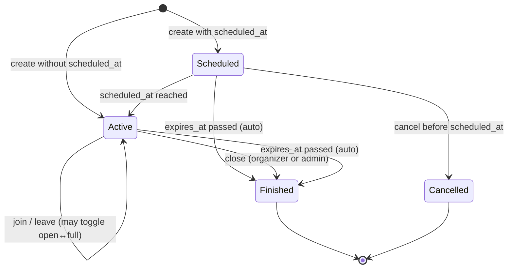

# Product Decisions & Specifications

This document is the official source of truth for approved product decisions, specifications, catalogs, statuses, dependencies, and scope boundaries in the project.

## Documentation Rules

* Every meaningful product/specification decision must be added to this document.
* Every future specification issue must update this document.
* Issues that depend on previous decisions must reference the relevant section.
* Do not change approved decisions silently.
* If a decision changes, add an update note explaining what changed and why.
* This document is intended for project team members, Codex, and future developers.
* This document is not a place for random ideas, temporary notes, or unapproved features.

---

# ISSUE-006 — Define Field Reporting Categories

## Type

Product decision / catalog definition.

## Background

There was no structured way to report problems with fields.

Before building a field reporting system, the official report categories must be defined.

## Goal

Create a fixed official catalog of field report categories.

## Decision

ISSUE-006 is a decision/specification task only.

No code changes are required for ISSUE-006.

The official field report category catalog is approved as follows:

| Hebrew Label  | Internal Key           | Meaning                                                                                         |
| ------------- | ---------------------- | ----------------------------------------------------------------------------------------------- |
| מיקום שגוי    | `wrong_location`       | The field exists, but the map location is incorrect.                                            |
| מגרש לא קיים  | `field_does_not_exist` | The field shown in the app does not exist in reality.                                           |
| מגרש סגור     | `field_closed`         | The field exists, but is closed and cannot currently be used.                                   |
| מגרש בשיפוצים | `under_renovation`     | The field exists but is temporarily under renovation or unusable.                               |
| מגרש פרטי     | `private_field`        | The field is private and not open to the public.                                                |
| כפילות מגרש   | `duplicate_field`      | The same field appears more than once in the app.                                               |
| מידע שגוי     | `wrong_information`    | Field details are incorrect, such as name, sport type, lighting, facilities, or other metadata. |
| אחר           | `other`                | The issue does not fit any of the defined categories.                                           |

## Acceptance Criteria

* All required categories are defined.
* No duplicate categories exist.
* Each category has a clear purpose.
* The catalog is approved for future development.

## Scope

Included:

* Define official categories.
* Define internal keys.
* Define category meanings.

Excluded:

* No database changes.
* No API endpoints.
* No frontend UI.
* No admin dashboard.
* No tests.

## Status

Approved.

---

# ISSUE-007 — Create Field Reports Database Schema

## Type

Database infrastructure specification.

## Dependency

Depends on ISSUE-006.

The `category` field must use the approved category catalog from ISSUE-006.

## Background

A field reporting system cannot be built without a dedicated database structure.

## Goal

Create the database foundation for storing field reports.

## Decision

Create a dedicated database table for field reports.

Table name:

`field_reports`

## Required Columns

| Column        | Type          | Required | Notes                                                   |
| ------------- | ------------- | -------- | ------------------------------------------------------- |
| `id`          | `uuid`        | yes      | Primary key.                                            |
| `field_id`    | `uuid`        | yes      | References `fields(id)`.                                |
| `user_id`     | `uuid`        | yes      | References `users(id)`.                                 |
| `category`    | `text`        | yes      | Must match one of the approved ISSUE-006 category keys. |
| `description` | `text`        | no       | Free text description from the reporting user.          |
| `status`      | `text`        | yes      | Default value: `open`.                                  |
| `created_at`  | `timestamptz` | yes      | Default value: `now()`.                                 |
| `reviewed_at` | `timestamptz` | no       | Nullable. Set when the report is reviewed.              |
| `reviewed_by` | `uuid`        | no       | Nullable. References `users(id)`.                       |

## Approved Category Values

The `category` column must allow only these values:

* `wrong_location`
* `field_does_not_exist`
* `field_closed`
* `under_renovation`
* `private_field`
* `duplicate_field`
* `wrong_information`
* `other`

## Approved Status Values

The `status` column must allow only these values:

| Label     | DB Value    |
| --------- | ----------- |
| Open      | `open`      |
| In Review | `in_review` |
| Resolved  | `resolved`  |
| Rejected  | `rejected`  |

## Constraints

* `category` must be one of the approved ISSUE-006 category values.
* `status` must be one of the approved status values.
* Invalid category values must be rejected.
* Invalid status values must be rejected.
* `reviewed_at` may be null.
* `reviewed_by` may be null.
* `status` must default to `open`.

## Recommended Indexes

Add useful indexes for future filtering and admin review:

* `field_id`
* `user_id`
* `status`
* `created_at`
* optionally `field_id, status`

## Implementation Details

Implemented as database/schema infrastructure only.

Migration file:

`backend/migrations/field_reports.sql`

Schema file:

`backend/schema.sql`

Implemented table:

`field_reports`

Implemented constraints:

* `category` is restricted to the approved ISSUE-006 category values.
* `status` is restricted to `open`, `in_review`, `resolved`, and `rejected`.
* `status` defaults to `open`.
* `field_id` references `fields(id)` and cascades on field deletion.
* `user_id` references `users(id)` and cascades on user deletion.
* `reviewed_by` references `users(id)` and is set to null if the reviewer user is deleted.
* `reviewed_at` is nullable.
* `reviewed_by` is nullable.

Implemented indexes:

* `idx_field_reports_field_id`
* `idx_field_reports_user_id`
* `idx_field_reports_status`
* `idx_field_reports_created_at`
* `idx_field_reports_field_id_status`

## Acceptance Criteria

* The `field_reports` table exists.
* The migration exists.
* The database schema is updated.
* Valid reports can be inserted.
* Reports can be selected after insert.
* Invalid categories are rejected.
* Invalid statuses are rejected.
* Default status is `open`.
* `reviewed_at` and `reviewed_by` can remain null.

## Scope

Included:

* Database migration.
* Schema update if the project keeps `schema.sql` in sync.
* Insert/select validation.
* Backend DB tests if the existing project test structure supports it.

Excluded:

* No frontend UI.
* No report button.
* No report modal.
* No API endpoints unless created in a separate issue.
* No admin dashboard.
* No notifications.
* No image uploads.
* No comments system.
* No severity system.
* No duplicate report aggregation.

## Status

Implemented.

---

# Global Rule For Future Specification Tasks

---

# ISSUE-008 — Create Submit Field Report API

## Type

Backend API implementation.

## Dependency

Depends on ISSUE-007.

The API writes to the `field_reports` table defined in ISSUE-007 and uses the approved ISSUE-006 category catalog.

## Goal

Allow an authenticated user to submit a field report.

## Decision

Create a backend endpoint:

`POST /field-reports`

The endpoint creates a field report with:

* `field_id` from the request.
* `user_id` from the authenticated user.
* `category` from the approved field report category catalog.
* optional `description`.
* `status` controlled by the database default.
* `created_at` controlled by the database.
* `reviewed_at` left null.
* `reviewed_by` left null.

## Request Body

Allowed client fields:

* `field_id`
* `category`
* `description`

Client-controlled review fields are not allowed:

* `status`
* `reviewed_at`
* `reviewed_by`

## Validation

* User must be authenticated.
* `field_id` must exist.
* `category` must be one of the approved ISSUE-006 category values.
* Invalid categories return a validation error.
* Missing fields return a not found error.
* Database insert failures return a clean API error.

## Scope

Included:

* Backend API endpoint.
* Request validation.
* Field existence validation.
* Authenticated user ownership.
* Backend tests for success and error cases.

Excluded:

* No frontend UI.
* No report button.
* No report modal.
* No admin dashboard.
* No notifications.
* No image uploads.
* No comments system.
* No severity system.
* No duplicate report aggregation.

## Status

Implemented.

---

# ISSUE-010 — Create Admin Field Reports Queue

## Type

Admin workflow / frontend and backend API implementation.

## Dependency

Depends on ISSUE-008.

The queue reads reports from the `field_reports` table defined in ISSUE-007 and displays categories from the approved ISSUE-006 catalog.

## Goal

Allow admins to view and triage user-submitted field reports from the existing admin panel.

## Decision

Create an admin-only field reports queue in the admin panel.

Backend endpoint:

`GET /admin/field-reports`

The endpoint is protected by the existing admin authorization requirement and returns reports sorted newest first.

Returned fields include:

* report id
* field id
* field name
* reporter user id
* reporter display name when available
* reporter email when available
* category
* description
* status
* created_at
* reviewed_at
* reviewed_by

## Admin Queue Display

The admin queue displays:

* Field Name
* Report Category
* Reporter
* Date
* Status
* Description

Reports are sorted newest first.

## Filters

The queue supports these status filters:

* All
* Open
* In Review
* Resolved
* Rejected

## Scope

Included:

* Admin-only backend list endpoint.
* Enriched field and reporter data for the queue.
* Admin panel queue UI.
* Status filters.
* Newest-first sorting.
* Backend and frontend tests, including 20-report display coverage.

Excluded:

* No schema changes.
* No frontend field report submission changes.
* No report status update actions.
* No report assignment workflow.
* No notifications.
* No image uploads.
* No duplicate report aggregation.

## Status

Implemented.

---

# ISSUE-011 - Field Report Resolution Workflow

## Decision

Admins can update the lifecycle status of existing field reports from the admin API.

## Backend API Contract

`PATCH /admin/field-reports/{report_id}/status`

Request body:

```json
{ "status": "in_review" }
```

Accepted update statuses:

* `in_review`
* `resolved`
* `rejected`

`open` remains the default creation status and a valid filter/list status, but admins do not set a report back to `open` through the resolution endpoint.

## Review Metadata

Every successful status update persists:

* `status`
* `reviewed_at`
* `reviewed_by`

`reviewed_by` is the authenticated admin user's `users.id`.

## Authorization

The endpoint uses the existing admin authorization requirement. Non-admin users cannot update report status.

## Scope

Included:

* Admin-only backend status update endpoint.
* Status validation.
* Database persistence through the existing `field_reports` table.
* Review metadata updates.
* Backend tests for allowed statuses, invalid status rejection, non-admin rejection, and persisted reviewer metadata.

Excluded:

* No schema changes.
* No frontend status action UI.
* No notifications.
* No report assignment workflow.
* No transition-history audit table.

## Status

Implemented.

---

# ISSUE-013 - Pre-Launch User Management Requirements

## Decision

Ban, Unban, and Suspend are required before launch.

Promote Admin and Demote Admin are not required as regular Admin UI features before launch. Admin role changes should remain manual or super-admin controlled until audit logging, stronger permission controls, and recovery safeguards exist.

## Source Document

See `docs/user-management-requirements.md`.

## Status

Decided.

---

# ISSUE-014 - Admin User List Display

## Decision

The Admin Users list displays User ID, Username, Email, Phone, Created Date, and Status.

The current users data model has no persisted account restriction/status field. Until Ban, Unban, or Suspend are implemented, the Admin Users list displays `Active` as an MVP account-status fallback for users without a real status value.

## Status

Implemented.

---

# ISSUE-015 - Admin User Moderation Actions

## Decision

Admin users can Ban, Unban, Suspend, and Unsuspend regular (non-admin) users. Every action writes an audit log row. Promote Admin and Demote Admin remain out of scope per ISSUE-013.

## DB Shape

### users table additions

* `status text not null default 'active'` — accepted values: `active`, `banned`, `suspended`.
* `restriction_reason text` — required for ban/suspend, cleared on unban/unsuspend.
* `restricted_at timestamptz` — when the current restriction was applied.
* `restricted_by uuid references users(id)` — which admin applied the current restriction.

### user_moderation_audit table

* `id uuid primary key`
* `target_user_id uuid not null references users(id)` — the user being moderated.
* `actor_user_id uuid references users(id)` — the admin performing the action.
* `action_type text not null` — accepted values: `ban`, `unban`, `suspend`, `unsuspend`.
* `reason text` — required for ban/suspend, optional for unban/unsuspend.
* `previous_status text not null` — status before the action.
* `new_status text not null` — status after the action.
* `created_at timestamptz not null default now()`.

## API Contract

* `POST /admin/users/{user_id}/ban` — body `{ "reason": "..." }` (required).
* `POST /admin/users/{user_id}/unban` — body `{ "reason": "..." }` (optional).
* `POST /admin/users/{user_id}/suspend` — body `{ "reason": "..." }` (required).
* `POST /admin/users/{user_id}/unsuspend` — body `{ "reason": "..." }` (optional).

All return `{ "message": "...", "user": { ... } }`.

## Enforcement

Banned and suspended users are blocked from all normal authenticated user workflows via `require_active_user`. Admin endpoints use `require_admin` which does not block restricted admins (admins are never the target of these actions).

## What is included

* Ban, Unban, Suspend, Unsuspend endpoints.
* Audit log table and per-action audit rows.
* Server-side restriction enforcement on all user routes.
* Admin UI actions (Ban/Suspend for active users, Unban for banned, Unsuspend for suspended).
* Hebrew and English labels.

## What is explicitly excluded

* Promote Admin.
* Demote Admin / Remove Admin.
* Role management UI.
* Suspension duration / auto-unsuspend.

## Dependencies

* ISSUE-013 (pre-launch user management decision).
* ISSUE-014 (admin user list display — now extended with real status).

## Status

Implemented.

---

# ISSUE-016 - Future Scheduled Game Cancellation

## Decision

Future scheduled games can be cancelled before their `scheduled_at` start time.

Cancellation is different from closing:

* `close` is an active or started game lifecycle action.
* `cancel` means a future scheduled game will not happen.

## Who can cancel

* The game creator/organizer can cancel their own future scheduled game before `scheduled_at`.
* Admins can cancel any future scheduled game before `scheduled_at`.
* Regular participants cannot cancel the game.

## Cancelled game behavior

* A cancelled game must not be hard deleted.
* A cancelled game remains available for future history, audit, and admin views.
* A cancelled game must not appear in active games.
* A cancelled game must not appear in upcoming joinable games.
* A cancelled game must not appear in field details as an available upcoming game.
* A cancelled game should use a clear `cancelled` status.

Future implementation should preserve:

* `cancelled_at`
* `cancelled_by`
* `cancelled_by_role` or equivalent actor context
* Optional cancellation reason

## Participant notifications

Participants should be notified when a future scheduled game is cancelled.

Notification rules:

* If the creator cancels, notify all participants except the cancelling creator.
* If an admin cancels, notify all participants and the creator.
* If there are no participants, cancellation still succeeds without notifications.

Notification type:

* `scheduled_game_cancelled`

Notification payload should include:

* `game_id`
* `field_id`
* `scheduled_at`
* `cancelled_by`
* `cancelled_by_role`, where available

## Open questions

None. ISSUE-016 leaves no open product questions about future scheduled game cancellation.

## Status

Decided.

---

# ISSUE-017 - Scheduled Game Cancellation Implementation

## Decision

Implements ISSUE-016 product decision. Future scheduled games can be cancelled before `scheduled_at` by the creator or an admin.

## DB Shape

### games table additions

* `cancelled_at timestamptz` — when the cancellation occurred.
* `cancelled_by uuid references users(id)` — who cancelled.
* `cancelled_by_role text` — `"creator"` or `"admin"`.
* `cancel_reason text` — optional free-text reason.

The existing `status` check constraint already includes `'cancelled'`. No constraint change needed.

## API Contract

* `POST /games/{game_id}/cancel` — creator cancels own future scheduled game. Body: `{ "reason": "..." }` (optional).
* `POST /admin/games/{game_id}/cancel` — admin cancels any future scheduled game. Body: `{ "reason": "..." }` (optional).

Both return `{ "message": "Game cancelled", "game": { ... } }`.

### Validation

* Game must be in `open` or `full` status.
* Game must have a `scheduled_at` value (non-scheduled games cannot be cancelled).
* `scheduled_at` must be in the future.
* Creator endpoint: caller must be `created_by`.
* Admin endpoint: caller must have admin role.

## Notification

* Type: `scheduled_game_cancelled`.
* Creator cancels: all participants except creator are notified.
* Admin cancels: all participants and creator are notified.
* No participants: cancellation still succeeds silently.
* Notification payload includes `game_id`, `field_id`, `scheduled_at`, `cancelled_by`, `cancelled_by_role`.

## Filtering

Cancelled games are automatically excluded from `/games/active`, `/games/upcoming`, and field details `upcoming_games` because these queries filter by `ACTIVE_GAME_STATUSES = ["open", "full"]`.

## Dependencies

* ISSUE-016 (product decision).

## Status

Implemented.

---

# ISSUE-019 - Game Lifecycle State Documentation

## Type

Product architecture documentation.

## Dependencies

* ISSUE-016 (cancellation product decision).
* ISSUE-017 (cancellation implementation).

## Goal

Define the official game lifecycle state model so all developers use consistent terminology and understand how games move through states.

## DB Status Values

The `games.status` column accepts exactly four values (enforced by check constraint):

| DB Status     | Terminal? | Description                                    |
| ------------- | --------- | ---------------------------------------------- |
| `open`        | No        | Game exists and has room for more players.     |
| `full`        | No        | Game exists and player count equals max.       |
| `finished`    | Yes       | Game has ended (expired, closed, or finished). |
| `cancelled`   | Yes       | Scheduled game was cancelled before start.     |

Code constant: `ACTIVE_GAME_STATUSES = ["open", "full"]`.

## Lifecycle States

The system uses six lifecycle concepts. Some are real DB statuses, some are derived from timestamps, and some are actions/events.

### 1. Scheduled (derived state)

**What it is:** A game that has not started yet.

**Nature:** Derived state, not a separate DB status. The DB status is `open` or `full`.

**Condition:** `scheduled_at` is not null AND `scheduled_at` is in the future AND `status` is `open` or `full`.

**Code:** `is_game_upcoming(game)` returns `True` when `scheduled_at > now`.

**Appears in:** `/games/upcoming` endpoint. Also visible in admin games list as an active game.

**Does NOT appear in:** `/games/active` endpoint (filtered out by `is_game_started` returning `False`).

**Timestamps:** `scheduled_at` is set at creation. `started_at` is set to `scheduled_at`. `expires_at` is set to `scheduled_at + 2 hours`.

**Exit transitions:**
* Time passes and `scheduled_at <= now` → game becomes **Active**.
* Creator or admin cancels before `scheduled_at` → game becomes **Cancelled**.
* `expires_at` passes (only possible if `expires_at` was not extended) → auto-finished to **Finished**.

### 2. Active (derived state)

**What it is:** A game currently in progress that players can join, leave, or interact with.

**Nature:** Derived state. The DB status is `open` or `full`.

**Condition:** `status` is `open` or `full` AND the game is not expired AND either `scheduled_at` is null (instant game) or `scheduled_at <= now`.

**Code:** `is_game_started(game)` returns `True` when `scheduled_at` is null or `scheduled_at <= now`. `is_game_expired(game)` returns `False`.

**Appears in:** `/games/active` endpoint. Also visible in admin games list.

**Available actions:** Join, Leave, Close, Extend.

**Timestamps:** `started_at` marks when the game began (either `now()` for instant games or `scheduled_at` for scheduled games). `expires_at` marks when the game auto-finishes (default: `started_at + 2 hours`).

**Exit transitions:**
* Organizer or admin closes the game → **Finished** (via Close action).
* `expires_at` passes → auto-finished to **Finished** (via `finish_expired_games`).
* Organizer extends → remains **Active** with updated `expires_at` (via Extend action).

### 3. Extended (action/event)

**What it is:** The act of pushing a game's end time further into the future.

**Nature:** An action/event, not a DB status or derived state. After extending, the game remains `open` or `full`.

**Condition:** Game must be active (status `open`/`full`, not expired). Only the organizer (`created_by`) or an admin can extend.

**Effect:** `expires_at` is updated to `current expires_at + 1 hour`. No status change occurs.

**API:** `POST /games/{game_id}/extend` (organizer), `POST /admin/games/{game_id}/extend` (admin).

**Notification:** `game_extended` notification sent to participants.

### 4. Finished (DB status)

**What it is:** A game that has ended, either naturally or by explicit close action.

**Nature:** Real DB status value (`finished`). Terminal state — no transitions out.

**Entry conditions (any of these):**
* Organizer calls `POST /games/{game_id}/close`.
* Admin calls `POST /admin/games/{game_id}/close`.
* `expires_at` passes and `finish_expired_games` auto-transitions the game.

**Appears in:** Admin finished games list. Does NOT appear in `/games/active` or `/games/upcoming`.

**Timestamps:** `expires_at` may or may not have passed. There is no dedicated `finished_at` column; the transition is inferred from the status change.

### 5. Closed (action)

**What it is:** The explicit action of ending a game early, before `expires_at`.

**Nature:** An action, not a separate DB status. The close action sets `status = 'finished'`.

**Who can close:**
* The game organizer (`created_by`) via `POST /games/{game_id}/close`.
* An admin via `POST /admin/games/{game_id}/close`.

**Precondition:** Game must be active (`open`/`full`, not expired). Checked by `ensure_game_is_actionable`.

**Result:** Game enters the **Finished** DB status. A `game_closed` notification is sent to participants.

**Difference from Finished:** "Closed" is how you get to "Finished" manually. "Finished" is also reached automatically when `expires_at` passes. Both result in the same terminal DB status `finished`.

### 6. Cancelled (DB status)

**What it is:** A scheduled game that was called off before its start time.

**Nature:** Real DB status value (`cancelled`). Terminal state — no transitions out.

**Condition:** Game must have `scheduled_at` in the future AND status must be `open` or `full` at the time of cancellation.

**Who can cancel:**
* The game organizer via `POST /games/{game_id}/cancel`.
* An admin via `POST /admin/games/{game_id}/cancel`.

**Cancellation metadata columns:**
* `cancelled_at` — when the cancellation occurred.
* `cancelled_by` — user ID of who cancelled.
* `cancelled_by_role` — `"creator"` or `"admin"`.
* `cancel_reason` — optional free text.

**Appears in:** Admin finished games list (alongside `finished` games). Does NOT appear in `/games/active` or `/games/upcoming`.

**Notification:** `scheduled_game_cancelled` sent to participants. Creator cancellation excludes the creator from notifications. Admin cancellation notifies all participants including the creator.

**Difference from Close/Finished:** Cancellation is only for future scheduled games that have not started. Closing is for active/started games. Both are terminal but use different DB status values (`cancelled` vs `finished`).

## Timestamp Roles

| Column         | Set when                                       | Purpose                                                     |
| -------------- | ---------------------------------------------- | ----------------------------------------------------------- |
| `scheduled_at` | Game creation (if scheduled)                   | Future start time. Null for instant games.                  |
| `started_at`   | Game creation                                  | `scheduled_at` for scheduled games, `now()` for instant.    |
| `expires_at`   | Game creation, updated on extend               | Auto-finish deadline. Default: `started_at + 2 hours`.      |
| `cancelled_at` | Cancellation action                            | When the game was cancelled. Null if not cancelled.         |

## Visibility Rules

| Query                  | Filter logic                                                          | Shows                        |
| ---------------------- | --------------------------------------------------------------------- | ---------------------------- |
| `/games/active`        | `status in (open, full)` AND not expired AND `is_game_started = True` | Currently playable games     |
| `/games/upcoming`      | `status in (open, full)` AND not expired AND `is_game_upcoming = True`| Future scheduled games       |
| `/admin/games?active`  | `status in (open, full)` AND not expired                              | All non-terminal games       |
| `/admin/games?finished`| `status in (finished, cancelled)`                                     | All ended/cancelled games    |
| Field upcoming games   | `status in (open, full)` for the field                                | Active + upcoming for field  |

Cancelled and finished games are automatically excluded from active/upcoming queries because they are not in `ACTIVE_GAME_STATUSES`.

## State Flow Diagram



## Key Clarifications

1. **Scheduled vs Active:** Both use DB status `open` or `full`. The difference is whether `scheduled_at` is in the future (Scheduled) or in the past/null (Active). There is no `scheduled` DB status value.

2. **Closed vs Finished:** "Closed" is the user action (`POST .../close`). "Finished" is the resulting DB status. A game can also become `finished` automatically when `expires_at` passes, without anyone explicitly closing it.

3. **Cancellation vs Close:** Cancellation applies only to future scheduled games before `scheduled_at`. Closing applies to active/started games. They produce different terminal DB statuses (`cancelled` vs `finished`) and different notifications (`scheduled_game_cancelled` vs `game_closed`).

4. **Extended is not a state:** Extending updates `expires_at` by +1 hour. The game remains `open` or `full`. There is no `extended` DB status.

5. **Auto-finish:** `finish_expired_games()` runs on every active/upcoming query. If `expires_at` has passed, the game is silently transitioned to `finished`. This is the garbage-collection mechanism for games that were never explicitly closed.

## Status

Documented.

---

# ISSUE-024 - Game Visibility Rules Specification

## Type

Product specification / visibility rules.

## Dependencies

* ISSUE-019 (game lifecycle state documentation — defines the state model this spec builds on).
* ISSUE-017 (cancellation implementation — introduced the `cancelled` status).

## Background

The project needed an explicit specification of which games appear in which context. While ISSUE-019 documented the state model and included a brief visibility table, no dedicated product decision existed to cover all contexts, edge cases, and the relationship between backend filtering and frontend display logic.

## Goal

Define clear, unambiguous visibility rules for every context where games are displayed.

## Current Behavior Audit

The following behavior was confirmed by inspecting backend endpoints, frontend components, and existing tests.

### Backend endpoints

| Endpoint | DB query filter | Post-query filter | Result |
| --- | --- | --- | --- |
| `GET /games/active` | `status IN ('open', 'full')` | `finish_expired_games` then `is_game_started` (started or instant) | Currently playable, non-expired games |
| `GET /games/upcoming` | `status IN ('open', 'full')` | `finish_expired_games` then `is_game_upcoming` (`scheduled_at > now`) | Future scheduled games only |
| `GET /fields` / `GET /fields/{id}` | `status IN ('open', 'full')` per field | `finish_expired_games` then split by `is_game_started` / `is_game_upcoming` | `active_game` (single) + `upcoming_games` (list) per field |
| `GET /admin/games` (no filter) | `status IN ('open', 'full')` + `status IN ('finished', 'cancelled')` | None | `{ active: [...], finished: [...] }` |
| `GET /admin/games?status=active` | `status IN ('open', 'full')` | None | Active games only |
| `GET /admin/games?status=finished` | `status IN ('finished', 'cancelled')` | None | Finished + cancelled games |

### Frontend components

| Component | Data source | What is shown |
| --- | --- | --- |
| Map markers (MapPage) | `GET /fields` → `active_game` per field | Only fields with an active (started, non-expired) game show a game marker |
| Field details (FieldDetailsPanel) | `active_game` + `upcoming_games` from field data | Active game panel + upcoming games list. No finished/cancelled games. |
| Game panel (GamePanel) | Renders a single game | Uses `ACTIVE_GAME_STATUSES = Set(['open', 'full'])` to determine if action buttons (join/leave/close/extend) are shown. Finished/cancelled games would render without action buttons if ever passed to this component. |
| Admin games (AdminGames) | `GET /admin/games` | Two sections: "Active Games" and "Finished Games" (includes cancelled). Admin can close/extend active games. |

### Contexts with no current implementation

| Context | Status |
| --- | --- |
| User's own game history / profile | No endpoint or UI exists. Not implemented. |
| Search / query by arbitrary filters | No endpoint exists. Not implemented. |

## Decision — Visibility Rules

### 1. Map / Active Games List

**Rule:** Show only currently playable games.

**Filter:** `status IN ('open', 'full')` AND not expired AND game has started (`scheduled_at` is null or `scheduled_at <= now`).

**Excludes:** Finished, cancelled, expired, and future scheduled games.

**Implementation:** `GET /games/active` + field `active_game` payload. **Matches current behavior.**

### 2. Field Details

**Rule:** Show the field's current active game (if any) and its upcoming scheduled games.

**Filter:** Same as Map for active game. Upcoming: `status IN ('open', 'full')` AND `scheduled_at > now`.

**Excludes:** Finished, cancelled, and expired games.

**Implementation:** `GET /fields/{id}` returns `active_game` + `upcoming_games`. **Matches current behavior.**

### 3. Upcoming Games

**Rule:** Show only future scheduled games that have not started and are not cancelled/finished.

**Filter:** `status IN ('open', 'full')` AND `scheduled_at > now`.

**Excludes:** Finished, cancelled, expired, instant (non-scheduled) games, and scheduled games whose `scheduled_at` has passed.

**Implementation:** `GET /games/upcoming`. **Matches current behavior.**

### 4. User's Own Games / History

**Rule (for future implementation):** When a user profile or "my games" feature is built:

* **Active/upcoming section:** Show the user's current and upcoming games (`status IN ('open', 'full')`, not expired, user is in `game_players`).
* **History section:** Show the user's finished and cancelled games, clearly labeled as past games. Sorted newest first.
* Finished and cancelled games must never appear in the active/upcoming section.

**Current status:** Not implemented. No endpoint or UI exists. This is a future feature.

### 5. Admin Panel

**Rule:** Admins see all games, grouped by lifecycle state.

* **Active tab:** `status IN ('open', 'full')`, not expired. Includes both started and scheduled.
* **Finished tab:** `status IN ('finished', 'cancelled')`. Sorted newest first, with a display limit.

**Implementation:** `GET /admin/games`. **Matches current behavior.**

### 6. Notifications / Reminders

**Rule:** Notifications reference games by ID regardless of status. A notification about a cancelled game is still valid and should be delivered/viewable — the notification itself is the record that the event happened.

* `game_created` — sent when an open/full game is created near a user's preference area.
* `game_closed` — sent when an active game is closed/finished.
* `game_extended` — sent when an active game's `expires_at` is extended.
* `player_joined_game` — sent when a player joins an active game.
* `scheduled_game_reminder` — sent ~1 hour before `scheduled_at` for upcoming games.
* `scheduled_game_cancelled` — sent when a future scheduled game is cancelled.

Notifications are never filtered by game status — they are historical records. **Matches current behavior.**

### 7. Search / Query Endpoints

**Rule (for future implementation):** If a search or filtered query endpoint is added:

* Default search should only return active and upcoming games (`status IN ('open', 'full')`, not expired).
* Admin search may include all statuses with an explicit filter parameter.
* Finished/cancelled games should not appear in user-facing search results unless the user explicitly requests history.

**Current status:** Not implemented. No search endpoint exists.

## Summary Table

| Context | Open | Full | Finished | Cancelled | Scheduled (future) | Expired (auto-finished) |
| --- | --- | --- | --- | --- | --- | --- |
| Map / active list | Yes (if started) | Yes (if started) | No | No | No | No |
| Field details — active | Yes (if started) | Yes (if started) | No | No | No | No |
| Field details — upcoming | No | No | No | No | Yes | No |
| Upcoming games list | No | No | No | No | Yes | No |
| User history (future) | No | No | Yes (labeled) | Yes (labeled) | No | No |
| Admin — active tab | Yes | Yes | No | No | Yes | No |
| Admin — finished tab | No | No | Yes | Yes | No | N/A (becomes finished) |
| Notifications | N/A — notifications are status-independent historical records | | | | | |

## Implementation Gap Analysis

| Gap | Severity | Follow-up |
| --- | --- | --- |
| No implementation gaps found | N/A | Current backend and frontend behavior matches all defined rules |
| 7 extend-notification tests use hardcoded `expires_at` dates without mocking `get_now`, causing time-sensitive failures | Low (test-only) | Fix by adding `get_now` mock to extend notification test fixtures (not a visibility issue) |
| User history/profile not implemented | N/A (future feature) | Implement when user profile feature is planned |

## Scope

Included:

* Audit of all backend query endpoints.
* Audit of frontend display components.
* Explicit visibility rules for every context.
* Future guidance for unimplemented features.

Excluded:

* No code changes.
* No migration changes.
* No frontend changes.
* No new endpoints.

## Status

Documented.

---

# ISSUE-027 - Game History Requirements Specification

## Type

Product specification / requirements definition.

## Dependencies

* ISSUE-019 (game lifecycle state documentation — defines the state model and statuses).
* ISSUE-024 (game visibility rules — defines current endpoint filtering).

## Background

The product currently has no concept of "game history" for users. There is no endpoint, UI, or product definition for what a user should see when reviewing their past or current game activity. Before building a "My Games" feature, the product rules must be defined.

## Current Behavior Audit

### What exists today

| Feature | Status |
| --- | --- |
| `/games/active` — list of currently playable games (all users, all fields) | Implemented |
| `/games/upcoming` — list of future scheduled games (all users, all fields) | Implemented |
| `/fields/{id}` — active game + upcoming games per field | Implemented |
| `/admin/games` — admin view of active + finished/cancelled games | Implemented |
| User profile / "My Games" endpoint | **Not implemented** |
| User game history endpoint | **Not implemented** |
| User game history UI | **Not implemented** |

### How user–game relationships are tracked

| Relationship | How it is stored | Notes |
| --- | --- | --- |
| Creator | `games.created_by = user_id` | Permanent. Survives game lifecycle. |
| Current participant | `game_players` row with `user_id` | Row exists as long as user is in the game. |
| Left participant | **Not tracked** | `leave_game` deletes the `game_players` row. No `left_at` column exists. Once a user leaves, there is no record of past participation. |

### Game statuses (from ISSUE-019)

| Status | Terminal? | Meaning |
| --- | --- | --- |
| `open` | No | Game has room for players. |
| `full` | No | Game is at max capacity. |
| `finished` | Yes | Game ended (expired, closed manually, or auto-finished). |
| `cancelled` | Yes | Scheduled game was cancelled before start. |

Derived states: **Scheduled** (`open`/`full` with `scheduled_at > now`), **Active** (`open`/`full`, started, not expired), **Expired** (auto-transitions to `finished`).

## Decision — Game History Sections

User game activity is split into four clearly separated sections. The term "history" is avoided as an umbrella label — instead, each section has a specific name and purpose.

### Section 1: My Active Games

**What it shows:** Games the user is currently playing or participating in that are in progress right now.

**Filter:** User is in `game_players` (or is `created_by`) AND `status IN ('open', 'full')` AND game has started (`scheduled_at` is null or `scheduled_at <= now`) AND not expired.

**Sort:** By `started_at` ascending (earliest-started first, so the user sees which games end soonest).

**Edge cases:**
* Full game where user is a participant — included (user is still in the game).
* Expired game — excluded (auto-finished by `finish_expired_games` before query returns).

### Section 2: My Upcoming Games

**What it shows:** Future scheduled games the user has joined or created that have not started yet.

**Filter:** User is in `game_players` (or is `created_by`) AND `status IN ('open', 'full')` AND `scheduled_at > now`.

**Sort:** By `scheduled_at` ascending (nearest upcoming game first).

**Edge cases:**
* Scheduled game that was cancelled — excluded (`status = 'cancelled'`, not in `ACTIVE_GAME_STATUSES`).

### Section 3: My Past Games

**What it shows:** Games the user participated in (or created) that have ended normally.

**Filter:** User is in `game_players` (or is `created_by`) AND `status = 'finished'`.

**Sort:** By `expires_at` descending (most recently ended first).

**Includes:**
* Games the user created and that finished (expired or closed).
* Games the user joined and that finished, and where the user was still a participant when the game ended.
* Games that were auto-finished by expiration.
* Games that were manually closed by the organizer or admin.

**Does not include:**
* Cancelled games (shown separately in Section 4).
* Games the user left before the game ended (the `game_players` row was deleted on leave — no record remains).

### Section 4: My Cancelled Games

**What it shows:** Scheduled games the user was involved with that were cancelled before starting.

**Filter:** User is in `game_players` (or is `created_by`) AND `status = 'cancelled'`.

**Sort:** By `cancelled_at` descending (most recently cancelled first).

**Display:** Clearly labeled as cancelled. Cancellation reason shown if available.

**Includes:**
* Games the user created and then cancelled.
* Games the user joined that were cancelled by the creator or admin.
* Games cancelled by admin where the user was a participant.

**Does not include:**
* Games the user left before cancellation (the `game_players` row was deleted on leave).

## Data Rules by User Relationship

| Relationship | Active | Upcoming | Past | Cancelled | Notes |
| --- | --- | --- | --- | --- | --- |
| Creator (organizer) | Yes | Yes | Yes | Yes | `games.created_by = user_id`. Always tracked. |
| Current participant | Yes | Yes | Yes | Yes | `game_players` row exists with matching `user_id`. |
| Left participant | No | No | No | No | `game_players` row is deleted on leave. No tracking data available. **v1: out of scope.** |
| Viewer only (not in game) | No | No | No | No | No relationship — game does not appear in user's activity. |

## Data Rules by Game Status

| Game status | Section shown in | Condition |
| --- | --- | --- |
| `open` (started, not expired) | My Active Games | User is participant or creator |
| `open` (scheduled, `scheduled_at > now`) | My Upcoming Games | User is participant or creator |
| `full` (started, not expired) | My Active Games | User is participant or creator |
| `full` (scheduled, `scheduled_at > now`) | My Upcoming Games | User is participant or creator |
| `finished` | My Past Games | User is participant or creator |
| `cancelled` | My Cancelled Games | User is participant or creator |
| Expired (before auto-finish) | N/A — auto-transitions to `finished` before query returns | Handled by `finish_expired_games` |

## Edge Cases

| Edge case | Behavior |
| --- | --- |
| Game cancelled by creator | Appears in creator's Cancelled section. Appears in participants' Cancelled section. Creator sees it because `created_by` matches. |
| Game expired automatically | Auto-finished by `finish_expired_games`. Appears in Past Games for all remaining participants and the creator. |
| Full game | Appears in Active or Upcoming depending on `scheduled_at`. Being full does not change visibility rules. |
| Scheduled game not yet started | Appears in Upcoming. Does not appear in Active or Past. |
| User leaves before game starts | `game_players` row is deleted. Game disappears from all of the user's sections. No history is preserved. |
| User leaves during active game | Same as above — `game_players` row is deleted. Game disappears from the user's history. |
| Organizer closes game manually | Game transitions to `finished`. Appears in Past Games for remaining participants and creator. |
| Admin closes game | Same as organizer close — `finished` status. Appears in Past Games. |
| User is both creator and participant | Game appears once (not duplicated). Query should use `game_players.user_id = X OR games.created_by = X` with deduplication. |

## Admin vs Normal User

| Viewer | What they see |
| --- | --- |
| Normal user | Only their own games (where they are creator or current participant). Four sections as defined above. |
| Admin (admin panel) | All games across all users, grouped by active/finished per existing `/admin/games` endpoint. No change to admin behavior. |
| Admin (as a regular user) | If an admin views their own "My Games," they see the same four sections as a normal user — only games they personally created or joined. |

## v1 Scope

### Included

* Product rules for four game activity sections (Active, Upcoming, Past, Cancelled).
* Clear data rules by status and user relationship.
* Edge case documentation.
* Suggested API shape (see below).
* Suggested frontend sections (see below).

### Explicitly excluded (out of scope for v1)

* **Left-participant history:** The `game_players` table has no `left_at` column. When a user leaves, the row is deleted. Tracking past participation after leaving would require a schema change (soft-delete or audit column). This is deferred to a future issue.
* **Game statistics / aggregates:** Total games played, win rate, most-played field, etc. Future feature.
* **Pagination of history:** v1 may return all results. Pagination can be added in a follow-up if performance requires it.
* **Filtering / search within history:** v1 shows all games in each section without additional filters. Future feature.
* **Shared game activity between users:** "Games I played with user X." Future feature.
* **Game ratings or reviews:** Not part of game history v1.

## Suggested Future API Shape (do not implement yet)

```
GET /users/me/games
```

Query parameters:
* `section` — required. One of: `active`, `upcoming`, `past`, `cancelled`.
* `limit` — optional. Default 50.
* `offset` — optional. Default 0.

Response shape:
```json
{
  "section": "past",
  "games": [
    {
      "id": "...",
      "field_id": "...",
      "field_name": "...",
      "sport_type": "football",
      "status": "finished",
      "players_present": 5,
      "max_players": 10,
      "started_at": "...",
      "expires_at": "...",
      "scheduled_at": null,
      "created_by": "...",
      "is_creator": true,
      "participants": [...]
    }
  ],
  "total": 42,
  "limit": 50,
  "offset": 0
}
```

Each game includes `is_creator: boolean` so the frontend can badge or label games the user organized.

Authentication: `require_active_user`. The endpoint returns only the authenticated user's games.

## Suggested Future Frontend Sections (do not implement yet)

A "My Games" page or tab with four sections:

1. **המשחקים שלי עכשיו** (My Active Games) — games in progress. Show field name, sport, player count, time remaining.
2. **משחקים קרובים** (Upcoming Games) — future scheduled games. Show field name, scheduled time, player count.
3. **משחקים שהסתיימו** (Past Games) — finished games. Show field name, date played, final player count.
4. **משחקים שבוטלו** (Cancelled Games) — cancelled games. Show field name, cancellation reason if available, cancelled by whom.

Each section collapses if empty. Sections 3 and 4 are sorted newest-first. Sections 1 and 2 are sorted by time (soonest first).

Games where the user was the organizer should have a visual indicator (badge, icon, or label).

## Follow-up Implementation Issue

A follow-up implementation issue should be created to:

1. Build `GET /users/me/games` endpoint with section-based filtering.
2. Build the frontend "My Games" page/tab.
3. Add backend tests for all four sections, edge cases, and creator/participant deduplication.
4. Verify that `finish_expired_games` runs before returning results (same pattern as `/games/active`).

## Status

Documented.

---

For every future product decision, specification, catalog, status definition, database design decision, API contract decision, or scope decision:

1. Update this document.
2. Add the relevant issue number.
3. Document the decision.
4. Document dependencies.
5. Document accepted values, statuses, categories, or contracts.
6. Document what is included.
7. Document what is explicitly excluded.
8. Keep the document clean and structured.
9. Do not mix unapproved ideas into this file.
10. Treat this file as the official source of truth for the project.

---

# ISSUE-029 — Notification Event Inventory

## Type

Documentation / system audit.

## Dependencies

* ISSUE-017 (cancellation implementation — introduced `scheduled_game_cancelled` notification).
* ISSUE-019 (game lifecycle state documentation).
* ISSUE-024 (game visibility rules — section 6 lists notification types).

## Background

The notification system grew organically across multiple issues. No single document defined when each notification is created, who receives it, and through which channels. This inventory is the authoritative reference.

## Notification Infrastructure

### Tables

| Table | Purpose |
| --- | --- |
| `notifications` | Stores all in-app notification records. Columns: `id`, `user_id`, `type`, `title`, `body`, `game_id`, `field_id`, `data` (jsonb), `read_at`, `created_at`. |
| `notification_preferences` | Stores per-user delivery preferences. Types: `radius`, `city`, `specific_field`. Columns include `enabled`, `sport_type`, `radius_km`, `lat`, `lng`, `city`, `field_id`. |
| `push_tokens` | Stores FCM push tokens per user/device. Columns: `id`, `user_id`, `token`, `created_at`, `updated_at`. Multi-device support (one user can have multiple tokens). |

### Delivery Channels

| Channel | Mechanism |
| --- | --- |
| **In-app** | Row inserted into `notifications` table. Retrieved via `GET /notifications`. Unread count via `GET /notifications/unread-count`. |
| **Push** | FCM v1 HTTP API via `send_fcm_notification()` in `app/services/firebase_push.py`. Sent per-token for each recipient's registered push tokens. |

### Push Delivery Details

* Push is always sent immediately after in-app notification row is inserted.
* Push uses the same `title` and `body` as the in-app notification.
* Push `data` payload includes: `notification_id`, `type`, `game_id`, `field_id`, plus any extra fields from the notification's `data` jsonb.
* Invalid tokens (FCM returns `INVALID_ARGUMENT`, `NOT_FOUND`, `UNREGISTERED`, or `SENDER_ID_MISMATCH`) are automatically deleted from `push_tokens`.
* `FirebaseConfigError` is suppressed by default (best-effort delivery). Only the test-push endpoint surfaces config errors.
* Push failures for individual tokens are caught and silently skipped (best-effort).

### Read State

* `read_at` (timestamptz) — canonical column. Set via `PATCH /notifications/{id}/read` or `PATCH /notifications/read-all`.
* Legacy `is_read` (boolean) — supported for backward compatibility. Code auto-detects which column the live schema exposes.

---

## Notification Event Inventory

### Event 1: Game Created

| Field | Value |
| --- | --- |
| **Event Name** | Game Created |
| **Notification Type** | `game_created` |
| **Trigger** | User creates a new game via `POST /games` |
| **Trigger Type** | User-action triggered |
| **Recipients** | Users whose notification preferences match the game's field location and sport type, **excluding** the game organizer. Matching rules: (1) `specific_field` — preference `field_id` matches game's `field_id`; (2) `city` — preference city matches field's city (case-insensitive, normalized); (3) `radius` — user's lat/lng is within `radius_km` of field's lat/lng (haversine). Only enabled preferences are evaluated. Each user receives at most one notification regardless of how many preferences match. |
| **Delivery Channel** | In-app + Push |
| **Preference Rules** | Delivery is entirely preference-driven. Users without matching enabled preferences receive nothing. |
| **Duplicate Prevention** | Yes. Checks `notifications` table for existing rows with `type='game_created'` AND same `game_id` AND same `user_id`. Skips users who already have a notification for this game. |
| **Failure Behavior** | Best-effort. Notification creation runs inline in the game creation endpoint but does not block the response — the game is created regardless. Push failures are silently caught. |
| **Title (Hebrew)** | `נפתח משחק חדש` |
| **Body (Hebrew)** | `נפתח משחק {sport_type} במגרש {field_name}` |
| **Payload/Data** | `game_id`, `field_id` (stored as top-level columns on the notification row) |
| **Source Files** | `backend/app/routers/notifications.py` (`create_game_created_notifications`, lines 320–384), `backend/app/routers/games.py` (line 177) |
| **Tests** | `backend/tests/test_notifications.py` |

### Event 2: Player Joined Game

| Field | Value |
| --- | --- |
| **Event Name** | Player Joined Game |
| **Notification Type** | `player_joined_game` |
| **Trigger** | User joins a game via `POST /games/{game_id}/join` (RPC `join_game_atomic`) |
| **Trigger Type** | User-action triggered |
| **Recipients** | The game organizer (`games.created_by`) only. **Not sent** if the joining user is the organizer themselves. |
| **Delivery Channel** | In-app + Push |
| **Preference Rules** | None. Always sent to the organizer regardless of notification preferences. |
| **Duplicate Prevention** | No. A new notification is created every time a player joins. If a player leaves and re-joins, a new notification is created. |
| **Failure Behavior** | Best-effort. Wrapped in try/except in `games.py`. Join succeeds even if notification fails. Errors are logged. |
| **Title (Hebrew)** | `שחקן חדש הצטרף למשחק שלך` |
| **Body (Hebrew)** | `{player_name} הצטרף למשחק שלך ב-{field_name}` (or `שחקן חדש הצטרף למשחק שלך ב-{field_name}` if player has no name) |
| **Payload/Data** | `data` jsonb: `{ game_id, field_id, type: "player_joined_game", joined_user_id }`. Also stored as top-level `game_id`, `field_id` columns. |
| **Legacy Schema Handling** | Falls back gracefully if `data` column or `game_id`/`field_id` columns don't exist (tries without `data`, then with `related_game_id`/`related_field_id`). |
| **Source Files** | `backend/app/routers/notifications.py` (`create_player_joined_game_notification`, lines 387–449), `backend/app/routers/games.py` (line 345) |
| **Tests** | `backend/tests/test_notifications.py` |

### Event 3: Game Closed

| Field | Value |
| --- | --- |
| **Event Name** | Game Closed |
| **Notification Type** | `game_closed` |
| **Trigger** | Organizer closes game via `POST /games/{game_id}/close`, or admin closes via `POST /admin/games/{game_id}/close` |
| **Trigger Type** | User-action triggered (organizer or admin) |
| **Recipients** | All current participants (`game_players` rows for the game), **excluding** the user who performed the close action. |
| **Delivery Channel** | In-app + Push |
| **Preference Rules** | None. Always sent to all participants regardless of preferences. |
| **Duplicate Prevention** | Yes. Checks for existing `type='game_closed'` AND same `game_id` AND same `user_id`. Skips users who already have a notification. |
| **Failure Behavior** | Best-effort. Wrapped in try/except. Close action succeeds even if notifications fail. Errors are logged. |
| **Title (Hebrew)** | `המשחק נסגר` |
| **Body (Hebrew)** | `המשחק במגרש {field_name} נסגר על ידי המארגן.` |
| **Payload/Data** | `data` jsonb: `{ game_id, field_id, type: "game_closed", closed_by_user_id }`. Also stored as top-level `game_id`, `field_id` columns. |
| **Source Files** | `backend/app/routers/notifications.py` (`create_game_closed_notifications`, lines 452–535), `backend/app/routers/games.py` (line 425), `backend/app/api/admin.py` (line 590) |
| **Tests** | `backend/tests/test_notifications.py` |

### Event 4: Game Extended

| Field | Value |
| --- | --- |
| **Event Name** | Game Extended |
| **Notification Type** | `game_extended` |
| **Trigger** | Organizer extends game via `POST /games/{game_id}/extend`, or admin extends via `POST /admin/games/{game_id}/extend` |
| **Trigger Type** | User-action triggered (organizer or admin) |
| **Recipients** | All current participants (`game_players` rows), **excluding** both the game organizer (`created_by`) and the user who performed the extend action. |
| **Delivery Channel** | In-app + Push |
| **Preference Rules** | None. Always sent to eligible participants regardless of preferences. |
| **Duplicate Prevention** | Yes, per extension event. Checks for existing `type='game_extended'` AND same `game_id` AND same `user_id` AND same `data->>'new_end_time'`. A second extend (to a different end time) creates a new notification. |
| **Failure Behavior** | Best-effort. Wrapped in try/except. Extend action succeeds even if notifications fail. Errors are logged. |
| **Title (Hebrew)** | `המשחק הוארך` |
| **Body (Hebrew)** | `שעת הסיום החדשה של המשחק היא {HH:MM}` |
| **Payload/Data** | `data` jsonb: `{ game_id, field_id, type: "game_extended", new_end_time (ISO 8601), extended_by_user_id }`. Also stored as top-level `game_id`, `field_id` columns. |
| **Source Files** | `backend/app/routers/notifications.py` (`create_game_extended_notifications`, lines 629–706), `backend/app/routers/games.py` (line 464), `backend/app/api/admin.py` (line 633) |
| **Tests** | `backend/tests/test_notifications.py` |

### Event 5: Scheduled Game Cancelled

| Field | Value |
| --- | --- |
| **Event Name** | Scheduled Game Cancelled |
| **Notification Type** | `scheduled_game_cancelled` |
| **Trigger** | Creator cancels via `POST /games/{game_id}/cancel`, or admin cancels via `POST /admin/games/{game_id}/cancel` |
| **Trigger Type** | User-action triggered (creator or admin) |
| **Recipients** | **If creator cancels:** all participants except the cancelling creator. **If admin cancels:** all participants AND the creator (creator is notified that an admin cancelled their game). |
| **Delivery Channel** | In-app + Push |
| **Preference Rules** | None. Always sent to all eligible participants/creator regardless of preferences. |
| **Duplicate Prevention** | No. No dedup check exists for this notification type. However, a game can only be cancelled once (terminal status), so duplicates are structurally impossible. |
| **Failure Behavior** | Best-effort. Wrapped in try/except. Cancel action succeeds even if notifications fail. Errors are logged. |
| **Title (Hebrew)** | `המשחק בוטל` |
| **Body (Hebrew)** | `המשחק במגרש {field_name} בוטל על ידי המארגן` (creator cancel) or `המשחק במגרש {field_name} בוטל על ידי מנהל` (admin cancel) |
| **Payload/Data** | `data` jsonb: `{ game_id, field_id, type: "scheduled_game_cancelled", scheduled_at, cancelled_by, cancelled_by_role }`. Also stored as top-level `game_id`, `field_id` columns. |
| **Source Files** | `backend/app/routers/notifications.py` (`create_scheduled_game_cancelled_notifications`, lines 538–626), `backend/app/routers/games.py` (line 532), `backend/app/api/admin.py` (line 702) |
| **Tests** | `backend/tests/test_notifications.py` |

### Event 6: Scheduled Game Reminder

| Field | Value |
| --- | --- |
| **Event Name** | Scheduled Game Reminder |
| **Notification Type** | `scheduled_game_reminder` |
| **Trigger** | Admin manually triggers via `POST /admin/reminders/scheduled-games/run`. The function scans all active games with a future `scheduled_at` that is within 1 hour of the current time. |
| **Trigger Type** | Admin-triggered (batch job, not automatic cron) |
| **Recipients** | All current participants (`game_players` rows) of each eligible game. The organizer receives the reminder only if they are also in `game_players`. |
| **Delivery Channel** | In-app + Push |
| **Preference Rules** | None. Sent to all participants regardless of notification preferences. |
| **Duplicate Prevention** | Yes, two layers: (1) `scheduled_reminder_processed_at` column on `games` table — once set, the game is skipped on future runs; (2) checks `notifications` table for existing `type='scheduled_game_reminder'` rows for the game — if any exist, the game is marked processed and skipped. |
| **Failure Behavior** | Best-effort for push. The function always returns a result object with `processed_game_ids`, `skipped_game_ids`, and `notifications_created` count. |
| **Title (Hebrew)** | `תזכורת למשחק שמתקרב` |
| **Body (Hebrew)** | `המשחק שלך מתחיל בעוד שעה. אל תשכח להגיע בזמן.` |
| **Payload/Data** | `data` jsonb: `{ type: "scheduled_game_reminder", game_id, field_id, scheduled_at }`. Also stored as top-level `game_id`, `field_id` columns. |
| **Eligibility Window** | Game must have `scheduled_at` in the future AND `scheduled_at - 1 hour <= now`. Games already started (`scheduled_at <= now`) are skipped. |
| **Source Files** | `backend/app/routers/notifications.py` (`generate_scheduled_game_reminders`, lines 741–828), `backend/app/api/admin.py` (line 571) |
| **Tests** | `backend/tests/test_notifications.py` |

### Event 7: Test Push Notification

| Field | Value |
| --- | --- |
| **Event Name** | Test Push |
| **Notification Type** | `test_push` (in push data only — no in-app notification row is created) |
| **Trigger** | User triggers via `POST /notifications/test-push` |
| **Trigger Type** | User-action triggered (self-service) |
| **Recipients** | The requesting user only (their own registered push tokens). |
| **Delivery Channel** | Push only. **No in-app notification row is created.** |
| **Preference Rules** | None. Requires at least one registered push token (returns 404 otherwise). |
| **Duplicate Prevention** | N/A. Test pushes can be sent repeatedly. |
| **Failure Behavior** | **Not best-effort.** Returns HTTP 503 if Firebase is not configured. Returns HTTP 502 if push could not be sent to any token. This is the only notification endpoint that surfaces push errors to the user. |
| **Title** | `Test notification` (English) |
| **Body** | `Push notifications are ready.` (English) |
| **Payload/Data** | Push data: `{ type: "test_push" }` |
| **Source Files** | `backend/app/routers/notifications.py` (`send_test_push`, lines 923–959) |
| **Tests** | `backend/tests/test_notifications.py` |

---

## Notification Type Summary

| # | Type String | In-App | Push | Preference-Gated | Dedup | Trigger |
| --- | --- | --- | --- | --- | --- | --- |
| 1 | `game_created` | Yes | Yes | Yes (radius/city/field) | Yes (per user+game) | User creates game |
| 2 | `player_joined_game` | Yes | Yes | No | No | User joins game |
| 3 | `game_closed` | Yes | Yes | No | Yes (per user+game) | Organizer/admin closes game |
| 4 | `game_extended` | Yes | Yes | No | Yes (per user+game+end_time) | Organizer/admin extends game |
| 5 | `scheduled_game_cancelled` | Yes | Yes | No | No (structurally impossible) | Creator/admin cancels scheduled game |
| 6 | `scheduled_game_reminder` | Yes | Yes | No | Yes (per game, via processed_at flag) | Admin runs reminder batch |
| 7 | `test_push` | No | Yes | No | No | User tests push setup |

## Preference System

Notification preferences only affect `game_created` notifications. All other notification types are sent unconditionally to eligible recipients.

### Preference Types

| Type | Matching Rule | Fields Used |
| --- | --- | --- |
| `radius` | Haversine distance from user's lat/lng to field's lat/lng <= `radius_km` | `lat`, `lng`, `radius_km` |
| `city` | Normalized city name comparison (case-insensitive, whitespace-normalized) | `city` |
| `specific_field` | Exact `field_id` match | `field_id` |

### Additional Filters

* `sport_type` — preference must match game's sport type, or be `"both"`.
* `enabled` — only enabled preferences are evaluated.
* Each user receives at most one `game_created` notification per game, regardless of how many preferences match.

### Frontend Settings UI

The frontend notification preferences page (`NotificationPreferencesPanel`) manages three categories:
* **Distance notifications** — radius-based, with radius slider (1–20 km).
* **City notifications** — city name match.
* **Specific field notifications** — checkbox per selected field.

Settings are saved via `PUT /notifications/preferences` which handles both the legacy single-preference format and the newer combined settings format.

## Database Deduplication Indexes

| Index | Purpose |
| --- | --- |
| `idx_notifications_user_type_game_unique` | Unique on `(user_id, type, game_id)` where `game_id IS NOT NULL` and `type IN ('game_created', 'game_closed', 'scheduled_game_reminder')`. Prevents duplicate notifications at DB level. |
| `idx_notifications_user_game_extended_end_time_unique` | Unique on `(user_id, type, game_id, data->>'new_end_time')` where `type = 'game_extended'`. Allows multiple extend notifications per game (one per distinct end time). |

## Orphan / Legacy Notification Types

No orphan or legacy notification types were found. All type strings used in code (`game_created`, `player_joined_game`, `game_closed`, `game_extended`, `scheduled_game_cancelled`, `scheduled_game_reminder`, `test_push`) are actively used and tested.

### Legacy Schema Compatibility

The `player_joined_game` notification creation function contains fallback logic for legacy database schemas:
* Falls back to omitting the `data` jsonb column if the column doesn't exist.
* Falls back to using `related_game_id`/`related_field_id` column names instead of `game_id`/`field_id` if those columns don't exist.
* The `game_created` notification function similarly handles `related_game_id`/`related_field_id` fallback.
* The `_with_notification_target_aliases` function normalizes both column naming conventions when reading notifications.

These are backward-compatibility paths for databases that haven't been fully migrated. The canonical schema (in `schema.sql`) uses `game_id`, `field_id`, and `data`.

## Identified Gaps and Follow-Up Issues

| # | Gap | Severity | Notes |
| --- | --- | --- | --- |
| 1 | `push_tokens` table is not in `schema.sql` | Low | Defined only in `backend/migrations/push_notifications.sql`. Should be added to `schema.sql` for consistency. |
| 2 | Scheduled game reminders are not automated | Medium | `generate_scheduled_game_reminders` must be manually triggered by an admin via `POST /admin/reminders/scheduled-games/run`. There is no cron job, scheduled task, or automatic invocation. Users could miss reminders if an admin forgets to trigger the endpoint. |
| 3 | All notification titles/body text are hardcoded in Hebrew | Low | No i18n support for notification content. Push notifications and in-app notifications are always in Hebrew regardless of user language preference. The test push is the exception (English). |
| 4 | No "player left game" notification | Low | When a player leaves, no notification is sent to the organizer or other participants. This may be intentional for v1. |
| 5 | No notification when game auto-finishes (expires) | Low | `finish_expired_games` silently transitions games to `finished` without creating notifications. Only explicit close creates `game_closed` notifications. |
| 6 | No notification for admin moderation actions | Info | Ban, suspend, unban, unsuspend actions do not create notifications for the affected user. The user discovers their status change on next login attempt. |

## Status

Documented.

---

## ISSUE-030 - Notification Duplication Risk Review

### Purpose

This audit systematically reviews the notification system to identify every situation where a user could receive the same notification twice. It distinguishes between two duplication types:
1. Duplicate notification rows in the database
2. Duplicate push notifications delivered to the device

This review documents existing protections, evaluates race conditions under concurrent operations, analyzes retry behavior, and specifies follow-up actions to address identified gaps.

### Scope

The audit covers all 7 active notification events implemented in the system, as inventoried in ISSUE-029:
1. **Game Created** (`game_created`)
2. **Player Joined Game** (`player_joined_game`)
3. **Game Closed** (`game_closed`)
4. **Game Extended** (`game_extended`)
5. **Scheduled Game Cancelled** (`scheduled_game_cancelled`)
6. **Scheduled Game Reminder** (`scheduled_game_reminder`)
7. **Test Push** (`test_push`)

### Summary Table

| Event | Type | DB Duplicate Risk | Push Duplicate Risk | Existing Protection | Missing Tests | Follow-up Needed |
| --- | --- | --- | --- | --- | --- | --- |
| **Game Created** | `game_created` | None | None | Application check & DB unique index `idx_notifications_user_type_game_unique` | None | No |
| **Player Joined Game** | `player_joined_game` | None | None | Structural check via `join_game_atomic` RPC constraint | None | No |
| **Game Closed** | `game_closed` | None | None | Application check & DB unique index `idx_notifications_user_type_game_unique` | None | No |
| **Game Extended** | `game_extended` | None (per end time) | None (per end time) | Application check & DB unique index `idx_notifications_user_game_extended_end_time_unique` | Verification test for sequential API retries | Yes (Low - non-idempotency of extend endpoint) |
| **Scheduled Game Cancelled** | `scheduled_game_cancelled` | Low (concurrency race only) | Low (concurrency race only) | Structural validation check (`status in ACTIVE_GAME_STATUSES`). No unique DB index or app check. | Concurrent cancellation race test | Yes (Low - add to unique index) |
| **Scheduled Game Reminder** | `scheduled_game_reminder` | None | None | Application `processed_at` column, app check, and DB unique index `idx_notifications_user_type_game_unique` | None | No |
| **Test Push** | `test_push` | N/A | None (Diagnostic) | Multi-triggers send again by design. No DB row created. | None | No |

### Detailed Event Review

#### 1. Game Created
* **Event Name:** Game Created
* **Trigger:** User creates a new game via `POST /games/`
* **Source files/functions:** `backend/app/routers/notifications.py` (`create_game_created_notifications`), called by `backend/app/routers/games.py` (`create_game`)
* **Recipients:** Users with matching enabled notification preferences (radius, city, or specific field) and sport type, excluding the organizer (`created_by`).
* **Delivery channel:** both
* **Preference rules:** Delivery is entirely preference-driven. Users without matching enabled preferences receive nothing.
* **Payload/data:**
  - `game_id`: Top-level UUID column `game_id` (fallback `related_game_id`)
  - `field_id`: Top-level UUID column `field_id` (fallback `related_field_id`)
  - `data` JSON: None (empty)
  - `title`: `נפתח משחק חדש`
  - `body`: `נפתח משחק {sport_type} במגרש {field_name}`
* **Existing deduplication:**
  - App-level: Queries `notifications` table for `type='game_created'`, `game_id` and recipient user IDs. Filters out users who already have a notification.
  - DB-level: Unique index `idx_notifications_user_type_game_unique` on `(user_id, type, game_id)`.
* **DB duplicate risk:** None. Dual-layer protection (application check + DB unique index) prevents duplicate rows.
* **Push duplicate risk:** None. Push is sent exactly once per successfully inserted DB row. If DB insert fails (e.g., due to unique constraint violation), no push is sent.
* **Retry behavior:**
  - User/browser retries request: Creates a completely new game with a new `game_id`. The new game legitimately generates its own notifications. The same game cannot be created twice.
  - Backend error after partial success: If the game is successfully created but the connection drops before returning, the client retries. A new game will be created, which is correct.
* **Concurrent behavior:**
  - Two users act at same time: Two separate games are created. Each gets its own notifications.
  - Same user double-clicks: Creates two separate games.
  - Organizer/admin action overlap: Only users can create games.
* **Scheduled/admin behavior:** N/A (not triggered by admin or scheduler).
* **Current tests:** `test_create_game_avoids_duplicate_notifications_for_same_user_game_and_type` in `backend/tests/test_notifications.py`
* **Missing tests:** None.
* **Status:** Protected.
* **Follow-up needed:** None.

#### 2. Player Joined Game
* **Event Name:** Player Joined Game
* **Trigger:** User joins a game via `POST /games/{game_id}/join`
* **Source files/functions:** `backend/app/routers/notifications.py` (`create_player_joined_game_notification`), called by `backend/app/routers/games.py` (`join_game`)
* **Recipients:** The game organizer (`created_by`) only, provided the joining user is not the organizer.
* **Delivery channel:** both
* **Preference rules:** None. Always sent to the organizer.
* **Payload/data:**
  - `game_id`: Top-level UUID column `game_id`
  - `field_id`: Top-level UUID column `field_id`
  - `data` JSON: `{ game_id, field_id, type: "player_joined_game", joined_user_id }`
  - `title`: `שחקן חדש הצטרף למשחק שלך`
  - `body`: `{player_name} הצטרף למשחק שלך ב-{field_name}` (or fallback)
* **Existing deduplication:**
  - App-level: None.
  - DB-level: None. The unique index `idx_notifications_user_type_game_unique` does NOT include `player_joined_game`.
* **DB duplicate risk:** None. Enforced structurally at the game participation layer. A user can only be in `game_players` once per game due to the `unique (game_id, user_id)` constraint on `game_players`.
* **Push duplicate risk:** None. Push is only sent on successful DB insert.
* **Retry behavior:**
  - User/browser retries request: If the first join succeeded, the retry will call `join_game_atomic` RPC which sees the user is already in `game_players` and returns `{"error": "User already joined"}`. The API returns a 400 Bad Request and does not call the notification function. Thus, no duplicate notification is created.
  - Backend error after partial success: Same as above. The retry is blocked by `join_game_atomic` checks.
* **Concurrent behavior:**
  - Two users act at same time: Success for both (if room). Two separate notifications are created for the organizer (User A and User B). This is correct.
  - Same user double-clicks: `join_game_atomic` RPC uses `SELECT ... FOR UPDATE` to serialize concurrent requests, and rejects the second request.
  - Organizer/admin action overlap: Organizer and admin cannot trigger joins for other users.
* **Scheduled/admin behavior:** N/A.
* **Current tests:** `test_duplicate_join_does_not_create_duplicate_player_joined_notification` in `backend/tests/test_notifications.py`
* **Missing tests:** None.
* **Status:** Protected (structural).
* **Follow-up needed:** None.

#### 3. Game Closed
* **Event Name:** Game Closed
* **Trigger:** Organizer closes game via `POST /games/{game_id}/close`, or admin closes via `POST /admin/games/{game_id}/close`
* **Source files/functions:** `backend/app/routers/notifications.py` (`create_game_closed_notifications`), called by `backend/app/routers/games.py` (`close_game`) and `backend/app/api/admin.py` (`close_admin_game`)
* **Recipients:** All current participants of the game (from `game_players`), excluding the user who closed the game.
* **Delivery channel:** both
* **Preference rules:** None. Always sent to all eligible participants.
* **Payload/data:**
  - `game_id`: Top-level UUID column `game_id`
  - `field_id`: Top-level UUID column `field_id`
  - `data` JSON: `{ game_id, field_id, type: "game_closed", closed_by_user_id }`
  - `title`: `המשחק נסגר`
  - `body`: `המשחק במגרש {field_name} נסגר על ידי המארגן.`
* **Existing deduplication:**
  - App-level: Yes. Queries `notifications` table for `type='game_closed'`, `game_id` and recipient user IDs. Filters out users who already have a notification.
  - DB-level: Yes. Unique index `idx_notifications_user_type_game_unique` on `(user_id, type, game_id)`.
* **DB duplicate risk:** None. Dual-layer protection (application check + DB unique index) prevents duplicate rows.
* **Push duplicate risk:** None. Push is only sent on successful DB insert.
* **Retry behavior:**
  - User/browser retries request: If the first close succeeded, the game status is updated to `finished`. The retried request will run `_ensure_active_game` (or `_ensure_admin_active_game`) which raises 400 Bad Request because the game is already in `finished` status (which is not in `ACTIVE_GAME_STATUSES`). The notification code is skipped.
  - Backend error after partial success: If the status is updated to `finished` but the request fails before notifications are sent, retrying the API will fail at the status validation check (game not active) and NOT send notifications (this is a missed-notification risk, not a duplicate risk).
* **Concurrent behavior:**
  - Two users act at same time / organizer and admin action overlap: If organizer and admin both close the game concurrently:
    - If one request completes first, the other fails at the status check.
    - If there is a race where both pass validation before either commits, both will try to update status to `finished` (idempotent) and both try to insert notification rows. The DB unique index `idx_notifications_user_type_game_unique` will reject the second insert, raising an exception and preventing duplicate DB rows and duplicate push notifications.
  - Same user double-clicks: Handled by status checks and unique index.
* **Scheduled/admin behavior:**
  - Admin manually triggers twice: Same as concurrent/retry. Fails at status check or unique index.
  - Admin and user path both trigger same event: Same as above.
* **Current tests:** `test_duplicate_close_does_not_create_duplicate_game_closed_notification` in `backend/tests/test_notifications.py`
* **Missing tests:** None.
* **Status:** Protected.
* **Follow-up needed:** None.

#### 4. Game Extended
* **Event Name:** Game Extended
* **Trigger:** Organizer extends game via `POST /games/{game_id}/extend`, or admin extends via `POST /admin/games/{game_id}/extend`
* **Source files/functions:** `backend/app/routers/notifications.py` (`create_game_extended_notifications`), called by `backend/app/routers/games.py` (`extend_game`) and `backend/app/api/admin.py` (`extend_admin_game`)
* **Recipients:** All current participants of the game, excluding the organizer and the actor who extended the game.
* **Delivery channel:** both
* **Preference rules:** None. Always sent to eligible participants.
* **Payload/data:**
  - `game_id`: Top-level UUID column `game_id`
  - `field_id`: Top-level UUID column `field_id`
  - `data` JSON: `{ game_id, field_id, type: "game_extended", new_end_time, extended_by_user_id }`
  - `title`: `המשחק הוארך`
  - `body`: `שעת הסיום החדשה של המשחק היא {HH:MM}`
* **Existing deduplication:**
  - App-level: Yes. Queries `notifications` table for existing `type='game_extended'`, `game_id`, recipient user IDs, and `data->>'new_end_time' == new_end_time_iso`. Skips users who already have a notification *for this specific end time*.
  - DB-level: Yes. Unique index `idx_notifications_user_game_extended_end_time_unique` on `(user_id, type, game_id, (data ->> 'new_end_time'))`.
* **DB duplicate risk:** None. Protected per extension end time.
* **Push duplicate risk:** None. Push is only sent on successful DB insert.
* **Retry behavior:**
  - User/browser retries request: The extend action reads `expires_at` from the DB, adds 1 hour to it, updates it in the DB, and sends a notification. If the user retries the request (or browser sends it twice), the second request reads the *updated* `expires_at` and extends it by *another* hour. This changes `expires_at` to a *new* time. Because the new time is different, the application check and the unique index permit a new notification. This is correct for the new end time, but the end result is that the game has been extended twice (unwanted double extension). This is an endpoint idempotency issue, not a notification duplication issue.
  - Backend error after partial success: If the first attempt succeeds but the connection drops before returning a response, retrying the endpoint will result in a double extension (2 hours total).
* **Concurrent behavior:**
  - Two users act at same time / organizer and admin overlap:
    - If they read the same initial `expires_at`, they both compute the same `new_end_time`. The DB updates to that time (idempotent). The notifications are generated for that same `new_end_time`, and the unique index/app check prevents duplicates.
    - If one commits first, the second reads the updated time and extends it further, generating a new notification for the new time.
  - Same user double-clicks: Can cause double extension.
* **Scheduled/admin behavior:** Same as retry/concurrent.
* **Current tests:** `test_duplicate_game_extended_notification_is_not_created_for_same_extension` in `backend/tests/test_notifications.py`
* **Missing tests:**
  - Verification test verifying that retrying an extend action results in a new notification for the new end time (expected but indicates non-idempotency).
* **Status:** Protected (notification dedup). Low risk (lifecycle non-idempotency).
* **Follow-up needed:**
  - Low priority: Consider making the extend endpoint idempotent by having the client pass the expected `expires_at` (optimistic concurrency) or a specific target time.

#### 5. Scheduled Game Cancelled
* **Event Name:** Scheduled Game Cancelled
* **Trigger:** Creator cancels via `POST /games/{game_id}/cancel`, or admin cancels via `POST /admin/games/{game_id}/cancel`
* **Source files/functions:** `backend/app/routers/notifications.py` (`create_scheduled_game_cancelled_notifications`), called by `backend/app/routers/games.py` (`cancel_game`) and `backend/app/api/admin.py` (`cancel_admin_game`)
* **Recipients:**
  - Creator cancels: all participants except the cancelling creator.
  - Admin cancels: all participants and the creator.
* **Delivery channel:** both
* **Preference rules:** None. Always sent to all eligible participants/creator.
* **Payload/data:**
  - `game_id`: Top-level UUID column `game_id`
  - `field_id`: Top-level UUID column `field_id`
  - `data` JSON: `{ game_id, field_id, type: "scheduled_game_cancelled", scheduled_at, cancelled_by, cancelled_by_role }`
  - `title`: `המשחק בוטל`
  - `body`: `המשחק במגרש {field_name} בוטל על ידי המארגן` or `המשחק במגרש {field_name} בוטל על ידי מנהל`
* **Existing deduplication:**
  - App-level: None.
  - DB-level: None. `scheduled_game_cancelled` is not in the `idx_notifications_user_type_game_unique` partial unique index.
* **DB duplicate risk:** Low risk (concurrency race only). No index protects this type in the database.
* **Push duplicate risk:** Low risk (concurrency race only). Duplicate inserts lead to duplicate pushes.
* **Retry behavior:**
  - User/browser retries request: Protected structurally. The first cancel sets the status to `'cancelled'`. The retried request checks if `status in ACTIVE_GAME_STATUSES`. Since `'cancelled'` is not active, the request fails with a 400 Bad Request, preventing duplicate notification rows and push sends for retries.
  - Backend error after partial success: If the first attempt succeeds in updating the DB to `'cancelled'` but fails before sending notifications, retrying will fail with 400 (game not active), leaving recipients with zero notifications.
* **Concurrent behavior:**
  - **Race condition:** If the creator and admin cancel the game at the exact same time:
    - Both requests check the game status. If both read `'open'` or `'full'` before either updates it, both will pass status validation.
    - Both will update the status to `'cancelled'` (idempotent).
    - Both will call `create_scheduled_game_cancelled_notifications`.
    - Since there is no app-level or DB-level deduplication for this type, both calls will insert notification rows and trigger push sends.
    - Result: Every recipient will receive two identical `scheduled_game_cancelled` notifications (two DB rows and two push notifications).
  - Same user double-clicks: Can cause race condition if the requests are handled concurrently.
* **Scheduled/admin behavior:** Same concurrent race risk between admin and creator.
* **Current tests:** None check duplicate prevention for `scheduled_game_cancelled`. (Tests in `test_game_cancel.py` check normal cancellation and notification generation only).
* **Missing tests:**
  - Concurrent cancellation race test (verifying that racing requests do not result in duplicate notifications).
* **Status:** Low risk (structural status validation protects sequential retries, but a concurrency gap exists).
* **Follow-up needed:**
  - suggested title: Add scheduled_game_cancelled to unique notifications index
  - priority: Low
  - reason: Add `scheduled_game_cancelled` to the partial unique index `idx_notifications_user_type_game_unique` for defense-in-depth against concurrent cancellation races.

#### 6. Scheduled Game Reminder
* **Event Name:** Scheduled Game Reminder
* **Trigger:** Admin manually triggers via `POST /admin/reminders/scheduled-games/run`
* **Source files/functions:** `backend/app/routers/notifications.py` (`generate_scheduled_game_reminders`), called by `backend/app/api/admin.py` (`run_scheduled_game_reminders`)
* **Recipients:** All current participants of the game (the organizer receives it only if they are in `game_players`).
* **Delivery channel:** both
* **Preference rules:** None. Always sent to all participants regardless of preferences.
* **Payload/data:**
  - `game_id`: Top-level UUID column `game_id`
  - `field_id`: Top-level UUID column `field_id`
  - `data` JSON: `{ type: "scheduled_game_reminder", game_id, field_id, scheduled_at }`
  - `title`: `תזכורת למשחק שמתקרב`
  - `body`: `המשחק שלך מתחיל בעוד שעה. אל תשכח להגיע בזמן.`
* **Existing deduplication:**
  - App-level: Yes, two layers:
    1. Checks the `games` table's `scheduled_reminder_processed_at` column. If set, the game is skipped.
    2. Queries the `notifications` table for existing `type='scheduled_game_reminder'` rows for the game. If any exist, it updates `scheduled_reminder_processed_at` and skips the game.
  - DB-level: Yes. Unique index `idx_notifications_user_type_game_unique` on `(user_id, type, game_id)` where `type = 'scheduled_game_reminder'`.
* **DB duplicate risk:** None. Triple-layer protection.
* **Push duplicate risk:** None. Push is only sent on successful DB insert.
* **Retry behavior:**
  - User/admin retries API / triggers manually twice: If the first run succeeded, `scheduled_reminder_processed_at` is set, or notification rows exist. The second run will find these and skip the game.
  - Backend error after partial success: If the first run succeeds in inserting notifications but fails before updating `scheduled_reminder_processed_at` or returning, retrying will run the notification check, find the existing rows, set `scheduled_reminder_processed_at`, and skip sending duplicates.
* **Concurrent behavior:**
  - Two admin requests run concurrently: If both pass the `scheduled_reminder_processed_at` and notification checks before either writes, both will attempt to insert rows. The unique index `idx_notifications_user_type_game_unique` will reject the second insert, raising an exception and preventing duplicate rows and duplicate push sends.
* **Scheduled/admin behavior:** Same as above.
* **Current tests:** `test_scheduled_game_reminder_existing_notification_prevents_late_duplicates` and `test_scheduled_game_reminder_job_is_idempotent` in `backend/tests/test_notifications.py`.
* **Missing tests:** None.
* **Status:** Protected.
* **Follow-up needed:** None.

#### 7. Test Push Notification
* **Event Name:** Test Push
* **Trigger:** User triggers via `POST /notifications/test-push`
* **Source files/functions:** `backend/app/routers/notifications.py` (`send_test_push`)
* **Recipients:** Requesting user only (their own registered push tokens).
* **Delivery channel:** push
* **Preference rules:** None.
* **Payload/data:**
  - Push data: `{ type: "test_push" }`
  - Title: `Test notification`
  - Body: `Push notifications are ready.`
* **Existing deduplication:** None.
* **DB duplicate risk:** N/A (no DB row created).
* **Push duplicate risk:** None (by design). Users trigger this explicitly to verify push delivery works. Receiving multiple push notifications upon multiple requests is the correct diagnostic behavior.
* **Retry behavior:** Sends a new push notification by design.
* **Concurrent behavior:** Sends multiple pushes by design.
* **Scheduled/admin behavior:** N/A.
* **Current tests:** `test_test_push_requires_authentication` and `test_test_push_sends_to_current_users_tokens` in `backend/tests/test_notifications.py`.
* **Missing tests:** None.
* **Status:** Protected (by design).
* **Follow-up needed:** None.

### Global Duplication Risks

#### Push Retry / Idempotency
Push notifications are sent synchronously immediately following the DB insert, inside the same API request. There is no background queue, offline retry loop, or delivery pipeline in the application. This ensures that the application itself never retries push delivery internally (reducing the risk of duplicate delivery). However, since Google's FCM v1 HTTP API does not natively support idempotency keys, if a network timeout occurs between the backend and FCM and a request is retried, FCM could deliver duplicate pushes. This is a standard transport-layer risk common to all push delivery systems.

#### Duplicate Push Tokens
A user registering the same FCM token multiple times (e.g. from the same device/browser context repeatedly) could result in duplicate push notifications if each token row was stored.
To prevent this, the system enforces:
1. A DB-level uniqueness constraint `UNIQUE(token)` on the `push_tokens` table.
2. The `save_push_token` application function performs an upsert: it queries for the token first and updates the existing row rather than inserting a new one.
This ensures there is never more than one row per token. If a user has multiple *different* devices (different tokens), each registers separately, resulting in one push per device, which is the expected correct behavior.

#### Scheduled Reminder Reruns
If the scheduled reminder batch job runs multiple times (due to duplicate admin actions or a misconfigured cron scheduler), it is protected from duplicate notification rows and duplicate push delivery by:
1. Setting the `scheduled_reminder_processed_at` timestamp on each game.
2. Checking the `notifications` table for existing `scheduled_game_reminder` rows before processing a game.
3. The DB-level uniqueness index `idx_notifications_user_type_game_unique`.
Even under concurrent execution, the DB-level uniqueness index prevents duplicate inserts.

#### Admin / User Path Overlap
Endpoints that can be triggered by both an organizer (user path) and an admin (admin path) on the same game:
* **Close game:** `POST /games/{id}/close` vs `POST /admin/games/{id}/close`
* **Extend game:** `POST /games/{id}/extend` vs `POST /admin/games/{id}/extend`
* **Cancel game:** `POST /games/{id}/cancel` vs `POST /admin/games/{id}/cancel`
For close and extend, duplicate notifications are prevented by their respective DB unique indexes.
For cancel, if an admin and creator concurrently cancel, they can trigger a race condition (due to lack of uniqueness index on `scheduled_game_cancelled`), which could result in duplicate notifications.

#### Lack of DB Uniqueness where Relevant
There is a lack of database-level uniqueness constraints for:
1. `player_joined_game`: Deduplication relies entirely on the structural uniqueness of the join action itself (`join_game_atomic` RPC checks).
2. `scheduled_game_cancelled`: No DB unique index or application check exists. Deduplication relies entirely on the status change of the game to `'cancelled'`. This leaves a narrow race condition window for concurrent cancellations.

### Follow-up Issues

#### 1. Add scheduled_game_cancelled to unique notifications index
* **Priority:** Low
* **Reason:** Add `scheduled_game_cancelled` to the partial unique index `idx_notifications_user_type_game_unique` in the database to prevent duplicate notifications during concurrent cancellation races (e.g., organizer and admin cancelling at the exact same moment).

#### 2. Make extend endpoint idempotent using optimistic concurrency or target time
* **Priority:** Low
* **Reason:** The extend game endpoint computes a new expiration time relative to the existing value stored in the database. Retrying an API call results in a double extension (2 hours total) and generates a new, legitimate notification for the new end time. Making the extend action idempotent (e.g., passing the expected current `expires_at` or a specific target time) would prevent accidental double-extensions and duplicate notification noise.

#### 3. Add concurrent cancellation test to verification suite
* **Priority:** Low
* **Reason:** The test suite does not currently contain a test verifying that racing cancellation requests are safely handled and do not result in duplicate notifications or pushes. A test simulating concurrent cancellation calls should be added.

---

# ISSUE-031 — Notification Expiration Policy

## Type

Product decision / lifecycle policy.

## Dependencies

* ISSUE-029 (Notification Event Inventory)
* ISSUE-030 (Notification Duplication Risk Review)

## Background

The notification system stores in-app notification records, but no lifecycle policy existed for old notifications.

## Goal

Define how long notifications are retained, whether they are deleted, and whether they are archived.

## Decision

For MVP, in-app notifications are retained for 90 days.

Notifications older than 90 days may be deleted by a future cleanup job.

No archive table is required for MVP.

Read and unread notifications follow the same retention policy.

Notifications are not an audit log. Business-critical history, compliance records, moderation logs, and operational audit trails must be stored in dedicated audit tables, not in the `notifications` table.

## Policy

* Retention period: 90 days from `created_at`.
* Deletion: allowed after 90 days.
* Archive: not required for MVP.
* Read/unread behavior: `read_at` does not affect expiration.
* Push notifications: no separate retention policy; push is delivery-only.
* In-app notifications: stored until deleted by future cleanup logic.

## Rationale

* Prevents unbounded growth of the `notifications` table.
* Keeps the user notification inbox useful and relevant.
* Avoids overengineering archive storage before the product needs it.
* Separates user-facing notifications from audit/compliance records.
* Makes future cleanup implementation straightforward using `created_at`.

## Scope

Included:

* Product decision for notification retention.
* Deletion/archive policy.
* Clarification that notifications are not audit records.

Excluded:

* No cleanup job implementation.
* No database migration.
* No archive table.
* No frontend changes.
* No backend endpoint changes.

## Status

Approved.

---

# ISSUE-032 — Implement Notification Retention Policy

## Type

Backend implementation.

## Dependencies

* ISSUE-031 (90-day retention policy decision).
* ISSUE-029 (Notification Event Inventory — defines the `notifications` table schema).

## Background

ISSUE-031 approved a 90-day retention policy for in-app notifications. This issue implements the cleanup mechanism as an admin-triggered endpoint.

## Goal

Provide a backend endpoint that deletes notifications older than 90 days, accessible only to admins.

## Decision

### Endpoint

`POST /admin/notifications/cleanup`

Protected by `require_admin`. Non-admin users receive 401/403.

### Behavior

* Calculates cutoff as `now - 90 days` (using `get_now()` for testability).
* Selects all notification rows where `created_at < cutoff` (strict less-than — notifications exactly at the cutoff boundary are NOT deleted).
* Deletes matching rows by ID using the service-role Supabase client (bypasses RLS).
* Returns `{ deleted_count, retention_days: 90, cutoff }`.

### What is deleted

* Only rows from the `notifications` table.
* Both read and unread notifications older than 90 days are deleted.

### What is NOT deleted

* `push_tokens` — push token records are never affected by cleanup.
* `notification_preferences` — user preference records are never affected by cleanup.
* `user_moderation_audit` — audit records are never affected by cleanup.
* Any other table.

### Idempotency

Running cleanup twice in succession is safe. The second run returns `deleted_count: 0`.

### Constants

* `NOTIFICATION_RETENTION_DAYS = 90` defined in `backend/app/routers/notifications.py`.

## Implementation Details

* Cleanup function: `cleanup_old_notifications(now=None)` in `backend/app/routers/notifications.py`.
* Admin endpoint: `POST /admin/notifications/cleanup` in `backend/app/api/admin.py`.
* Tests: `backend/tests/test_notification_cleanup.py` (9 tests).

## Tests

| # | Test | Verifies |
| --- | --- | --- |
| 1 | Deletes notification older than 90 days | Old notifications are removed |
| 2 | Does not delete notification newer than 90 days | Recent notifications are preserved |
| 3 | Does not delete notification exactly at the 90-day cutoff | Boundary condition (strict less-than) |
| 4 | Deletes old unread notifications | `read_at = NULL` does not prevent deletion |
| 5 | Deletes old read notifications | `read_at` set does not prevent deletion |
| 6 | Does not delete push_tokens | Cleanup is scoped to `notifications` only |
| 7 | Does not delete notification_preferences | Cleanup is scoped to `notifications` only |
| 8 | Non-admin cannot run cleanup | Authorization enforcement |
| 9 | Admin cleanup is idempotent | Second run deletes 0 |

## Scope

Included:

* Backend cleanup function.
* Admin-only endpoint.
* 9 backend tests.

Excluded:

* No archive table.
* No automatic cron/scheduler.
* No frontend UI for cleanup.
* No changes to notification delivery behavior.
* No changes to push_tokens, notification_preferences, or other tables.

## Status

Implemented.

---

# ISSUE-033 — Review Notification Unread Counter Accuracy

## Type

Audit / test coverage.

## Dependencies

* ISSUE-029 (Notification Event Inventory — defines all 7 notification events).

## Background

The unread notification badge must always show an accurate count. This audit reviewed every backend endpoint and frontend component involved in the unread counter to verify correctness, identify bugs, and add missing test coverage.

## Unread Counter Source of Truth

`GET /notifications/unread-count` is the authoritative source. It fetches all notifications for the authenticated user using the service-role client (bypasses RLS), filters in Python using `_is_notification_unread()`, and returns `{ unread_count: N }`.

The function `_is_notification_unread()` supports both the canonical `read_at` timestamp column and the legacy `is_read` boolean column.

## Read Single Behavior

`PATCH /notifications/{id}/read` marks a single notification as read:
* Verifies the notification belongs to the authenticated user (returns 404 otherwise).
* Sets `read_at` to the current UTC timestamp (or `is_read = True` on legacy schema).
* Marking an already-read notification is a no-op — it overwrites `read_at` with a new timestamp but does not change the unread count.

## Read All Behavior

`PATCH /notifications/read-all` marks all of the authenticated user's unread notifications as read:
* Filters by `user_id` AND `read_at IS NULL` (or `is_read = False` on legacy schema).
* Does not affect other users' notifications.
* After completion, `GET /notifications/unread-count` returns 0 for the user.

## New Notification Behavior

When a new notification row is inserted (via any of the 7 notification events), it has `read_at = NULL` by default. The next call to `GET /notifications/unread-count` will reflect the increased count.

## Multiple Tabs Behavior

The frontend polls `GET /notifications/unread-count` every 20 seconds (production) or 1 second (development) via `setInterval`. Polling only fires when `document.visibilityState === 'visible'`. If one tab marks notifications as read, other tabs will update within the next polling interval.

No websocket or realtime infrastructure is used. The polling delay (up to 20 seconds in production) is a known and accepted limitation.

## Frontend Counter Design

The frontend uses an optimistic-then-verify pattern:

1. **Read single:** Locally updates the notification in state and computes new count from the updated array, then calls `refreshUnreadCount()` which re-fetches from the server.
2. **Read all:** Locally sets all notifications to read and count to 0, then calls both `refreshNotifications()` and `refreshUnreadCount()` from the server.
3. **Badge initialization:** On mount, fetches both `GET /notifications` and `GET /notifications/unread-count` from the server.

The count displayed in the badge is always `Number(unreadCountResult?.unread_count ?? 0)`, which guarantees no negative counts.

## Audit Result

No bugs found. The existing implementation is correct:

* Server endpoint is the authoritative source of truth.
* Frontend always re-checks the server after optimistic updates.
* Polling keeps multiple tabs in sync.
* Negative counts are structurally impossible (server returns a non-negative integer).
* Read-single on an already-read notification is idempotent.

## Tested Scenarios

### Backend tests (in `test_notifications.py`)

| # | Test | Status |
| --- | --- | --- |
| 1 | Unread count returns only current user's unread notifications | Pre-existing |
| 2 | Unread count uses service-role client | Pre-existing |
| 3 | Unread count supports legacy `is_read` schema | Pre-existing |
| 4 | Mark single notification sets `read_at` | Pre-existing |
| 5 | Cannot mark another user's notification as read | Pre-existing |
| 6 | Read-all marks only current user's notifications | Pre-existing |
| 7 | Mark single sets `is_read` on legacy schema | Pre-existing |
| 8 | Read-all sets `is_read` on legacy schema | Pre-existing |
| 9 | New notification increases unread count | Pre-existing |
| 10 | Marking one read decreases unread count by exactly 1 | **Added (ISSUE-033)** |
| 11 | Marking already-read notification does not change unread count | **Added (ISSUE-033)** |
| 12 | Mark-all-read sets unread count to 0 | **Added (ISSUE-033)** |

### Frontend tests (in `notifications.spec.js`)

| # | Test | Status |
| --- | --- | --- |
| 1 | Badge shows unread count on load; click notification updates badge | Pre-existing |
| 2 | Mark all read clears badge | Pre-existing |
| 3 | Legacy `is_read` schema displays and marks correctly | Pre-existing |
| 4 | Preferences save triggers unread count refresh | Pre-existing |
| 5 | Scheduled game reminder can be marked read | Pre-existing |

### Scenarios verified by design (not individually testable)

| Scenario | Verified by |
| --- | --- |
| Multiple tabs sync | Polling interval in `MapPage.jsx` calls `refreshUnreadCount()` every 20s |
| No negative badge count | Server returns `len(unread)` which is always >= 0; frontend uses `Number(... ?? 0)` |
| Server is source of truth | Every optimistic update is followed by `refreshUnreadCount()` server call |

## Known Limitations

* **Polling delay:** Up to 20 seconds in production before another tab reflects read-state changes. Acceptable for MVP.
* **No realtime push for count updates:** A new notification created by another user's action (e.g., game created) will only appear in the badge after the next poll. Push notifications provide immediate device-level alerting as a mitigation.

## Scope

Included:

* Full backend audit of unread count, read-single, and read-all endpoints.
* Full frontend audit of badge, inbox modal, polling, and optimistic update logic.
* 3 new backend tests for missing coverage.

Excluded:

* No code changes to endpoints or frontend components (no bugs found).
* No new infrastructure (no websockets, no realtime).
* No changes to notification delivery or retention.

## Status

Documented and tested.

---

# ISSUE-034 — Notification Localization Requirements

## Type

Product specification / localization policy.

## Dependencies

* ISSUE-029 (Notification Event Inventory — defines all 7 notification events and their current text).

## Purpose

Define the official Hebrew and English notification copy for every notification type, establish the localization policy, and document the current default-language behavior and future implementation path.

## Supported Languages

| Language | Code | Direction | Status |
| --- | --- | --- | --- |
| Hebrew | `he` | RTL | Current default for notification content |
| English | `en` | LTR | Defined in this document; not yet generated at runtime |

## Source of Truth for Notification Copy

This section is the canonical reference for approved notification title and body text in both languages. Backend notification creation code must use these templates (or their equivalent) when generating notification rows.

## Current Default Language Behavior

Today, all notification titles and bodies are hardcoded in Hebrew in the backend notification creation functions (`backend/app/routers/notifications.py`). The one exception is `test_push`, which uses English.

The frontend UI chrome (inbox title, buttons, labels) is localized via i18n (`frontend/src/locales/he/common.js` and `frontend/src/locales/en/common.js`), but the notification content displayed inside the inbox comes directly from the stored `title` and `body` columns — it is not translated at read time.

No user language preference is consulted when generating notification text. The backend does not look up the recipient's language setting.

## Notification Localization Table

| # | Type | Hebrew Title | Hebrew Body Template | English Title | English Body Template | Variables | Notes |
| --- | --- | --- | --- | --- | --- | --- | --- |
| 1 | `game_created` | נפתח משחק חדש | נפתח משחק {sport_type} במגרש {field_name} | New game opened | A new {sport_type} game opened at {field_name} | `sport_type`, `field_name` | |
| 2 | `player_joined_game` | שחקן חדש הצטרף למשחק שלך | {player_name} הצטרף למשחק שלך ב-{field_name} | A new player joined your game | {player_name} joined your game at {field_name} | `player_name`, `field_name` | Fallback body when player_name is empty: **HE** שחקן חדש הצטרף למשחק שלך ב-{field_name} / **EN** A new player joined your game at {field_name} |
| 3 | `game_closed` | המשחק נסגר | המשחק במגרש {field_name} נסגר על ידי המארגן. | Game closed | The game at {field_name} was closed by the organizer. | `field_name` | |
| 4 | `game_extended` | המשחק הוארך | שעת הסיום החדשה של המשחק היא {time} | Game extended | The new game end time is {time} | `time` | `time` is formatted as HH:MM |
| 5a | `scheduled_game_cancelled` (creator) | המשחק בוטל | המשחק במגרש {field_name} בוטל על ידי המארגן | Game cancelled | The game at {field_name} was cancelled by the organizer | `field_name` | Body varies by `cancelled_by_role` |
| 5b | `scheduled_game_cancelled` (admin) | המשחק בוטל | המשחק במגרש {field_name} בוטל על ידי מנהל | Game cancelled | The game at {field_name} was cancelled by an admin | `field_name` | Body varies by `cancelled_by_role` |
| 6 | `scheduled_game_reminder` | תזכורת למשחק שמתקרב | המשחק שלך מתחיל בעוד שעה. אל תשכח להגיע בזמן. | Upcoming game reminder | Your game starts in one hour. Don't forget to arrive on time. | (none) | |
| 7 | `test_push` | בדיקת התראות | התראות Push מוכנות. | Test notification | Push notifications are ready. | (none) | Push-only; no in-app notification row. Currently uses English. |

## Template Variables

| Variable | Type | Source | Fallback |
| --- | --- | --- | --- |
| `{field_name}` | string | `fields.name` via field lookup | `"Unknown field"` (EN) / `"Unknown field"` (HE, current behavior) |
| `{sport_type}` | string | `games.sport_type` | Raw value (`football` / `basketball`) |
| `{player_name}` | string | `users.name` of the joining player | Empty string triggers fallback body template |
| `{time}` | string | `new_end_time` formatted as `HH:MM` | N/A (always derived from the extend action) |

## Fallback Behavior

| Scenario | Current Behavior | Approved Behavior |
| --- | --- | --- |
| `field_name` is missing or null | Uses `"Unknown field"` | Same — use `"Unknown field"` (EN) or `"מגרש לא ידוע"` (HE, future) |
| `player_name` is empty | Uses fallback body: `שחקן חדש הצטרף למשחק שלך ב-{field_name}` | Same — use language-appropriate fallback body |
| `sport_type` value | Inserted raw (`football` / `basketball`) | Future: localize to `כדורגל`/`כדורסל` (HE) or `Football`/`Basketball` (EN) |
| User language preference unavailable | Generates Hebrew | Fallback to Hebrew for MVP |
| Missing language template | N/A (only Hebrew exists today) | Fallback to Hebrew if English template is missing |

## Directionality Rules

* Hebrew notification content is suitable for RTL display. The frontend already applies RTL layout when the app language is Hebrew.
* English notification content is suitable for LTR display.
* The notification `title` and `body` columns store plain text — no HTML or directional markers are needed.
* The frontend inbox component renders notification content in the current app direction. If a Hebrew notification is displayed while the app is in English (LTR) mode, the text may appear left-aligned. This is acceptable for MVP because notifications are currently always in Hebrew.

## Key Design Questions and Answers

### 1. What is the default notification language today?

Hebrew. All notification titles and bodies are generated in Hebrew, except `test_push` which uses English.

### 2. Where should future notification templates live?

In backend code, centralized in a dedicated notification template module or dictionary within `backend/app/routers/notifications.py`. Templates should be keyed by `(notification_type, language_code)`.

### 3. Are titles/bodies stored already localized, or resolved at read time?

**Stored already localized.** The `title` and `body` columns on the `notifications` table contain the final text generated at creation time. There is no read-time resolution. This is the approved MVP approach.

### 4. How should push and in-app notification text stay consistent?

Push notifications use the same `title` and `body` values as the in-app notification row. Both are generated from the same template at creation time. This must remain the case — push and in-app must never diverge.

### 5. What happens if a language value is missing?

Fallback to Hebrew. If a template for the user's preferred language does not exist, generate the notification in Hebrew.

### 6. Should notification history change language if the user changes app language later?

**No.** Notifications are stored with their generated text at creation time. Changing the app language does not retranslate historical notifications. This is acceptable because:
* Retranslation would require re-rendering every stored notification.
* The `title`/`body` columns are plain text, not template references.
* Users who switch languages will see new notifications in their new language, but old ones remain in the language they were created in.

## Future Implementation Guidance

When runtime localization is implemented (in a future issue):

1. **Add a user language preference lookup** to notification creation functions. The backend should determine the recipient's preferred language before generating text.
2. **Create a template dictionary** mapping `(notification_type, language_code)` → `(title_template, body_template)`. Use the approved copy from this document.
3. **Localize `sport_type`** values in notification bodies (`football` → `כדורגל` / `Football`).
4. **Localize the field_name fallback** (`"Unknown field"` → `"מגרש לא ידוע"` for Hebrew).
5. **Generate both push and in-app text from the same template** to prevent divergence.
6. **Do not retranslate existing notifications.** Only new notifications should use the recipient's language.
7. **If user language is not set**, default to Hebrew.

## Scope

Included:

* Approved Hebrew and English copy for all 7 notification types.
* Template variable definitions and fallback rules.
* Directionality guidance.
* Current default-language behavior documentation.
* Future implementation guidance.

Excluded:

* No runtime localization implementation (no code changes to notification creation).
* No database schema changes.
* No migrations.
* No frontend changes.
* No changes to notification delivery or retention behavior.

## Status

Approved.

---

# ISSUE-035 — Implement Multilingual Notification Templates

## Type

Implementation (backend code change).

## Dependencies

* ISSUE-034 (Notification Localization Requirements — provides the approved copy used as source of truth).

## Purpose

Create a centralized notification template module that replaces all hardcoded Hebrew/English strings in `backend/app/routers/notifications.py` with a single rendering function backed by a template dictionary.

## What Changed

### New file: `backend/app/services/notification_templates.py`

* **`TEMPLATES`** dictionary — maps `(notification_type, language_code)` → `{"title": ..., "body": ...}` for all 7 notification types in Hebrew (`he`) and English (`en`).
* **`render_notification_template(notification_type, language, variables)`** — renders a template with variable substitution. Handles:
  - Fallback to Hebrew when the requested language has no template.
  - `player_joined_game` fallback body when `player_name` is empty/None.
  - `scheduled_game_cancelled` role-based body variants via `cancelled_by_role` variable (`"creator"` or `"admin"`).
* **`DEFAULT_LANGUAGE = "he"`** — the fallback language constant.

### Modified file: `backend/app/routers/notifications.py`

All 7 notification creation functions now call `render_notification_template()` instead of using inline Hebrew/English strings:

| Function | Template type | Language |
| --- | --- | --- |
| `create_game_created_notifications` | `game_created` | `he` |
| `create_player_joined_game_notification` | `player_joined_game` | `he` |
| `create_game_closed_notifications` | `game_closed` | `he` |
| `create_scheduled_game_cancelled_notifications` | `scheduled_game_cancelled` | `he` |
| `create_game_extended_notifications` | `game_extended` | `he` |
| `generate_scheduled_game_reminders` | `scheduled_game_reminder` | `he` |
| `send_test_push` | `test_push` | `en` |

All functions still pass `language="he"` (or `"en"` for `test_push`) because no user language preference lookup exists yet. This preserves the exact same runtime behavior as before — the generated notification text is byte-identical.

### New file: `backend/tests/test_notification_templates.py`

16 unit tests covering:
1. Each notification type renders correctly in Hebrew.
2. Each notification type renders correctly in English.
3. `player_joined_game` fallback body for empty and None player names.
4. `scheduled_game_cancelled` creator vs admin role variants.
5. Fallback to Hebrew for unsupported language codes.
6. `ValueError` for unknown notification types.
7. All types have both Hebrew and English templates in the dictionary.

## Behavioral Guarantees

* **No behavior change.** The exact same Hebrew text is generated for all notification types. `test_push` continues to use English.
* **No database changes.** No new columns, no migrations.
* **No frontend changes.** Notification content is still stored as plain text at creation time.
* **All 88 existing tests pass.** The 79 notification tests and 9 cleanup tests continue to pass unchanged, confirming byte-identical output.

## Future: Switching to Per-User Language

To generate notifications in the user's preferred language:
1. Look up the recipient's language preference before calling `render_notification_template`.
2. Pass the user's language code instead of the hardcoded `"he"` / `"en"`.
3. No other changes needed — the template module already supports both languages and falls back to Hebrew.

## Status

Implemented.

---

# ISSUE-036 — Notification Analytics Requirements

## Type

Product specification / analytics requirements.

## Background

The notification system has grown across multiple issues (ISSUE-029 inventory, ISSUE-032 retention, ISSUE-033 unread counter, ISSUE-034/035 localization). It is not defined which notification data we want to measure. Before building analytics infrastructure, we need an approved list of metrics, their definitions, and whether they can be derived from existing data or require new tracking.

## Goal

Define the approved notification analytics metrics that can be used as a requirements document for future implementation.

## Dependencies

* ISSUE-029 (Notification Event Inventory — defines all 7 notification events, tables, and delivery channels).
* ISSUE-033 (Notification Unread Counter Accuracy — documents read state behavior and frontend polling).
* ISSUE-035 (Multilingual Notification Templates — centralizes notification types with template keys).

## Current Data Available Today

The following data already exists in the system and can be queried without code changes:

| Data Point | Source | Notes |
| --- | --- | --- |
| Notification created timestamp | `notifications.created_at` | Present on every in-app notification row. |
| Notification type | `notifications.type` | One of 7 defined types (ISSUE-029). |
| Recipient | `notifications.user_id` | The user the notification was created for. |
| Associated game | `notifications.game_id` | Present on game-related notifications. |
| Associated field | `notifications.field_id` | Present on field-related notifications. |
| Read timestamp | `notifications.read_at` | Set when user marks notification as read. NULL if unread. |
| Legacy read flag | `notifications.is_read` | Boolean, supported for backward compatibility. |
| Notification metadata | `notifications.data` (jsonb) | Contains type-specific data: `cancelled_by_role`, `new_end_time`, `scheduled_at`, etc. |
| Push tokens per user | `push_tokens` table | One row per user/device. Multi-device supported. |
| User preferences | `notification_preferences` table | Match type (`radius`, `city`, `specific_field`), sport type, location. |

**Not available today:** push delivery results, frontend open/click events, notification-to-action correlation.

## Approved Notification Analytics Metrics

### Category A — Metrics Partially or Fully Available from Existing Data

#### 1. Notification Created

| Field | Value |
| --- | --- |
| **Definition** | A notification row was inserted into the `notifications` table. |
| **Current Support** | **Available today.** Every in-app notification has a `created_at` timestamp. Can be counted, grouped by type, user, game, field, and date. |
| **Notes** | This is the closest current proxy for "sent" for in-app notifications. Does not cover push-only events (`test_push` does not insert a notification row). |

#### 2. Notification Read

| Field | Value |
| --- | --- |
| **Definition** | User marked a notification as read, represented by `read_at` being set to a non-null timestamp. |
| **Current Support** | **Available today.** `read_at` is set via `PATCH /notifications/{id}/read` or `PATCH /notifications/read-all`. Can compute read rate per type as `COUNT(read_at IS NOT NULL) / COUNT(*)`. |
| **Notes** | Does not distinguish between single-read and read-all actions. Both set `read_at`. |

#### 3. Notification Ignored (Partial)

| Field | Value |
| --- | --- |
| **Definition** | A notification that was not read or clicked after a defined time window. |
| **Recommended MVP Definition** | Ignored if `read_at IS NULL` and notification age > 7 days from `created_at`. |
| **Current Support** | **Partially available today.** Can identify notifications with `read_at IS NULL` older than 7 days. However, true "ignored" requires click tracking (not available), so this is an approximation. |
| **Notes** | The 7-day window is a product decision, not a technical constraint. Adjust as needed. Notifications older than 90 days are deleted by the retention policy (ISSUE-032). |

### Category B — Metrics Requiring Future Tracking/Events

#### 4. Push Sent Attempted

| Field | Value |
| --- | --- |
| **Definition** | The backend attempted to send a push notification through FCM for a specific token. |
| **Current Support** | **Not persistently tracked.** The `_send_push_to_tokens()` function returns `{"sent": N, "invalid_tokens": N}` at runtime but does not store these counts. |
| **Future Requirement** | Log each push attempt with: `notification_id`, `push_token_id`, `user_id`, `timestamp`, `result` (sent/failed). |
| **Event Source** | `backend/app/routers/notifications.py` — `_send_push_to_tokens()` function. |

#### 5. Push Delivered / Push Failed

| Field | Value |
| --- | --- |
| **Definition** | FCM accepted (HTTP 200) or rejected a push send attempt. |
| **Current Support** | **Not persistently tracked.** The `send_fcm_notification()` function in `firebase_push.py` returns the FCM response status, but it is consumed and discarded. |
| **Future Requirement** | Store push delivery result: `notification_id`, `token_id`, `status_code`, `fcm_error_code` (if failed), `timestamp`. |
| **Event Source** | `backend/app/services/firebase_push.py` — `send_fcm_notification()` return value. |

#### 6. Notification Opened

| Field | Value |
| --- | --- |
| **Definition** | User opened the notification inbox or viewed a notification in the UI. |
| **Current Support** | **Not tracked.** The frontend `NotificationInboxModal` opens on click but does not emit an analytics event. |
| **Future Requirement** | Frontend event: `notification_inbox_opened` with `user_id`, `timestamp`, `unread_count_at_open`. Per-notification: `notification_viewed` with `notification_id`, `type`, `timestamp`. |
| **Event Source** | `frontend/src/components/NotificationInboxModal.jsx`. |

#### 7. Notification Clicked

| Field | Value |
| --- | --- |
| **Definition** | User clicked/tapped a notification and navigated to its target (game/field on map). |
| **Current Support** | **Not tracked.** The frontend handles notification tap navigation but does not emit an analytics event. |
| **Future Requirement** | Frontend event: `notification_clicked` with `notification_id`, `type`, `game_id`, `field_id`, `timestamp`. |
| **Event Source** | `frontend/src/components/NotificationInboxModal.jsx` — notification item click handler. |

#### 8. Notification Preference Match

| Field | Value |
| --- | --- |
| **Definition** | A user received a `game_created` notification because a notification preference matched the game's location/sport. |
| **Current Support** | **Not persistently tracked.** The `_find_notification_candidates()` function evaluates preferences at runtime but does not record which preference matched or by what rule. |
| **Future Requirement** | Store match metadata: `notification_id`, `preference_id`, `match_type` (`radius` / `city` / `specific_field`), `distance_km` (for radius matches). |
| **Event Source** | `backend/app/routers/notifications.py` — `_find_notification_candidates()`. |

#### 9. Invalid Push Token Removed

| Field | Value |
| --- | --- |
| **Definition** | A push token was deleted after FCM returned an invalid/unregistered token error. |
| **Current Support** | **Operational behavior exists** — invalid tokens are deleted from `push_tokens` at runtime. But the removal is not logged as an analytics event. |
| **Future Requirement** | Log token removal event: `token_id`, `user_id`, `fcm_error_code`, `timestamp`. |
| **Event Source** | `backend/app/routers/notifications.py` — `_send_push_to_tokens()` invalid token branch. |

#### 10. Notification Conversion

| Field | Value |
| --- | --- |
| **Definition** | User clicked a notification and then performed a valuable action (e.g., joined a game) within a defined attribution window. |
| **Current Support** | **Not tracked.** Requires event correlation between notification click and subsequent user action. |
| **Future Requirement** | Correlate `notification_clicked` event with downstream actions (e.g., `POST /games/{id}/join` within N minutes). Requires both click tracking (metric 7) and an attribution model. |
| **Event Source** | Cross-event correlation between frontend click events and backend action endpoints. |

## Summary Table

| # | Metric | Definition | Current Support | Future Tracking Needed | Priority | Notes |
| --- | --- | --- | --- | --- | --- | --- |
| 1 | Notification Created | Row inserted into notifications table | Yes — `created_at` | No | P1 | Proxy for "sent" in-app |
| 2 | Notification Read | `read_at` set on notification | Yes — `read_at` | No | P1 | Does not distinguish single vs read-all |
| 3 | Notification Clicked | User tapped notification and navigated | No | Yes — frontend event | P1 | Requires frontend tracking |
| 4 | Push Sent Attempted | Backend called FCM for a token | No | Yes — backend event log | P2 | Runtime data exists but not stored |
| 5 | Push Delivered / Failed | FCM response status | No | Yes — backend event log | P2 | Runtime data exists but not stored |
| 6 | Notification Ignored | Unread after 7 days, no click | Partial — unread age | Yes — needs click data | P2 | MVP approximation possible today |
| 7 | Preference Match | Which preference rule matched | No | Yes — backend event log | P2 | Useful for preference tuning |
| 8 | Notification Opened | User opened inbox / viewed notification | No | Yes — frontend event | P2 | Distinct from "clicked" |
| 9 | Invalid Push Token Removed | Token deleted after FCM error | No | Yes — backend event log | P3 | Operational behavior exists |
| 10 | Notification Conversion | Click → valuable action | No | Yes — event correlation | P3 | Requires click tracking + attribution |

## Design Decisions

1. **The `notifications` table is not an analytics event log.** It stores notification content for user consumption. Analytics should not overload this table with tracking columns.
2. **Future event-level tracking should use a dedicated analytics/events table** (or external analytics service) to avoid coupling product data with measurement data.
3. **Metric identity uses `notification_type`, not notification text or language.** Template language (ISSUE-035) does not affect metric grouping.
4. **Analytics dimensions should use existing identifiers:** `notification_id`, `user_id`, `type`, `game_id`, `field_id`, `created_at`, and event timestamp.
5. **Avoid storing sensitive or unnecessary user behavior data** beyond what is needed for product improvement. Analytics events should contain IDs and timestamps, not notification content.
6. **Read-all vs read-single is not distinguished today.** If this distinction becomes important for analytics, a future implementation should record the read method.

## Future Implementation Guidance

When analytics tracking is implemented:

1. **Start with P1 metrics.** Notification Created and Notification Read are already available — build queries or a dashboard view on existing data first.
2. **Add frontend click tracking next.** Notification Clicked (P1) requires a frontend event emitter in `NotificationInboxModal.jsx` and a backend endpoint or analytics service to receive the events.
3. **Create a dedicated `notification_events` table** (or use an external analytics service) for event-level tracking. Suggested schema: `id`, `event_type`, `notification_id`, `user_id`, `notification_type`, `game_id`, `field_id`, `metadata` (jsonb), `created_at`.
4. **Do not retroactively backfill events.** Analytics begins from the point of implementation. Historical data is limited to what the `notifications` table already stores.
5. **Push analytics (P2) can be added incrementally** by logging inside `_send_push_to_tokens()` without changing the push delivery behavior.
6. **Conversion tracking (P3) is the most complex metric** — implement only after click tracking is stable and attribution rules are defined.

## Scope

Included:

* Approved metrics list with definitions.
* Current data availability assessment.
* Future tracking requirements per metric.
* Priority classification (P1/P2/P3).
* Design decisions for future implementation.

Excluded:

* No code changes (backend or frontend).
* No analytics table or migration.
* No dashboard or visualization.
* No frontend tracking implementation.
* No backend event logging implementation.
* No third-party analytics integration (e.g., Mixpanel, Amplitude).

## Status

Approved.

---

# ISSUE-037 — Notification Stress Test Plan

## Type

QA / test planning documentation.

## Background

The notification system has been built incrementally across multiple issues. Its behavior under normal usage is well-tested (unit and integration tests cover all 7 notification types, duplicate prevention, retention cleanup, and unread counter accuracy). However, it is unknown how the system behaves when many notifications are created simultaneously, when many users read notifications concurrently, or when the notifications table grows large. No stress test plan exists.

## Goal

Define an approved stress test plan that the team can execute in a staging environment to identify performance bottlenecks, verify correctness under load, and establish baseline performance metrics for the notification system.

## Dependencies

* ISSUE-029 (Notification Event Inventory — defines the 7 notification events, tables, delivery channels, and preference matching logic).
* ISSUE-030 (Notification Duplication Risk Review — identifies duplicate prevention mechanisms and known race conditions, especially `scheduled_game_cancelled` concurrency gap).
* ISSUE-032 (Notification Retention Policy Implementation — defines the `POST /admin/notifications/cleanup` endpoint and 90-day retention window).
* ISSUE-033 (Notification Unread Counter Accuracy — documents the `GET /notifications/unread-count` endpoint, read-state behavior, and frontend polling).
* ISSUE-036 (Notification Analytics Requirements — defines metrics to collect and data available today).

## System Areas Under Test

| Area | Endpoint / Function | Why It Matters |
| --- | --- | --- |
| Notification row creation | `create_game_created_notifications`, `create_player_joined_game_notification`, `create_game_closed_notifications`, `create_game_extended_notifications`, `create_scheduled_game_cancelled_notifications` | Core write path — must handle fan-out without timeouts or duplicates. |
| Push send fan-out | `_send_push_to_tokens`, `_send_push_for_notifications` | FCM calls are network-bound — must not block notification row creation unacceptably. |
| Notification preferences matching | `_find_notification_candidates` | Haversine distance calculations and preference filtering for `game_created` — CPU-bound under large user bases. |
| Unread count endpoint | `GET /notifications/unread-count` | Fetches all user notifications and filters in Python — scales with notification count per user. |
| Notification inbox retrieval | `GET /notifications` | Returns user's notifications — response size and query time grow with row count. |
| Mark single read | `PATCH /notifications/{id}/read` | Single-row update — should remain fast. |
| Mark all read | `PATCH /notifications/read-all` | Updates all unread rows for a user — scales with unread count. |
| Scheduled game reminder generation | `generate_scheduled_game_reminders` | Batch job that scans all active games and creates notifications for eligible ones — scales with game count. |
| Duplicate prevention indexes/checks | `idx_notifications_user_type_game_unique`, `idx_notifications_user_game_extended_end_time_unique`, application-level dedup queries | Must hold under concurrent writes. |
| Retention cleanup | `cleanup_old_notifications` via `POST /admin/notifications/cleanup` | Deletes rows with `created_at < cutoff` — must handle large tables efficiently. |

## Test Environment Requirements

| Requirement | Detail |
| --- | --- |
| **Environment** | Staging or local development. Never production unless explicitly approved. |
| **Database** | Supabase staging project or local PostgreSQL instance with the same schema. |
| **Push delivery** | Disabled or pointed at a test Firebase project. Do not send pushes to real user devices. |
| **Users** | Synthetic test users only. Do not use real user accounts. |
| **Data isolation** | All test data (users, games, fields, preferences, notifications, push tokens) must be tagged or tracked for cleanup. |
| **Monitoring** | Database query logs enabled. Backend request logs enabled. System metrics (CPU, memory) if infrastructure allows. |
| **Concurrency tooling** | HTTP load testing tool capable of concurrent requests (e.g., `locust`, `k6`, `wrk`, `hey`, or similar). |

## Test Data Setup

Before executing scenarios, seed the following synthetic data:

1. **Synthetic users** — Create N test users with known IDs (e.g., `stress-user-0001` through `stress-user-NNNN`). Set `role = "user"`, `status = "active"`.
2. **Synthetic admin** — Create 1–2 admin users for admin-path scenarios.
3. **Synthetic fields** — Create M test fields with known coordinates and cities.
4. **Notification preferences** — Create preferences for synthetic users:
   - Vary match types: `radius` (different distances), `city`, `specific_field`.
   - Vary sport types: `football`, `basketball`, `both`.
   - Control the number of matching users per field to set fan-out width.
5. **Push tokens** — Register 1–3 synthetic FCM tokens per user. Include some known-invalid tokens to test cleanup behavior.
6. **Existing notifications** — For inbox and cleanup scenarios, pre-seed notification rows at various ages (recent, 30 days, 60 days, 90+ days).

**Data tagging convention:** All synthetic data should use a recognizable prefix (e.g., `stress-test-` in names/IDs) or be recorded in a manifest file for cleanup.

## Stress Scenarios

### Scenario 1: Bulk game_created Fan-Out

**Goal:** Verify behavior when one new game matches many users' notification preferences.

| Parameter | Load Levels |
| --- | --- |
| Matching users | 100 / 1,000 / 10,000 (if staging DB supports it) |

**Procedure:**
1. Seed N users with notification preferences that match a specific field and sport type.
2. Create a single game at that field via `POST /games`.
3. Measure time to API response.
4. Verify notification rows created in the database.

**Checks:**
- Correct number of notification rows created (one per matching user, excluding organizer).
- No duplicate rows (query `GROUP BY user_id, type, game_id HAVING COUNT(*) > 1`).
- API response returns within acceptable time (see success criteria).
- Push fan-out completes (or times out gracefully) without blocking the API response unacceptably.
- `GET /notifications/unread-count` returns 1 for each recipient after creation.

### Scenario 2: Many Simultaneous Game Creations

**Goal:** Verify behavior when many games are created in rapid succession, each triggering notification fan-out.

| Parameter | Load Levels |
| --- | --- |
| Game creation rate | 10/min / 100/min / burst of 500 |
| Matching users per game | 50 (moderate fan-out) |

**Procedure:**
1. Seed 50 users with broad preferences matching multiple fields.
2. Send concurrent `POST /games` requests at the target rate.
3. Monitor backend error rate and database latency.

**Checks:**
- Duplicate prevention holds across concurrent inserts (unique indexes enforced).
- Database insert throughput remains stable.
- Backend error rate stays below threshold.
- No notification rows are lost (total rows = games created × matching users per game, minus any legitimately skipped duplicates).

### Scenario 3: Many Users Reading Notifications Concurrently

**Goal:** Verify unread counter correctness and update performance under concurrent read operations.

| Parameter | Load Levels |
| --- | --- |
| Concurrent users calling `GET /notifications/unread-count` | 100 / 500 / 1,000 |
| Concurrent users calling `PATCH /notifications/{id}/read` | 100 / 500 |
| Concurrent users calling `PATCH /notifications/read-all` | 50 / 200 |

**Procedure:**
1. Seed each user with 10 unread notifications.
2. Send concurrent requests across all three endpoints.
3. After all requests complete, verify each user's unread count.

**Checks:**
- Unread count is accurate for every user after operations complete.
- No cross-user updates (user A's read action does not affect user B's count).
- No negative unread counts.
- Response times remain acceptable under load.
- `PATCH /notifications/read-all` does not inadvertently update another user's rows.

### Scenario 4: Large Inbox Retrieval

**Goal:** Verify `GET /notifications` behavior for users with many notification rows.

| Parameter | Load Levels |
| --- | --- |
| Notifications per user | 100 / 1,000 / 10,000 (if supported) |

**Procedure:**
1. Seed one user with N notification rows (varying types and ages).
2. Call `GET /notifications` and measure response time and payload size.
3. Repeat for each load level.

**Checks:**
- Response time remains under threshold.
- Payload size is manageable (consider whether pagination is needed).
- Frontend can render the response without freezing (if frontend testing is in scope).
- No server memory issues for large result sets.

### Scenario 5: Push Token Fan-Out

**Goal:** Verify push delivery behavior when recipients have multiple devices and mixed token validity.

| Parameter | Load Levels |
| --- | --- |
| Tokens per user | 1 / 3 / 5 |
| Invalid token ratio | 0% / 20% / 50% |
| Recipients | 100 |

**Procedure:**
1. Seed 100 users with the specified token distribution (mix of valid and invalid).
2. Create a game that triggers `game_created` notifications for all 100 users.
3. Monitor push send results and token cleanup.

**Checks:**
- Invalid tokens are removed from `push_tokens` table after FCM returns invalid status.
- Push failures do not block in-app notification row creation.
- No duplicate push sends for the same token.
- Valid tokens receive exactly one push per notification.

### Scenario 6: Scheduled Game Reminder Batch

**Goal:** Verify reminder generation for many upcoming games within the reminder window.

| Parameter | Load Levels |
| --- | --- |
| Upcoming games within window | 100 / 1,000 |
| Participants per game | 10 |

**Procedure:**
1. Seed N games with `scheduled_at` within the 1-hour reminder window, each with 10 participants.
2. Call `POST /admin/reminders/scheduled-games/run`.
3. Measure execution time and verify results.

**Checks:**
- `scheduled_reminder_processed_at` set on all processed games.
- Correct notification count: games × participants.
- Duplicate prevention holds (re-running the endpoint produces 0 new notifications).
- Function returns correct `processed_game_ids`, `skipped_game_ids`, and `notifications_created` counts.
- Execution time is acceptable for the batch size.

### Scenario 7: Concurrent Cancellation/Close/Extend Paths

**Goal:** Verify duplicate prevention under race conditions, particularly the known `scheduled_game_cancelled` gap (ISSUE-030).

**Procedure:**
1. **Close race:** Create a game with 10 participants. Send concurrent `POST /games/{id}/close` from organizer and `POST /admin/games/{id}/close` from admin simultaneously. Verify at most one set of `game_closed` notifications is created.
2. **Extend race:** Create a game with 10 participants. Send concurrent extend requests from organizer and admin with the same target time. Verify at most one set of `game_extended` notifications per end time.
3. **Cancel race:** Create a game with 10 participants. Send concurrent cancel requests from creator and admin. Count resulting `scheduled_game_cancelled` notification rows per recipient. Document whether duplicates occur (expected per ISSUE-030 finding).

**Checks:**
- `game_closed`: no duplicate rows (protected by unique index).
- `game_extended`: no duplicate rows for the same `new_end_time` (protected by unique index).
- `scheduled_game_cancelled`: document whether duplicates occur. If they do, this confirms the ISSUE-030 finding and validates the priority of the follow-up to add a unique index.

### Scenario 8: Retention Cleanup Under Large Table

**Goal:** Verify `POST /admin/notifications/cleanup` behavior with a large notifications table.

| Parameter | Load Levels |
| --- | --- |
| Old rows (> 90 days) | 10,000 / 100,000 |
| Recent rows (< 90 days) | 10,000 / 100,000 |

**Procedure:**
1. Seed the notifications table with the specified mix of old and recent rows.
2. Call `POST /admin/notifications/cleanup`.
3. Measure execution time and verify results.

**Checks:**
- Only old notifications (created_at < 90 days ago) are deleted.
- Recent notifications are untouched.
- `push_tokens` table is unaffected.
- `notification_preferences` table is unaffected.
- Endpoint remains admin-only (non-admin request returns 401/403).
- `deleted_count` in response matches actual rows removed.
- Execution time is acceptable.

## Metrics to Collect

Reference ISSUE-036 for analytics metric definitions. During stress testing, collect:

### Application Metrics

| Metric | How to Measure |
| --- | --- |
| Notification rows created | `SELECT COUNT(*) FROM notifications` before and after each scenario. |
| Duplicate rows detected | `SELECT user_id, type, game_id, COUNT(*) FROM notifications GROUP BY 1,2,3 HAVING COUNT(*) > 1`. |
| Push attempts | Count from `_send_push_to_tokens` return values (requires logging or test instrumentation). |
| Push failures | Count of non-200 FCM responses (requires logging or test instrumentation). |
| Invalid tokens removed | `push_tokens` row count before and after. |
| Cleanup deleted count | `deleted_count` from cleanup endpoint response. |
| Backend error rate | Count of 4xx/5xx responses during test window. |

### Performance Metrics

| Metric | How to Measure |
| --- | --- |
| API response time (p50/p95/p99) | Load testing tool output. |
| `GET /notifications/unread-count` latency | Measured per request during concurrent read scenarios. |
| `GET /notifications` latency | Measured per request for large inbox scenarios. |
| `POST /games` latency (with notification fan-out) | End-to-end time including notification creation. |
| Reminder batch execution time | Wall clock time for `POST /admin/reminders/scheduled-games/run`. |
| Cleanup execution time | Wall clock time for `POST /admin/notifications/cleanup`. |
| DB query latency | From database query logs if available. |

### Infrastructure Metrics (If Available)

| Metric | Source |
| --- | --- |
| CPU utilization | Server/container metrics. |
| Memory utilization | Server/container metrics. |
| Database connection pool usage | Supabase dashboard or `pg_stat_activity`. |
| Database disk I/O | Supabase dashboard or `pg_stat_io`. |

## Success Criteria

| Criterion | Threshold |
| --- | --- |
| No duplicate notification rows | 0 duplicates for types protected by unique indexes (`game_created`, `game_closed`, `game_extended`, `scheduled_game_reminder`). |
| No cross-user read/unread updates | Each user's unread count is independently correct after concurrent operations. |
| Backend error rate | < 1% during expected load scenarios (scenarios 1–6). |
| `POST /games` response time (with 100-user fan-out) | p95 < 5 seconds. |
| `POST /games` response time (with 1,000-user fan-out) | p95 < 30 seconds (document actual value for capacity planning). |
| `GET /notifications/unread-count` response time | p95 < 500ms for users with ≤ 1,000 notifications. |
| `GET /notifications` response time | p95 < 1 second for users with ≤ 1,000 notifications. |
| Reminder batch (100 games × 10 participants) | Completes in < 60 seconds. |
| Cleanup (100k old rows) | Completes in < 120 seconds. |
| Push failures do not block notification creation | In-app notification rows exist even when all push sends fail. |
| Cleanup deletes only eligible rows | 0 rows deleted from `push_tokens` or `notification_preferences`. 0 recent notifications deleted. |

## Failure Criteria

Any of the following means the stress test has identified a problem that needs investigation:

| Failure | Severity |
| --- | --- |
| Duplicate notification rows where unique indexes should prevent them | Critical |
| Unread count incorrect for any user after concurrent operations | Critical |
| `PATCH /notifications/read-all` affects another user's notifications | Critical |
| Cleanup deletes rows from wrong tables or recent notifications | Critical |
| Server crashes or sustained 5xx errors during any scenario | Critical |
| Database connection pool exhaustion | Critical |
| Notification creation blocks game creation for > 60 seconds (100-user fan-out) | High |
| Notification creation blocks game creation for > 5 minutes (1,000-user fan-out) | High |
| `GET /notifications/unread-count` returns negative count | High |
| Backend error rate > 5% during any scenario | High |
| Reminder batch fails to complete or times out | Medium |
| `scheduled_game_cancelled` duplicates under concurrent cancellation (ISSUE-030 known gap) | Low (expected, confirms ISSUE-030) |

## Safety Rules

1. **Do not run stress tests against production** unless explicitly approved by the team lead.
2. **Use staging or local test environment only.**
3. **Use synthetic users and synthetic fields/games.** Do not use real user accounts or real field data.
4. **Disable real push delivery** or use a test Firebase project. Do not send push notifications to real user devices.
5. **Do not spam real users.** All notification recipients must be synthetic test accounts.
6. **Record all test dataset IDs** in a manifest file for cleanup. Use a recognizable prefix (e.g., `stress-test-`) for all synthetic data.
7. **Clean up all test data after execution.** Remove test notifications, games, fields, users, preferences, and push tokens.
8. **Monitor database health during execution.** If connection pool usage or disk I/O approaches limits, stop the test.
9. **Run scenarios one at a time** unless specifically testing cross-scenario interaction.
10. **Do not modify production database schema, indexes, or RLS policies** for stress testing purposes.

## Execution Procedure

Step-by-step procedure for future execution:

### Phase 1: Preparation

1. **Provision staging environment.** Ensure the staging Supabase project has the same schema, indexes, and RLS policies as production.
2. **Configure push delivery.** Either disable FCM entirely (set `FIREBASE_CREDENTIALS` to empty or use a mock) or point to a test Firebase project.
3. **Select load testing tool.** Install and configure the chosen tool (`locust`, `k6`, `wrk`, `hey`, or similar).
4. **Generate authentication tokens.** Create JWT tokens for synthetic users using `create_access_token()` or equivalent.

### Phase 2: Data Seeding

5. **Seed synthetic users.** Insert test users into the `users` table with `stress-test-` prefix.
6. **Seed synthetic fields.** Insert test fields with known coordinates and cities.
7. **Seed notification preferences.** Insert preferences for synthetic users matching test fields.
8. **Seed push tokens.** Insert FCM tokens (real test tokens or placeholder strings) for synthetic users.
9. **Seed existing notifications** (for scenarios 3, 4, 8). Insert notification rows at various ages.
10. **Record manifest.** Save all synthetic data IDs to a manifest file.

### Phase 3: Execution

11. **Run each scenario separately.** Execute scenarios 1–8 in order. Record start/end timestamps.
12. **Collect metrics after each scenario.** Query the database and record application/performance metrics.
13. **Verify database invariants after each scenario.** Run duplicate detection queries, cross-user checks, and row count validations.
14. **Document any failures or unexpected behavior** with timestamps, error messages, and query results.

### Phase 4: Verification

15. **Run duplicate detection queries** across all notification types.
16. **Verify unread counts** for a sample of synthetic users.
17. **Verify push token cleanup** (invalid tokens removed, valid tokens retained).
18. **Verify retention cleanup** (only old rows deleted, other tables unaffected).

### Phase 5: Cleanup and Reporting

19. **Delete all test notifications** created during the stress test.
20. **Delete all test games, fields, game_players, push tokens, and notification preferences.**
21. **Delete all synthetic users.**
22. **Verify cleanup completeness** by querying for the `stress-test-` prefix.
23. **Produce test report** with: scenarios executed, metrics collected, pass/fail per success criterion, identified bottlenecks, and recommendations.

## Cleanup Procedure

After stress test execution, remove all synthetic data in this order (to respect foreign key relationships):

1. Delete from `notifications` where `user_id` matches synthetic user IDs.
2. Delete from `game_players` where `user_id` or `game_id` matches synthetic data.
3. Delete from `push_tokens` where `user_id` matches synthetic user IDs.
4. Delete from `notification_preferences` where `user_id` matches synthetic user IDs.
5. Delete from `games` where `id` matches synthetic game IDs.
6. Delete from `fields` where `id` matches synthetic field IDs.
7. Delete from `users` where `id` matches synthetic user IDs.
8. Verify: `SELECT COUNT(*) FROM notifications WHERE user_id LIKE 'stress-test-%'` returns 0. Repeat for all tables.

## Scope

Included:

* Approved stress test plan with 8 scenarios.
* Test environment requirements.
* Data seeding and cleanup procedures.
* Metrics to collect (application, performance, infrastructure).
* Success and failure criteria with concrete thresholds.
* Safety rules.
* Step-by-step execution procedure.

Excluded:

* No stress test implementation (no scripts, no tools, no code changes).
* No new analytics table or migration.
* No dashboard.
* No production load testing.
* No frontend performance testing implementation.
* No push provider changes.
* No schema changes.

## Future Implementation Guidance

When implementing the stress test:

1. **Start with scenarios 1, 3, and 4** — they test the most common paths (creation fan-out, reading, inbox retrieval) and can be run with simple HTTP tools.
2. **Scenario 7 (concurrent races) requires precise timing** — use a load testing tool that supports synchronized request starts, or coordinate multiple parallel curl/HTTP requests.
3. **Scenario 8 (large table cleanup) is the simplest** — it only requires data seeding and a single API call.
4. **Adjust load levels based on actual user base.** The suggested levels (100/1,000/10,000) are guidelines. Use current production user counts to set realistic targets.
5. **Consider automating the data seeding and cleanup** as a standalone script (not part of the application) to make stress tests repeatable.
6. **Integrate with ISSUE-036 analytics** — if analytics tracking is implemented, stress tests can also validate that analytics events are recorded correctly under load.

## Status

Approved.

---

# ISSUE-038 — Execute Notification Stress Testing

## Type

QA execution / test results.

## Date

2026-06-23.

## Dependencies

* ISSUE-037 (Notification Stress Test Plan — source of truth for scenarios, metrics, and success criteria).

## Environment

| Property | Value |
| --- | --- |
| Type | Local development (pytest with FakeSupabase) |
| Database | In-memory FakeSupabase (same API surface as Supabase client) |
| Push delivery | Mocked (no real FCM calls) |
| Users | Synthetic only |
| Concurrency | Sequential (single-threaded) |

## Scenarios Executed

| # | Scenario | Dataset Size | Result |
| --- | --- | --- | --- |
| 1 | Bulk game_created fan-out | 100 and 1,000 recipients | PASS |
| 1b | Fan-out with 100% push failure | 100 recipients | PASS |
| 2 | Repeated game creation dedup | 50 users, 1 game (x2 calls) | PASS |
| 2b | Multiple games fan-out | 50 users, 10 games | PASS |
| 3 | Unread counter accuracy | 100 / 500 / 1,000 notifications | PASS |
| 3b | Mark single read | 100 notifications | PASS |
| 3c | Mark all read | 200 notifications | PASS |
| 3d | Cross-user isolation | 50 notifications per user | PASS |
| 4 | Large inbox retrieval | 100 / 500 / 1,000 rows | PASS |
| 4b | Inbox user isolation | 100 own + 100 other | PASS |
| 5 | Scheduled reminder batch | 50 and 200 games x 10 players | PASS |
| 5b | Reminder rerun idempotency | 1 game, 10 players | PASS |
| 6 | Retention cleanup | 1k+1k and 5k+5k rows | PASS |
| 6b | Cleanup rerun idempotency | 100 old rows | PASS |
| 7 | Dedup: game_created (5x calls) | 100 users | PASS |
| 7b | Dedup: game_closed (5x calls) | 20 users | PASS |
| 7c | Dedup: game_extended same time (5x) | 20 users | PASS |
| 7d | Dedup: game_extended different times | 10 users, 3 times | PASS |
| 7e | Dedup: scheduled_game_reminder (5x) | 20 users | PASS |
| 7f | scheduled_game_cancelled (known gap) | 10 users | PASS (confirms ISSUE-030) |

## Summary Result

**27 tests executed, 27 passed, 0 failed.**

## Critical Issues Found

**No.**

No duplicate notification rows for protected event types. No cross-user contamination. No incorrect unread counts. No cleanup deleting wrong rows. No backend errors or crashes.

## Non-Critical Issues / Follow-Up Recommendations

1. **`scheduled_game_cancelled` dedup gap confirmed** — sequential calls create duplicate rows (10 users got duplicate notifications). Known from ISSUE-030. Follow-up: add to unique index (low priority).
2. **Large inbox payload** — 1,000 notifications = ~240 KB response. Consider server-side pagination if inbox sizes regularly exceed 500.
3. **Real database testing** — these tests validate application logic only. A staging database run is recommended to measure real query latency under load (ISSUE-037 future guidance).
4. **Concurrent request testing** — true race conditions require a load testing tool (k6, locust) for simultaneous HTTP requests.

## Detailed Results

See [docs/notification-stress-test-results.md](notification-stress-test-results.md) for full scenario results, metrics, performance baselines, and issue details.

## Test File

`backend/tests/test_notification_stress.py` — 27 pytest tests covering all 7 ISSUE-037 scenarios. Run with:

```
cd backend && python -m pytest tests/test_notification_stress.py -v -s
```

## Status

Executed. All scenarios passed.

---

# ISSUE-039 — Notification Error Handling Specification

## Type

Specification (documentation only — no code changes).

## Background

The notification system (ISSUE-013 through ISSUE-038) has grown to cover 7 notification types, push delivery via FCM, token management, duplicate prevention, scheduled reminders, and retention cleanup. Error handling has been implemented incrementally across these issues without a single specification defining the expected behavior for every failure mode. This document codifies the current behavior, identifies gaps, and establishes the approved error handling policy for all notification-related failures.

## Goal

Define a single, consistent specification for how the notification system handles errors at every layer — notification creation, push delivery, token management, scheduled jobs, and admin operations — so that:

1. Developers know the expected behavior without reading every call site.
2. Gaps in error handling are documented with approved follow-up actions.
3. Future notification features follow the same patterns.

## Dependencies

- ISSUE-013: Core notification system (creation, retrieval, read/unread, push delivery)
- ISSUE-022: Push token management
- ISSUE-024: Scheduled game reminders
- ISSUE-025: Notification retention cleanup
- ISSUE-030: Duplicate prevention (partial unique index)
- ISSUE-035: Centralized notification templates
- ISSUE-038: Stress test results confirming behavior

## Current Behavior Audit

Audited on 2026-06-23 by reading the actual code in `backend/app/routers/notifications.py`, `backend/app/routers/games.py`, `backend/app/api/admin.py`, and `backend/app/services/firebase_push.py`.

### Notification Creation — Called from games.py

| Notification Type | Call Site | Wrapped in try/except | On Failure |
| --- | --- | --- | --- |
| `game_created` | `games.py` → `create_game()` line 177 | **NO** | Game creation returns HTTP 500 even though game was already created in DB |
| `player_joined_game` | `games.py` → `join_game()` lines 344-359 | Yes | Logged via `logger.exception()`, join succeeds |
| `game_closed` | `games.py` → `close_game()` lines 424-438 | Yes | Logged via `logger.exception()`, close succeeds |
| `game_extended` | `games.py` → `extend_game()` lines 463-478 | Yes | Logged via `logger.exception()`, extend succeeds |
| `scheduled_game_cancelled` | `games.py` → `cancel_game()` lines 531-542 | Yes | Logged via `logger.exception()`, cancel succeeds |

### Notification Creation — Called from admin.py

| Notification Type | Call Site | Wrapped in try/except | On Failure |
| --- | --- | --- | --- |
| `game_closed` (admin) | `admin.py` → `close_admin_game()` lines 595-609 | Yes | Logged via `logger.exception()`, close succeeds |
| `game_extended` (admin) | `admin.py` → `extend_admin_game()` lines 638-654 | Yes | Logged via `logger.exception()`, extend succeeds |
| `scheduled_game_cancelled` (admin) | `admin.py` → `cancel_admin_game()` lines 707-718 | Yes | Logged via `logger.exception()`, cancel succeeds |

### Scheduled Jobs

| Job | Call Site | Error Handling | On Failure |
| --- | --- | --- | --- |
| `generate_scheduled_game_reminders` | `admin.py` line 572 | **No per-game try/except** inside the function | One bad game crashes the entire batch; no reminders sent for remaining games |
| `cleanup_old_notifications` | `admin.py` line 577 | No try/except | Error propagates to admin caller as HTTP 500 |

### Push Delivery

| Component | Error Handling | On Failure |
| --- | --- | --- |
| `send_fcm_notification()` | Raises `FirebaseConfigError` for config issues; returns `{"ok": False, "invalid_token": True}` for invalid tokens; raises on HTTP errors | Caller handles |
| `_send_push_to_tokens()` | Catches `FirebaseConfigError` (suppressed by default via `suppress_config_error=True`); catches generic `Exception` per token (continues to next) | Best-effort: failures logged, loop continues |
| `_send_push_for_notifications()` | Iterates notifications, calls `_send_push_to_tokens` per notification | Best-effort |
| Invalid token detection | `INVALID_TOKEN_ERROR_CODES` set; invalid tokens deleted automatically | Silent cleanup |
| `send_test_push` endpoint | `FirebaseConfigError` → HTTP 503; no tokens → HTTP 404; send failure → HTTP 502 | Errors surfaced to caller |

### Gaps Found

1. **GAP-1: `create_game_created_notifications` is not wrapped in try/except in `games.py`.** If notification creation fails (DB error, template error, any exception), the `create_game()` endpoint returns HTTP 500 to the client even though the game was already successfully created in the database. This is the only notification type where a notification failure can cause the parent operation to appear to fail.

2. **GAP-2: `generate_scheduled_game_reminders` has no per-game try/except.** The function iterates over eligible games and creates reminders. If any single game causes an exception (e.g., missing field data, DB error), the entire batch stops. Games later in the iteration receive no reminders.

## Approved Error Handling Policy

### Core Principle

**Notifications are best-effort. A notification failure must never cause the parent operation (game creation, join, close, extend, cancel) to fail.**

This means:

1. All notification creation calls from game endpoints MUST be wrapped in try/except.
2. All notification creation calls MUST log the exception with `logger.exception()` and sufficient context (game_id, user_id, field_id, notification type).
3. The parent operation MUST return its normal success response regardless of notification failure.
4. Push delivery failures MUST NOT affect in-app notification creation.

### Exception: Diagnostic Endpoints

The `send_test_push` endpoint is a diagnostic tool. It SHOULD surface errors to the caller (HTTP 503 for config errors, HTTP 404 for no tokens, HTTP 502 for send failures) because its purpose is to verify push delivery works.

## Behavior by Notification Type

| Notification Type | Trigger | On Creation Failure | On Push Failure |
| --- | --- | --- | --- |
| `game_created` | User creates a game | Log + suppress (**requires fix — GAP-1**) | Log + suppress (best-effort) |
| `player_joined_game` | User joins a game | Log + suppress (already implemented) | Log + suppress (best-effort) |
| `game_closed` | User/admin closes a game | Log + suppress (already implemented) | Log + suppress (best-effort) |
| `game_extended` | User/admin extends a game | Log + suppress (already implemented) | Log + suppress (best-effort) |
| `scheduled_game_cancelled` | User/admin cancels a scheduled game | Log + suppress (already implemented) | Log + suppress (best-effort) |
| `scheduled_game_reminder` | Admin cron job | Log + continue to next game (**requires fix — GAP-2**) | Log + suppress (best-effort) |
| `test_push` | User tests push notifications | Surface error to caller (already implemented) | Surface error to caller (already implemented) |

## Behavior by Failure Type

| Failure Type | Layer | Behavior | Rationale |
| --- | --- | --- | --- |
| Database error (insert) | Notification creation | Log + suppress; parent operation succeeds | Notification is secondary to the game operation |
| Database error (query) | Notification creation (dedup check) | Log + suppress; parent operation succeeds | Same rationale |
| Template rendering error | Notification creation | Log + suppress; parent operation succeeds | Bad template data should not block game operations |
| Firebase config missing | Push delivery | Suppressed by default (`suppress_config_error=True`) | App works without push; config error logged once |
| Firebase config missing | `test_push` endpoint | HTTP 503 returned | Diagnostic endpoint; user needs to know |
| Invalid FCM token | Push delivery | Token deleted from `push_tokens` table; delivery skipped | Self-healing: stale tokens are cleaned up automatically |
| FCM HTTP error | Push delivery | Logged; continues to next token | Best-effort; one bad token should not block others |
| FCM network timeout | Push delivery | Logged; continues to next token | Same as HTTP error |
| No push tokens for user | Push delivery | Silently skipped | User hasn't registered for push; in-app notification still created |
| No push tokens for user | `test_push` endpoint | HTTP 404 returned | Diagnostic endpoint; user needs to know |
| Scheduled reminder — single game failure | Reminder batch job | Log + continue to next game (**requires fix — GAP-2**) | One bad game should not block reminders for other games |
| Cleanup — DB error | Retention cleanup | Error propagates to admin caller as HTTP 500 | Acceptable: admin can retry; no user-facing impact |

## Retry Policy

**No automatic retries for MVP.**

- If a notification fails to be created, it is lost. The user will not receive it.
- If a push delivery fails, the in-app notification still exists. The user will see it on next app open.
- Scheduled reminders that fail for a specific game are not retried. The `scheduled_reminder_processed_at` flag prevents re-processing on subsequent cron runs, so the game is skipped permanently once marked as processed.

**Future consideration:** If notification reliability becomes critical, a dead-letter queue or retry mechanism can be added. This is out of scope for the current MVP.

## Logging Policy

All notification errors MUST be logged with `logger.exception()` (which includes the full stack trace) and the following context fields:

| Context Field | Required | Example |
| --- | --- | --- |
| `game_id` | Yes (when available) | `game_id=uuid` |
| `user_id` | Yes (when available) | `user_id=uuid` |
| `field_id` | When available | `field_id=uuid` |
| `notification_type` | Yes | `notification_type="game_created"` |
| Error description | Yes | Human-readable message describing what failed |

Example log pattern (already used in `games.py`):
```python
except Exception:
    logger.exception(
        "Failed to create %s notifications",
        "game_created",
        extra={"game_id": str(game.id), "field_id": str(game.field_id)},
    )
```

Push delivery errors in `_send_push_to_tokens` are logged per token with the token value and error details.

## User-Facing Behavior

- Users are **never** shown notification errors. There is no error toast, banner, or message when a notification fails.
- If a notification fails to be created, the user simply does not see it in their inbox. They are not informed.
- If push delivery fails but the in-app notification was created, the user will see the notification when they next open the app (but will not receive a push alert).
- The parent operation (create game, join game, etc.) always returns success to the user if the game operation itself succeeded.

## Admin-Facing Behavior

- Admin game operations (close, extend, cancel) follow the same "log + suppress" pattern as user operations.
- The `run_scheduled_game_reminders` admin endpoint returns success even if individual game reminders fail (after GAP-2 is fixed). The admin should check server logs for failures.
- The `run_notification_cleanup` admin endpoint returns HTTP 500 if cleanup fails. The admin can retry manually.
- There is no admin dashboard or UI for notification errors. Errors are visible only in server logs.

## Push-Specific Behavior

### Token Lifecycle

1. User registers a push token → stored in `push_tokens` table.
2. On push delivery, each token is tried individually.
3. If FCM returns an error code in `INVALID_TOKEN_ERROR_CODES` (`INVALID_ARGUMENT`, `NOT_FOUND`, `UNREGISTERED`, `SENDER_ID_MISMATCH`), the token is deleted from `push_tokens` automatically.
4. If FCM returns a different error (transient), the token is kept and delivery is skipped for this notification.

### Firebase Configuration

- `FirebaseConfigError` is raised when Firebase credentials are missing or invalid.
- In all notification creation flows, this error is suppressed by default (`suppress_config_error=True` in `_send_push_to_tokens`).
- In the `test_push` diagnostic endpoint, this error is surfaced as HTTP 503.
- The system works without Firebase configured — in-app notifications are always created regardless of push configuration.

## Database-Specific Behavior

### Notification Row Creation

- Notifications are inserted one at a time per recipient (no bulk insert).
- If a DB insert fails for one recipient, the behavior depends on whether the creation function has per-recipient error handling (currently: no per-recipient try/except in most creation functions — a single DB failure stops the loop for remaining recipients).
- Dedup checks (`select` before `insert`) prevent duplicate rows for protected types. If the dedup check itself fails (DB error), the creation function raises and is caught by the caller's try/except.

### Partial Unique Index

- The `idx_notifications_user_type_game_unique` partial unique index (ISSUE-030) covers `game_created`, `game_closed`, `player_joined_game`, `scheduled_game_reminder`.
- `game_extended` uses a separate check (includes `data->>'new_end_time'`).
- `scheduled_game_cancelled` has **no dedup protection** (known ISSUE-030 gap).
- If a duplicate insert hits the unique index, Supabase returns an error. The creation function should catch this and continue. Currently, this scenario is handled by the application-level dedup check that runs before the insert.

## Duplicate Handling

Duplicate prevention is handled at two levels:

1. **Application level:** Before inserting a notification, the creation function queries for an existing notification with the same `(user_id, type, game_id)`. If found, the insert is skipped.
2. **Database level:** The partial unique index acts as a safety net if the application check is bypassed (e.g., concurrent requests).

If a duplicate insert is attempted and caught by the unique index, the Supabase error should be caught by the caller's try/except and logged. The notification is silently skipped.

**Known gap:** `scheduled_game_cancelled` has neither application-level nor database-level dedup (ISSUE-030). This is documented and has an approved follow-up (add to partial unique index).

## Excluded Scope

The following are explicitly out of scope for this specification:

- **Retry mechanisms** — no automatic retries for MVP.
- **Dead-letter queues** — failed notifications are not persisted for later retry.
- **Notification delivery guarantees** — the system is best-effort, not at-least-once or exactly-once.
- **User-facing error reporting** — no UI for notification failures.
- **Admin notification dashboard** — errors are in server logs only.
- **Rate limiting** — no notification rate limits defined.
- **Circuit breaker for push delivery** — if FCM is consistently failing, the system continues trying per notification rather than backing off.
- **Monitoring and alerting** — no automated alerts for notification failure rates (covered by ISSUE-036 analytics requirements as future work).

## Future Implementation Guidance

### GAP-1 Fix (Priority: High)

Wrap `create_game_created_notifications()` in try/except in `games.py` → `create_game()`, matching the pattern already used by `join_game()`, `close_game()`, `extend_game()`, and `cancel_game()`:

```python
try:
    await create_game_created_notifications(...)
except Exception:
    logger.exception(
        "Failed to create game_created notifications",
        extra={"game_id": str(game.id), "field_id": str(game.field_id)},
    )
```

### GAP-2 Fix (Priority: Medium)

Add per-game try/except inside `generate_scheduled_game_reminders()` so that one failing game does not crash the entire batch:

```python
for game in eligible_games:
    try:
        # existing reminder creation logic for this game
    except Exception:
        logger.exception(
            "Failed to create reminder for game",
            extra={"game_id": str(game["id"])},
        )
        continue
```

### Future Enhancements (Not for MVP)

1. **Bulk insert optimization** — replace per-recipient inserts with a single bulk insert for fan-out notifications (improves performance for large recipient lists).
2. **Per-recipient error handling** — add try/except around individual recipient inserts within creation functions so one recipient's failure doesn't skip remaining recipients.
3. **Push delivery retry** — implement a simple retry (1 retry after 30s) for transient FCM failures.
4. **Circuit breaker** — if FCM fails N times in a row, pause push delivery for M minutes and log a warning.
5. **Monitoring** — implement ISSUE-036 analytics metrics to track notification failure rates and alert on anomalies.

## Status

Approved.

---

# ISSUE-040 — Implement Notification Failure Handling

## Type

Implementation (code changes + tests).

## Background

ISSUE-039 defined the notification error handling specification and identified two gaps:

1. **GAP-1:** `create_game_created_notifications` in `games.py` was NOT wrapped in try/except — a notification failure could cause game creation to return HTTP 500 even though the game was already created.
2. **GAP-2:** `generate_scheduled_game_reminders` had NO per-game try/except — one bad game could crash the entire reminder batch.

This issue implements the fixes for both gaps.

## Changes

### A. game_created notification creation — best-effort (GAP-1 fix)

In `backend/app/routers/games.py` → `create_game()`, wrapped the `create_game_created_notifications(...)` call in try/except, matching the pattern already used by `join_game()`, `close_game()`, `extend_game()`, and `cancel_game()`.

On failure:
- Exception logged via `logger.exception()` with `game_id`, `field_id`, `organizer_id` context.
- Game creation returns normal success response.
- No internal error exposed to user.

### B. Scheduled reminder per-game isolation (GAP-2 fix)

In `backend/app/routers/notifications.py` → `generate_scheduled_game_reminders()`, wrapped the per-game processing block (from dedup check through notification insert and push delivery) in try/except.

On failure:
- Exception logged via `logger.exception()` with `game_id` and `field_id` context.
- Failed game added to `failed_game_ids` list and `errors` list.
- Processing continues to next eligible game.
- Idempotency preserved: failed games are NOT marked as processed, so they are retried on the next cron run.

Added `import logging` and `logger = logging.getLogger(__name__)` to `notifications.py` (previously had no logging).

### C. Extended response shape

`generate_scheduled_game_reminders()` return value extended with two new keys (backward-compatible):

```json
{
  "processed_game_ids": ["..."],
  "skipped_game_ids": ["..."],
  "failed_game_ids": ["..."],
  "errors": [{"game_id": "...", "error": "..."}],
  "notifications_created": 0,
  "notifications": []
}
```

Existing keys (`processed_game_ids`, `skipped_game_ids`, `notifications_created`, `notifications`) are unchanged.

## Tests Added

7 new tests in `backend/tests/test_notifications.py`:

| # | Test | Validates |
| --- | --- | --- |
| 1 | `test_game_creation_succeeds_when_notification_creation_raises` | GAP-1: game creation returns 200 even when notifications throw |
| 2 | `test_game_creation_still_creates_notifications_on_success` | Normal path: notifications still created when no error |
| 3 | `test_game_creation_notification_failure_is_logged` | GAP-1: failure logged with correct message |
| 4 | `test_scheduled_reminder_batch_continues_after_one_game_fails` | GAP-2: 3 games, 1 fails, other 2 processed; failed_game_ids populated |
| 5 | `test_scheduled_reminder_batch_idempotent_after_partial_failure` | GAP-2: failed game retried on next run; no duplicates |
| 6 | `test_scheduled_reminder_failure_is_logged` | GAP-2: failure logged with correct message |
| 7 | `test_scheduled_reminder_result_shape_includes_failure_fields` | Response shape includes new `failed_game_ids` and `errors` keys |

## Test Results

- `test_notifications.py`: 86 passed, 0 failed
- `test_notification_templates.py`: 16 passed, 0 failed
- `test_notification_stress.py`: 27 passed, 0 failed
- **Total: 129 passed, 0 failed**

## Files Changed

| File | Change |
| --- | --- |
| `backend/app/routers/games.py` | Wrapped `create_game_created_notifications` in try/except |
| `backend/app/routers/notifications.py` | Added logging import + logger; wrapped per-game reminder logic in try/except; extended return shape with `failed_game_ids` and `errors` |
| `backend/tests/test_notifications.py` | Added 7 new failure handling tests |
| `docs/product-decisions.md` | This section |

## Remaining Known Limitations

1. **No per-recipient isolation** — within a single notification creation function (e.g., `create_game_created_notifications`), if the bulk insert fails partway through, some recipients may not get notifications. Per-recipient try/except is a future enhancement (ISSUE-039 future guidance).
2. **No retry mechanism** — failed notifications are lost. Failed reminder games are retried on the next cron run (because `scheduled_reminder_processed_at` is not set), but other notification types have no retry.
3. **`scheduled_game_cancelled` still has no dedup** — unchanged from ISSUE-030.

## Status

Implemented.

---

# ISSUE-041 — Field Ownership and Source-of-Truth Policy

## Type

Policy / specification (documentation only — no code changes).

## Problem

The app has sports fields coming from multiple sources:

1. **GovMap imports** — bulk-imported from the Israeli government GovMap facility database (1,357 fields imported via `backend/scripts/prepare_fields_import.py`).
2. **User submissions** — created via `POST /fields/` with `approval_status: "pending"` and `verified: false`.
3. **Admin-created or admin-edited fields** — created or modified by admins through the admin panel (approve, reject, edit, status change).
4. **User reports** — submitted via `POST /field-reports` using the ISSUE-006 category catalog; stored in the `field_reports` table (ISSUE-007); triaged by admins (ISSUE-010, ISSUE-011).

There is currently no defined policy for what happens when data from different sources conflicts. Without a clear hierarchy, future import/update logic risks silently overwriting admin corrections, auto-merging duplicates, or treating user reports as authoritative field modifications.

## Sources Involved

| Source | Entry Point | Initial `approval_status` | Initial `verified` | `added_by` |
| --- | --- | --- | --- | --- |
| GovMap import | SQL insert script (`fields_import.sql`) | `approved` | `true` | `NULL` |
| User submission | `POST /fields/` | `pending` | `false` | User's `users.id` |
| Admin-created | Admin panel (direct insert or approval of pending) | `approved` | `true` | Admin's `users.id` or original submitter |
| Admin-edited | Admin panel (status change, field update) | Unchanged or set by admin | May be set to `true` | Original value preserved |
| User report | `POST /field-reports` | N/A (separate table) | N/A | N/A |

## Source-of-Truth Hierarchy

Authority flows from highest to lowest:

| Priority | Source | Authority Level | Rationale |
| --- | --- | --- | --- |
| 1 (highest) | Admin-created or admin-edited | Absolute | Admin is the final decision-maker. Manual corrections represent verified ground truth. |
| 2 | GovMap | Trusted external baseline | Government data is the authoritative external source for field existence and location. |
| 3 | User submission | Proposal | Users contribute field data, but it is unverified until admin-approved. |
| 4 (lowest) | User report | Signal only | Reports flag issues for admin review. They never directly modify field data. |

## Conflict Resolution Matrix

| Scenario | Source A | Source B | Resolution | Outcome |
| --- | --- | --- | --- | --- |
| 1. Admin edits a GovMap field | Admin | GovMap | Admin wins | Admin's values are preserved. Future GovMap re-imports must not overwrite admin-edited attributes. |
| 2. GovMap re-import has updated data for an unedited field | GovMap (new) | GovMap (existing) | GovMap update applies | Safe to update because no admin has manually edited the field. |
| 3. GovMap re-import has updated data for an admin-edited field | GovMap (new) | Admin | Admin wins — no automatic overwrite | The field is flagged for admin review. Admin decides whether to accept GovMap's update. |
| 4. User submits a field that matches an existing GovMap field | User | GovMap | Treated as duplicate candidate | The submission is held for admin review. Admin decides to merge, reject as duplicate, or approve as separate. |
| 5. User submits a field that matches an existing admin-created field | User | Admin | Treated as duplicate candidate | Same as scenario 4 — admin reviews. |
| 6. Two GovMap records describe the same real-world field | GovMap | GovMap | No auto-merge | Both records are flagged for admin review. Admin decides which to keep, merge, or reject. |
| 7. User report claims a GovMap field is wrong | User report | GovMap | Report queued for admin | Admin reviews report and decides whether to edit the field. The report itself does not change field data. |
| 8. User report claims an admin-edited field is wrong | User report | Admin | Report queued for admin | Same as scenario 7. Admin reviews and decides. |
| 9. User submits a field that is near but not identical to an existing field | User | Any existing | Treated as potential duplicate | If within a configurable proximity threshold, flagged for review. Otherwise processed as a new pending field. |
| 10. GovMap removes a field that exists in the app | GovMap (removal) | Existing field | No automatic deletion | Field is flagged for admin review. Admin decides whether to mark as closed, keep, or remove. |

## Rules for User Reports

User reports (ISSUE-006 categories) are governed by these rules:

1. **Reports are non-mutating.** A user report MUST NOT directly change any attribute of a field record (`name`, `lat`, `lng`, `sport_type`, `status`, `approval_status`, `verified`, or any metadata column).
2. **Reports are review signals.** They exist to inform admin decisions. Admins triage reports through the ISSUE-010 queue and resolve them through the ISSUE-011 workflow.
3. **Report resolution may trigger admin action.** When an admin resolves a report, they may separately choose to edit the field, change its status, or take no action. The report resolution (`in_review` → `resolved` / `rejected`) is independent of any field change.
4. **Aggregate reports may increase priority.** If multiple users report the same issue for the same field, this may be used in the future to surface high-priority items, but it still does not auto-modify the field.
5. **Category-specific notes:**
   - `field_does_not_exist` — admin may mark field status as `closed` or remove it. Report alone does not trigger removal.
   - `wrong_location` — admin may update `lat`/`lng`. Report alone does not move the field.
   - `duplicate_field` — admin may merge or reject one of the duplicates. Report alone does not merge.
   - `wrong_information` — admin may update metadata. Report alone does not change metadata.
   - `field_closed`, `under_renovation` — admin may update `status`. Report alone does not change status.
   - `private_field` — admin may change `status` or `approval_status`. Report alone does not restrict access.

## Rules for Future Imports

When implementing GovMap re-imports or any external data import:

1. **Never overwrite admin-edited fields automatically.** If a field has been modified by an admin after its initial import, the import must skip or flag it for review.
2. **Track edit provenance.** To enforce rule 1, the system must be able to distinguish between fields that were only set by import and fields that were subsequently edited by an admin. This may require:
   - An `admin_edited_at` timestamp column, or
   - An `edit_source` / `last_edited_by` column, or
   - An audit trail of field modifications.
   The specific implementation is deferred to a future issue.
3. **Detect duplicates before inserting.** New import rows must be checked against existing fields by proximity (lat/lng within a threshold) and name similarity. Potential duplicates must be flagged for admin review, not auto-inserted.
4. **GovMap removals do not auto-delete.** If a field present in the app is absent from a new GovMap export, the field must be flagged for admin review, not automatically deleted or hidden.
5. **Imports must be idempotent.** Running the same import twice must not create duplicate fields. Use `source_id` (e.g., `layer_sport.XXXXXXXX`) as the dedup key for GovMap records.
6. **Import results must be auditable.** Every import run should produce a summary (as `prepare_fields_import.py` already does) showing how many fields were added, skipped, flagged, or rejected.

## Open Implementation Notes

These are not required for ISSUE-041 but are documented for future implementation work:

1. **No `admin_edited_at` or `edit_source` column exists yet.** The current `fields` schema has no way to distinguish an admin-edited GovMap field from an untouched GovMap field. Conflict resolution scenario 3 cannot be enforced without this. A future issue should add edit provenance tracking.
2. **No `source_id` column exists on the `fields` table.** GovMap imported fields have a `source_id` (e.g., `layer_sport.68845729`) in the import CSV but this is not stored in the database. A future issue should add this column to support idempotent re-imports.
3. **No proximity-based duplicate detection exists.** User submissions and imports are not currently checked against existing fields by location. A future issue should implement proximity matching.
4. **The `added_by` column is `NULL` for GovMap imports.** This is the current implicit signal that a field was imported rather than user-submitted, but it is not a reliable long-term provenance marker (admin-created fields also have an `added_by` value).
5. **Field report aggregation is not implemented.** Multiple reports for the same field are stored independently. A future issue could aggregate them for priority surfacing.

## Status

Approved.

---

# ISSUE-042 — Duplicate Field Detection Strategy

## Type

Strategy / specification (documentation only — no code changes).

## Problem

The app contains ~1,357 GovMap-imported fields and accepts user-submitted fields. Multiple sources can describe the same real-world facility:

- A GovMap import and a user submission may refer to the same physical field with slightly different names or coordinates.
- Two GovMap records from separate import batches may describe the same facility.
- A user submission may duplicate an admin-created or admin-edited field.
- Multi-sport complexes may contain multiple fields at nearly the same location that are legitimately separate records.

Without a defined detection strategy, duplicate fields accumulate, confuse users, and split game activity across records that represent the same place. ISSUE-041 established that duplicates must not be auto-merged or auto-deleted — admin review is always required. This document defines the detection signals, matching rules, and scoring model that future implementation should follow.

## Scope

This strategy covers:

- How to identify duplicate candidates among existing fields.
- How to flag new submissions or imports as potential duplicates of existing fields.
- What signals to use and how to combine them.
- What thresholds to apply.
- What admin review behavior is required.

This strategy does NOT cover:

- Implementation details (database queries, API endpoints, background jobs).
- Schema changes (columns, indexes, tables).
- UI design for duplicate review.
- Automatic resolution or merging logic.

## Duplicate Detection Signals

| # | Signal | Type | Weight | Notes |
| --- | --- | --- | --- | --- |
| 1 | Same coordinates (exact match) | Coordinate | Very strong | After rounding to 7 decimal places (schema precision). |
| 2 | Similar coordinates (close proximity) | Coordinate | Strong to moderate | Distance-based, see coordinate strategy below. |
| 3 | Same normalized name (exact match) | Name | Strong | After normalization (see name strategy below). |
| 4 | Similar normalized name (fuzzy match) | Name | Moderate | Similarity ratio above threshold. |
| 5 | Same sport type | Attribute | Supporting | Strengthens other signals but is not sufficient alone. |
| 6 | Same external source identifier | Identifier | Definitive | If a future `source_id` column exists (ISSUE-041 open note 2). |
| 7 | Same or nearby city | Location | Supporting | Strengthens coordinate signals for close-proximity cases. |
| 8 | Source type | Context | Modifying | Admin-edited fields require extra caution per ISSUE-041. |
| 9 | Field status and approval status | Context | Modifying | Rejected or closed fields are lower-priority duplicate candidates. |

## Normalization Rules

Before comparing field attributes, normalize as follows:

### Name Normalization

1. **Trim whitespace** — remove leading/trailing whitespace and collapse internal runs of whitespace to a single space.
2. **Lowercase** — convert to lowercase. For Hebrew text, this is a no-op (no case distinction), but apply it uniformly for mixed-language names.
3. **Remove punctuation** — strip quotes, dashes, periods, parentheses, and other punctuation. Keep digits.
4. **Normalize Hebrew final letters** — deferred. Hebrew final-form letters (ם/מ, ן/נ, ך/כ, ף/פ, ץ/צ) may appear inconsistently in source data. If the project later supports it, normalize finals to their non-final form before comparison. Until then, treat final and non-final forms as distinct characters.
5. **Remove generic prefixes/suffixes with caution** — words like "מגרש" (field/court), "כדורגל" (football), "כדורסל" (basketball), "ספורט" (sport), "משולב" (combined), "ציבורי" (public), "שכונתי" (neighborhood) are extremely common in GovMap field names. Removing them can improve matching but also creates false positives (two different fields both named just "מגרש שכונתי" in different cities). Rules:
   - Only remove generic words if the remaining name has at least 2 non-generic tokens.
   - Never remove all tokens — if removal would leave an empty string, keep the original.
   - Generic word removal is a secondary normalization step, not the primary one. Always compare with and without removal.

### Coordinate Normalization

1. **Round to schema precision** — the `fields` table uses `numeric(10, 7)`. Round both lat and lng to 7 decimal places before comparison.
2. **Use Haversine distance** — the codebase already has `_distance_km()` in `backend/app/routers/notifications.py` (Haversine formula). Use the same approach for duplicate detection.

### City Normalization

1. **Use existing `_normalize_city()`** — strip, lowercase, collapse whitespace. Already implemented in `notifications.py`.
2. **City match is supporting only** — same city strengthens a coordinate match but is never sufficient on its own.

## Coordinate Matching Strategy

Distance between two fields is computed using the Haversine formula and classified into risk bands:

| Band | Distance | Signal Strength | Rationale |
| --- | --- | --- | --- |
| Exact | 0 m (identical lat/lng after rounding) | Very strong | Two records at the same point almost certainly describe the same facility. |
| Very close | ≤ 10 m | Strong | GPS/geocoding variance. Different sources may place the same field within a few meters. |
| Nearby | 11–50 m | Moderate | Could be the same field with inaccurate coordinates, or two adjacent fields in a sports complex. |
| Review zone | 51–100 m | Weak | Possible duplicate in a large park or campus. May also be legitimately separate fields. |
| Far | > 100 m | None | Not a coordinate-based duplicate candidate. Other signals (name, source_id) could still apply. |

### Threshold Configuration

These thresholds are initial proposals, not hardcoded production values:

```
DUPLICATE_DISTANCE_EXACT_M = 0
DUPLICATE_DISTANCE_VERY_CLOSE_M = 10
DUPLICATE_DISTANCE_NEARBY_M = 50
DUPLICATE_DISTANCE_REVIEW_ZONE_M = 100
```

Thresholds should be configurable (environment variable or settings) so they can be tuned after observing real-world data. Israeli sports complexes often have multiple fields within 30–80 m of each other, so the "nearby" and "review zone" bands must be used in combination with other signals, never alone.

## Name Matching Strategy

### Exact Normalized Match

After applying all normalization rules, compare the two normalized names. If they are identical, this is a strong duplicate signal.

### Fuzzy Similarity

For non-identical names, compute a similarity ratio. The recommended approach is token-based similarity (e.g., Jaccard similarity on word tokens, or sequence-based like `difflib.SequenceMatcher`):

| Similarity | Signal Strength | Example |
| --- | --- | --- |
| ≥ 0.90 | Strong | "מגרש כדורגל עירוני" vs "מגרש כדורגל עירוני רמלה" |
| 0.70–0.89 | Moderate | "מגרש ספורט הפועל" vs "מגרש הפועל" |
| 0.50–0.69 | Weak | "מגרש כדורגל" vs "מגרש כדורסל" (generic names, different sport) |
| < 0.50 | None | Names are too different to contribute to a duplicate signal. |

### Name-Only Matching Limitations

Name similarity alone is a weak duplicate signal because:

- Many fields share generic names ("מגרש שכונתי", "מגרש כדורגל", "מגרש משולב").
- Two fields in different cities can have identical names and be completely separate facilities.
- Name similarity must always be combined with coordinate proximity to produce a meaningful duplicate signal.

## Scoring and Risk Levels

Combine signals into a duplicate risk classification:

### Risk Levels

| Level | Label | Meaning | Required Action |
| --- | --- | --- | --- |
| 1 | **Confirmed duplicate candidate** | Very high confidence that two records describe the same field. | Flag for admin review. Suggest merge. |
| 2 | **Strong duplicate candidate** | High confidence, but some ambiguity. | Flag for admin review. Present both records side by side. |
| 3 | **Possible duplicate candidate** | Some evidence, but could be legitimately separate. | Flag for admin review with lower priority. |
| 4 | **Not enough evidence** | Signals are too weak or contradictory. | No action. Do not flag. |

### Scoring Rules

| Rule | Signals Required | Risk Level |
| --- | --- | --- |
| R1 | Same `source_id` (future) | 1 — Confirmed |
| R2 | Exact coordinates + exact normalized name | 1 — Confirmed |
| R3 | Exact coordinates + different name + same sport type | 2 — Strong |
| R4 | Very close (≤ 10 m) + similar name (≥ 0.70) + same sport type | 2 — Strong |
| R5 | Very close (≤ 10 m) + exact normalized name + different sport type | 2 — Strong |
| R6 | Nearby (11–50 m) + exact normalized name + same sport type | 2 — Strong |
| R7 | Nearby (11–50 m) + similar name (≥ 0.70) + same sport type | 3 — Possible |
| R8 | Nearby (11–50 m) + same sport type + different name (< 0.70) | 3 — Possible |
| R9 | Review zone (51–100 m) + exact normalized name + same sport type | 3 — Possible |
| R10 | Review zone (51–100 m) + similar name + same sport type | 4 — Not enough (unless additional signals) |
| R11 | Close coordinates (≤ 50 m) + different sport type + different name | 4 — Not enough |
| R12 | Similar name (≥ 0.70) + far coordinates (> 100 m) | 4 — Not enough |
| R13 | Same name + far coordinates + same city | 3 — Possible (same city elevates) |
| R14 | Any match involving admin-edited or admin-created field | Elevate to at least level 2 — always require admin review |

### Multi-Sport Complex Rule

Close coordinates (≤ 50 m) with different `sport_type` values should NOT be treated as a confirmed duplicate. Sports complexes frequently contain separate football and basketball fields at the same location. These are legitimate separate records. Only flag as "possible" (level 3) if other signals (name similarity) support it.

## Admin Review Behavior

Duplicate detection produces review candidates. It never takes automatic action on field data.

### What duplicate detection MUST do:

1. Create a duplicate candidate record (or queue entry) linking two field records with a risk level and the signals that triggered it.
2. Surface candidates to admins through an admin review interface.
3. Present both field records side by side with their source type, creation date, and all attributes.
4. Allow the admin to choose one of the following actions:
   - **Merge** — combine the two records into one, choosing which attributes to keep.
   - **Reject as duplicate** — mark one record as rejected/duplicate.
   - **Keep both** — dismiss the duplicate candidate. Both fields remain active.
   - **Link** — mark the records as related but distinct (e.g., two fields in the same complex).

### What duplicate detection MUST NOT do:

1. Auto-delete any field record.
2. Auto-merge field records.
3. Overwrite admin-created or admin-edited field data (ISSUE-041 hierarchy).
4. Automatically reject user submissions without admin review.
5. Change `approval_status`, `verified`, `status`, or any field attribute.
6. Block user submissions from being created. A submission flagged as a potential duplicate should still be stored as `pending` — the duplicate flag is metadata for the admin review queue, not a rejection mechanism.

## Conflict Behavior with ISSUE-041 Source-of-Truth Policy

Duplicate detection must respect the ISSUE-041 source-of-truth hierarchy at every step:

| ISSUE-041 Rule | Duplicate Detection Implication |
| --- | --- |
| Admin is highest authority | If an admin-edited field is flagged as a duplicate of a GovMap or user-submitted field, the admin-edited field's data takes precedence in any suggested merge. |
| GovMap is trusted baseline | GovMap-vs-GovMap duplicates are presented neutrally — neither has higher authority. Admin decides. |
| User submissions are proposals | A user submission flagged as duplicating an existing field does not challenge the existing field's data. The admin reviews whether to merge, keep, or reject the submission. |
| User reports are non-mutating | A `duplicate_field` user report (ISSUE-006) is a signal for the admin queue. It feeds into the same admin review flow but does not trigger automatic duplicate detection scoring. |
| No auto-overwrite of admin data | Duplicate resolution must not auto-apply GovMap or user-submitted values over admin-edited values, even during a merge operation. |
| GovMap re-imports check for duplicates | ISSUE-041 rule 3 (detect duplicates before inserting) is implemented using this detection strategy. |

## Examples

### Example 1: Confirmed Duplicate (GovMap + User Submission)

- **Field A (GovMap):** name="מגרש כדורגל הפועל", lat=32.0853000, lng=34.7818000, sport_type=football, approval_status=approved
- **Field B (User submission):** name="מגרש כדורגל הפועל", lat=32.0853000, lng=34.7818000, sport_type=football, approval_status=pending

Signals: exact coordinates, exact normalized name, same sport type.
Rule: R2. Risk level: 1 — Confirmed duplicate candidate.
Action: Flag for admin review. Suggest merging B into A (GovMap has higher authority per ISSUE-041).

### Example 2: Strong Duplicate (Slightly Different Location)

- **Field A (GovMap):** name="מגרש כדורגל עירוני", lat=31.2530000, lng=34.7910000, sport_type=football
- **Field B (User submission):** name="מגרש כדורגל העירוני", lat=31.2530500, lng=34.7910300, sport_type=football

Signals: ~6 m apart (very close), similar name (0.91 after normalization), same sport type.
Rule: R4. Risk level: 2 — Strong duplicate candidate.
Action: Flag for admin review.

### Example 3: Possible Duplicate (Nearby, Same Sport, Different Name)

- **Field A (GovMap):** name="מגרש ספורט צפון", lat=32.7940000, lng=35.0100000, sport_type=basketball
- **Field B (GovMap):** name="מגרש שכונתי", lat=32.7943000, lng=35.0102000, sport_type=basketball

Signals: ~38 m apart (nearby), different names (similarity < 0.50), same sport type.
Rule: R8. Risk level: 3 — Possible duplicate candidate.
Action: Flag for admin review with lower priority. May be two separate courts in the same area.

### Example 4: Not a Duplicate (Multi-Sport Complex)

- **Field A:** name="מגרש כדורגל פארק הירקון", lat=32.0970000, lng=34.8050000, sport_type=football
- **Field B:** name="מגרש כדורסל פארק הירקון", lat=32.0970500, lng=34.8051000, sport_type=basketball

Signals: ~12 m apart (very close), similar names but different sport words, different sport type.
Rule: R11 (close + different sport type + different name after sport word removal). Risk level: 4 — Not enough evidence.
Action: No flag. These are likely separate facilities in the same park.

### Example 5: Same Name, Different City

- **Field A:** name="מגרש שכונתי", city="חיפה", lat=32.7940000, lng=34.9890000
- **Field B:** name="מגרש שכונתי", city="באר שבע", lat=31.2520000, lng=34.7910000

Signals: exact normalized name, far coordinates (> 170 km), different city.
Rule: R12. Risk level: 4 — Not enough evidence.
Action: No flag. Generic name match at distant locations is not meaningful.

### Example 6: Admin-Edited Field Flagged

- **Field A (admin-edited):** name="מגרש כדורגל מתוקן", lat=31.7680000, lng=35.2130000, sport_type=football
- **Field B (GovMap re-import):** name="מגרש כדורגל", lat=31.7680200, lng=35.2130100, sport_type=football

Signals: ~3 m apart (very close), similar name (0.75), same sport type.
Rule: R4 → R14 elevates to at least level 2. Risk level: 2 — Strong (admin involvement).
Action: Flag for admin review. Admin-edited data is not overwritten. Admin decides whether GovMap's updated data should be applied.

## Future Implementation Notes

1. **Duplicate candidate table.** A `duplicate_candidates` table (or similar) will be needed to store pairs of field IDs, risk level, triggering signals, and admin resolution status. Schema design is deferred to the implementation issue.
2. **Detection triggers.** Duplicate detection should run:
   - On every new user field submission (`POST /fields/`), comparing the submission against all existing `approved` fields.
   - During GovMap re-imports, comparing new import rows against all existing fields.
   - On-demand via an admin endpoint that scans all existing fields for internal duplicates.
3. **Performance.** Comparing every new field against all existing fields is O(n). With ~1,400 fields, this is trivial. If the field count grows significantly, a spatial index (PostGIS, or a simple lat/lng bounding-box pre-filter) can reduce the comparison set.
4. **Similarity library.** Python's `difflib.SequenceMatcher` is sufficient for MVP name similarity. If Hebrew-specific tokenization or stemming is needed later, consider a library like `fuzzywuzzy` or `rapidfuzz`.
5. **`source_id` column.** ISSUE-041 identified that `source_id` is not stored in the database. Adding this column would enable rule R1 (same source_id = confirmed duplicate), which is the highest-confidence detection signal for GovMap re-imports.
6. **User report integration.** When a user submits a `duplicate_field` report (ISSUE-006), the system could auto-run duplicate detection between the reported field and nearby fields, pre-populating a duplicate candidate record for the admin. This is an optimization, not a requirement.
7. **Batch vs real-time.** Initial implementation should support both:
   - Real-time: check on submission/import (blocks or flags before insert).
   - Batch: admin-triggered scan of existing fields (background job).

## Status

Approved.

---

# ISSUE-043 — Implement Duplicate Field Detection Tooling

## Type

Implementation (code changes + tests).

## Background

ISSUE-042 defined the duplicate field detection strategy. This issue implements the detection tooling as a reusable backend service and admin-only endpoint. Detection is read-only — it identifies duplicate candidates but never modifies field data.

## Implementation

### Service Module

`backend/app/services/duplicate_detection.py` — reusable detection logic:

- `_haversine_m(lat1, lng1, lat2, lng2)` — Haversine distance in meters (mirrors `_distance_km` from `notifications.py`).
- `normalize_name(name)` — NFC normalization, trim, lowercase, remove punctuation, collapse whitespace.
- `name_similarity(name_a, name_b)` — `difflib.SequenceMatcher` ratio, with and without generic token removal. Returns the higher score.
- `score_pair(field_a, field_b)` — applies ISSUE-042 scoring rules R2–R14. Returns a candidate dict or `None` (not enough evidence).
- `find_duplicates(fields)` — O(n²) pairwise comparison with bounding-box pre-filter. Returns actionable candidates sorted by risk level then distance.

### Configurable Thresholds

```python
DISTANCE_VERY_CLOSE_M = 10
DISTANCE_NEARBY_M = 50
DISTANCE_REVIEW_ZONE_M = 100
NAME_SIMILARITY_STRONG = 0.90
NAME_SIMILARITY_MODERATE = 0.70
```

### Generic Token List

Hebrew and English generic field words removed during secondary name comparison (only if ≥2 non-generic tokens remain):
`מגרש`, `כדורגל`, `כדורסל`, `ספורט`, `משולב`, `ציבורי`, `שכונתי`, `field`, `court`, `football`, `basketball`, `sport`.

### Admin Endpoint

`GET /admin/fields/duplicates`

- Requires admin authentication (`require_admin`).
- Loads all fields from the database (including `added_by` for admin-involvement detection).
- Returns duplicate candidates as a JSON array, sorted by highest risk first.
- Does not mutate the database.

Response shape per candidate:

```json
{
  "field_a": {"id": "...", "name": "...", "lat": ..., "lng": ..., "sport_type": "...", "city": "...", "status": "...", "approval_status": "...", "verified": ...},
  "field_b": {"id": "...", ...},
  "distance_m": 0.0,
  "name_similarity": 1.0,
  "matching_signals": ["exact_coordinates", "exact_name", "same_sport_type"],
  "risk_level": 1,
  "risk_label": "confirmed duplicate candidate",
  "reason": "Same coordinates and same name"
}
```

## Tests

19 tests in `backend/tests/test_duplicate_detection.py`:

| # | Test | Validates |
| --- | --- | --- |
| 1 | `test_normalize_name_trims_and_lowercases` | Name normalization basics |
| 2 | `test_normalize_name_removes_punctuation` | Punctuation removal |
| 3 | `test_normalize_name_collapses_whitespace` | Whitespace normalization |
| 4 | `test_name_similarity_exact` | Identical names = 1.0 |
| 5 | `test_name_similarity_different` | Unrelated names < 0.50 |
| 6 | `test_same_coordinates_same_name_confirmed` | R2: confirmed duplicate |
| 7 | `test_very_close_similar_name_same_sport_strong` | R4: strong duplicate |
| 8 | `test_nearby_same_sport_different_name_possible` | R8: possible duplicate |
| 9 | `test_far_similar_name_not_enough` | R12: excluded |
| 10 | `test_close_different_sport_not_confirmed` | Multi-sport complex rule |
| 11 | `test_admin_involved_elevates_to_strong` | R14: admin elevation |
| 12 | `test_find_duplicates_returns_sorted_candidates` | Integration: sorting |
| 13 | `test_find_duplicates_excludes_not_enough_evidence` | Only actionable results |
| 14 | `test_find_duplicates_result_shape` | Response shape validation |
| 15 | `test_exact_coords_different_name_same_sport_strong` | R3: strong duplicate |
| 16 | `test_same_name_far_same_city_possible` | R13: same-city elevation |
| 17 | `test_admin_duplicates_endpoint_requires_admin` | 403 for non-admin |
| 18 | `test_admin_duplicates_endpoint_returns_candidates` | Endpoint returns results |
| 19 | `test_admin_duplicates_endpoint_empty_when_no_duplicates` | Empty when no matches |

Additionally, `/admin/fields/duplicates` was added to `ADMIN_ENDPOINTS` in `test_admin_me.py`, so the existing parametrized tests also cover admin-allow, regular-user-reject, and no-token-reject (3 additional tests).

## Test Results

- `test_duplicate_detection.py`: 19 passed
- `test_admin_me.py`: 36 passed (including 3 new parametrized for `/admin/fields/duplicates`)

## Files Changed

| File | Change |
| --- | --- |
| `backend/app/services/duplicate_detection.py` | New: detection service module |
| `backend/app/api/admin.py` | Added import + `GET /admin/fields/duplicates` endpoint |
| `backend/tests/test_duplicate_detection.py` | New: 19 tests |
| `backend/tests/test_admin_me.py` | Added `/admin/fields/duplicates` to `ADMIN_ENDPOINTS` |
| `docs/product-decisions.md` | This section |

## Status

Implemented.

---

# ISSUE-044 — Define Field Verification Workflow

## Type

Product decision (documentation only — no code changes).

## Problem

Fields in the system go through an approval workflow: user-submitted fields start as `pending`, admins approve or reject them, and only `approved` fields appear in the public listing. However, the full lifecycle — who can do what, what happens on rejection, how re-approval works, and how duplicate detection interacts with verification — is not formally documented. Without a clear specification:

- Developers may introduce inconsistencies (e.g., allowing games on non-approved fields).
- Admin behavior is undefined for edge cases (e.g., re-approving a previously rejected field, handling a field flagged as a duplicate).
- The `GET /fields/{field_id}` endpoint currently returns any field regardless of `approval_status`, which is a potential information leak for pending/rejected fields.

## Scope

This issue defines:
- The three verification states and their meaning.
- Visibility rules for each state.
- Allowed state transitions and who can perform them.
- Behavior by field source (user-submitted, GovMap-imported, admin-created).
- Rejection and re-approval rules.
- How duplicate detection (ISSUE-042/043) interacts with verification.

This issue does NOT:
- Add new database columns (`reviewed_at`, `reviewed_by`, `rejection_reason` — deferred to implementation).
- Change any code or API behavior.
- Define the admin UI for the verification workflow.

## Verification States

| State | `approval_status` | `verified` | Meaning |
| --- | --- | --- | --- |
| **Pending** | `pending` | `false` | Field has been submitted but not yet reviewed by an admin. |
| **Approved** | `approved` | `true` | Field has been reviewed and accepted. Visible to all users. |
| **Rejected** | `rejected` | `false` | Field has been reviewed and declined (duplicate, inaccurate, spam, etc.). |

The `approval_status` column is the primary state indicator. The `verified` boolean is always kept in sync: `true` only when `approval_status = "approved"`.

Database constraint: `approval_status IN ('pending', 'approved', 'rejected')` (enforced by CHECK constraint in `schema.sql`).

## State Visibility Rules

| Context | Pending | Approved | Rejected |
| --- | --- | --- | --- |
| `GET /fields/` (public listing) | Hidden | **Visible** | Hidden |
| `GET /fields/{field_id}` (direct lookup) | Visible* | **Visible** | Visible* |
| Game creation (`POST /games/`) | **Blocked** | Allowed | **Blocked** |
| Admin panel (`GET /admin/fields`) | **Visible** | **Visible** | **Visible** |
| Admin pending queue (`GET /admin/fields/pending`) | **Visible** | Hidden | Hidden |
| Duplicate detection (`GET /admin/fields/duplicates`) | Included | Included | Included |

**\* Gap identified:** `GET /fields/{field_id}` does not filter by `approval_status`. Any field is accessible if the caller knows the UUID. This is acceptable for MVP because:
- Field UUIDs are not enumerable (random UUIDs, not sequential).
- The submitting user needs to see their own pending field after submission.
- The response includes `approval_status` so the frontend can handle display accordingly.

**Future consideration:** Add an optional `approval_status` filter or restrict non-approved fields to the submitter + admins only.

**Game creation validation:** The `POST /games/` endpoint already validates `field.verified == True` and `field.approval_status == "approved"` before allowing game creation (see `backend/app/routers/games.py` line 109). Games cannot be created on pending or rejected fields.

## Allowed Transitions

| From | To | Actor | Endpoint | Side Effects |
| --- | --- | --- | --- | --- |
| `pending` | `approved` | Admin | `POST /admin/fields/{id}/approve` | Sets `verified=true`, `approval_status="approved"` |
| `pending` | `rejected` | Admin | `POST /admin/fields/{id}/reject` | Sets `verified=false`, `approval_status="rejected"` |
| `rejected` | `approved` | Admin | `POST /admin/fields/{id}/approve` | Sets `verified=true`, `approval_status="approved"` |
| `approved` | `rejected` | Admin | `POST /admin/fields/{id}/reject` | Sets `verified=false`, `approval_status="rejected"` |

Transitions NOT allowed:
- **Any state → `pending`**: Once a field has been reviewed, it cannot be returned to `pending`. There is no "undo review" action. If an admin made a mistake, they approve or reject again directly.
- **User-initiated transitions**: Regular users cannot change `approval_status`. They can only submit new fields (which start as `pending`).

## Actor Permissions

| Action | Regular User | Admin |
| --- | --- | --- |
| Submit new field | Yes (creates as `pending`) | Yes (creates as `pending`*) |
| View pending fields in admin panel | No (403) | Yes |
| Approve field | No | Yes |
| Reject field | No | Yes |
| View own pending field by ID | Yes (via `GET /fields/{id}`) | Yes |
| Create game on pending/rejected field | No (400) | No (400) |

**\* Admin-submitted fields:** When an admin submits a field via `POST /fields/`, it follows the same workflow as user submissions — it starts as `pending` and must be approved. This is intentional: it maintains a consistent audit trail and prevents accidental bypass of the review process. If the admin wants to fast-track, they submit and then immediately approve.

## Behavior by Field Source

### User-Submitted Fields

1. User calls `POST /fields/` with field data.
2. Field is created with `approval_status="pending"`, `verified=false`, `added_by=<user_id>`.
3. Field appears in admin pending queue (`GET /admin/fields/pending`).
4. Admin reviews and approves or rejects.
5. On approval: field appears in public listing, games can be created on it.
6. On rejection: field is hidden from public listing, remains accessible by direct ID lookup.

### GovMap-Imported Fields

1. Import script inserts fields with `approval_status="approved"`, `verified=true`, `added_by=null`.
2. GovMap fields are pre-approved because the data source is authoritative (per ISSUE-041 source-of-truth hierarchy).
3. No admin review step is required for initial import.
4. If an admin later discovers a GovMap field is invalid, they can reject it using `POST /admin/fields/{id}/reject`.

### Admin-Created Fields

Per the current implementation, there is no separate "admin create" endpoint. Admins use the same `POST /fields/` endpoint as users. The field starts as `pending` and follows the standard workflow. This is by design — see Actor Permissions above.

## Rejection Rules

### When to Reject

An admin should reject a field when:
1. **Duplicate:** The field is a confirmed duplicate of an existing approved field (per ISSUE-042 scoring).
2. **Inaccurate location:** The coordinates do not correspond to an actual sports field.
3. **Spam or test data:** The submission is not a genuine field.
4. **Insufficient information:** The field lacks enough detail to verify (e.g., no name, clearly wrong coordinates).

### Rejection Behavior

- Sets `verified=false`, `approval_status="rejected"`.
- The field is immediately hidden from the public listing.
- If any games exist on this field (edge case — should not happen because game creation validates approval_status), those games are NOT automatically cancelled. The admin should handle active games separately.
- The submitting user is NOT notified of rejection (no notification type exists for this; deferred to future implementation).

### Missing Rejection Metadata

The current schema does NOT store:
- `rejection_reason` — why the field was rejected.
- `reviewed_by` — which admin reviewed the field.
- `reviewed_at` — when the review happened.

These columns exist on the `field_reports` table but not on the `fields` table. Adding them is deferred to the implementation issue. For MVP, rejection is a simple status flip without recorded reasoning.

## Re-Approval / Reversal Rules

### Re-Approving a Rejected Field

An admin can re-approve a previously rejected field by calling `POST /admin/fields/{id}/approve`. This is useful when:
- The initial rejection was a mistake.
- The field data has been corrected (e.g., coordinates fixed via a user report).
- New information confirms the field is legitimate.

Behavior: Sets `verified=true`, `approval_status="approved"`. The field reappears in the public listing immediately.

### Revoking Approval (Approved → Rejected)

An admin can reject a previously approved field. This is useful when:
- The field is discovered to be a duplicate after approval.
- The field location is found to be incorrect.
- The physical field no longer exists.

Behavior: Sets `verified=false`, `approval_status="rejected"`. The field is immediately hidden from the public listing. Existing games on this field are NOT automatically affected — the admin should close or cancel active games separately if needed.

### No "Pending" Reversal

There is no transition from `approved` or `rejected` back to `pending`. The `pending` state is reserved for fields that have never been reviewed.

## Interaction with Duplicate Detection (ISSUE-042/043)

### Detection Scope

The duplicate detection endpoint (`GET /admin/fields/duplicates`) scans ALL fields regardless of `approval_status`. This means:
- Pending fields are checked against approved fields (catches duplicates before approval).
- Rejected fields are checked against approved fields (identifies previously rejected duplicates).
- Two pending fields can be flagged as duplicates of each other.

### Recommended Admin Workflow

1. Admin opens the pending queue (`GET /admin/fields/pending`).
2. Before approving a field, admin checks duplicate detection results (`GET /admin/fields/duplicates`).
3. If the pending field appears as a duplicate candidate:
   - **Confirmed duplicate (risk level 1):** Reject the pending field.
   - **Strong duplicate (risk level 2):** Investigate further. Compare field details manually. Reject if confirmed, approve if distinct.
   - **Possible duplicate (risk level 3):** Approve unless other signals suggest it's a duplicate.
4. If no duplicate candidates: proceed with normal review.

### Duplicate Detection Does Not Block Approval

Duplicate detection is advisory only. The admin can approve a field even if it is flagged as a duplicate candidate. This is intentional because:
- Detection has false positives (e.g., two legitimately distinct fields at the same sports complex).
- The admin has context that the algorithm does not (e.g., they know the area, they've verified on a map).
- Blocking approval on detection results would require a more complex workflow with override capabilities.

### Future: Auto-Detection on Submission

When duplicate detection is integrated into the submission flow (per ISSUE-042 future note #2), the system should:
1. Run detection when a new field is submitted (`POST /fields/`).
2. If candidates are found, attach them to the pending field record (or store in a `duplicate_candidates` table).
3. Surface the candidates to the admin during review.
4. This does NOT change the approval flow — the admin still decides.

## Audit / Future Implementation Notes

1. **Rejection reason column.** Add `rejection_reason TEXT` to the `fields` table to store why a field was rejected. This helps admins understand previous decisions and allows the submitting user to be notified with context.

2. **Review metadata columns.** Add `reviewed_by UUID REFERENCES users(id)` and `reviewed_at TIMESTAMPTZ` to the `fields` table. These enable audit trails and allow the admin panel to show who reviewed each field and when.

3. **Submitter notification on rejection.** Add a new notification type (e.g., `field_rejected`) to inform the submitting user when their field is rejected. Include the rejection reason if available.

4. **Submitter notification on approval.** Add a new notification type (e.g., `field_approved`) to inform the submitting user when their field is approved.

5. **`GET /fields/{field_id}` access control.** Consider restricting non-approved fields so they are only visible to: (a) the user who submitted them (`added_by`), and (b) admins. This prevents information leakage of pending/rejected field data to arbitrary users who know the UUID.

6. **Approved → Rejected game handling.** When an approved field is rejected, consider automatically closing or flagging any active/upcoming games on that field. Currently, this is a manual admin responsibility.

7. **Re-submission after rejection.** Consider allowing users to edit and re-submit rejected fields (returning them to `pending`). This would require a new endpoint and a `pending` reversal transition. Deferred — users can submit a new field instead.

8. **Bulk approval/rejection.** For GovMap imports that introduce many new fields, a bulk approval endpoint would reduce admin workload. Deferred to a future issue.

## Acceptance Criteria Mapping

| # | Criterion | Addressed In |
| --- | --- | --- |
| 1 | Three states defined (pending, approved, rejected) | Verification States |
| 2 | Visibility rules per state documented | State Visibility Rules |
| 3 | Allowed transitions and actors documented | Allowed Transitions, Actor Permissions |
| 4 | User-submitted field lifecycle documented | Behavior by Field Source |
| 5 | GovMap-imported field lifecycle documented | Behavior by Field Source |
| 6 | Admin-created field lifecycle documented | Behavior by Field Source |
| 7 | Rejection rules and behavior documented | Rejection Rules |
| 8 | Re-approval / reversal rules documented | Re-Approval / Reversal Rules |
| 9 | Duplicate detection interaction documented | Interaction with Duplicate Detection |
| 10 | Gaps identified and documented | State Visibility Rules (GET by ID gap), Missing Rejection Metadata |
| 11 | Future implementation notes provided | Audit / Future Implementation Notes |

## Status

Approved.

---

# ISSUE-045 — Field Approval Workflow Audit

## Type

Audit (documentation only — no code changes).

## Audit Purpose

Perform a full audit of the existing field approval workflow implementation against the specification defined in ISSUE-044. Every requirement from ISSUE-044 is checked against the actual codebase to identify compliant behavior, gaps, and missing test coverage.

## Source of Truth

ISSUE-044 (Define Field Verification Workflow) in this document is the authoritative specification for all audit checks.

## Scope

This audit covers:
1. Field submission flow (`POST /fields/`)
2. Public field listing (`GET /fields/`)
3. Direct field lookup (`GET /fields/{field_id}`)
4. Game creation validation (`POST /games/`)
5. Admin field review endpoints (pending queue, approve, reject, status update)
6. Permission enforcement (admin-only, regular user, anonymous)
7. Duplicate detection interaction (`GET /admin/fields/duplicates`)
8. Existing test coverage

## Audit Methodology

- Read every source file involved in the field approval workflow.
- Trace each ISSUE-044 requirement to specific code (file, function, line).
- Verify database schema constraints match documented states.
- Inventory existing tests and identify coverage gaps.
- Classify each finding as PASS, GAP, PARTIAL, or NOT VERIFIED with severity.

## Requirement-by-Requirement Audit

### 1. Field Submission Flow

| Requirement | Expected Behavior | Implementation Evidence | Status | Severity | Recommendation |
| --- | --- | --- | --- | --- | --- |
| New fields start as `pending` | `approval_status="pending"` on insert | `backend/app/routers/fields.py`, `create_field()` line 134: `"approval_status": "pending"` | PASS | None | — |
| New fields start as `verified=false` | `verified=False` on insert | `backend/app/routers/fields.py`, `create_field()` line 133: `"verified": False` | PASS | None | — |
| `added_by` is set to current user | `added_by=current_user["id"]` on insert | `backend/app/routers/fields.py`, `create_field()` line 136: `"added_by": current_user["id"]` | PASS | None | — |
| Only authenticated active users can submit | `Depends(require_active_user)` on endpoint | `backend/app/routers/fields.py`, `create_field()` line 120: `current_user: dict[str, Any] = Depends(require_active_user)` | PASS | None | — |
| Schema enforces valid `approval_status` values | CHECK constraint on column | `backend/schema.sql` line 34: `check (approval_status in ('pending', 'approved', 'rejected'))` | PASS | None | — |

### 2. Public Field Listing

| Requirement | Expected Behavior | Implementation Evidence | Status | Severity | Recommendation |
| --- | --- | --- | --- | --- | --- |
| Only approved fields are publicly listed | Filter by `verified=True` AND `approval_status="approved"` | `backend/app/routers/fields.py`, `get_fields()` lines 81–82: `.eq("verified", True).eq("approval_status", "approved")` | PASS | None | — |
| Pending fields are hidden from public listing | Excluded by the `approved` filter | Same as above — `pending` fields do not match `eq("approval_status", "approved")` | PASS | None | — |
| Rejected fields are hidden from public listing | Excluded by the `approved` filter | Same as above — `rejected` fields do not match `eq("approval_status", "approved")` | PASS | None | — |
| No authentication required for public listing | Endpoint has no auth dependency | `backend/app/routers/fields.py`, `get_fields()` line 72: `def get_fields():` — no `Depends(...)` parameter | PASS | None | — |

### 3. Direct Field Lookup

| Requirement | Expected Behavior | Implementation Evidence | Status | Severity | Recommendation |
| --- | --- | --- | --- | --- | --- |
| Any field accessible by UUID | No `approval_status` filter on direct lookup | `backend/app/routers/fields.py`, `get_field()` lines 107–108: `.select("*").eq("id", field_id)` — no approval_status filter | GAP (Known MVP) | Low | Future issue: restrict non-approved fields to submitter + admins. Documented in ISSUE-044 future note #5. |
| Response includes `approval_status` field | Field data returned as-is from database | `backend/app/routers/fields.py`, `get_field()` line 116: `return field` — returns full row including `approval_status` | PASS | None | — |

### 4. Game Creation

| Requirement | Expected Behavior | Implementation Evidence | Status | Severity | Recommendation |
| --- | --- | --- | --- | --- | --- |
| Block game creation on non-approved fields | Validate `verified=True` and `approval_status="approved"` | `backend/app/routers/games.py`, `create_game()` line 109: `if not field.get("verified") or field.get("approval_status") != "approved"` → raises 400 `"Field not approved"` | PASS | None | — |
| Error message is clear | Returns 400 with detail | `backend/app/routers/games.py`, line 110: `detail="Field not approved"` | PASS | None | — |
| Both `verified` and `approval_status` checked | Dual condition prevents edge cases | Line 109 checks both: `not field.get("verified")` OR `field.get("approval_status") != "approved"` | PASS | None | — |

### 5. Admin Field Review

| Requirement | Expected Behavior | Implementation Evidence | Status | Severity | Recommendation |
| --- | --- | --- | --- | --- | --- |
| Pending queue exists | `GET /admin/fields/pending` returns pending fields | `backend/app/api/admin.py`, `get_pending_fields()` lines 428–438: `.eq("approval_status", "pending").order("created_at", desc=False)` | PASS | None | — |
| Admin field listing shows all fields | `GET /admin/fields` returns all fields regardless of status | `backend/app/api/admin.py`, `get_admin_fields()` lines 416–425: `.select(ADMIN_FIELD_COLUMNS).order("created_at", desc=True)` — no approval_status filter | PASS | None | — |
| Approve endpoint exists and works | `POST /admin/fields/{id}/approve` sets approved + verified | `backend/app/api/admin.py`, `approve_field()` lines 441–446: `updates={"verified": True, "approval_status": "approved"}` | PASS | None | — |
| Reject endpoint exists and works | `POST /admin/fields/{id}/reject` sets rejected + unverified | `backend/app/api/admin.py`, `reject_field()` lines 449–454: `updates={"verified": False, "approval_status": "rejected"}` | PASS | None | — |
| `verified` and `approval_status` stay in sync | Approve sets both to true/approved; reject sets both to false/rejected | Approve: `{"verified": True, "approval_status": "approved"}`; Reject: `{"verified": False, "approval_status": "rejected"}` | PASS | None | — |
| No transition validation in approve/reject | `_update_field_approval` does not check current state before update | `backend/app/api/admin.py`, `_update_field_approval()` lines 737–752: performs `update(updates).eq("id", field_id)` without checking current `approval_status` | PARTIAL | Low | Allows any→approved and any→rejected, which aligns with ISSUE-044 allowed transitions. However, there is no guard against re-approving an already approved field or re-rejecting a rejected field (idempotent but no-op). Acceptable for MVP. |
| Rejection metadata not stored | No `rejection_reason`, `reviewed_by`, `reviewed_at` on fields | `backend/schema.sql` lines 22–40: `fields` table has no `rejection_reason`, `reviewed_by`, or `reviewed_at` columns. These columns exist only on `field_reports` (lines 94–95). | GAP (Known) | Medium | Future issue: add `rejection_reason TEXT`, `reviewed_by UUID`, `reviewed_at TIMESTAMPTZ` to `fields` table. Documented in ISSUE-044 future notes #1 and #2. |
| Admin stats include pending and rejected counts | `GET /admin/stats` returns `pending_fields` and `rejected_fields` | `backend/app/api/admin.py`, `get_admin_stats()` lines 408–411: counts by `approval_status` for pending and rejected | PASS | None | — |

### 6. Permissions

| Requirement | Expected Behavior | Implementation Evidence | Status | Severity | Recommendation |
| --- | --- | --- | --- | --- | --- |
| Only admins can approve fields | `Depends(require_admin)` on approve endpoint | `backend/app/api/admin.py`, `approve_field()` line 442: `_: dict[str, Any] = Depends(require_admin)` | PASS | None | — |
| Only admins can reject fields | `Depends(require_admin)` on reject endpoint | `backend/app/api/admin.py`, `reject_field()` line 450: `_: dict[str, Any] = Depends(require_admin)` | PASS | None | — |
| Only admins can view pending queue | `Depends(require_admin)` on pending endpoint | `backend/app/api/admin.py`, `get_pending_fields()` line 429: `_: dict[str, Any] = Depends(require_admin)` | PASS | None | — |
| Only admins can view all fields in admin panel | `Depends(require_admin)` on admin fields endpoint | `backend/app/api/admin.py`, `get_admin_fields()` line 417: `_: dict[str, Any] = Depends(require_admin)` | PASS | None | — |
| `require_admin` returns 403 for non-admin | Checks `role != "admin"` and raises 403 | `backend/app/auth/dependencies.py`, `require_admin()` lines 63–70: raises `HTTP_403_FORBIDDEN` with detail `"Admin access required"` | PASS | None | — |
| Anonymous users get 401 | `HTTPBearer` returns None when no token → 401 | `backend/app/auth/dependencies.py`, `get_current_user()` lines 15–19: raises `HTTP_401_UNAUTHORIZED` with detail `"Missing bearer token"` | PASS | None | — |
| Regular users cannot approve/reject | 403 returned for non-admin role | Covered by `require_admin` dependency on both endpoints (verified in test matrix below) | PASS | None | — |

### 7. Duplicate Detection Interaction

| Requirement | Expected Behavior | Implementation Evidence | Status | Severity | Recommendation |
| --- | --- | --- | --- | --- | --- |
| Detection endpoint is read-only | No insert/update/delete operations in detection code | `backend/app/services/duplicate_detection.py`: zero calls to `.insert()`, `.update()`, `.delete()`, or `.upsert()` across all 247 lines. Confirmed via grep. | PASS | None | — |
| Detection does not auto-reject fields | No approval_status mutation in detection flow | `backend/app/api/admin.py`, `get_field_duplicates()` lines 466–476: calls `find_duplicates(fields)` and returns result. No write operations. | PASS | None | — |
| Detection is advisory only | Returns candidates without side effects | `find_duplicates()` returns a sorted list of candidate dicts. No database writes anywhere in the call chain. | PASS | None | — |
| Detection scans all fields regardless of approval_status | No approval_status filter on the query | `backend/app/api/admin.py`, `get_field_duplicates()` line 469: `.select(ADMIN_FIELD_COLUMNS + ",added_by")` — no `.eq("approval_status", ...)` filter | PASS | None | — |
| Only admins can access detection | `Depends(require_admin)` on endpoint | `backend/app/api/admin.py`, `get_field_duplicates()` line 467: `_: dict[str, Any] = Depends(require_admin)` | PASS | None | — |

### 8. Test Coverage

| Requirement | Expected Behavior | Implementation Evidence | Status | Severity | Recommendation |
| --- | --- | --- | --- | --- | --- |
| Admin endpoints reject regular users | Parametrized test covers all admin GET endpoints | `backend/tests/test_admin_me.py` line 220: `test_admin_endpoints_reject_regular_user` — parametrized over `ADMIN_ENDPOINTS` list including `/admin/fields`, `/admin/fields/duplicates`, `/admin/field-reports`, `/admin/games`, `/admin/users`, `/admin/stats` | PASS | None | — |
| Admin endpoints reject anonymous users | Parametrized test covers all admin GET endpoints | `backend/tests/test_admin_me.py` line 247: `test_admin_endpoints_require_token` — same list | PASS | None | — |
| Admin endpoints allow admin users | Parametrized test covers all admin GET endpoints | `backend/tests/test_admin_me.py` line 191: `test_admin_endpoints_allow_admin_user` — same list | PASS | None | — |
| Stats count pending/rejected correctly | Dedicated test | `backend/tests/test_admin_me.py` line 756: `test_admin_stats_returns_counts_only` — fixture includes fields with `pending`, `approved`, and `rejected` statuses; asserts `pending_fields: 1`, `rejected_fields: 1` | PASS | None | — |
| Approve endpoint tested directly | Dedicated test for `POST /admin/fields/{id}/approve` | No test found. The approve endpoint is not in `ADMIN_ENDPOINTS` (which only covers GET endpoints) and has no dedicated test. | GAP | Medium | Add tests: approve sets `verified=true` + `approval_status="approved"`; approve returns 403 for regular user; approve returns 404 for nonexistent field; approve works on rejected field (re-approval). |
| Reject endpoint tested directly | Dedicated test for `POST /admin/fields/{id}/reject` | No test found. Same situation as approve. | GAP | Medium | Add tests: reject sets `verified=false` + `approval_status="rejected"`; reject returns 403 for regular user; reject returns 404 for nonexistent field; reject works on approved field (revocation). |
| Pending queue tested directly | Dedicated test for `GET /admin/fields/pending` | No test found. `/admin/fields/pending` is not in the `ADMIN_ENDPOINTS` list in `test_admin_me.py` (line 126). Only `/admin/fields` is listed. | GAP | Medium | Add `/admin/fields/pending` to `ADMIN_ENDPOINTS` list in `test_admin_me.py` for parametrized coverage. Add a dedicated test verifying it returns only pending fields. |
| Game creation on non-approved field tested | Test that `POST /games/` returns 400 for pending/rejected field | No test found. No test in the entire test suite asserts the `"Field not approved"` error message or tests game creation against a non-approved field. | GAP | Medium | Add tests: game creation on pending field returns 400; game creation on rejected field returns 400; game creation on approved field succeeds. |
| Field submission creates pending field tested | Test that `POST /fields/` creates with `approval_status="pending"` | No test found. No dedicated test for the field submission endpoint exists. | GAP | Medium | Add test: field submission creates field with `approval_status="pending"`, `verified=false`, correct `added_by`. |
| Direct field lookup exposes all statuses tested | Test that `GET /fields/{id}` returns pending/rejected fields | No test found. | GAP | Low | Add test confirming the known MVP gap: `GET /fields/{id}` returns pending and rejected fields. This documents the gap as an intentional test rather than accidental omission. |
| Public listing filters correctly tested | Test that `GET /fields/` excludes pending/rejected | No test found. No test verifies the public listing filter. | GAP | Medium | Add test: `GET /fields/` returns only approved+verified fields; pending and rejected fields are excluded. |
| Duplicate detection endpoint tested | Dedicated tests exist | `backend/tests/test_duplicate_detection.py`: tests for 403 on non-admin (line 330), returns candidates (line 342), empty when no duplicates (line 384). Also covered by `ADMIN_ENDPOINTS` parametrized tests (line 129). | PASS | None | — |

## Summary of Findings

### Compliant Behavior (PASS)

All core field approval workflow logic is implemented correctly:

1. **Field submission** — `POST /fields/` correctly creates fields with `approval_status="pending"` and `verified=false` (`backend/app/routers/fields.py` lines 133–134).
2. **Public listing** — `GET /fields/` correctly filters to `verified=true` AND `approval_status="approved"` (`backend/app/routers/fields.py` lines 81–82).
3. **Game creation guard** — `POST /games/` validates both `verified` and `approval_status` before allowing game creation (`backend/app/routers/games.py` line 109).
4. **Admin approve/reject** — Endpoints exist, set correct values, and are admin-protected (`backend/app/api/admin.py` lines 441–454).
5. **Pending queue** — `GET /admin/fields/pending` exists and filters correctly (`backend/app/api/admin.py` lines 428–438).
6. **Permission enforcement** — All admin endpoints use `Depends(require_admin)` which returns 403 for non-admins and 401 for anonymous users (`backend/app/auth/dependencies.py` lines 63–70).
7. **Duplicate detection** — Fully read-only, advisory, and admin-protected (`backend/app/services/duplicate_detection.py`, `backend/app/api/admin.py` lines 466–476).
8. **Schema constraints** — `approval_status` has a CHECK constraint limiting values to `pending`, `approved`, `rejected` (`backend/schema.sql` line 34).

### Gaps

| # | Gap | Severity | Category | Recommendation |
| --- | --- | --- | --- | --- |
| G1 | `GET /fields/{field_id}` exposes pending/rejected fields to any caller who knows the UUID | Low | Known MVP gap (ISSUE-044) | Future issue: add access control so non-approved fields are only visible to the submitter and admins |
| G2 | No `rejection_reason`, `reviewed_by`, `reviewed_at` columns on `fields` table | Medium | Missing schema | Future issue: add review metadata columns to `fields` table (per ISSUE-044 future notes #1, #2) |
| G3 | No test for `POST /admin/fields/{id}/approve` endpoint | Medium | Missing test coverage | Add dedicated tests for approve endpoint (happy path, 403, 404, re-approval) |
| G4 | No test for `POST /admin/fields/{id}/reject` endpoint | Medium | Missing test coverage | Add dedicated tests for reject endpoint (happy path, 403, 404, revocation) |
| G5 | No test for `GET /admin/fields/pending` endpoint | Medium | Missing test coverage | Add `/admin/fields/pending` to `ADMIN_ENDPOINTS` in `test_admin_me.py`; add dedicated filter test |
| G6 | No test for game creation on non-approved fields | Medium | Missing test coverage | Add tests verifying 400 response for pending and rejected fields |
| G7 | No test for `POST /fields/` submission defaults | Medium | Missing test coverage | Add test verifying `approval_status="pending"` and `verified=false` on creation |
| G8 | No test for `GET /fields/` public listing filter | Medium | Missing test coverage | Add test verifying only approved+verified fields are returned |
| G9 | No test for `GET /fields/{field_id}` returning non-approved fields | Low | Missing test coverage | Add test documenting the known MVP gap |
| G10 | No submitter notification on approval/rejection | Low | Missing feature (ISSUE-044 future notes #3, #4) | Future issue: add `field_approved` and `field_rejected` notification types |

### Partial Findings

| # | Finding | Severity | Detail |
| --- | --- | --- | --- |
| P1 | Approve/reject endpoints allow any→any transition without state validation | Low | `_update_field_approval()` in `backend/app/api/admin.py` lines 737–752 does not check the current `approval_status` before applying the update. This means approved→approved (no-op) and rejected→rejected (no-op) are silently allowed. This is consistent with ISSUE-044's allowed transitions table (which permits approved→rejected and rejected→approved) but does not prevent the currently disallowed any→pending transition. However, since the only callers are `approve_field` (which sets `approved`) and `reject_field` (which sets `rejected`), the any→pending case cannot occur through existing endpoints. Acceptable for MVP. |

## No Code Changes Made

This issue is an audit only. No code, migration, schema, or test changes were made. All findings are documented for future implementation issues.

## Recommended Follow-Up Issues

1. **Add field approval workflow tests (G3–G9).** Create a dedicated `test_field_approval.py` covering: approve endpoint, reject endpoint, pending queue, game creation guard, field submission defaults, public listing filter, and direct lookup MVP gap. Estimated: 10–15 tests.
2. **Add review metadata to fields table (G2).** Migration to add `rejection_reason TEXT`, `reviewed_by UUID REFERENCES users(id)`, `reviewed_at TIMESTAMPTZ` to the `fields` table. Update `approve_field()` and `reject_field()` to populate `reviewed_by` and `reviewed_at`.
3. **Add field approval/rejection notifications (G10).** New notification types `field_approved` and `field_rejected` to inform submitters of review outcomes.
4. **Restrict direct field lookup access (G1).** Update `GET /fields/{field_id}` to return 404 for non-approved fields unless the requester is the submitter or an admin.

## Acceptance Criteria Mapping

| # | Criterion | Addressed In |
| --- | --- | --- |
| 1 | Every gap between ISSUE-044 and implementation documented | Requirement-by-Requirement Audit, Summary of Findings — Gaps (G1–G10) |
| 2 | Existing matching behavior documented with evidence | Requirement-by-Requirement Audit — all PASS items with file/line references |
| 3 | Known gaps clearly separated from compliant behavior | Summary — separate PASS, GAP, and PARTIAL sections |
| 4 | No code behavior changed | "No Code Changes Made" section |
| 5 | Future implementation issues recommended | Recommended Follow-Up Issues (4 items) |
| 6 | Field submission audited | Section 1 |
| 7 | Public listing audited | Section 2 |
| 8 | Direct field lookup audited | Section 3 |
| 9 | Game creation audited | Section 4 |
| 10 | Admin approve/reject audited | Section 5 |
| 11 | Permissions audited | Section 6 |
| 12 | Duplicate detection interaction audited | Section 7 |
| 13 | Test coverage audited | Section 8 |

## Status

Approved.

---

# ISSUE-046 — Field Moderation Guidelines

## Type

Policy / moderation guidelines (documentation only — no code changes).

## Purpose

Admins review user-submitted sports fields and decide whether to approve, reject, or investigate further. Without clear guidelines, different admins may make inconsistent decisions — one admin approves a field that another would reject, leading to data quality drift, user confusion, and duplicate accumulation.

This document provides practical moderation guidelines so that any admin, new or experienced, can make consistent, defensible field approval decisions.

## Scope

These guidelines cover:
- When to approve, reject, or hold a field for further review.
- How to handle duplicates, location accuracy issues, sport type mismatches, private/restricted fields, unsafe fields, and incomplete submissions.
- How to resolve conflicting evidence from different sources.
- A decision checklist for everyday moderation.

These guidelines do NOT cover:
- Implementation details (code, endpoints, UI).
- Schema or migration changes.
- Automated moderation rules (all decisions are manual).

## Admin Moderation Principles

1. **Accuracy over speed.** It is better to delay approval than to approve a bad field. Users can wait; wrong data erodes trust.
2. **No single-signal decisions.** Never approve or reject based on one factor alone. Duplicate detection is advisory (ISSUE-042). A user submission is not automatically trustworthy. A generic name is not automatically a rejection reason.
3. **Reversibility.** Approval and rejection are reversible (ISSUE-044). An incorrect decision can be corrected, but it is better to get it right the first time.
4. **Source hierarchy.** Follow the ISSUE-041 source-of-truth hierarchy: Admin > GovMap > User submission > User report. GovMap data is a trusted baseline but not infallible. Admin corrections always take precedence.
5. **When in doubt, investigate.** If a submission is ambiguous, prefer "needs further review" over a premature approve or reject.
6. **Consistency.** Apply these guidelines uniformly. Do not give preferential treatment to frequent submitters or apply stricter scrutiny to new users.
7. **Preservation.** Rejected fields are kept in the database for audit, history, and duplicate prevention (ISSUE-044). Rejection is not deletion.

## Approval Criteria

Approve a field when ALL of the following are true:

| # | Criterion | How to Verify |
| --- | --- | --- |
| A1 | The field appears to be a real, physical sports field | Check satellite imagery or map services for the submitted coordinates |
| A2 | The submitted location is on or immediately adjacent to the actual field | Marker should be within the field boundary or very close to it (see Location Accuracy below) |
| A3 | The sport type matches the field | A football field should not be listed as basketball, and vice versa. "Both" is acceptable for multi-sport fields |
| A4 | The field is publicly accessible or reasonably usable by target users | Public parks, municipal facilities, open community fields. See Public/Private/Restricted rules below |
| A5 | The field is not an obvious duplicate of an existing approved field | Check duplicate detection results (ISSUE-042/043). See Duplicate Handling below |
| A6 | There are no serious safety, privacy, or access concerns | No reports of unsafe conditions, private property, military zones, etc. |

## Rejection Criteria

Reject a field when ANY of the following are true:

| # | Criterion | Examples |
| --- | --- | --- |
| R1 | Spam, fake, test data, or abusive content | Name is "test123", "asdf", offensive language, or clearly not a real field name |
| R2 | The location is clearly not a sports field | Marker points to a residential building, highway, body of water, empty desert, commercial building |
| R3 | The field is private/restricted and should not be promoted publicly | Private residential courts, military facilities, closed corporate campuses (see Public/Private/Restricted rules) |
| R4 | Confirmed duplicate of an existing approved field | Duplicate detection risk level 1, verified by admin. See Duplicate Handling below |
| R5 | The sport type is clearly wrong and cannot be corrected | A swimming pool listed as a football field, a tennis court listed as basketball, with no way to edit sport type in the current workflow |
| R6 | The field does not exist | Satellite imagery shows no field at the location, and no other evidence supports its existence |
| R7 | The information is too unreliable to approve and cannot be verified | No map evidence, no satellite imagery, no other data source confirms the field, and the submission has no corroborating detail |

## "Needs Further Review" Criteria

Hold a field for further review when ANY of the following are true:

| # | Criterion | What to Investigate |
| --- | --- | --- |
| F1 | Location accuracy is uncertain | Marker is in the general area but not clearly on the field. Check satellite imagery from multiple dates/sources |
| F2 | Duplicate detection flags a possible or strong candidate | Risk level 2 or 3 from ISSUE-042/043. Compare both fields manually before deciding |
| F3 | The field appears to be inside a school, military area, private facility, gated complex, or restricted property | Verify whether public access is available. Some school fields are open after hours; some are not |
| F4 | User reports or external data conflict with the submission | A user report says the field does not exist, but the submission looks plausible. Investigate before deciding |
| F5 | The sport type is unclear | The field might support multiple sports, or the satellite imagery is ambiguous. Check for goalposts, hoops, markings |
| F6 | The field may be temporarily closed, under renovation, or unsafe | Approve the location but set `status` to `closed` or `renovation` if the field exists but is not currently usable |
| F7 | The submitted name is generic | Names like "מגרש כדורגל" or "מגרש שכונתי" without a distinguishing qualifier. The field may still be real — investigate location |
| F8 | More admin or manual verification is needed | Any other situation where the evidence is insufficient for a confident approve or reject |

## Duplicate Handling Rules

Use the ISSUE-042/043 risk levels to guide duplicate decisions:

| Risk Level | Label | Admin Action |
| --- | --- | --- |
| 1 | Confirmed duplicate | **Reject** the pending submission as a duplicate, unless the admin has a specific reason to keep both (e.g., the existing record is stale and the new submission has better data — in that case, approve the new one and reject or update the old one) |
| 2 | Strong duplicate | **Investigate manually.** Compare field names, coordinates, sport types, and satellite imagery for both records. If they are the same field, reject the newer submission. If they are legitimately different (e.g., adjacent fields in a complex), approve both |
| 3 | Possible duplicate | **Do not reject automatically.** Review the context. Possible duplicates are often false positives — two fields in the same neighborhood with generic names. Approve if the fields are clearly distinct |
| 4 | Not enough evidence | **Do not treat as a duplicate.** Proceed with normal review |

Additional duplicate rules:
- Duplicate detection is advisory only. It never auto-rejects (ISSUE-042, ISSUE-044).
- When rejecting as a duplicate, mentally note which existing field is the "keeper." In the future, a merge workflow will formalize this.
- If both fields in a duplicate pair are pending, approve the one with better data and reject the other.
- If the pending field has better data than the existing approved field (e.g., more accurate coordinates, better name), consider updating the approved field and then rejecting the pending one — or approve the pending one and reject the old one.

## Location Accuracy Rules

| Band | Description | Admin Action |
| --- | --- | --- |
| **Exact / Acceptable** | Marker is on or immediately adjacent to the actual field (visible in satellite imagery). Within ~10 m of the field boundary. | Approve (if all other criteria pass) |
| **Minor offset** | Marker is close enough that users can find the field. Within ~50 m. The field is clearly visible nearby. | Approve if other evidence is strong (correct name, sport type, city). The offset does not meaningfully impair usability. |
| **Unclear** | Marker is in the general area (~50–200 m) but not clearly on the field. Multiple fields or facilities are nearby. | Needs further review. Check satellite imagery, cross-reference with GovMap data, compare with other submissions for the same area. |
| **Wrong** | Marker points to an unrelated location (different neighborhood, no field visible within 200 m). | Reject (R2 or R6). If the field might exist elsewhere, reject this submission and wait for a corrected one. Do not approve and hope the user meant a different location. |

Practical tips:
- Use Google Maps satellite view or similar to verify locations.
- GovMap coordinates are generally accurate to within 5–20 m. User-submitted coordinates depend on their device GPS and how carefully they placed the marker.
- Israeli sports complexes often have multiple fields within 30–80 m. Two fields at 40 m apart with the same sport type may be the same field (inaccurate marker) or two adjacent fields. Check satellite imagery.

## Sport Type Validation Rules

| Situation | Admin Action |
| --- | --- |
| Sport type matches visible field features (goalposts → football, hoops → basketball) | Approve |
| Field clearly supports both sports (common in smaller Israeli municipal fields) | Approve if sport type is set to "both." If set to only one sport, consider whether it matters — approve if it is one of the supported sports |
| Sport type is clearly wrong (hoops visible but listed as football) | Reject (R5) if the admin cannot correct the sport type. If admin can edit the field, correct and approve |
| Sport type is ambiguous (open flat area, no visible equipment) | Needs further review (F5). A generic open field might support multiple sports. Approve as "both" if plausible |

## Public / Private / Restricted Field Rules

| Field Type | Examples | Admin Action |
| --- | --- | --- |
| **Public** | Municipal parks, public sports facilities, open community centers | Approve (if other criteria pass) |
| **Semi-public** | School fields open after hours, community center fields available to members, kibbutz fields open to visitors | Needs further review (F3). Approve if there is reasonable evidence of public access. Add a note about access restrictions if known |
| **Private** | Residential backyard courts, private club facilities (members only with no public access), corporate campus courts | Reject (R3). Private fields should not be promoted on a public platform |
| **Restricted** | Military bases, closed government facilities, construction zones | Reject (R3). These locations should not be listed for safety and access reasons |
| **Uncertain** | Gated community fields, fields behind fences with unclear ownership | Needs further review (F3). Investigate access. If public access is plausible, approve with a note. If not, reject |

## Handling Unsafe / Unusable Fields

| Situation | Admin Action |
| --- | --- |
| Field exists but is reported as unsafe (broken glass, flooding, structural damage) | Approve the field location but set `status` to `closed`. The field is real, but users should know it is not currently safe. Once repaired, status can be changed to `open`. |
| Field is under construction or renovation | Approve the field location but set `status` to `renovation`. |
| Field exists but is permanently decommissioned (converted to parking lot, building built on top) | Reject (R6). The field no longer exists. |
| Field exists but has seasonal limitations (muddy in winter, flooded) | Approve. Seasonal conditions are not a rejection reason. Users and field reports can flag temporary issues. |

## Handling Incomplete Submissions

| Missing Information | Admin Action |
| --- | --- |
| No name provided | Reject only if the location is also unclear. If the location clearly shows a real field, approve — the name can be improved later via user reports or admin edits. |
| No city provided | Approve if the location is clearly accurate. City can be inferred from coordinates. |
| No surface type, nets, or water information | Approve. These are secondary attributes and can be updated later. Lack of metadata is not a rejection reason. |
| No opening hours | Approve. Opening hours are optional and frequently unknown. |
| No notes | Approve. Notes are optional. |
| Only generic name and approximate location, no other detail | Needs further review (F7, F8). A submission with nothing but "מגרש כדורגל" and a vague coordinate requires investigation before approval. |

## Handling Conflicting Evidence

When different sources disagree, follow the ISSUE-041 source-of-truth hierarchy:

| Conflict | Resolution |
| --- | --- |
| User submission says field exists, but satellite imagery shows nothing | Reject (R6) unless the satellite imagery is outdated. Check image date if available. |
| User report says field is closed, but submission says it is open | Needs further review. Check satellite imagery and other reports. If evidence supports closure, approve but set `status` to `closed`. |
| GovMap data and user submission have different coordinates for the same named field | Prefer GovMap coordinates (ISSUE-041 hierarchy). If the user's coordinates are more accurate based on satellite imagery, the admin may update the GovMap record. |
| Two users submit the same field with different sport types | Investigate which sport type is correct. Approve the accurate one. If both are partially correct, approve as "both." |
| User report says field is private, but submission says it is public | Needs further review (F3). Investigate access. Err on the side of caution — if access is unclear, do not approve until verified. |
| Duplicate detection flags two fields, but satellite imagery shows two distinct adjacent fields | Approve both. Duplicate detection has false positives, especially for sports complexes. The admin's visual confirmation overrides the algorithm. |

## Decision Checklist

Use this checklist for every pending field review:

| Step | Check | Action |
| --- | --- | --- |
| 1 | **Is it spam or test data?** | If yes → Reject (R1) |
| 2 | **Does the location show a real sports field?** | Check satellite imagery. If no field visible → Reject (R6). If unclear → Further review (F1) |
| 3 | **Is the location accurate enough?** | Check marker placement against field boundary. If wrong → Reject (R2). If unclear → Further review (F1). If acceptable → Continue |
| 4 | **Is it a duplicate?** | Check duplicate detection results. Risk 1 → Reject (R4). Risk 2 → Further review (F2). Risk 3 → Review context, likely approve. No match → Continue |
| 5 | **Is the sport type correct?** | Compare with visible field features. If wrong → Reject (R5). If unclear → Further review (F5). If correct → Continue |
| 6 | **Is the field publicly accessible?** | If private/restricted → Reject (R3). If semi-public → Further review (F3). If public → Continue |
| 7 | **Are there safety or usability concerns?** | If unsafe → Approve but set status to `closed`. If under renovation → Approve but set status to `renovation`. If fine → Continue |
| 8 | **Any conflicting reports or evidence?** | If yes → Further review (F4). If no → Continue |
| 9 | **Approve** | All checks passed → Approve the field |

## Examples

### Example 1: Clear Approval

**Submission:** name="מגרש כדורגל פארק הירקון", lat=32.0970, lng=34.8050, sport_type=football, city="תל אביב"
**Satellite check:** Large football field visible at the coordinates in a public park.
**Duplicate check:** No candidates found.
**Decision:** **Approve.** Real field, accurate location, correct sport type, public park, no duplicates.

### Example 2: Clear Rejection — Spam

**Submission:** name="test123", lat=0.0, lng=0.0, sport_type=football, city=""
**Satellite check:** Coordinates point to the Gulf of Guinea (0,0 is the "null island").
**Decision:** **Reject (R1).** Spam or test data.

### Example 3: Clear Rejection — Confirmed Duplicate

**Submission:** name="מגרש כדורגל הפועל", lat=32.0853, lng=34.7818, sport_type=football, city="תל אביב"
**Duplicate check:** Risk level 1 (confirmed) — exact coordinates and exact name match with existing approved field.
**Decision:** **Reject (R4).** Confirmed duplicate of an existing approved field.

### Example 4: Needs Further Review — Strong Duplicate

**Submission:** name="מגרש כדורגל עירוני", lat=32.0853050, lng=34.7818050, sport_type=football, city="תל אביב"
**Duplicate check:** Risk level 2 (strong) — 7 m apart, similar name, same sport type.
**Satellite check:** One field visible at the location.
**Decision:** **Reject (R4)** after manual verification confirms it is the same field. If satellite imagery showed two adjacent fields, the decision would be Approve.

### Example 5: Needs Further Review — School Field

**Submission:** name="מגרש בית ספר השלום", lat=31.7680, lng=35.2130, sport_type=basketball, city="ירושלים"
**Satellite check:** Basketball court visible inside a school compound, behind a fence.
**Decision:** **Further review (F3).** Some school fields are open after hours. If public access is verified, approve. If not, reject (R3).

### Example 6: Approve with Status Change — Unsafe Field

**Submission:** name="מגרש כדורסל שכונת נווה שאנן", lat=32.7870, lng=35.0100, sport_type=basketball, city="חיפה"
**Satellite check:** Basketball court visible, but a recent user report says it has broken glass and damaged hoops.
**Decision:** **Approve** the field (it is real, public, and at the correct location) but set `status` to `closed`. The field can be reopened when conditions improve.

### Example 7: Rejection — Wrong Location

**Submission:** name="מגרש כדורגל", lat=31.9500, lng=34.8700, sport_type=football, city="רמלה"
**Satellite check:** Coordinates point to a residential neighborhood. No field visible within 200 m.
**Decision:** **Reject (R2/R6).** The location does not correspond to a sports field.

### Example 8: Approve — Generic Name but Good Location

**Submission:** name="מגרש שכונתי", lat=31.2530, lng=34.7910, sport_type=football, city="באר שבע"
**Satellite check:** Small neighborhood football field clearly visible at the exact coordinates.
**Duplicate check:** No candidates found.
**Decision:** **Approve.** The name is generic (F7 trigger) but the location is accurate and the field is real. A generic name alone is not a rejection reason.

## Relationship to ISSUE-041 Through ISSUE-045

| Issue | Relationship to These Guidelines |
| --- | --- |
| ISSUE-041 (Field Ownership and Source-of-Truth Policy) | Establishes the source hierarchy (Admin > GovMap > User > Report) that governs conflict resolution in these guidelines. GovMap is a trusted baseline; user reports are signals only. |
| ISSUE-042 (Duplicate Field Detection Strategy) | Defines the scoring model (risk levels 1–4) used in the Duplicate Handling section. Detection thresholds and matching rules come directly from ISSUE-042. |
| ISSUE-043 (Duplicate Field Detection Tooling) | Provides the `GET /admin/fields/duplicates` endpoint that admins use during the duplicate check step. Detection is read-only and advisory. |
| ISSUE-044 (Field Verification Workflow) | Defines the three states (pending/approved/rejected), allowed transitions, and visibility rules that these guidelines operate within. Approval sets `verified=true, approval_status="approved"`. Rejection sets `verified=false, approval_status="rejected"`. |
| ISSUE-045 (Field Approval Workflow Audit) | Confirms that the implementation matches ISSUE-044's specification. Identifies test coverage gaps (G3–G9) but no behavioral gaps that would affect these guidelines. |

## Future Implementation Notes

1. **Rejection reason capture.** When ISSUE-044 future note #1 is implemented (adding `rejection_reason` to the `fields` table), admins should record which rejection criterion (R1–R7) applies. This enables rejection analytics and helps other admins understand past decisions.
2. **Moderation queue UI.** A future admin UI should surface duplicate detection results alongside the pending field during review, so admins do not need to manually check a separate endpoint.
3. **Moderation guidelines in-app.** Consider embedding a condensed version of the Decision Checklist in the admin panel, visible during field review.
4. **Approval/rejection metrics.** Track approval rate, rejection reasons, and average review time to identify moderation bottlenecks and guideline effectiveness.
5. **Merge workflow.** When a duplicate merge feature is built, update these guidelines to cover when to merge vs. reject. Currently, the only option for duplicates is rejection.
6. **Escalation path.** For ambiguous cases (F1–F8), define an escalation process if more than one admin disagrees. Currently, any admin can approve or reject independently.
## Acceptance Criteria Mapping

| # | Criterion | Addressed In |
| --- | --- | --- |
| 1 | Moderation guideline document exists | This section |
| 2 | Clearly defines when to approve | Approval Criteria (A1–A6), Decision Checklist |
| 3 | Clearly defines when to reject | Rejection Criteria (R1–R7), Decision Checklist |
| 4 | Clearly defines when to investigate further | "Needs Further Review" Criteria (F1–F8), Decision Checklist |
| 5 | Consistent with ISSUE-041 through ISSUE-045 | Relationship to ISSUE-041 Through ISSUE-045 |
| 6 | Gives admins practical decision rules | Decision Checklist, Examples |
| 7 | No single-signal automatic decisions | Admin Moderation Principles (#2), Duplicate Handling Rules, Decision Checklist |
| 8 | Documents duplicate handling | Duplicate Handling Rules |
| 9 | Documents private/restricted fields | Public/Private/Restricted Field Rules |
| 10 | Documents unsafe fields | Handling Unsafe/Unusable Fields |
| 11 | Documents wrong location | Location Accuracy Rules |
| 12 | Documents unclear sport type | Sport Type Validation Rules |
| 13 | Documents incomplete submissions | Handling Incomplete Submissions |
| 14 | Documents conflicting evidence | Handling Conflicting Evidence |

## Status

Approved.

---

# ISSUE-047 — Inactive Field Handling Policy

## Type

Policy / product decision (documentation only — no code changes).

## Purpose

Sports fields in the real world can become permanently closed, demolished, converted to other uses, or otherwise unusable. The system needs a clear policy for what happens to these fields: whether they are hidden, deleted, or kept visible, and how their state affects game creation, admin workflows, duplicate detection, and historical data.

Without a policy, admins may handle inactive fields inconsistently — some deleting records, others changing status, others rejecting — leading to data loss, broken game history, and duplicate re-submissions.

## Scope

This policy covers:
- What happens to fields that are no longer active or usable.
- Visibility rules for inactive/closed fields across public and admin interfaces.
- Game creation and existing game handling.
- Historical data preservation.
- Interaction with duplicate detection, user reports, and GovMap imports.
- The distinction between rejected, closed/inactive, under renovation, duplicate, and deleted.

This policy does NOT cover:
- Code implementation, schema changes, or migrations.
- UI design for displaying field status.
- Automated lifecycle transitions (all transitions are admin-initiated).

## Definitions

| Term | Meaning |
| --- | --- |
| **Active field** | A field with `status="open"` and `approval_status="approved"`. Fully operational. |
| **Closed / inactive field** | A field with `status="closed"`. The physical field is no longer usable — permanently shut down, demolished, converted, or inaccessible. |
| **Under renovation** | A field with `status="renovation"`. Temporarily unavailable but expected to return to service. |
| **Rejected field** | A field with `approval_status="rejected"`. The submission was not approved (spam, duplicate, inaccurate, etc.). |
| **Duplicate field** | A field record that represents the same real-world facility as another record. Handled via duplicate detection (ISSUE-042/043) and moderation guidelines (ISSUE-046). |
| **Deleted field** | A field physically removed from the database (`DELETE FROM fields`). Irreversible. Cascades to all linked games, notifications, and reports. |

## Business Decision

**Inactive or permanently closed fields are NOT physically deleted by default.**

Rationale:
1. **History preservation.** Past games are linked to fields via `field_id` foreign key. Deleting a field cascades to all its games (`ON DELETE CASCADE` in `schema.sql` line 44), destroying historical data.
2. **Duplicate prevention.** Keeping closed fields in the database prevents users from re-submitting the same field and creating duplicate records.
3. **Audit trail.** Closed fields document what existed and when, which is valuable for data quality and moderation history.
4. **Reversibility.** A field marked `closed` can be reopened if circumstances change. A deleted field is gone permanently.
5. **Report history.** Field reports reference `field_id`. Deleting a field orphans or cascades report data.

## Public Visibility Policy

| Field Condition | Current Behavior | Policy |
| --- | --- | --- |
| `status="open"`, `approval_status="approved"` | Visible in public listing | **Visible.** Active field. |
| `status="closed"`, `approval_status="approved"` | Visible in public listing (no `status` filter) | **Should be hidden.** Closed fields should not appear in the public map/listing by default. GAP: `GET /fields/` currently does not filter by `status` — see Implementation Gaps below. |
| `status="renovation"`, `approval_status="approved"` | Visible in public listing (no `status` filter) | **Policy decision: visible with indicator.** Fields under renovation should remain visible so users know the field exists, but the UI should indicate they are temporarily unavailable. If the UI does not yet support status indicators, hiding is acceptable as an interim measure. GAP: same as above. |
| `approval_status="pending"` | Hidden from public listing | **Hidden.** Unchanged. |
| `approval_status="rejected"` | Hidden from public listing | **Hidden.** Unchanged. |

### Implementation Gap: Public Listing Does Not Filter by Status

`GET /fields/` in `backend/app/routers/fields.py` (lines 81–82) filters only by `verified=True` and `approval_status="approved"`. It does not filter by `status`. This means closed and renovation fields that are approved still appear in the public listing.

**Recommended fix (future issue):** Add `.neq("status", "closed")` to the public listing query, or filter to `status="open"` only. The handling of `renovation` fields depends on whether the frontend supports status indicators — if not, filter those out too.

## Admin Visibility Policy

| Field Condition | Visibility |
| --- | --- |
| All fields (any status, any approval_status) | **Visible** in admin panel via `GET /admin/fields` |
| Closed/inactive fields | **Visible** in admin panel. Admins need to see closed fields for audit, duplicate review, and potential reopening. |
| Deleted fields | **Not visible.** Physically removed from database. |

The admin field listing (`GET /admin/fields` in `backend/app/api/admin.py` lines 416–425) already returns all fields without filtering by `status` or `approval_status`. No change needed.

## Game Creation Policy

| Field Condition | Game Creation |
| --- | --- |
| `status="open"`, `approval_status="approved"` | **Allowed** |
| `status="closed"`, `approval_status="approved"` | **Should be blocked.** Users should not create games on closed fields. |
| `status="renovation"`, `approval_status="approved"` | **Should be blocked.** Fields under renovation are not currently playable. |
| `approval_status="pending"` or `"rejected"` | **Blocked.** Already enforced by `POST /games/` (line 109 in `backend/app/routers/games.py`). |

### Implementation Gap: Game Creation Does Not Check Field Status

`POST /games/` in `backend/app/routers/games.py` (line 109) validates `verified` and `approval_status` but does NOT check the field `status`. A game can currently be created on a `closed` or `renovation` field as long as it is `approved`.

**Recommended fix (future issue):** Add a check after line 110:
```
if field.get("status") != "open":
    raise HTTPException(status_code=400, detail="Field is not open")
```

## Existing Games Policy

When a field transitions from `open` to `closed`:

| Game State | Policy |
| --- | --- |
| **Active games** (status `open` or `full`) | **Do not silently delete or cancel.** Admin should review and manually close or cancel these games. Players may already be at the field or planning to attend. |
| **Upcoming scheduled games** | **Flag for admin review.** Admin should cancel these games and notify participants (if notification system supports it). |
| **Past/finished games** | **Preserve.** Historical game records must remain linked to the field. They are part of the system's history and user activity records. |
| **Cancelled games** | **Preserve.** Already terminal state. No action needed. |

**No automatic cascading.** Changing a field's status to `closed` must NOT automatically cancel or delete games. This is a manual admin decision per ISSUE-044 (Re-Approval / Reversal Rules section: "Existing games on this field are NOT automatically affected — the admin should close or cancel active games separately if needed").

## Historical Data Policy

| Data Type | Policy |
| --- | --- |
| **Past games** | Preserved. Remain linked to the closed field via `field_id`. |
| **Game players / participants** | Preserved. Linked to games, which are linked to the field. |
| **Field reports** | Preserved. Reports document the field's history and may explain why it was closed. |
| **Notifications** | Preserved until normal cleanup (ISSUE-039). Not affected by field status changes. |
| **The field record itself** | Preserved. Remains in the database with `status="closed"`. |

## Duplicate Detection Interaction

| Aspect | Policy |
| --- | --- |
| **Closed fields in detection scan** | **Included.** `GET /admin/fields/duplicates` already scans all fields without status filter (`backend/app/api/admin.py` lines 468–471). Closed fields must remain in the scan to prevent users from re-submitting the same field. |
| **Duplicate of a closed field** | Admin should reject the new submission and optionally explain that the field is closed. If the submitter has evidence that the field has reopened, the admin should investigate and potentially reopen the existing record rather than approving a duplicate. |
| **Closed field is itself a duplicate** | The admin may reject the closed field as a duplicate if it was never the canonical record. If it is the canonical record, keep it and reject the other. |

## User Reports Interaction

| Scenario | Policy |
| --- | --- |
| User reports that a field is closed / does not exist | Report is queued for admin review (per ISSUE-041, ISSUE-046). Admin investigates and may set `status="closed"` if confirmed. **The report itself does not change field state.** |
| User reports that a closed field has reopened | Admin investigates and may set `status="open"` if confirmed. |
| Multiple users report the same field as closed | Increases confidence but still requires admin verification. No automatic status change regardless of report volume. |
| User submits a `field_does_not_exist` report | Admin checks satellite imagery and other sources. If confirmed, sets `status="closed"`. If the field never existed (was approved erroneously), admin may also set `approval_status="rejected"`. |

## GovMap / Import Interaction

Consistent with ISSUE-041 rules for future imports:

| Scenario | Policy |
| --- | --- |
| GovMap removes a field that exists in the app | **Do not automatically delete.** Flag for admin review. Admin decides whether to mark as `closed` or keep as `open` (the GovMap data may be stale, or the field may have been removed from GovMap's dataset for administrative reasons unrelated to the field's physical existence). |
| GovMap re-import shows a field marked `closed` in the app | Admin reviews whether the field has reopened. If GovMap still lists it, the physical field may still exist — admin may set `status="open"` after verification. |
| New GovMap import includes a field that matches a `closed` field | Treat as a duplicate candidate. Do not create a second record. Admin reviews and either reopens the existing record or confirms it should remain closed. |

## Distinction Between Field States

| Condition | `approval_status` | `status` | Meaning | Public Visibility | Game Creation | DB Preserved | Duplicate Detection |
| --- | --- | --- | --- | --- | --- | --- | --- |
| **Active approved** | `approved` | `open` | Fully operational field | Visible | Allowed | Yes | Included |
| **Pending** | `pending` | `open` | Awaiting admin review | Hidden | Blocked | Yes | Included |
| **Rejected** | `rejected` | `open` | Submission not approved (spam, duplicate, inaccurate) | Hidden | Blocked | Yes | Included |
| **Under renovation** | `approved` | `renovation` | Temporarily unavailable, expected to return | Visible with indicator (or hidden as interim) | Blocked (policy) | Yes | Included |
| **Closed / inactive** | `approved` | `closed` | Permanently or indefinitely unavailable | Hidden (policy) | Blocked (policy) | Yes | Included |
| **Rejected + closed** | `rejected` | `closed` | Was rejected and also physically closed | Hidden | Blocked | Yes | Included |
| **Deleted** | N/A | N/A | Physically removed from database | Not available | Not available | **No** — cascades to games, reports | Not available |

### Key Distinctions

**Rejected vs. Closed:**
- `rejected` means the *submission* was not approved — the admin decided the data should not be public (bad location, spam, duplicate, etc.). The field may or may not physically exist.
- `closed` means the *field* is no longer active in the real world. It may have been a valid, approved field that has since been demolished, converted, or permanently shut down.
- A field can be both: `approval_status="rejected"` and `status="closed"` — e.g., a submission for a field that was demolished before the admin reviewed it.

**Closed vs. Under Renovation:**
- `closed` is indefinite or permanent. The field is not expected to return to service, or there is no known timeline.
- `renovation` is temporary. The field is expected to reopen. Admins should use `renovation` when there is a reasonable expectation of return to service.
- If a renovation drags on indefinitely with no progress, the admin may change `status` to `closed`.

**Closed vs. Deleted:**
- `closed` keeps the record. History, reports, and duplicate detection all continue to work. The field can be reopened if circumstances change.
- `deleted` removes the record permanently. All linked games are cascade-deleted. Reports may be orphaned. Duplicate detection cannot prevent re-submission. **Deletion is irreversible and destructive.**

**Duplicate vs. Closed:**
- A duplicate is a data quality issue — two records describe the same real-world field. Resolution involves rejecting one record (or merging in a future workflow).
- Closure is a real-world event — the physical field is no longer usable. A closed field is not a duplicate; it is a single valid record for a field that no longer operates.
- A field can be both a duplicate and closed, but these are independent concerns.

## Recommended Admin Workflow

When an admin believes a field should be marked as inactive/closed:

| Step | Action | Detail |
| --- | --- | --- |
| 1 | **Review evidence** | Check user reports, GovMap data, satellite imagery, local knowledge, and recent game activity on the field. |
| 2 | **Determine if temporary or permanent** | Is the field under construction? Seasonal closure? Or permanently gone? |
| 3 | **If temporary** | Set `status="renovation"`. Add a note if possible. The field can be reopened later. |
| 4 | **If permanent** | Set `status="closed"` via `PATCH /admin/fields/{id}/status` with `{"status": "closed"}`. |
| 5 | **Review active/upcoming games** | Check if any active or scheduled games exist on this field. If so, manually close or cancel them via the admin game management endpoints. Notify participants if the notification system supports it. |
| 6 | **Do NOT delete the field** | Unless there is a legal, privacy, or abuse reason (see Edge Cases). |
| 7 | **Document the reason** | When `rejection_reason` is available on the `fields` table (ISSUE-044 future note #1), record why the field was closed. Until then, use the `notes` field if appropriate. |

## Edge Cases

| Edge Case | Policy |
| --- | --- |
| **Field was never physically real** (approved by mistake based on bad data) | Set `approval_status="rejected"` (not just `status="closed"`). The approval was the error, not a real-world closure. |
| **Legal/privacy request to remove field data** | Physical deletion is appropriate. This is one of the few cases where `DELETE` is justified. Document the deletion reason externally (e.g., in an admin log or audit trail). |
| **Abusive or offensive field data** | Reject (`approval_status="rejected"`) and set `status="closed"`. Physical deletion only if the content is illegal or poses an ongoing harm. |
| **Test/development data in production** | Physical deletion is appropriate for cleanup. Test data should not persist in production. |
| **Field demolished and replaced with a new field at the same location** | Close the old field record. Create (or approve) a new field record for the replacement. They are different fields even though the location is the same. Duplicate detection may flag them — admin should approve both with a note. |
| **Field changes sport type** (football field converted to basketball) | Update the existing field record's `sport_type` rather than closing and creating a new one. The physical location is the same field. |
| **GovMap removes a field but users report it still exists** | Keep the field as `open`. User reports and GovMap are both inputs for admin review (ISSUE-041). Admin should verify via satellite imagery or local knowledge before changing status. |
| **Multiple games scheduled on a field that just closed** | Admin cancels each game individually via `POST /admin/games/{id}/cancel`. No batch cancellation exists currently — this is a manual process. |

## Future Implementation Notes

1. **Public listing status filter.** `GET /fields/` should filter out `closed` fields. Consider also filtering `renovation` fields or including them with a status indicator. This requires a code change to `backend/app/routers/fields.py`.
2. **Game creation status check.** `POST /games/` should validate `field.status == "open"` before allowing game creation. This requires a code change to `backend/app/routers/games.py`.
3. **Admin "close field" workflow.** When an admin changes a field's status to `closed`, the system could automatically surface any active/upcoming games on that field for review. Currently, the admin must check manually.
4. **Closure reason tracking.** When ISSUE-044's `rejection_reason` column is added, consider a parallel `closure_reason` field or repurpose the same column for status-change context.
5. **Batch game cancellation.** When a field is closed, a "cancel all upcoming games on this field" action would reduce admin workload. Deferred to a future issue.
6. **Closed field indicator in UI.** The frontend map could show closed fields with a different marker or gray them out, rather than hiding them entirely. This gives users context about why a previously known field is no longer available.
7. **Scheduled auto-closure.** For fields with a known closure date (e.g., end of a lease), a scheduled status change could automate the transition. Not needed for MVP.
8. **Audit log for status changes.** Track who changed a field's status and when, similar to `reviewed_at`/`reviewed_by` for field reports. Depends on ISSUE-044 future note #2.
## Acceptance Criteria Mapping

| # | Criterion | Addressed In |
| --- | --- | --- |
| 1 | Inactive field policy documented | This section (Business Decision, all subsections) |
| 2 | Hide vs. archive vs. keep visible answered | Public Visibility Policy, Admin Visibility Policy, Distinction Between Field States |
| 3 | Inactive/closed distinguished from rejected, renovation, duplicate, deleted | Distinction Between Field States, Key Distinctions |
| 4 | Consistent with ISSUE-041 through ISSUE-046 | GovMap/Import Interaction (ISSUE-041), Duplicate Detection Interaction (ISSUE-042/043), Game Creation Policy (ISSUE-044), User Reports Interaction (ISSUE-046) |
| 5 | Public visibility defined | Public Visibility Policy |
| 6 | Game creation defined | Game Creation Policy |
| 7 | Admin visibility defined | Admin Visibility Policy |
| 8 | Historical games defined | Existing Games Policy, Historical Data Policy |
| 9 | Duplicate detection defined | Duplicate Detection Interaction |
| 10 | Reports defined | User Reports Interaction |
| 11 | No code changes required by this issue | This is documentation only. Implementation gaps are documented for future issues. |

## Status

Approved.

---

# ISSUE-049 — Operational Field Review Schedule

## Type

Operational policy / workflow decision.

## Dependencies

* ISSUE-041 (Field Ownership and Source-of-Truth Policy)
* ISSUE-047 (Inactive Field Handling Policy)
* ISSUE-048 (Inactive Field Lifecycle Behavior)

## Purpose

Define a clear operational maintenance schedule for reviewing the fields database to prevent stale, inaccurate, duplicate, or conflicted field data.

## Decision

The operational review procedures, SLA targets, admin decision rules, and cadences are officially documented in:

* [operational-field-review-schedule.md](./operational-field-review-schedule.md)

## Status

Approved.

---

# ISSUE-048: Implement Inactive Field Lifecycle

**Date:** 2026-06-23
**Scope:** Code + Tests
**Depends on:** ISSUE-047 (policy), ISSUE-013 (field schema)

## Summary

Implements the inactive field handling policy defined in ISSUE-047 as runtime enforcement in the backend.

## Implemented Behavior

### Public Field Listing (`GET /fields/`)
- Added `.eq("status", "open")` filter to the public listing query
- Only fields with `verified=True` AND `approval_status="approved"` AND `status="open"` appear in public results
- Closed and renovation fields are hidden from public users

### Game Creation (`POST /games/`)
- Added field status validation after the existing approval check
- If `field.status != "open"`, returns HTTP 400 with `"Field is not open"`
- Validation order: approval_status check → status check → sport_type check

### Direct Field Lookup (`GET /fields/{field_id}`)
- No status filter applied (known MVP gap per ISSUE-047 policy)
- Closed/renovation fields are still accessible by direct ID lookup

### Admin Endpoints (unchanged)
- `GET /admin/fields` — returns all fields regardless of status (correct per policy)
- `GET /admin/fields/pending` — unchanged, filters by approval_status only
- `PATCH /admin/fields/{id}/status` — unchanged, allows open/closed/renovation transitions
- `GET /admin/fields/duplicates` — unchanged, scans all fields (correct per policy)

## Files Changed

| File | Change |
|------|--------|
| `backend/app/routers/fields.py` | Added `.eq("status", "open")` to public listing query |
| `backend/app/routers/games.py` | Added field status != "open" check in game creation |
| `backend/tests/test_inactive_field_lifecycle.py` | NEW — 23 tests covering all lifecycle scenarios |
| `backend/tests/test_game_close.py` | Added `"status": "open"` to field fixtures |
| `backend/tests/test_game_transitions.py` | Added `"status": "open"` to FIELD fixture |
| `backend/tests/test_game_participant_limits.py` | Added `"status": "open"` to FIELD fixture |
| `backend/tests/test_game_creator_ownership.py` | Added `"status": "open"` to FIELD fixture |
| `backend/tests/test_game_payloads.py` | Added `"status": "open"` to `make_field()` |
| `backend/tests/test_notifications.py` | Added `"status": "open"` to fake_supabase field fixture |

## Migration Steps

No new migrations required. The `status` column with CHECK constraint `('open', 'closed', 'renovation')` already exists per ISSUE-013/schema.sql.

## Status

Approved.

---

# ISSUE-050: Game Data Integrity Audit

**Date:** 2026-06-23
**Scope:** Script + Tests + Documentation

## Summary

A runnable, read-only audit that detects inconsistent, orphaned, invalid, or suspicious game records. Produces structured findings grouped by check, with severity levels and suggested fixes. Does not modify any data.

## Decision

Implemented as a backend script (`backend/scripts/audit_game_data_integrity.py`) following the existing scripts pattern. The audit reuses `ACTIVE_GAME_STATUSES` from `game_lifecycle.py` and defines `ALLOWED_GAME_STATUSES` based on the schema CHECK constraint.

## Checks Implemented

1. **games_without_valid_fields** — null or missing field_id (critical)
2. **games_without_valid_creators** — null or missing created_by (critical)
3. **invalid_game_status** — status not in [open, full, finished, cancelled] (critical)
4. **invalid_participant_counts** — negative/null players_present, zero/null max_players, players_present > max_players (critical/warning)
5. **status_count_contradictions** — full but under capacity, open but at capacity (warning)
6. **games_on_inactive_fields** — active game on closed/renovation/unapproved/unverified field (warning)
7. **scheduled_game_inconsistencies** — scheduled_at in past but game still active (info)
8. **participant_table_inconsistencies** — count mismatch, orphaned rows, duplicates, missing users (critical/warning)
9. **time_data_sanity** — missing created_at, cancelled without cancelled_at (warning/info)

## How to Run

```bash
cd backend
python -m scripts.audit_game_data_integrity        # human-readable
python -m scripts.audit_game_data_integrity --json  # JSON output
```

Full documentation: [game-data-integrity-audit.md](game-data-integrity-audit.md)

## Status

Approved.

---

# ISSUE-051: Execute Game Data Integrity Audit

**Date:** 2026-06-23
**Scope:** Execution + Report (no code changes)
**Depends on:** ISSUE-050 (audit tool)

## Summary

Executed the game data integrity audit (ISSUE-050) against the configured Supabase environment. The audit found 5 warnings (all `created_at` null/unparseable on game records) and 0 critical findings. No data was modified.

## Results

Full report: [game-data-integrity-audit-results-2026-06-23.md](game-data-integrity-audit-results-2026-06-23.md)
JSON output: [audit-results/game-data-integrity-audit-2026-06-23.json](audit-results/game-data-integrity-audit-2026-06-23.json)

## Status

Approved.

---

# ISSUE-052: User-Generated Content Moderation Policy

**Date:** 2026-06-23
**Scope:** Documentation only (no code changes)

## Summary

Defines a practical moderation policy for all user-generated content in the application, including field submissions, field reports, game notes, cancel reasons, user names, and future content types. Covers allowed/disallowed content, severity levels, decision matrix, admin checklist, repeat abuse handling, and future automation opportunities.

## Decision

The full policy is documented in: [user-generated-content-policy.md](user-generated-content-policy.md)

Key points:
- Content is classified as allowed, disallowed, or needs-review with concrete examples
- Severity levels: critical (same-day), high (2 days), medium (5 days), low (next cycle)
- Admin checklist with 9 verification steps before approval
- Repeat abuse thresholds: 3+ fake/spam rejections or 2+ offensive rejections trigger user review
- References ISSUE-041 (source-of-truth), ISSUE-046 (field moderation), ISSUE-047 (inactive fields), ISSUE-049 (review schedule)
- No automated enforcement — manual admin moderation only

## Status

Approved.

---

# ISSUE-053: Content Moderation Validation

**Date:** 2026-06-23
**Scope:** Backend code + tests
**Depends on:** ISSUE-052 (UGC policy)

## Summary

Implements basic backend validation for user-generated content per the ISSUE-052 policy. Rejects clearly invalid content (offensive terms, spam, fake names, personal data leaks) at the API layer before database insertion.

## Implementation

Validation service: `backend/app/services/content_moderation.py`

### Violation categories detected

| Category | Description | Severity |
|---|---|---|
| `empty_required` | Required text field is empty | medium |
| `too_short` | Text below minimum length | low |
| `too_long` | Text exceeds maximum length | low |
| `repeated_characters` | Excessive repeated characters (8+) | medium |
| `denied_term` | Matches local denylist of offensive terms | critical |
| `fake_name` | Matches known fake/test patterns | high |
| `multiple_urls` | 2+ URLs where not expected | medium |
| `personal_data_phone` | Contains phone number pattern | high |
| `personal_data_email` | Contains email address pattern | high |

### Endpoints protected

| Endpoint | Text fields validated |
|---|---|
| `POST /fields/` | `name`, `notes`, `opening_hours`, `city` |
| `POST /field-reports` | `description` |
| `POST /games/` | `age_note` |
| `POST /games/{id}/cancel` | `reason` |

### Admin exemption

Admin endpoints (`PATCH /admin/fields/{id}/status`, etc.) are not affected — they modify metadata fields (status, approval_status), not user-submitted text content.

## Status

Approved.

---

# ISSUE-054: Production Support Handbook

**Date:** 2026-06-23
**Scope:** Documentation only (no code changes)

## Summary

A practical production support handbook/runbook that enables a new operator or admin to handle day-to-day support operations: user reports, incorrect fields, problematic games, and abusive users. Includes severity levels, step-by-step workflows, checklists, operational command reference, documentation templates, and a complete admin API quick-reference table.

## Decision

The full handbook is documented in: [production-support-handbook.md](production-support-handbook.md)

Key sections:
- User report triage and action decision tables
- Field correction procedures with source-of-truth hierarchy
- Problematic game investigation and admin actions
- Abusive user handling with evidence requirements and thresholds
- 4-level severity classification with response times
- 9-step support workflow
- 5 operational checklists
- Admin API endpoint quick reference (all 20 endpoints)
- Explicit "what not to do" rules
- 5 documentation templates for consistent record-keeping
- 10 future improvement items

## Status

Approved.

---

# ISSUE-055 — Create Pre-Mobile Readiness Review

## Type

Product / Readiness Gate Review.

## Background

Before starting Mobile Readiness (EPIC 02), a formal review of all EPIC 01 issues (Backend Foundation & Admin Operations) must be performed to ensure there are no open blockers, critical gaps, or unresolved risks.

## Goal

Perform a comprehensive audit of all 54 issues comprising EPIC 01 and document a final readiness decision.

## Decision

The pre-mobile readiness review has been completed and approved. 

The complete review document is located at: [epic-01-pre-mobile-readiness-review.md](epic-01-pre-mobile-readiness-review.md)

Key findings:
- All 37 P0 issues are 100% complete with passing tests and verified backend implementations.
- All 16 P1 issues are complete or formally deferred with accepted low/medium risks.
- Game Data Integrity Audit (ISSUE-051) executed with 0 critical findings.
- Content Moderation Validation (ISSUE-053) successfully deployed on user text inputs.
- Production Support Handbook (ISSUE-054) and Operational Field Review Schedule (ISSUE-049) are ready.
- There are no active blockers preventing Mobile Readiness.

## Status

Approved.

---

# ISSUE-056 — Create Global Error Handling Strategy

## Type

Architecture / Quality Gate Specification.

## Background

Before mobile client development starts, the system requires a standardized error handling contract across the backend APIs, database connections, frontend React application, and external services to ensure secure, stable, and user-friendly operation under all network conditions.

## Goal

Create a global error handling strategy defining error shapes, taxonomy, HTTP status codes, handling rules, logging policies, security redacts, and frontend UX requirements.

## Decision

The global error handling strategy has been approved.

The full strategy is documented in: [global-error-handling-strategy.md](global-error-handling-strategy.md)

Key decisions:
- Define target API error shape using an `{"error": {"code": "...", "message": "...", "details": {}, "request_id": "..."}}` wrapper.
- Establishes a 9-category backend error taxonomy (Validation, Auth, Authz, Not Found, Conflict, Database, External, Rate Limit, Unknown).
- Maps all errors to specific HTTP status codes and retry behaviors.
- Restricts database error exposure (masks raw Supabase/PostgREST details from clients).
- Defines frontend timeout, network offline, and UX form rendering rules.
- Captures 5 major architectural gaps in the current implementation to form the Phase 1/2/3 backlog.

## Status

Approved.

---

# ISSUE-057 — Audit Backend Error Responses

## Type

Quality Assurance / Architecture Audit.

## Dependency

Depends on ISSUE-056.

## Background

To guarantee users receive a consistent and secure error-handling experience across all features, a thorough audit of the entire backend API router code is required to identify status code misalignments, raw detail leaks, and unhandled database queries.

## Goal

Audit all 35 endpoints in the backend router codebase and catalog every exception raise, returned HTTP status code, and security/privacy leak.

## Decision

The backend error responses audit has been completed and approved.

The audit report is documented in: [backend-error-responses-audit.md](backend-error-responses-audit.md)

Key findings:
- Audited 35 active endpoints and 48 total error raise statements.
- Confirmed a critical security vulnerability in `POST /fields/` and `POST /field-reports/` where database schema properties (errors, hints, queries) are returned in public API payloads.
- Identified 18 database query routes lacking exception isolation wrappers (risk of unhandled server crashes).
- Identified token leakage risk in external push notification test routes.
- Outlined a remediation action plan to stage these changes in the upcoming implementation ticket.

## Status

Approved.

---

# ISSUE-058 — Standardize Backend Error Response Format

## Type

Backend Architecture Implementation.

## Dependency

Depends on [global-error-handling-strategy.md](./global-error-handling-strategy.md) (ISSUE-056) and [backend-error-responses-audit.md](./backend-error-responses-audit.md) (ISSUE-057).

## Background

Following the backend error responses audit in ISSUE-057, all active backend endpoints must be updated to return a unified public response shape for all exceptions and HTTP errors, while securing database schema details and internal third-party tracebacks.

## Goal

Standardize the API error payload format to return a structured JSON response instead of plain strings or inconsistent dictionaries:
```json
{
  "error": true,
  "code": "ERROR_CODE",
  "message": "Safe user-facing message",
  "details": {}
}
```

## Decision

The backend error response standardization has been successfully implemented and verified:
- Created a core [errors.py](../backend/app/errors.py) helper module with unified `raise_api_error` and `error_response` builders.
- Configured global exception handlers in [main.py](../backend/app/main.py) for framework-level `HTTPException`, FastAPI's `RequestValidationError`, and any unhandled generic `Exception` (which logs the traceback and returns a safe `INTERNAL_SERVER_ERROR`).
- Updated all API routers (`dependencies.py`, `auth.py`, `fields.py`, `field_reports.py`, `games.py`, `game_lifecycle.py`, `notifications.py`, `admin.py`) to raise standardized structured exceptions.
- Completely scrubbed database schema leaks (such as raw Supabase errors and query insert payloads) in `fields.py` and `field_reports.py`, and third-party tracebacks (such as Firebase pushes) in `notifications.py`.
- Updated and verified the entire backend test suite (509 tests) to assert the correct standardized JSON error properties.

## Status

Implemented.

---

# ISSUE-059 — Create Frontend Error State Inventory

## Type

Audit / Documentation.

## Background

Before implementing frontend error handling improvements, a complete inventory of all error states, loading states, and failure modes across the frontend is needed. This audit documents every component's current behavior without changing any code.

## Goal

Map every frontend screen and component that performs API calls, async operations, or user-triggered actions, and document how each handles loading, errors, and failures.

## Decision

Created [frontend-error-state-inventory.md](./frontend-error-state-inventory.md) covering:
- 44 distinct error-handling points across 19 components/pages
- 6 areas: Auth, Map, Games, Fields, Notifications, Admin
- 2 critical gaps identified (no Error Boundary, silent push setup failure)
- 5 medium-priority gaps (missing retry buttons, generic error messages)
- 12 recommended follow-up issues with priority and effort estimates

Key findings:
- Consistent pattern of `[error, setError]` + `[isLoading, setIsLoading]` + `isMounted` guards across all components.
- No `window.alert()` usage — all errors use state-driven UI.
- 3 instances of `console.error()` in NotificationsModal (push operations).
- 1 instance of `window.prompt()` in AdminUsers (moderation reasons).
- 1 instance of `window.confirm()` in GamePanel (game close).
- No React Error Boundary exists — unhandled errors crash the app.

No frontend or backend code was changed.

## Status

Approved.

---

# ISSUE-060 — Implement Consistent Frontend Error Handling

## Type

Frontend Implementation.

## Background

ISSUE-059 identified P0 and P1 gaps in frontend error handling: no React Error Boundary, generic error messages hiding backend details, missing retry buttons on data load failures, and `console.error` leaking to production.

## Goal

Implement a consistent error handling pattern across core frontend screens based on the ISSUE-059 inventory findings.

## Decision

Implemented the following changes:

1. **Shared error helper** (`src/api/errors.js`): `getApiErrorMessage(error, fallback)` extracts meaningful messages from backend responses — checks `detail` (string, array, or object with `.message`), then `data.message`, falls back to provided default.

2. **React Error Boundary** (`src/components/ErrorBoundary.jsx`): Class-based boundary wraps the entire app in `main.jsx`. Shows a safe fallback UI with a reload button if any component throws during rendering.

3. **Backend error extraction** applied to:
   - GamePanel (join, leave, extend, close) — was hiding backend messages behind generic translated strings
   - AddFieldModal — was returning generic "submit failed" for content moderation rejections

4. **Retry buttons** added to initial data load failures in:
   - MyGamesPage
   - AdminStats
   - AdminFields (pending + all tabs)
   - AdminGames
   - AdminUsers
   - AdminFieldReports

5. **Foreground push setup** (App.jsx): Replaced empty `.catch(() => {})` with a documented comment explaining the intentional non-blocking behavior.

6. **console.error removed** from NotificationsModal push operations (3 instances) — errors are already shown to the user via state.

Deferred to future issues:
- Replace `window.prompt` with modal for admin moderation reasons (P2, UI redesign)
- Replace `window.confirm` with custom modal for game close (P2, UI redesign)
- Geolocation failure message on map (P3, cosmetic)
- Notification polling failure indicator (P3, silent failure acceptable for background)

## Status

Implemented.

---

# ISSUE-061 — Add Migration For Fields Has Nets Schema Drift

## Type

Database migration / production incident follow-up.

## Background

Production `POST /fields` failed with:

```json
{ "error": true, "code": "DATABASE_ERROR", "message": "Failed to create field" }
```

## Root Cause

The backend/frontend field creation flow sends `has_nets`, but the production `public.fields` table was missing the `has_nets` column.

## Production Hotfix

A manual Supabase hotfix was applied:

```sql
alter table public.fields
add column if not exists has_nets boolean not null default false;
```

After the hotfix, `POST /fields` succeeded and new field rows were inserted with `approval_status = pending`, `verified = false`, and `has_nets` populated correctly.

## Repository Fix

Added a repository migration to prevent future schema drift:

`backend/migrations/fields_has_nets.sql`

The canonical schema already includes:

```sql
has_nets boolean not null default false
```

## Status

Implemented.

---

# ISSUE-062 — Implement Offline Detection

## Type

Frontend resilience / user-facing network state.

## Dependency Note

The repository's ISSUE-061 entry documents the `fields.has_nets` schema drift migration, not an offline behavior policy. The offline behavior implemented here follows the network failure guidance in [global-error-handling-strategy.md](./global-error-handling-strategy.md): show a clear offline banner when the browser is offline.

## Decision

The frontend detects browser connectivity using:

* `navigator.onLine`
* `window` `online` and `offline` events

When the browser reports offline, the app shows a translated, non-blocking offline banner:

> No internet connection. Please check your network and try again.

When the browser reports online again, the banner is removed automatically.

## Scope

Included:

* Reusable frontend online/offline status hook.
* Global offline banner visible across authenticated core screens, including the map/main app area.
* Localized English and Hebrew banner text.

Excluded:

* No full offline mode.
* No offline action queue.
* No cache persistence.
* No service worker or PWA behavior.
* No backend or database changes.
* No API contract changes.

## Status

Implemented.

---

# ISSUE-063 — Create Retry Strategy Specification

## Type

Specification / frontend-backend resilience policy.

## Background

Not every failed request should require user action, but not every failed request is safe to retry automatically. The app includes safe read endpoints, background polling, authentication flows, non-idempotent user actions, field/report creation, admin moderation actions, and push-token operations with different duplication and safety risks.

## Decision

The approved retry strategy is documented in:

* [retry-strategy.md](./retry-strategy.md)

The specification classifies each API/action category as one of:

* Auto retry.
* Manual retry button.
* No retry.
* Background retry / polling retry.
* Retry only after user confirmation.

Key decisions:

* Idempotent GET requests may auto-retry transient network, timeout, `5xx`, and unavailable-service failures with bounded backoff.
* Background notification polling should wait for the next poll rather than burst retrying.
* Non-idempotent user actions, create flows, game actions, admin moderation actions, and test push must not auto-retry.
* State-changing retries require user confirmation and a fresh resource/list state check when the first attempt may have succeeded.
* `400`/`422`, `401`, `403`, `404`, and business-rule conflicts are not automatically retried.
* Retry logging must avoid exposing tokens, credentials, raw database errors, stack traces, or internal request bodies to users.

## Scope

Documentation only.

No frontend runtime behavior, backend runtime behavior, API contracts, service worker/PWA behavior, or database migrations were changed.

## Status

Approved.

---

# ISSUE-064 — Implement Retry Handling

## Type

Frontend resilience implementation.

## Dependency

Implements the approved policy in [retry-strategy.md](./retry-strategy.md).

## Decision

Implemented a narrow shared retry helper for safe frontend read requests only:

`frontend/src/api/retry.js`

The helper:

* Accepts an async operation.
* Attempts safe reads up to 3 total times.
* Uses bounded backoff of 500ms and 1500ms with small jitter.
* Retries transient network/no-response errors, timeouts, and `5xx` responses.
* Retries `429` only when a parseable `Retry-After` header is present.
* Stops retrying when the browser reports offline.
* Stops immediately for non-retryable statuses such as `400`, `401`, `403`, `404`, and `409`.

Auto-retry was applied only to:

* `GET /fields/`
* `GET /fields/{id}`
* `GET /games/active/`
* `GET /games/upcoming/`

Manual/no-retry behavior was preserved for auth, game writes, field creation, field reports, admin actions, notification writes, push operations, backend health, MyGames, admin list/stat loads, notification preferences/list loads, and unread-count polling.

## Scope

No backend code, database code, API contracts, service worker/PWA behavior, offline cache, offline queue, retry library, or global axios retry interceptor was added.

## Status

Implemented.

---

# ISSUE-065 — Create Application Logging Policy

## Type

Specification / product decision.

## Scope

This issue defines the approved application logging policy for the Yesh Mishak system.

This is documentation only. No code, endpoints, database migrations, runtime behavior, logging middleware, audit table changes, or service integrations were implemented by this issue.

## Architecture Reviewed

The policy was created after reviewing the current repository architecture:

| Area | Repository evidence reviewed |
| --- | --- |
| Authentication | `backend/app/api/auth.py`, `backend/app/auth/dependencies.py`, `backend/app/auth/jwt.py`, `backend/app/auth/google.py`, `backend/app/auth/passwords.py`, `backend/app/schemas/auth.py` |
| Fields | `backend/app/routers/fields.py`, `backend/schema.sql`, field moderation policies in this document |
| Games | `backend/app/routers/games.py`, `backend/app/routers/game_lifecycle.py`, `backend/app/routers/game_payloads.py`, game lifecycle and visibility sections in this document |
| Notifications | `backend/app/routers/notifications.py`, `backend/app/services/firebase_push.py`, `backend/app/services/notification_templates.py`, ISSUE-029, ISSUE-039, ISSUE-040 |
| Admin APIs | `backend/app/api/admin.py`, `backend/schema.sql`, `backend/migrations/user_moderation.sql`, production support handbook |
| Scheduled jobs / operational jobs | `generate_scheduled_game_reminders()`, `cleanup_old_notifications()`, `backend/scripts/audit_game_data_integrity.py`, GovMap import scripts |
| Future integrations | Firebase/FCM push, Google OAuth, GovMap import tooling, future mobile/offline/retry guidance |
| Existing observability guidance | `docs/global-error-handling-strategy.md`, `docs/retry-strategy.md`, `docs/production-support-handbook.md`, backend error response audit |

## Findings

1. The backend already uses Python `logging` in several places, especially Google login, game notification side effects, admin game actions, scheduled reminders, and global unhandled exception handling.
2. The current logging style is mixed: some logs use plain message interpolation, some use `extra={...}`, and there is no enforced structured log schema yet.
3. `docs/global-error-handling-strategy.md` already requires server logs to include request path, method, user ID, request ID, sanitized error category, and traceback for `5xx` failures, but the codebase still lacks request ID middleware.
4. Current Google login debug logs include email values and token claim metadata. This policy supersedes that pattern: emails and token-derived claim dumps must not be logged in application logs except as explicitly approved, redacted, or hashed security telemetry.
5. The system already has one durable audit table, `user_moderation_audit`, for ban/unban/suspend/unsuspend actions. That table is the correct place for durable moderation history; ordinary logs are not a substitute for audit tables.
6. Notification delivery is best-effort. Notification creation or push failures should be logged with enough context to investigate, but they should not expose push tokens, notification bodies containing user content, or Firebase authorization data.
7. Scheduled reminder and cleanup functions exist as admin-triggered operational jobs. They need job start, finish, partial failure, and fatal failure logging separate from per-request logs.
8. GovMap and import scripts are operational tooling. They should log counts, file paths, classification summaries, and failure reasons, but not raw external payloads wholesale.
9. There is no central retention implementation in the repo for application logs, error logs, or audit logs. This policy defines retention recommendations only.

## Recommended Logging Policy

Yesh Mishak logs must be structured, minimal, and safe. Logs exist to support operations, debugging, security review, and incident response. Logs must not become an alternate database of sensitive user data.

Every log entry should be written as a structured event with a stable event name and typed context fields. Free-text messages are allowed, but important context must be included as fields so logs can be searched and aggregated.

Recommended event naming pattern:

`area.action.result`

Examples:

* `auth.login.success`
* `auth.login.failure`
* `games.create.success`
* `games.join.failure`
* `notifications.push.failure`
* `admin.user_moderation.success`
* `jobs.scheduled_game_reminders.finish`

## Structured Severity Matrix

| Level | Purpose | When to use | Project examples | Do not use for |
| --- | --- | --- | --- | --- |
| `INFO` | Record normal, expected system activity that is useful for support and operations. | Successful major actions, job start/finish, expected lifecycle transitions, non-sensitive operational counts. | Password login success by `user_id`; Google login success by `user_id`; game created with `game_id`, `field_id`, `user_id`; field submitted with `field_id`, `user_id`; scheduled reminder job started/finished with counts; notification cleanup deleted N rows. | Raw request bodies; every read request at high volume; passwords/tokens/emails/phone numbers; validation failures caused by normal user input; stack traces. |
| `WARNING` | Record handled abnormal conditions that did not crash the primary user operation but may require monitoring. | Business-rule denials worth tracking, restricted account access attempts, notification side-effect failures, transient external failures, recoverable scheduled-job item failures. | Banned/suspended user attempts an authenticated action; notification generation fails after a game was already created; FCM send fails for one token; scheduled reminder fails for one game and continues; admin attempts invalid moderation transition. | Successful actions; unhandled exceptions; system-wide outages; expected form validation like missing field name; raw third-party responses containing sensitive data. |
| `ERROR` | Record failed operations that affect the requested operation, data consistency, or a critical side effect. | Unhandled request exception converted to `500`; database write failure; failed field/report/game creation; scheduled job fatal failure; repeated external service failure affecting user-visible behavior. | `POST /fields` database insert fails; `POST /field-reports` insert fails; game close update does not persist; Firebase test-push endpoint cannot send; scheduled reminder batch cannot query games; unexpected Supabase failure. | Expected `400`/`401`/`403`/`404`/`409` responses; successful but slow requests; user typos; notification side-effect failure when the parent action succeeded and is already logged as `WARNING`. |
| `CRITICAL` | Record system-wide, security, data-loss, or availability incidents that need immediate attention. | The API cannot reach Supabase broadly; auth signing/verification configuration is broken for all users; widespread data corruption risk; migration/schema drift blocks core flows; suspected credential leakage; repeated failing jobs with broad user impact. | Supabase unreachable for all requests; JWT secret misconfiguration prevents all auth; public fields table missing a required production column and core field creation fails system-wide; Firebase credentials leaked; scheduled job corrupts or skips a large class of reminders. | Single user failures; one game failing validation; one push token failing; expected admin rejection; ordinary `500` isolated to one request unless correlated with wider outage. |

## Mandatory Log Fields

All backend application logs should include the following fields when available.

| Field | Requirement | Notes |
| --- | --- | --- |
| `timestamp` | Mandatory | UTC ISO 8601 timestamp. If supplied by the log platform, application code does not need to duplicate it. |
| `level` | Mandatory | One of `INFO`, `WARNING`, `ERROR`, `CRITICAL`. |
| `event` | Mandatory | Stable event name such as `games.join.success`. |
| `message` | Mandatory | Short human-readable summary. |
| `endpoint` | Required for HTTP request logs | Route pattern, not raw URL with query secrets. Example: `/games/{game_id}/join`. |
| `method` | Required for HTTP request logs | `GET`, `POST`, `PATCH`, `DELETE`, etc. |
| `user_id` | Required when authenticated user is known | Store UUID only. Do not include email, phone, username, token, or display name. |
| `actor_user_id` | Required for admin/moderation actions | Admin or service actor performing the action. |
| `target_user_id` | Required for user moderation actions | User being moderated. |
| `game_id` | Required when action targets a game | UUID only. |
| `field_id` | Required when action targets a field | UUID only. |
| `notification_id` | Recommended when action targets a notification | UUID only. |
| `notification_type` | Required for notification generation failures | Example: `game_created`, `game_closed`, `scheduled_game_reminder`. |
| `job_name` | Required for scheduled/operational jobs | Example: `scheduled_game_reminders`, `notification_cleanup`, `game_data_integrity_audit`. |
| `request_id` | Required once request ID middleware exists | Must be included in server logs and returned as `X-Request-ID` when implemented. |
| `error_code` | Required for handled API errors | Stable API code such as `AUTH_INVALID`, `DATABASE_ERROR`, `GAME_FULL`. |
| `status_code` | Required for HTTP failures | Numeric HTTP status. |
| `execution_time_ms` | Required for request/job completion logs | Milliseconds from start to finish. |
| `result` | Recommended | `success`, `failure`, `partial_failure`, `skipped`, `denied`. |
| `count` fields | Recommended for batch jobs | `processed_count`, `skipped_count`, `failed_count`, `deleted_count`, `notifications_created`. |

The following fields are optional and must be used carefully:

* `client_platform` - `web`, `mobile`, `admin`, or `script`.
* `ip_hash` - hashed IP only, if abuse detection needs it.
* `user_agent_family` - browser family only, not full user-agent string unless needed for a short-lived incident.
* `external_service` - `google_oauth`, `firebase_fcm`, `supabase`, `govmap`.

## Sensitive-data Policy

The following MUST NEVER be logged in application logs, error logs, job logs, or client logs:

| Data | Policy |
| --- | --- |
| Passwords | Never log plaintext passwords, password confirmation fields, or password hashes. |
| JWT access tokens | Never log token values, decoded full payloads, raw bearer credentials, or token signatures. |
| Refresh tokens | Never log. |
| Google ID tokens | Never log token values or full decoded claim payloads. |
| Raw authorization headers | Never log. |
| Push notification tokens / FCM device tokens | Never log token values. Use token count or a short non-reversible hash only if absolutely required. |
| Firebase service account credentials | Never log JSON, private keys, access tokens, credential file contents, or ADC token values. |
| Supabase keys | Never log anon key, service role key, URLs containing keys, or PostgREST auth headers. |
| Emails | Do not log in application logs. Prefer `user_id`. If email is required for a support artifact, store it in the support system or audit evidence, not general logs. |
| Phone numbers | Do not log. Use `user_id`. |
| Raw request bodies | Do not log by default. They may contain user text, tokens, phone numbers, emails, or moderation content. |
| User-generated content | Do not log raw field names, notes, report descriptions, game notes, cancel reasons, or moderation denied text unless a dedicated evidence/audit process explicitly requires it. |
| Raw third-party responses | Do not log full Firebase, Google, GovMap, Supabase, or PostgREST responses. Log status/category and sanitized error code only. |
| Stack traces in client responses | Never return to users. Stack traces may appear only in server error logs for `ERROR`/`CRITICAL`, with sensitive fields redacted. |

Allowed identifiers:

* `user_id`, `actor_user_id`, `target_user_id`.
* `game_id`, `field_id`, `report_id`, `notification_id`.
* Stable error codes.
* Counts and statuses.
* Boolean presence flags such as `has_google_sub=true`, `phone_is_null=true`, or `email_present=true`.

Disallowed identifier substitutes:

* Full email address.
* Full phone number.
* Full token or token prefix.
* Full IP address unless a separate security logging policy approves short-lived use.

## Authentication Logging Requirements

### Login Success

Log level: `INFO`.

Required fields:

* `event`: `auth.login.success`
* `method`: `password` or `google`
* `user_id`
* `request_id` when available
* `execution_time_ms`

Do not log:

* Passwords.
* Google ID token.
* JWT access token.
* Email or phone number.
* Raw Google claim payload.

### Login Failure

Log level:

* `WARNING` for failed credential/token verification.
* `ERROR` only if login fails because of system dependency failure such as Supabase or Google OAuth outage.

Required fields:

* `event`: `auth.login.failure`
* `method`
* `error_code`
* `status_code`
* `request_id` when available

Do not log whether a username/email exists. Do not log submitted username, email, password, or Google token.

### Invalid Token

Log level: `WARNING` when repeated or suspicious; otherwise omit or sample at low volume.

Required fields:

* `event`: `auth.token.invalid`
* `error_code`: `AUTH_INVALID` or `AUTH_REQUIRED`
* `endpoint`
* `method`
* `request_id` when available

Do not log the token, raw authorization header, decoded payload, or signature error details that expose token content.

## Games Logging Requirements

Game write operations should log success at `INFO` and operation failures at `WARNING` or `ERROR` depending on whether the failure is expected business validation or system failure.

| Action | Success log | Failure log | Required context |
| --- | --- | --- | --- |
| Game creation | `INFO games.create.success` | `WARNING` for validation/conflict, `ERROR` for DB/system failure | `user_id`, `game_id` when created, `field_id`, `sport_type`, `request_id`, `execution_time_ms` |
| Join | `INFO games.join.success` | `WARNING` for full/not actionable/not participant conflict, `ERROR` for system failure | `user_id`, `game_id`, `field_id` when known |
| Leave | `INFO games.leave.success` | `WARNING` for not-in-game/not actionable, `ERROR` for system failure | `user_id`, `game_id` |
| Close | `INFO games.close.success` | `WARNING` for forbidden/not actionable, `ERROR` if update fails | `user_id`, `game_id`, `field_id`, `closed_by_role` |
| Extend | `INFO games.extend.success` | `WARNING` for forbidden/not actionable, `ERROR` if update fails | `user_id`, `game_id`, `field_id`, `new_expires_at` |
| Cancel scheduled game | `INFO games.cancel.success` | `WARNING` for forbidden/not scheduled/not actionable, `ERROR` if update fails | `user_id`, `game_id`, `field_id`, `cancelled_by_role` |

Do not log:

* Raw `age_note`.
* Raw `cancel_reason`.
* Full participant lists unless a dedicated audit report requires it.
* Raw Supabase query payloads.

Notification side-effect failures from game actions should be logged as `WARNING` when the game action succeeded.

## Fields Logging Requirements

### Field Submission

Log level:

* `INFO` when a field is submitted successfully.
* `WARNING` when content moderation rejects the submission.
* `ERROR` when database insertion fails.

Required fields:

* `event`: `fields.submit.success`, `fields.submit.rejected`, or `fields.submit.failure`
* `user_id`
* `field_id` when available
* `error_code` for failures
* `request_id` when available

Do not log raw field name, notes, opening hours, city, coordinates at high precision, or raw moderation text. If location debugging is required, log `field_id` after insert or coarse location metadata only.

### Moderation Decisions

Field approval/rejection/status changes by admins should log at `INFO` and should eventually be stored in an audit table if durable history is required.

Required fields:

* `event`: `fields.moderation.approve`, `fields.moderation.reject`, or `fields.status.update`
* `actor_user_id`
* `field_id`
* `new_status` or `approval_status`
* `request_id` when available

Do not log internal admin notes or raw user-generated field content.

## Notifications Logging Requirements

### Notification Generation Failures

Log level: `WARNING` when the parent operation succeeds and notification generation fails.

Required fields:

* `event`: `notifications.generate.failure`
* `notification_type`
* `game_id` when available
* `field_id` when available
* `user_id` or `recipient_count` when available
* `request_id` or `job_name`
* `error_code` or sanitized exception type

Do not log notification title/body if it may contain user-generated or location-sensitive text.

### Push Failures

Log level:

* `WARNING` for per-token or transient FCM failures.
* `ERROR` for test-push failures surfaced to the user or systemic Firebase configuration failure.
* `CRITICAL` only for confirmed credential leakage or broad push outage affecting all delivery and requiring immediate response.

Required fields:

* `event`: `notifications.push.failure`
* `notification_type`
* `external_service`: `firebase_fcm`
* `status_code` or sanitized FCM error category when available
* `invalid_token_count`, `sent_count`, or `recipient_count`

Do not log push tokens, Firebase access tokens, authorization headers, service account JSON, notification body, or full Firebase response.

## Admin Logging Requirements

Admin actions should be logged because they can affect user accounts, fields, games, and operational jobs. Logs support operational triage; audit tables preserve durable accountability.

### Admin Actions

Log level:

* `INFO` for successful admin list-independent actions.
* `WARNING` for denied admin access or invalid admin action.
* `ERROR` for admin action system failure.

Required fields:

* `actor_user_id`
* `endpoint`
* `method`
* `target_user_id`, `field_id`, `game_id`, or `report_id` when applicable
* `event`
* `request_id` when available

Do not log:

* Admin-entered moderation reason in general application logs.
* Reporter email/phone.
* Raw field report descriptions.

### Moderation Actions

User moderation actions already write to `user_moderation_audit`. Logs should record that the action happened, but the durable reason and status transition belong in the audit table.

Log event examples:

* `admin.user.ban.success`
* `admin.user.unban.success`
* `admin.user.suspend.success`
* `admin.user.unsuspend.success`

Required fields:

* `actor_user_id`
* `target_user_id`
* `action_type`
* `previous_status`
* `new_status`
* `request_id` when available

Do not log raw moderation reason in application logs. Store moderation reason only in the audit table and support evidence process.

## Scheduled Jobs Logging Requirements

This applies to admin-triggered jobs and future cron/worker execution.

### Job Start

Log level: `INFO`.

Required fields:

* `event`: `jobs.<job_name>.start`
* `job_name`
* `trigger`: `admin`, `cron`, `manual_script`, or `system`
* `actor_user_id` when admin-triggered
* `request_id` when HTTP-triggered

### Job Finish

Log level: `INFO`.

Required fields:

* `event`: `jobs.<job_name>.finish`
* `job_name`
* `result`
* `execution_time_ms`
* `processed_count`
* `skipped_count`
* `failed_count`
* other relevant counts such as `notifications_created` or `deleted_count`

### Job Partial Failure

Log level: `WARNING`.

Use when one item fails but the job continues, such as one scheduled game reminder failing while other reminders continue.

Required fields:

* `event`: `jobs.<job_name>.item_failure`
* `job_name`
* relevant `game_id`, `field_id`, or row identifier
* sanitized failure reason

### Job Fatal Failure

Log level: `ERROR`, or `CRITICAL` if system-wide data integrity or availability is at risk.

Use when the job cannot complete, cannot query required data, or produces unsafe output.

Do not log raw imported GovMap payloads, full generated SQL, raw CSV rows, or sensitive environment configuration.

## Future Integration Logging Requirements

### Google OAuth

Log only verification success/failure category and `user_id` after a user is known. Do not log Google ID tokens, full decoded claims, email, name, or picture URL. Existing Google auth debug logging should be reduced or redacted in a future implementation issue.

### Firebase / FCM

Log only sanitized status, counts, invalid-token counts, and notification type. Do not log FCM tokens, Firebase bearer tokens, service account details, full FCM response bodies, or notification message bodies.

### GovMap / Import Tooling

Log import/fetch start, finish, counts, classification summaries, output file names, and fatal errors. Do not log full external payloads, raw rows containing names/locations in bulk, or generated SQL contents into general logs.

### Future Mobile / Offline / Retry Integrations

Client retry/offline logs should follow ISSUE-063/064: request category, endpoint family, retry attempt, final status category, and elapsed time. They must not include tokens, raw request bodies, or user-generated content.

## Retention Policy

These are recommendations until infrastructure-specific retention is implemented.

| Log type | Recommended retention | Rationale |
| --- | --- | --- |
| Application INFO logs | 14 to 30 days | Useful for short-term support and operational debugging; high volume. |
| WARNING logs | 30 to 60 days | Useful for trend detection, abuse attempts, transient external failures, and non-blocking side-effect failures. |
| ERROR logs | 90 days | Supports incident investigation and regression analysis. |
| CRITICAL incident logs | 180 days or longer if legally/operationally required | Needed for postmortems and security/data-loss incidents. |
| Scheduled job logs | 90 days | Supports operational review of reminders, cleanup, imports, and audits. |
| Security/auth failure aggregates | 90 days | Useful for abuse detection; must remain redacted and should avoid raw identifiers beyond `user_id` or hashed IP. |
| Audit logs | 1 to 7 years depending on business/legal requirements | Durable accountability for moderation/admin decisions. Current `user_moderation_audit` should be retained longer than application logs. |

Logs older than the retention window should be deleted or archived according to infrastructure capability. If archived, sensitive-data redaction requirements still apply.

## Audit-vs-log Separation Policy

Logs and audit tables serve different purposes.

### Belongs in Logs

Use logs for:

* Request success/failure diagnostics.
* Stack traces for server exceptions.
* External service failures.
* Operational job counts and failures.
* Transient warning/error context.
* Performance timing.
* Correlation through `request_id`.

Logs are optimized for debugging and operations. They are not the official record of a moderation decision.

### Belongs in Audit Tables

Use audit tables for durable accountability:

* Who performed an admin/moderation action.
* Who was affected.
* What changed.
* Previous and new values.
* When it happened.
* Why it happened, when a reason is required.

Current example:

* `user_moderation_audit` stores ban/unban/suspend/unsuspend actions with `target_user_id`, `actor_user_id`, `action_type`, `reason`, `previous_status`, `new_status`, and `created_at`.

Recommended future audit tables:

* Field moderation audit: approve/reject/status changes.
* Game admin action audit: admin close/extend/cancel.
* Field report review audit if report status history beyond `reviewed_at`/`reviewed_by` becomes necessary.
* Admin role-change audit before adding promote/demote admin UI.

### Rule

If the business needs a durable answer to "who changed what, when, and why", use an audit table. If engineering needs to understand "what happened while the system ran", use logs.

## Risks and Tradeoffs

| Risk / tradeoff | Decision |
| --- | --- |
| More logs improve debugging but increase privacy risk. | Prefer IDs, counts, and error codes over raw data. Never log secrets or user-generated content. |
| Email and phone can help support but are sensitive. | Use `user_id` in logs. Support tools may resolve identity under access controls. |
| Full third-party errors help debugging but may expose credentials or payloads. | Log sanitized category/status only; keep raw errors out of general logs. |
| Stack traces help engineers but can contain sensitive values. | Allow stack traces only on server-side `ERROR`/`CRITICAL` logs with redaction rules; never return them to clients. |
| Audit tables require schema work. | Do not use logs as a substitute. Add audit tables only through future explicit issues. |
| Request IDs are not yet implemented. | This policy requires them when available and keeps request ID middleware as a future implementation need. |
| Current Google auth debug logging is more verbose than this policy allows. | Treat it as a gap for future remediation; do not expand that pattern. |

## Final Recommendation

Approve this logging policy as the source of truth for application logging.

Future implementation should:

1. Add structured JSON logging and request ID middleware.
2. Redact or remove existing logs that include emails, phone numbers, Google token claims, raw Supabase details, or raw third-party responses.
3. Standardize event names and mandatory fields across backend routers, services, scripts, and future frontend/mobile telemetry.
4. Keep application logs short-lived and sanitized.
5. Use durable audit tables for admin/moderation accountability rather than relying on logs.

## Status

Approved.

# ISSUE-066: Backend Logging Audit

## Status

Approved.

## Audit Scope

This audit reviewed the existing backend logging implementation against the ISSUE-065 logging policy. It is documentation-only and does not implement logging changes.

Reviewed areas:

* Authentication API and helpers: `backend/app/api/auth.py`, `backend/app/auth/dependencies.py`, `backend/app/auth/google.py`, `backend/app/auth/jwt.py`, `backend/app/auth/passwords.py`.
* Admin APIs: `backend/app/api/admin.py`.
* Field APIs: `backend/app/routers/fields.py`, `backend/app/routers/field_reports.py`.
* Game APIs and payload helpers: `backend/app/routers/games.py`, `backend/app/routers/game_lifecycle.py`, `backend/app/routers/game_payloads.py`.
* Notification APIs, scheduled reminder generation, cleanup helpers, and push-token flows: `backend/app/routers/notifications.py`.
* Push service: `backend/app/services/firebase_push.py`.
* Backend services: `backend/app/services/content_moderation.py`, `backend/app/services/duplicate_detection.py`, `backend/app/services/notification_templates.py`.
* Error handling and app entrypoint: `backend/app/errors.py`, `backend/app/main.py`.
* Database/config support: `backend/app/db/supabase.py`, `backend/app/core/config.py`.
* Backend scripts: `backend/scripts/audit_game_data_integrity.py`, `backend/scripts/prepare_fields_import.py`, `backend/scripts/govmap_facility_splitter.py`, `backend/scripts/verify_notification_settings_payload.py`.

Commands and searches run:

```powershell
git status --short
rg -n "ISSUE-065|Application Logging Policy|Structured Severity Matrix|Sensitive-data Policy|Mandatory Log Fields|Final Recommendation" docs\product-decisions.md
rg -n "logger|logging|print\(|traceback|exc_info|HTTPException|Exception|except\b|raise_api_error" backend\app backend\scripts -g "*.py"
rg --files backend\app backend\scripts | rg "\.py$"
```

## Logging Inventory

| Area | Current logging behavior |
| --- | --- |
| App-level exception handling | `backend/app/main.py` defines a logger and logs unhandled exceptions with `logger.exception("Unhandled error occurred during request processing")`. |
| Auth API | `backend/app/api/auth.py` logs Google login start, Google login success, and `last_login` update success/failure. Password login/register do not log success/failure. |
| Google auth helper | `backend/app/auth/google.py` has extensive INFO/WARNING/ERROR logging around Google token claims, email lookup, Supabase user lookup/insert, and Google user creation. |
| Admin API | `backend/app/api/admin.py` logs notification side-effect failures for admin game close/extend/cancel. It does not log most admin/moderation successes or failures. |
| Games router | `backend/app/routers/games.py` logs notification side-effect failures for game-created, player-joined, game-closed, game-extended, and game-cancelled notifications. Core game actions mostly have no application logs. |
| Notifications router | `backend/app/routers/notifications.py` logs per-game scheduled reminder processing failures. Several push and compatibility fallback failures are silent. |
| Game payload helper | `backend/app/routers/game_payloads.py` logs Supabase batched select start events and batched select failures. |
| Fields and field reports | `backend/app/routers/fields.py` and `backend/app/routers/field_reports.py` do not define loggers. Database write failures are converted to API errors without logging. |
| Push service | `backend/app/services/firebase_push.py` does not define a logger. FCM failures are raised to callers or swallowed by callers. |
| Services | `content_moderation.py`, `duplicate_detection.py`, and `notification_templates.py` have no logger usage found. |
| Scripts | Backend scripts use `print()` for command output. This is acceptable for manual CLI scripts, but it is not structured operational logging if any script becomes scheduled or production-run. |
| Traceback / `exc_info` | No explicit `traceback` or `exc_info` usage was found by repository search. Stack traces currently come from `logger.exception()`. |

## Gap Analysis

| ID | File path | Function / endpoint | Current behavior | Expected behavior per ISSUE-065 | Severity | Recommendation | Follow-up issue |
| --- | --- | --- | --- | --- | --- | --- | --- |
| LOG-AUDIT-001 | `backend/app/auth/google.py` | `_token_debug_claims`, `_log_google_user_lookup_debug`, `verify_google_token`, `find_or_create_google_user` | Logs email addresses, decoded Google token claims, derived names, and user lookup details. | Never log emails, Google ID token contents/claims, or sensitive identity details. Use `user_id`, sanitized auth outcome, `error_code`, and request context. | High | Remove or redact sensitive fields. Replace with structured event names and sanitized auth categories. | Yes |
| LOG-AUDIT-002 | `backend/app/api/auth.py` | `POST /auth/google` | Successful Google login log includes `email`. | Login success should log `user_id`, auth method, endpoint, method, request ID, and timing, but not email or phone. | High | Redact email and standardize the success log. | Yes |
| LOG-AUDIT-003 | `backend/app/auth/google.py` | Supabase user lookup/create exception paths | Logs formatted Supabase errors and exception reprs; API exceptions may include raw Supabase detail. | Log sanitized database error category/status only. Do not log or expose raw third-party/database payloads. | High | Sanitize Supabase error logging and response detail. | Yes |
| LOG-AUDIT-004 | `backend/app/auth/dependencies.py`, `backend/app/auth/jwt.py`, `backend/app/api/auth.py` | Token validation, restricted-user checks, admin checks, password login/register | Missing structured logs for suspicious invalid tokens, restricted account access attempts, admin denial, and password login/register success/failure. | INFO for successful auth events; WARNING for repeated/suspicious invalid token, suspended/banned access, and permission denial. Avoid noisy logs for ordinary unauthenticated probes. | Medium | Add rate-limited/sampled auth warnings and sanitized success/failure events. | Yes |
| LOG-AUDIT-005 | `backend/app/main.py` | Global exception handler | Logs a generic unhandled exception with stack trace but without endpoint, method, user, request ID, error code, or execution time. | ERROR logs must include mandatory fields when available and support request correlation. | High | Add structured exception logging once request ID/context middleware exists. | Yes |
| LOG-AUDIT-006 | Multiple backend files | All existing logger calls | Existing logs are mostly free-form strings with inconsistent `extra` fields and no shared `request_id`, `endpoint`, `method`, `error_code`, or `execution_time`. | ISSUE-065 requires structured fields and consistent names. | High | Introduce structured logging standards in a dedicated implementation issue. | Yes |
| LOG-AUDIT-007 | `backend/app/routers/fields.py` | `POST /fields` / `create_field` | Database insert failures are caught and returned as `DATABASE_ERROR` without logging. Successful field submissions are not logged. | Field submission success should be INFO; database write failure should be ERROR with sanitized context. | High | Add sanitized INFO/ERROR logs for field submission and failure. | Yes |
| LOG-AUDIT-008 | `backend/app/routers/field_reports.py` | `POST /field-reports` / `create_field_report` | Database insert failures are caught and returned as `DATABASE_ERROR` without logging. Successful reports are not logged. | Report submission success should be INFO; database write failure should be ERROR with sanitized context. | High | Add sanitized INFO/ERROR logs for report submission and failure. | Yes |
| LOG-AUDIT-009 | `backend/app/routers/games.py` | Game create/join/leave/close/extend/cancel endpoints | Core game action successes and business-rule denials are mostly not logged. | INFO for successful game lifecycle actions; WARNING for suspicious or repeated permission/business-rule denials. | Medium | Add structured lifecycle logs and carefully scoped warning logs. | Yes |
| LOG-AUDIT-010 | `backend/app/routers/games.py`, `backend/app/api/admin.py` | Notification side effects after game/admin actions | Notification side-effect failures use `logger.exception()`, which emits ERROR-level logs while the parent action succeeds. | Best-effort notification side-effect failures should usually be WARNING unless they break the user-facing operation or indicate systemic failure. | Medium | Downgrade expected side-effect failures to WARNING with sanitized context; keep ERROR for systemic failures. | Yes |
| LOG-AUDIT-011 | `backend/app/routers/notifications.py` | `_send_push_to_tokens` | `FirebaseConfigError` and generic push exceptions are swallowed silently; invalid token cleanup is silent. | Push failures should log WARNING/ERROR with counts, sanitized FCM status, notification type, and no push tokens. | High | Add sanitized push failure and invalid-token cleanup logs. | Yes |
| LOG-AUDIT-012 | `backend/app/routers/notifications.py`, `backend/app/api/admin.py` | `generate_scheduled_game_reminders`, `cleanup_old_notifications`, admin scheduled-job endpoints | Scheduled jobs lack start/finish logs and consistent failure logs. Per-game reminder failures are logged but miss job context and mandatory fields. | Scheduled jobs require INFO start/finish with counts/timing, WARNING partial failures, ERROR failed jobs, and CRITICAL only for systemic failure. | Medium | Add structured job lifecycle logs. | Yes |
| LOG-AUDIT-013 | `backend/app/api/admin.py` | User moderation, field moderation, field report status, admin game actions | `user_moderation_audit` exists for user moderation. Field moderation, field report review, and admin game actions do not have durable audit tables; application logs are also sparse. | Durable "who changed what, when, why" records belong in audit tables. Logs should support operations, not serve as the official audit record. | Medium | Open separate audit-table issues for field moderation, field reports, and admin game actions; add operational logs separately. | Yes |
| LOG-AUDIT-014 | `backend/app/routers/game_payloads.py` | `_fetch_rows_by_ids` | Logs every batched select start at INFO and logs exception reprs on failure. | Read-path logs should avoid noise and use structured timing/error fields. Raw exception reprs should be sanitized if they may contain backend details. | Low | Reduce noisy INFO logs or convert to debug once structured logging exists; sanitize exception output. | Yes |
| LOG-AUDIT-015 | `backend/scripts/*` | Manual scripts | Scripts use `print()` for output and summaries. | Manual CLI output can use `print()`, but production/scheduled execution should use structured job logs. | Low | Leave manual scripts as-is; add structured logging if any script becomes scheduled or production-run. | Conditional |
| LOG-AUDIT-016 | Backend-wide | CRITICAL severity | No CRITICAL logs were found. | CRITICAL should be used for system-wide outage, credential exposure, data-loss risk, or broken auth/config preventing core operation. | High | Define CRITICAL event points in a future implementation issue, especially Supabase unavailable, auth configuration failure, and notification credential failure. | Yes |
| LOG-AUDIT-017 | `backend/app/routers/notifications.py` | Push token save/delete/test push, notification preference/list flows | Push-token and notification preference flows have limited or no logs for success/failure. | Log sanitized push operation failures and relevant operational counts. Never log push tokens. | Medium | Add sanitized logs for push-token failures and test-push failures; avoid logging token values. | Yes |
| LOG-AUDIT-018 | `backend/app/routers/notifications.py` | Notification compatibility fallbacks | Some `APIError` compatibility fallbacks happen silently. | Schema drift or compatibility fallback should produce low-volume WARNING logs when operationally meaningful. | Low | Add throttled WARNING logs for schema-drift fallback paths if they recur in production. | Yes |
| LOG-AUDIT-019 | Field/game/report moderation callers | Content moderation rejection and validation paths | Moderation rejections and validation/business-rule failures are often returned to the client without application logs. | Moderation rejects should be WARNING when they represent policy enforcement or repeated suspicious behavior; ordinary validation errors should not be noisy. | Medium | Add targeted warning logs for moderation enforcement and repeated suspicious patterns. | Yes |

## Sensitive-data Violations

Confirmed sensitive-data gaps against ISSUE-065:

* `backend/app/auth/google.py` logs emails in Google lookup, verification, user-found, user-create, and debug paths.
* `backend/app/api/auth.py` logs email on successful Google login.
* `backend/app/auth/google.py` logs decoded Google token claims through `_token_debug_claims`. Even though the raw token string is not logged, token-derived claims are sensitive and should not appear in application logs.
* `backend/app/auth/google.py` logs formatted Supabase error details and exception reprs. These may contain implementation details or database response payloads that should be sanitized before logging.

No direct logging of passwords, refresh tokens, raw JWTs, raw Google ID tokens, raw authorization headers, phone numbers, or push notification token values was found by the required search. This conclusion is limited to the searched Python backend files.

## Missing Critical Logs

No existing `CRITICAL` logging was found.

Missing CRITICAL candidates from ISSUE-065:

* Backend cannot connect to Supabase for core request handling over a sustained period.
* Authentication configuration is broken, causing login/session validation to fail globally.
* Firebase or push credentials are missing/invalid in a way that disables all push delivery.
* A credential, token, or other secret is detected in logs or an outbound error payload.
* A schema drift or migration issue causes broad write failures across production endpoints.

These should become implementation follow-ups after structured logging and request correlation exist.

## Silent Failure Risks

| File path | Function / area | Risk | Severity | Recommendation |
| --- | --- | --- | --- | --- |
| `backend/app/routers/notifications.py` | `_send_push_to_tokens` | Firebase config and generic push exceptions are swallowed, making push delivery failures hard to detect. | High | Log sanitized warning/error events with counts and reason categories. |
| `backend/app/routers/fields.py` | `create_field` | Database insert failures are returned as generic API errors without server-side operational context. | High | Log sanitized ERROR with user and request context. |
| `backend/app/routers/field_reports.py` | `create_field_report` | Report insert failures are returned as generic API errors without server-side operational context. | High | Log sanitized ERROR with user and request context. |
| `backend/app/routers/notifications.py` | Notification compatibility fallbacks | API errors during compatibility fallbacks can hide schema drift. | Medium | Add low-volume warning logs when fallback paths are used. |
| `backend/app/api/admin.py` | Scheduled-job trigger endpoints | Start/finish/failure are not logged at the admin endpoint level. | Medium | Add job lifecycle logs with counts and timing. |
| `backend/app/auth/dependencies.py` | Auth restriction and admin checks | Suspended/banned/admin-denied access attempts are not logged. | Medium | Add targeted warnings without logging tokens or emails. |

## Audit-table vs Log Misuse

Current good pattern:

* `backend/app/api/admin.py` writes durable user moderation actions to `user_moderation_audit`. This aligns with ISSUE-065 because it records who changed what, when, and why.

Current gaps:

* Field moderation decisions do not appear to have a dedicated audit table.
* Field report review/status changes do not appear to have a dedicated audit table beyond the current row fields such as reviewer/timestamp.
* Admin game close/extend/cancel actions are logged only indirectly through notification failure logs, not through a durable audit table.
* Application logs should not become the official record for moderation decisions. Separate migration-backed audit tables should be proposed in future issues if durable accountability is required.

## Noisy Logging Risks

* `backend/app/auth/google.py` has verbose auth debug logs and logs sensitive identity details. This is both noisy and privacy-sensitive.
* `backend/app/routers/game_payloads.py` logs batched select starts on read paths. This may be too noisy for high-traffic map/field loads unless moved to debug-level telemetry or sampled structured metrics.
* Notification side-effect failures currently use `logger.exception()` in several places. Some of these should be WARNING because the primary user action still succeeds.

## Prioritized Remediation Backlog

1. Remove/redact sensitive Google auth logs and email logging in auth success paths.
2. Add structured request correlation: `request_id`, endpoint, method, execution time, and consistent event names.
3. Add sanitized ERROR logs for field and field-report write failures.
4. Add sanitized WARNING/ERROR logs for Firebase push failures and invalid-token cleanup counts.
5. Standardize game lifecycle logs: INFO for successful create/join/leave/close/extend/cancel and targeted WARNING for suspicious denials.
6. Add scheduled job lifecycle logs for reminder generation and notification cleanup.
7. Define CRITICAL event points for systemic Supabase/auth/Firebase outages and suspected credential exposure.
8. Create audit-table follow-up issues for field moderation, field report review history, and admin game actions if durable accountability is required.
9. Reduce or reclassify noisy read-path and side-effect logs after structured logging exists.

## Findings Summary

The backend has partial logging coverage, mostly around Google auth debugging, notification side-effect failures, scheduled reminder item failures, and batched Supabase reads. The largest gaps are not missing loggers alone; they are inconsistent structure, missing mandatory fields, missing request correlation, sensitive identity data in auth logs, silent push failures, and missing operational logs for field/report database writes.

The most urgent remediation is to remove or redact sensitive Google auth logs before expanding logging elsewhere. The next priority is structured request-level logging so future INFO/WARNING/ERROR/CRITICAL events include the ISSUE-065 mandatory fields consistently.

## GitHub Issue Comment Summary

ISSUE-066 audit completed as documentation only.

Reviewed backend auth, admin, fields, games, notifications, push service, services, scripts, app error handling, and scheduled reminder/cleanup paths. Existing logging is partial and inconsistent. Key gaps:

* Sensitive auth logs currently include emails and decoded Google token claims.
* Most logs lack mandatory ISSUE-065 fields such as request ID, endpoint, method, error code, and execution time.
* `POST /fields` and field report submission convert database failures to API errors without backend ERROR logs.
* Push notification failures can be swallowed silently.
* Scheduled jobs lack start/finish/failure lifecycle logs.
* No CRITICAL logs exist for systemic outages or credential exposure.
* User moderation has an audit table, but field moderation, field report review, and admin game actions need separate audit-table follow-ups if durable accountability is required.

Recommended follow-up issues:

1. Redact sensitive Google auth logging.
2. Add structured request logging and request IDs.
3. Add sanitized field/report write-failure logs.
4. Add sanitized push failure logs.
5. Add game lifecycle and scheduled-job logs.
6. Define CRITICAL outage/security logging points.
7. Add audit tables for field moderation/report/admin game actions if product requires durable records.

## Files Modified

* `docs/product-decisions.md`

No backend runtime, frontend runtime, database, migration, endpoint, or logging behavior changes were made.

# ISSUE-067: Implement Missing Backend Logs

## Status

Implemented.

## Policy References

This implementation follows:

* ISSUE-065: Application Logging Policy.
* ISSUE-066: Backend Logging Audit.

The implementation intentionally does not add request ID middleware, monitoring, metrics, alerting, a new logging framework, backend API contract changes, or database changes.

## ISSUE-066 Findings Addressed

| ISSUE-066 finding | Resolution in ISSUE-067 |
| --- | --- |
| LOG-AUDIT-001 / LOG-AUDIT-002 | Google/password login logs now avoid email, phone, password, JWT, Google token, and decoded Google claim payloads. Existing Google auth debug logs were redacted to IDs, booleans, and sanitized exception types. |
| LOG-AUDIT-004 | Added password login success and failure logs; added sanitized Google login success/failure logs. |
| LOG-AUDIT-008 | Added field report creation success and database failure logs. |
| LOG-AUDIT-009 | Added game creation success and game close success/failure logs for creator close and admin close. |
| LOG-AUDIT-010 | Changed game notification side-effect failures touched by this issue from ERROR-style `logger.exception()` to WARNING logs with `notifications.generate.failure`. |
| LOG-AUDIT-011 | Added push notification failure logs for Firebase config failures, send failures, and invalid-token cleanup without logging token values. |
| LOG-AUDIT-012 | Added admin-triggered scheduled job start, finish, and fatal failure logs for scheduled game reminders and notification cleanup. Scheduled reminder item failures now use WARNING with job context. |
| LOG-AUDIT-013 | Added operational field approval/rejection logs. Durable audit-table work remains a separate follow-up. |

## Implemented Logs

| Area | Event | Severity | Why it exists | Context fields included |
| --- | --- | --- | --- | --- |
| Login success | `auth.login.success` | INFO | Records successful password and Google login without storing sensitive identity data. | `auth_method`, `endpoint`, `method`, `user_id`, `result`, plus non-sensitive null/presence flags for Google login. |
| Login failure | `auth.login.failure` | WARNING | Records credential/token verification failure for operational/security review. | `auth_method`, `endpoint`, `method`, `status_code`, `error_code`, `result`, `attempt_id` for Google. |
| Last-login update failure | `auth.last_login.failure` | WARNING | Records a non-blocking login side-effect failure while preserving successful login behavior. | `auth_method`, `endpoint`, `method`, `user_id`, `error_code`, `exception_type`, `result`. |
| Google auth helper logs | `auth.google_token.*`, `auth.google_user.*` | INFO/WARNING/ERROR | Preserves operational visibility for Google auth while redacting sensitive data identified by ISSUE-066. | `auth_method`, `attempt_id`, `user_id` when known, boolean presence flags, `error_code`, `exception_type`, `result`. |
| Game creation | `games.create.success` | INFO | Records successful game creation for support and operations. | `endpoint`, `method`, `user_id`, `game_id`, `field_id`, `sport_type`, `result`. |
| Game close | `games.close.success` / `games.close.failure` | INFO/ERROR | Records successful close and persisted-update failure. | `endpoint`, `method`, `user_id` or `actor_user_id`, `game_id`, `field_id`, `closed_by_role`, `error_code` on failure, `result`. |
| Field approval | `fields.moderation.approve` | INFO | Records an admin field approval decision. | `endpoint`, `method`, `actor_user_id`, `field_id`, `approval_status`, `verified`, `result`. |
| Field rejection | `fields.moderation.reject` | INFO | Records an admin field rejection decision. | `endpoint`, `method`, `actor_user_id`, `field_id`, `approval_status`, `verified`, `result`. |
| Field report creation | `field_reports.create.success` / `field_reports.create.failure` | INFO/ERROR | Records successful field report submission and database insert failure. | `endpoint`, `method`, `user_id`, `field_id`, `report_id` on success, `error_code`, `exception_type`, `result`. |
| Notification generation failure | `notifications.generate.failure` | WARNING | Records best-effort notification creation failures after the parent action succeeds. | `notification_type`, `game_id`, `field_id`, `user_id` or `actor_user_id`, `error_code`, `exception_type`, `result`. |
| Scheduled reminder item failure | `jobs.scheduled_game_reminders.item_failure` | WARNING | Records one failed reminder while the batch continues. | `job_name`, `notification_type`, `game_id`, `field_id`, `error_code`, `exception_type`, `result`. |
| Push notification failure | `notifications.push.failure` | WARNING/ERROR | Records FCM send failures, invalid-token cleanup, and user-visible test-push/config failures. | `notification_type`, `external_service`, `recipient_count`, `sent_count`, `invalid_token_count`, `status_code` when available, `user_id` for test push, `error_code`, `exception_type`, `result`. |
| Scheduled job start | `jobs.scheduled_game_reminders.start`, `jobs.notification_cleanup.start` | INFO | Records admin-triggered operational job start. | `job_name`, `trigger`, `actor_user_id`, `endpoint`, `method`. |
| Scheduled job finish | `jobs.scheduled_game_reminders.finish`, `jobs.notification_cleanup.finish` | INFO | Records operational job completion and counts. | `job_name`, `trigger`, `actor_user_id`, `endpoint`, `method`, `result`, `processed_count`, `skipped_count`, `failed_count`, `notifications_created` or `deleted_count`, `execution_time_ms`. |
| Scheduled job fatal failure | `jobs.scheduled_game_reminders.failure`, `jobs.notification_cleanup.failure` | ERROR | Records a job that cannot complete. | `job_name`, `trigger`, `actor_user_id`, `endpoint`, `method`, `result`, `error_code`, `exception_type`, `execution_time_ms`. |

## Sensitive-data Validation

New and updated logs avoid:

* Passwords and password hashes.
* JWT access tokens.
* Google ID token values.
* Full decoded Google claim payloads.
* Authorization headers.
* Emails and phone numbers.
* Push notification tokens.
* Notification title/body text.
* Field report descriptions.

Validation included tests asserting that password login logs do not include submitted credentials, field report logs do not include report description text, and push failure logs do not include device token values.

## Tests Executed

Command run from `backend`:

```powershell
.venv\Scripts\python.exe -m pytest tests\test_manual_auth.py tests\test_google_auth.py tests\test_game_close.py tests\test_field_reports_api.py tests\test_admin_me.py tests\test_notifications.py
```

Result:

* 166 passed.
* 561 warnings from existing dependency deprecations (`supabase/gotrue`, FastAPI/Starlette asyncio deprecation warnings).

An earlier attempt from the repository root failed because Python could not resolve the backend `app` package. The successful command was rerun from `backend`, which matches the existing test layout.

## Example Log Shapes

Examples below show representative messages and structured fields. IDs are illustrative only.

```text
INFO password login succeeded
event=auth.login.success auth_method=password endpoint=/auth/login method=POST user_id=user-1 result=success
```

```text
WARNING password login failed
event=auth.login.failure auth_method=password endpoint=/auth/login method=POST status_code=401 error_code=AUTH_INVALID result=failure
```

```text
INFO game created
event=games.create.success endpoint=/games/ method=POST user_id=user-1 game_id=game-1 field_id=field-1 sport_type=football result=success
```

```text
WARNING Failed to create game_created notifications
event=notifications.generate.failure notification_type=game_created game_id=game-1 field_id=field-1 user_id=user-1 error_code=NOTIFICATION_GENERATION_FAILED exception_type=RuntimeError result=partial_failure
```

```text
ERROR test push failed because Firebase is not configured
event=notifications.push.failure notification_type=test_push external_service=firebase_fcm user_id=user-1 recipient_count=1 error_code=FIREBASE_CONFIG_ERROR result=failure
```

## Files Changed

Runtime logging changes:

* `backend/app/api/auth.py`
* `backend/app/auth/google.py`
* `backend/app/routers/games.py`
* `backend/app/api/admin.py`
* `backend/app/routers/field_reports.py`
* `backend/app/routers/notifications.py`

Test changes:

* `backend/tests/test_manual_auth.py`
* `backend/tests/test_game_close.py`
* `backend/tests/test_field_reports_api.py`
* `backend/tests/test_admin_me.py`
* `backend/tests/test_notifications.py`

Documentation:

* `docs/product-decisions.md`

## Remaining Logging Gaps

The following ISSUE-066 gaps remain intentionally out of scope for ISSUE-067:

* Request ID middleware and global request correlation.
* Full structured JSON logging configuration.
* CRITICAL outage/security logging points.
* Durable audit tables for field moderation, field report review history, and admin game actions.
* Broad logging for every game lifecycle action beyond game creation and close.
* General validation/business-rule denial logging.
* Broader admin action logging outside the explicitly requested field approval/rejection and scheduled job paths.
* Metrics, monitoring, alerting, or log retention implementation.

# ISSUE-068: Sensitive Data Logging Review

## Status

Approved — no violations found.

## Scope

Full sensitive-data logging review of all backend runtime code, services, scripts, and tests after ISSUE-067 implemented missing backend logs and redacted previously identified sensitive-data violations from ISSUE-066.

This review verifies that the ISSUE-065 sensitive-data policy is met across all backend files that emit log output.

## Files Reviewed

| Area | Files |
| --- | --- |
| Auth API | `backend/app/api/auth.py` |
| Google auth helper | `backend/app/auth/google.py` |
| Auth dependencies | `backend/app/auth/dependencies.py` |
| JWT utility | `backend/app/auth/jwt.py` |
| Password utility | `backend/app/auth/passwords.py` |
| Admin API | `backend/app/api/admin.py` |
| Games router | `backend/app/routers/games.py` |
| Game payloads | `backend/app/routers/game_payloads.py` |
| Field reports router | `backend/app/routers/field_reports.py` |
| Notifications router | `backend/app/routers/notifications.py` |
| Firebase push service | `backend/app/services/firebase_push.py` |
| Content moderation | `backend/app/services/content_moderation.py` |
| Duplicate detection | `backend/app/services/duplicate_detection.py` |
| Notification templates | `backend/app/services/notification_templates.py` |
| App entrypoint | `backend/app/main.py` |
| Config | `backend/app/core/config.py` |
| DB client | `backend/app/db/supabase.py` |
| Scripts | `backend/scripts/audit_game_data_integrity.py`, `backend/scripts/prepare_fields_import.py`, `backend/scripts/govmap_facility_splitter.py`, `backend/scripts/verify_notification_settings_payload.py` |
| Tests | `backend/tests/test_manual_auth.py`, `backend/tests/test_google_auth.py`, `backend/tests/test_game_close.py`, `backend/tests/test_field_reports_api.py`, `backend/tests/test_admin_me.py`, `backend/tests/test_notifications.py`, `backend/tests/test_notification_stress.py` |

## Searches Run

The following searches were run across `backend/app` and `backend/scripts` (Python files):

| Search term | Purpose |
| --- | --- |
| `logger` | Find all logger definitions and log calls |
| `logging` | Find logging imports and configuration |
| `print(` | Find unstructured output in scripts and tests |
| `traceback` | Find traceback module usage |
| `exc_info` | Find explicit stack-trace logging |
| `Authorization` | Find authorization header references |
| `token` | Find token references in log calls |
| `jwt` | Find JWT references |
| `password` | Find password references |
| `email` | Find email references |
| `phone` / `phone_number` | Find phone number references |
| `id_token` | Find Google ID token references |
| `refresh_token` | Find refresh token references |
| `push_token` | Find push token references |
| `credentials` | Find credential references |
| `request.body` | Find raw request body logging |
| `dict(payload)` | Find payload dump logging |
| `decoded` / `claims` | Find decoded token claim logging |
| `notification body` / `report description` | Find user-generated content logging |

## Sensitive-data Checklist

| Data type | Logged? | Risk level | Evidence |
| --- | --- | --- | --- |
| JWT access tokens | No | None | No logger call in `auth.py`, `dependencies.py`, or `jwt.py` includes token values. `credentials.credentials` is passed to `decode_access_token` but never logged. |
| Passwords / password hashes | No | None | `passwords.py` has no logger. `auth.py` login/register paths do not log `payload.password`, `password_hash`, or `password_confirm`. Test `test_manual_auth.py` asserts `strongpass123` and `wrongpass123` are absent from `caplog.text`. |
| Phone numbers | No | None | No logger call includes phone number values. `phone_is_null` boolean flag is used in auth success logs instead. |
| Emails | No | None | No logger call includes email values. ISSUE-067 removed all email logging from Google auth and login success paths. Test `test_manual_auth.py` asserts `manual@example.com` is absent from `caplog.text`. |
| Google ID token values | No | None | `verify_google_token` receives `token` parameter but never logs it. `_token_debug_claims` decodes the token to extract boolean presence flags only — no claim values are logged. |
| Decoded Google token claims | No | None | `_token_debug_claims` returns only `has_sub`, `has_name`, `email_present`, `email_verified_present` booleans. No token claim values (sub, email, name, picture) appear in any log call. |
| Raw authorization headers | No | None | `dependencies.py` extracts `credentials.credentials` via FastAPI's `HTTPBearer` but never logs it. No `Authorization` string appears in any logger call. |
| Refresh tokens | No | None | The backend does not implement refresh tokens. No `refresh_token` variable or log reference exists. |
| Push notification tokens | No | None | `_send_push_to_tokens` iterates over token values for FCM delivery but never logs them. Invalid-token cleanup logs event metadata only. Tests `test_notifications.py` assert `own-token` and `bad-token` are absent from `caplog.text`. |
| Raw request bodies | No | None | No `request.body`, `dict(payload)`, or equivalent appears in any logger call. |
| Field report descriptions | No | None | `create_field_report` logs `field_reports.create.success` with `user_id`, `field_id`, `report_id` only — description is not included. Test `test_field_reports_api.py` asserts `The pin is on the wrong block.` is absent from `caplog.text`. |
| Notification titles/bodies | No | None | `_send_push_to_tokens` receives `title` and `body` for FCM delivery but does not include them in any log call. Scheduled reminder and notification creation logs use `notification_type` and IDs only. |
| Firebase service account credentials | No | None | `firebase_push.py` has no logger. Credential loading is internal; errors raise `FirebaseConfigError` with generic messages. |
| Supabase keys | No | None | `config.py` and `supabase.py` do not log key values. |
| Raw third-party responses | No | None | `_format_supabase_error` in `google.py` captures `str(exc)` and `repr(exc)` but these are included in the `HTTPException.detail` returned to the caller, not in logger calls. The `logger.exception` calls for Supabase failures log only `exception_type` and `error_code` in structured `extra` fields. |
| User-generated content (game notes, cancel reasons, moderation text) | No | None | No logger call includes game notes, cancel reasons, field names as user content, or moderation denial text. |
| Stack traces | Server logs only | None | `logger.exception()` and `exc_info=True` emit stack traces in server error logs only. These are standard Python logging behavior and do not expose sensitive data because the logged `extra` fields are already sanitized. |

## Findings Table

| # | File | Function / endpoint | Data type reviewed | Logged? | Risk | Evidence | Action |
| --- | --- | --- | --- | --- | --- | --- | --- |
| 1 | `backend/app/api/auth.py` | `google_login`, `login`, `register` | Passwords, emails, phone numbers, tokens | No | None | Log calls use `user_id`, `auth_method`, `attempt_id`, boolean flags. Existing tests assert email/password absence. | None required. |
| 2 | `backend/app/auth/google.py` | `verify_google_token`, `find_or_create_google_user`, `_token_debug_claims`, `_log_google_user_lookup_debug` | Google ID token, decoded claims, email | No | None | `_token_debug_claims` returns boolean presence flags only. All logger calls use `user_id`, `attempt_id`, `exception_type`. No email, token value, or claim value in `extra`. | None required. |
| 3 | `backend/app/auth/dependencies.py` | `get_current_user`, `require_active_user`, `require_admin` | JWT, authorization header | No | None | No logger defined. Token extraction passes to `decode_access_token` without logging. | None required. |
| 4 | `backend/app/auth/jwt.py` | `create_access_token`, `decode_access_token` | JWT, email (in payload) | No | None | No logger defined. Functions return/raise without logging. | None required. |
| 5 | `backend/app/api/admin.py` | All admin endpoints | Actor email, user email in `/me` response, report descriptions in field report enrichment | No | None | `/me` returns email in the API response (not logged). `_attach_field_report_details` returns `reporter_email` in the response (not logged). All logger calls use `actor_user_id`, `game_id`, `field_id`, `job_name`, `execution_time_ms`. | None required. |
| 6 | `backend/app/routers/games.py` | Game create, join, close, extend | User content, notification bodies | No | None | Logger calls use `game_id`, `field_id`, `user_id`, `sport_type`, `notification_type`. No user-generated content in logs. | None required. |
| 7 | `backend/app/routers/field_reports.py` | `create_field_report` | Report description | No | None | Logger calls use `field_id`, `user_id`, `report_id`. Test asserts description text absent from caplog. | None required. |
| 8 | `backend/app/routers/notifications.py` | `_send_push_to_tokens`, `save_push_token`, `delete_push_token`, `send_test_push`, `generate_scheduled_game_reminders` | Push tokens, notification bodies | No | None | Logger calls use `notification_type`, `recipient_count`, `sent_count`, `invalid_token_count`. Tests assert token values absent. | None required. |
| 9 | `backend/app/services/firebase_push.py` | `send_fcm_notification`, `_get_access_token`, `_get_credentials` | Firebase credentials, access tokens, push tokens | No | None | No logger defined. Credentials handled internally. Authorization header constructed in-memory for HTTP request only. | None required. |
| 10 | `backend/app/routers/game_payloads.py` | `_select_with_in_batches` | Exception repr | No sensitive data | None | `logger.exception` includes `exception_repr=%r` which could contain Supabase internal details but not user PII. Supabase client errors contain connection/query metadata, not user-submitted data. | None required. |
| 11 | `backend/app/main.py` | `generic_exception_handler` | Unhandled exception | No sensitive data | None | `logger.exception` logs the exception message and traceback server-side only. The client receives a generic 500 response. | None required. |
| 12 | `backend/scripts/*` | All scripts | Various | No | None | Scripts use `print()` for CLI output. No sensitive user data is printed. `verify_notification_settings_payload.py` uses a hardcoded test email `user@example.com` in a mock fixture. | None required. |

## Violations Found

None.

All logger calls across the backend use structured `extra` fields containing only:

* UUIDs (`user_id`, `game_id`, `field_id`, `report_id`, `actor_user_id`).
* Stable event names and error codes.
* Boolean presence flags (`phone_is_null`, `email_present`, `has_sub`, `has_google_sub`).
* Counts and timing (`recipient_count`, `sent_count`, `execution_time_ms`).
* Exception type names (`exception_type`).

No email, phone number, password, token value, decoded claim, push token, notification body, report description, or raw request body appears in any logger call.

## Fixes Made

None. No runtime code was changed.

## Tests Run

```
backend> .venv\Scripts\python.exe -m pytest tests\test_manual_auth.py tests\test_google_auth.py tests\test_game_close.py tests\test_field_reports_api.py tests\test_admin_me.py tests\test_notifications.py -q
```

Result: 166 passed, 563 warnings (dependency deprecations only).

Existing sensitive-data log assertions verified:

| Test file | Assertion |
| --- | --- |
| `test_manual_auth.py` | `manual@example.com` not in `caplog.text`; `strongpass123` not in `caplog.text`; `wrongpass123` not in `caplog.text` |
| `test_field_reports_api.py` | `The pin is on the wrong block.` not in `caplog.text` |
| `test_notifications.py` | `own-token` not in `caplog.text`; `bad-token` not in `caplog.text` |

## Final Security Decision

The backend meets the ISSUE-065 sensitive-data policy. ISSUE-067 successfully remediated all sensitive-data violations identified in ISSUE-066. No new violations were introduced.

This issue is documentation-only. No code changes are required.

## Remaining Risks

| Risk | Severity | Mitigation |
| --- | --- | --- |
| `_format_supabase_error` in `google.py` and `field_reports.py` captures `str(exc)` and `repr(exc)` into `HTTPException.detail` responses returned to the client. While these are not logged, they could expose internal database error details to API callers. | Low | This is a separate issue from logging. The error detail is returned in 500 responses for debugging during development. Consider sanitizing these in a future hardening pass. |
| `game_payloads.py` logs `exception_repr=%r` which could contain Supabase connection/query metadata in stack traces. | Low | No user PII is present in Supabase client exceptions. Monitor if Supabase client changes introduce sensitive data in error messages. |
| Google auth test file `test_google_auth.py` does not include `caplog`-based sensitive-data assertions. | Low | The runtime code in `google.py` was reviewed and contains no sensitive values in logger calls. Adding caplog assertions to `test_google_auth.py` would be a defense-in-depth improvement for a future issue. |
| Scripts use `print()` for output. If any script becomes a scheduled production job, its output would bypass structured logging. | Low | Per ISSUE-066, scripts remain manual CLI tools. Revisit if any script becomes automated. |

## Files Modified

* `docs/product-decisions.md`

No backend runtime, frontend runtime, database, migration, endpoint, or logging behavior changes were made.

# ISSUE-069: Production Monitoring Requirements

## Status

Approved.

## Type

Specification / product decision.

## Goal

Define production monitoring requirements for the Yesh Mishak application. This document establishes what to monitor, how to measure it, when to alert, and in what order to implement monitoring capabilities.

This is documentation only. No code, endpoints, metrics middleware, dashboards, alerting systems, database migrations, or runtime behavior changes are implemented by this issue.

## Policy References

* ISSUE-065: Application Logging Policy — defines structured log events, severity matrix, and sensitive-data rules.
* ISSUE-066: Backend Logging Audit — inventories existing logging and gaps.
* ISSUE-067: Implement Missing Backend Logs — adds structured log events for auth, games, field reports, notifications, scheduled jobs, and field moderation.
* ISSUE-068: Sensitive Data Logging Review — confirms no sensitive data appears in logs after ISSUE-067.
* ISSUE-036: Notification Analytics Requirements — defines approved notification metrics derivable from existing data.
* ISSUE-038: Notification Stress Test Plan — defines performance baselines and infrastructure metrics.
* ISSUE-054: Production Support Handbook — defines operational procedures and escalation paths.
* ISSUE-063: Retry Strategy Specification — defines which failures are transient vs permanent.

## Architecture Context

| Component | Technology | Hosting |
| --- | --- | --- |
| Backend API | Python / FastAPI | Hosting provider TBD (no Dockerfile or platform config found in repo) |
| Frontend | React / Vite | Vercel (`frontend/vercel.json` present) |
| Database | PostgreSQL | Supabase (managed) |
| Push notifications | Firebase Cloud Messaging (FCM) | Google Cloud (via service account) |
| Authentication | JWT (local) + Google OAuth | Backend-issued JWTs; Google ID token verification |

---

## 1. Monitoring Scope

### In scope

* Backend API reliability, performance, and error rates.
* Game lifecycle health (creation, join, close, cancel).
* User activity signals (logins, active users).
* Notification delivery health (generation, push delivery, scheduled jobs).
* Field and field report submission health.
* Admin and moderation activity.
* Database availability and query health.
* Security and abuse signals.
* Infrastructure and deployment health.

### Out of scope

* Frontend performance profiling (bundle size, render times, Lighthouse scores).
* Mobile-specific telemetry (app crash rates, ANR rates).
* Full APM tracing (distributed traces, span-level instrumentation).
* Cost monitoring (Supabase billing, Vercel usage, FCM quotas).
* User behavior analytics (funnels, retention, engagement).

---

## 2. Metric Catalog

### 2.1 API Health — Reliability

| # | Metric name | Category | Why it matters | Source of truth | Unit | Aggregation window | Healthy baseline | Warning threshold | Critical threshold | Owner response | Alert now or later |
| --- | --- | --- | --- | --- | --- | --- | --- | --- | --- | --- | --- |
| M-01 | `api.error_rate.5xx` | reliability | Unhandled backend failures affect all users. | Backend logs (`logger.exception` in `main.py`), hosting provider metrics | % of requests | 5 min rolling | < 0.5% | > 1% sustained 5 min | > 5% sustained 5 min | Check backend logs for exception patterns. Verify Supabase connectivity. Check recent deployments. | Phase 2 |
| M-02 | `api.error_rate.4xx` | reliability | Elevated 4xx may indicate broken clients, API contract drift, or abuse. | Hosting provider access logs | % of requests | 15 min rolling | < 10% | > 20% sustained 15 min | > 40% sustained 15 min | Check for deployment-related contract breakage. Filter out expected 401/404. | Phase 2 |
| M-03 | `api.availability` | reliability | Users cannot use the app if the API is unreachable. | Hosting provider uptime check or external ping | % uptime | 1 hour rolling | > 99.5% | < 99.5% over 1 hour | < 99% over 1 hour | Verify hosting provider status. Check deployment health. Restart if needed. | Phase 2 |

### 2.2 Backend Performance

| # | Metric name | Category | Why it matters | Source of truth | Unit | Aggregation window | Healthy baseline | Warning threshold | Critical threshold | Owner response | Alert now or later |
| --- | --- | --- | --- | --- | --- | --- | --- | --- | --- | --- | --- |
| M-04 | `api.response_time.p50` | performance | Baseline user experience. | Future metrics middleware or hosting provider | ms | 5 min rolling | < 200ms | > 500ms sustained 5 min | > 2000ms sustained 5 min | Check database query latency. Check hosting provider resource limits. | Phase 2 |
| M-05 | `api.response_time.p95` | performance | Tail latency affects perceived reliability. | Future metrics middleware or hosting provider | ms | 5 min rolling | < 500ms | > 1000ms sustained 5 min | > 5000ms sustained 5 min | Same as M-04. Investigate slow endpoints. | Phase 2 |
| M-06 | `api.response_time.p99` | performance | Worst-case user experience. | Future metrics middleware or hosting provider | ms | 5 min rolling | < 1000ms | > 3000ms sustained 5 min | > 10000ms sustained 5 min | Check for long-running queries, large fan-out notifications, or resource contention. | Phase 3 |

### 2.3 Authentication — Security / Reliability

| # | Metric name | Category | Why it matters | Source of truth | Unit | Aggregation window | Healthy baseline | Warning threshold | Critical threshold | Owner response | Alert now or later |
| --- | --- | --- | --- | --- | --- | --- | --- | --- | --- | --- | --- |
| M-07 | `auth.login.success.count` | product | Tracks active usage and login health. | Backend logs: `auth.login.success` event | count | 1 hour | Proportional to active users | Sudden drop > 50% from baseline | Near zero for > 30 min during expected active hours | Verify Google OAuth config. Verify Supabase is reachable. Check JWT secret config. | Phase 1 (manual log review) |
| M-08 | `auth.login.failure.count` | security | Elevated failures may indicate credential stuffing, broken OAuth, or misconfiguration. | Backend logs: `auth.login.failure` event | count | 15 min rolling | Low relative to success count | > 10x normal failure rate sustained 15 min | > 50x normal failure rate sustained 15 min | Check if failures are password or Google. If Google: verify `GOOGLE_CLIENT_ID`. If password: check for brute-force patterns. | Phase 1 (manual log review) |
| M-09 | `auth.login.failure.rate` | security | Failure percentage normalizes against traffic. | Backend logs: `auth.login.failure` / (`auth.login.success` + `auth.login.failure`) | % | 15 min rolling | < 5% | > 15% sustained 15 min | > 50% sustained 15 min | Same as M-08. | Phase 2 |

### 2.4 Game Activity — Product / Reliability

| # | Metric name | Category | Why it matters | Source of truth | Unit | Aggregation window | Healthy baseline | Warning threshold | Critical threshold | Owner response | Alert now or later |
| --- | --- | --- | --- | --- | --- | --- | --- | --- | --- | --- | --- |
| M-10 | `games.active.count` | product | Core product health indicator. Zero active games means the product is not being used or game creation is broken. | Database query: `SELECT COUNT(*) FROM games WHERE status IN ('open','full')` | count | 1 hour snapshot | Varies by time of day and user base | Sustained zero during expected active hours | N/A (product metric, not outage) | Check if game creation is failing (M-11). Check user login health (M-07). | Phase 1 (manual DB query) |
| M-11 | `games.create.success.count` | product | Tracks game creation volume. A drop indicates a product or backend issue. | Backend logs: `games.create.success` event | count | 1 hour | Varies by time of day | Sudden drop > 50% from baseline | Zero for > 2 hours during active hours | Check field availability. Check backend error logs. | Phase 1 (manual log review) |
| M-12 | `games.create.failure.count` | reliability | Game creation failures directly impact users. | Backend logs: HTTP 500 on `POST /games/` (from `main.py` generic handler) | count | 1 hour | 0 | > 3 in 1 hour | > 10 in 1 hour | Check Supabase connectivity. Review error logs. | Phase 2 |
| M-13 | `games.close.failure.count` | reliability | Game close persistence failure is a data consistency risk. | Backend logs: `games.close.failure` event | count | 1 hour | 0 | > 1 in 1 hour | > 3 in 1 hour | Run game data integrity audit script. Check Supabase write health. | Phase 2 |
| M-14 | `games.join.failure.count` | reliability | Join failures frustrate users trying to play. | Backend error responses on `POST /games/{id}/join` (4xx with `GAME_FULL`, `CONFLICT`, `FIELD_NOT_OPEN`) | count | 1 hour | Low (depends on game capacity) | Spike > 5x normal | N/A (mostly expected business-rule denials) | Distinguish business-rule denials from 5xx errors. Business-rule denials are expected. | Phase 2 |

### 2.5 User Activity — Product

| # | Metric name | Category | Why it matters | Source of truth | Unit | Aggregation window | Healthy baseline | Warning threshold | Critical threshold | Owner response | Alert now or later |
| --- | --- | --- | --- | --- | --- | --- | --- | --- | --- | --- | --- |
| M-15 | `users.active.daily` | product | Core business metric. Indicates product health and adoption. | Database query: `SELECT COUNT(*) FROM users WHERE last_login >= NOW() - INTERVAL '24 hours'` or `last_active` column | count | 24 hour snapshot | Varies by growth stage | Sudden drop > 50% from previous week | N/A (product metric) | Check login health (M-07). Check API availability (M-03). | Phase 1 (manual DB query) |
| M-16 | `users.registered.total` | business | Growth tracking. | Database query: `SELECT COUNT(*) FROM users` | count | Daily snapshot | Monotonically increasing | N/A | N/A | Informational only. | Phase 1 (manual DB query) |

### 2.6 Field Submissions — Reliability

| # | Metric name | Category | Why it matters | Source of truth | Unit | Aggregation window | Healthy baseline | Warning threshold | Critical threshold | Owner response | Alert now or later |
| --- | --- | --- | --- | --- | --- | --- | --- | --- | --- | --- | --- |
| M-17 | `fields.create.failure.count` | reliability | Field submission failures silently lose user contributions. | Backend error responses on `POST /fields` (5xx); currently no structured log for this (ISSUE-066 LOG-AUDIT-007 gap). | count | 1 hour | 0 | > 1 in 1 hour | > 5 in 1 hour | Check Supabase write health. Review field validation logic. | Phase 2 |
| M-18 | `field_reports.create.failure.count` | reliability | Report submission failures prevent users from flagging problems. | Backend logs: `field_reports.create.failure` event | count | 1 hour | 0 | > 1 in 1 hour | > 5 in 1 hour | Check Supabase write health. | Phase 2 |

### 2.7 Field Moderation Volume — Product

| # | Metric name | Category | Why it matters | Source of truth | Unit | Aggregation window | Healthy baseline | Warning threshold | Critical threshold | Owner response | Alert now or later |
| --- | --- | --- | --- | --- | --- | --- | --- | --- | --- | --- | --- |
| M-19 | `fields.moderation.pending.count` | product | Unmoderated fields degrade user trust and content quality. | Database query: `SELECT COUNT(*) FROM fields WHERE approval_status = 'pending'` | count | Daily snapshot | < 20 pending | > 50 pending for > 3 days | > 100 pending for > 7 days | Assign admin review. Check if moderation workflow is blocked. | Phase 1 (manual DB query) |
| M-20 | `fields.moderation.decisions.count` | product | Tracks admin review throughput. | Backend logs: `fields.moderation.approve` and `fields.moderation.reject` events | count | Daily | Proportional to submission volume | N/A | N/A | Informational. Compare to pending count. | Phase 1 (manual log review) |

### 2.8 Notification Health — Reliability

| # | Metric name | Category | Why it matters | Source of truth | Unit | Aggregation window | Healthy baseline | Warning threshold | Critical threshold | Owner response | Alert now or later |
| --- | --- | --- | --- | --- | --- | --- | --- | --- | --- | --- | --- |
| M-21 | `notifications.generate.failure.count` | reliability | Notification generation failures mean users miss important game updates. | Backend logs: `notifications.generate.failure` event | count | 1 hour | 0 | > 3 in 1 hour | > 10 in 1 hour | Check Supabase connectivity. Review exception types in logs. | Phase 2 |
| M-22 | `notifications.push.failure.count` | reliability | Push delivery failures mean users do not receive real-time alerts. | Backend logs: `notifications.push.failure` event | count | 1 hour | Low relative to push attempts | > 20% failure rate | > 50% failure rate | Check Firebase credentials. Check FCM service status. Review `error_code` in logs. | Phase 2 |
| M-23 | `notifications.push.invalid_token.count` | reliability | High invalid-token rates indicate stale device registrations. | Backend logs: `notifications.push.failure` with `error_code=INVALID_PUSH_TOKEN` | count | 1 hour | Low | Spike > 5x normal | N/A (self-healing via token cleanup) | Monitor trend. High sustained rate suggests token registration bug. | Phase 3 |
| M-24 | `notifications.created.count` | product | Volume indicator for notification system health. References ISSUE-036 metric definition. | Database query: `SELECT COUNT(*) FROM notifications WHERE created_at >= NOW() - INTERVAL '1 hour'` | count | 1 hour | Proportional to game activity | Sudden drop > 80% from baseline during active hours | Zero for > 2 hours during active hours | Check notification generation failures (M-21). Check game creation (M-11). | Phase 1 (manual DB query) |

### 2.9 Scheduled Jobs — Reliability

| # | Metric name | Category | Why it matters | Source of truth | Unit | Aggregation window | Healthy baseline | Warning threshold | Critical threshold | Owner response | Alert now or later |
| --- | --- | --- | --- | --- | --- | --- | --- | --- | --- | --- | --- |
| M-25 | `jobs.scheduled_game_reminders.success` | reliability | Failed reminder jobs mean users miss upcoming game notifications. | Backend logs: `jobs.scheduled_game_reminders.finish` event with `result=success` | boolean per run | Per execution | Success | `result=partial_failure` (some games failed) | `jobs.scheduled_game_reminders.failure` event (fatal) | Check `failed_count` in job finish log. Review item-level failures. Run manually if needed. | Phase 1 (manual log review after each run) |
| M-26 | `jobs.notification_cleanup.success` | reliability | Failed cleanup lets the notifications table grow unbounded. | Backend logs: `jobs.notification_cleanup.finish` event | boolean per run | Per execution | Success with `deleted_count` > 0 when old rows exist | Fatal failure event | N/A (cleanup is not user-facing urgency) | Check Supabase connectivity. Run manually. | Phase 1 (manual log review after each run) |
| M-27 | `jobs.scheduled_game_reminders.execution_time_ms` | performance | Reminder job performance degrades as game volume grows. | Backend logs: `execution_time_ms` field on job finish event | ms | Per execution | < 60000ms per ISSUE-038 baseline | > 120000ms | > 300000ms | Investigate slow queries. Check game volume. | Phase 2 |

### 2.10 Database / Supabase — Reliability

| # | Metric name | Category | Why it matters | Source of truth | Unit | Aggregation window | Healthy baseline | Warning threshold | Critical threshold | Owner response | Alert now or later |
| --- | --- | --- | --- | --- | --- | --- | --- | --- | --- | --- | --- |
| M-28 | `database.availability` | reliability | All backend operations depend on Supabase. | Supabase dashboard status page; backend error logs with `error_code=DATABASE_ERROR` | boolean / % | 5 min | Available | Intermittent errors > 3 in 5 min | Sustained unavailability > 2 min | Check Supabase status page. Check Supabase project quotas. Contact Supabase support if needed. | Phase 1 (manual Supabase dashboard check) |
| M-29 | `database.error.count` | reliability | Tracks Supabase/PostgREST error volume. | Backend logs: events with `error_code=DATABASE_ERROR` | count | 15 min rolling | 0 | > 5 in 15 min | > 20 in 15 min | Check Supabase dashboard. Review which endpoints are failing. | Phase 2 |
| M-30 | `database.connection_pool` | performance | Connection exhaustion causes cascading failures. | Supabase dashboard or `pg_stat_activity` query | active connections | 5 min snapshot | < 50% of pool limit | > 70% of pool limit | > 90% of pool limit | Review long-running queries. Check for connection leaks. | Phase 2 |

### 2.11 Frontend / Deployment Health — Reliability

| # | Metric name | Category | Why it matters | Source of truth | Unit | Aggregation window | Healthy baseline | Warning threshold | Critical threshold | Owner response | Alert now or later |
| --- | --- | --- | --- | --- | --- | --- | --- | --- | --- | --- | --- |
| M-31 | `frontend.availability` | reliability | Users cannot access the app if the frontend is down. | Vercel dashboard or external uptime check | % uptime | 1 hour | > 99.9% | < 99.9% over 1 hour | < 99% over 1 hour | Check Vercel deployment status. Check DNS. | Phase 1 (manual Vercel dashboard check) |
| M-32 | `deployment.backend.health` | reliability | Backend deployment failures block all API traffic. | Hosting provider dashboard; `GET /` health check endpoint returns `{"status": "ok"}` | boolean | 5 min | Healthy | Health check fails once | Health check fails > 3 consecutive times | Check hosting provider logs. Re-deploy if needed. | Phase 1 (manual health check) |
| M-33 | `deployment.frontend.status` | reliability | Tracks Vercel deployment success. | Vercel dashboard deployment history | success/failure per deploy | Per deployment | Success | Build failure | N/A | Review Vercel build logs. Fix build errors. | Phase 1 (manual Vercel dashboard check) |

### 2.12 Admin Actions — Product / Security

| # | Metric name | Category | Why it matters | Source of truth | Unit | Aggregation window | Healthy baseline | Warning threshold | Critical threshold | Owner response | Alert now or later |
| --- | --- | --- | --- | --- | --- | --- | --- | --- | --- | --- | --- |
| M-34 | `admin.moderation.actions.count` | product | Tracks admin activity volume. Absence may indicate unmaintained moderation queue. | Backend logs: `fields.moderation.approve`, `fields.moderation.reject` events; `user_moderation_audit` table | count | Daily | Proportional to content volume | Zero admin actions for > 7 days when pending queue > 0 | N/A | Check if admin users are active. Review pending queue. | Phase 1 (manual log/DB review) |
| M-35 | `admin.user_moderation.count` | security | Ban/suspend actions indicate abuse response. | Database query: `SELECT COUNT(*) FROM user_moderation_audit WHERE created_at >= NOW() - INTERVAL '7 days'` | count | Weekly | Low | N/A | N/A | Informational. Correlate with abuse signals. | Phase 1 (manual DB query) |

### 2.13 Abuse / Security Signals — Security

| # | Metric name | Category | Why it matters | Source of truth | Unit | Aggregation window | Healthy baseline | Warning threshold | Critical threshold | Owner response | Alert now or later |
| --- | --- | --- | --- | --- | --- | --- | --- | --- | --- | --- | --- |
| M-36 | `auth.login.failure.burst` | security | Sudden burst of login failures from password auth may indicate brute-force attempt. | Backend logs: `auth.login.failure` with `auth_method=password` | count per 5 min | 5 min | < 5 | > 20 in 5 min | > 100 in 5 min | Review source patterns. Consider rate limiting. Ban if confirmed abuse. | Phase 2 |
| M-37 | `content.moderation.rejection.rate` | security | High rejection rate indicates content quality or abuse issues. | Backend logs: `fields.moderation.reject` / total moderation decisions | % | Weekly | < 30% | > 50% sustained | > 80% sustained | Review rejected content patterns. Check moderation rules. | Phase 3 |
| M-38 | `auth.restricted_access.count` | security | Banned/suspended users attempting to access the system. | Backend error responses: `ACCOUNT_RESTRICTED` error code on 403 responses | count | 1 hour | Low | Spike > 5x normal | N/A | Informational. May indicate ban evasion. | Phase 3 |

### 2.14 Dependency / Security Warnings

| # | Metric name | Category | Why it matters | Source of truth | Unit | Aggregation window | Healthy baseline | Warning threshold | Critical threshold | Owner response | Alert now or later |
| --- | --- | --- | --- | --- | --- | --- | --- | --- | --- | --- | --- |
| M-39 | `dependencies.vulnerabilities` | security | Known vulnerabilities in dependencies are exploitable attack vectors. | `pip audit` / `npm audit` / GitHub Dependabot | count of high/critical CVEs | Weekly manual check | 0 high/critical | > 0 high severity | > 0 critical severity | Evaluate and update affected packages. | Phase 1 (manual periodic check) |

---

## 3. Dashboard Requirements

### Minimum production dashboard sections

#### Section 1: API Health

* Current 5xx error rate (M-01).
* Current 4xx error rate (M-02).
* API availability status (M-03).
* Backend health check status (M-32).

#### Section 2: Backend Performance

* Response time p50 / p95 / p99 (M-04, M-05, M-06).
* Database error count (M-29).
* Database connection pool usage (M-30).

#### Section 3: Game Activity

* Active games count (M-10).
* Game creation count (M-11).
* Game creation failure count (M-12).
* Game close failure count (M-13).

#### Section 4: User Activity

* Login success count (M-07).
* Daily active users (M-15).
* Total registered users (M-16).

#### Section 5: Notifications Health

* Notification generation failure count (M-21).
* Push notification failure count (M-22).
* Invalid push token count (M-23).
* Notifications created count (M-24).

#### Section 6: Scheduled Jobs

* Scheduled game reminders success/failure (M-25).
* Notification cleanup success/failure (M-26).
* Reminder job execution time (M-27).

#### Section 7: Admin / Moderation Activity

* Admin moderation action count (M-34).
* User moderation count (M-35).
* Pending field moderation count (M-19).
* Moderation decisions count (M-20).

#### Section 8: Security / Abuse Signals

* Login failure count and rate (M-08, M-09).
* Login failure burst detection (M-36).
* Content rejection rate (M-37).
* Restricted access attempts (M-38).

#### Section 9: Infrastructure / Deployment Health

* Frontend availability (M-31).
* Backend deployment health (M-32).
* Frontend deployment status (M-33).
* Database availability (M-28).
* Dependency vulnerabilities (M-39).

---

## 4. Source-of-truth Mapping

| Source | Available now | Metrics served | Notes |
| --- | --- | --- | --- |
| Backend structured logs (ISSUE-067) | Yes | M-07, M-08, M-09, M-11, M-13, M-18, M-20, M-21, M-22, M-23, M-25, M-26, M-27, M-34 | Logs include structured `event`, `error_code`, `result`, and timing fields. Can be queried with `grep`/`jq` or a log aggregator. |
| Database queries (Supabase SQL) | Yes | M-10, M-15, M-16, M-19, M-24, M-28, M-30, M-35 | Manual queries against Supabase SQL editor or `psql`. No new tables required. |
| Supabase dashboard | Yes | M-28, M-30 | Supabase provides built-in database health, connection pool, and query performance views. |
| Hosting provider dashboard | Yes (Vercel for frontend) | M-31, M-33 | Vercel deployment status and analytics are available. Backend hosting provider TBD. |
| Backend health check endpoint | Yes | M-32 | `GET /` returns `{"status": "ok"}`. |
| Manual checks | Yes | M-39 | `pip audit`, `npm audit`, or Dependabot alerts. |
| Future metrics middleware | No — requires implementation | M-01, M-02, M-03, M-04, M-05, M-06, M-12, M-14, M-17, M-29, M-36 | Requires adding request-level metrics collection (response time, status codes) in a middleware or metrics endpoint. |
| Future frontend telemetry | No — requires implementation | Client-side error rates, load times | Not defined in this issue. |

---

## 5. Threshold Recommendations

Thresholds are initial recommendations based on ISSUE-038 stress test baselines and expected early-stage traffic. They should be calibrated against actual production data within the first 30 days of monitoring.

| Category | Baseline source | Confidence |
| --- | --- | --- |
| Response time | ISSUE-038 stress test: p95 < 500ms for reads, < 5s for fan-out writes | Medium — stress tests used FakeSupabase, not production Supabase |
| Error rates | Industry standard: < 1% 5xx is healthy | Medium |
| Game/notification counts | No production baseline yet | Low — must be calibrated after launch |
| Database pool | Supabase free/pro tier defaults | Medium — depends on plan |
| Job execution time | ISSUE-038: reminder batch < 60s for 100 games | Medium |

---

## 6. SLO Candidates

The following Service Level Objectives are recommended for future adoption. They should not be formally committed until Phase 2 monitoring provides baseline data.

| SLO | Definition | Suggested target | Measurement source | Notes |
| --- | --- | --- | --- | --- |
| API availability | Percentage of successful (non-5xx) API responses | 99.5% over 30-day rolling window | Future metrics middleware or hosting provider | Excludes planned maintenance windows |
| p95 response time | 95th percentile response time across all endpoints | < 1000ms over 30-day rolling window | Future metrics middleware | Fan-out notification endpoints (game create with large fields) may need endpoint-specific SLOs |
| Game creation success rate | Percentage of `POST /games/` requests that return 2xx | > 99% over 7-day rolling window | Backend logs: `games.create.success` / total game create requests | Business-rule rejections (4xx) excluded from failure count |
| Notification generation success rate | Percentage of notification generation attempts that succeed | > 95% over 7-day rolling window | Backend logs: absence of `notifications.generate.failure` relative to game/notification events | Best-effort by design; 100% is not expected |
| Scheduled job success rate | Percentage of scheduled job runs that complete without fatal failure | > 99% over 30-day rolling window | Backend logs: job finish vs job failure events | Partial failures (some items fail) count as success with degradation |

---

## 7. Alerting Recommendations

### Phase 1 — No automated alerting

All monitoring is manual. Operators check logs, Supabase dashboard, and Vercel dashboard periodically and after each deployment or scheduled job run.

### Phase 2 — Threshold-based alerting

Introduce automated alerts for:

| Priority | Alert | Condition | Channel |
| --- | --- | --- | --- |
| P1 | Backend health check failure | `GET /` fails > 3 consecutive checks | Operator notification (email, Slack, or equivalent) |
| P1 | Sustained 5xx error rate | M-01 > 5% for > 5 min | Operator notification |
| P1 | Database unavailable | M-28 unavailable > 2 min | Operator notification |
| P2 | Elevated 5xx error rate | M-01 > 1% for > 5 min | Operator notification (lower urgency) |
| P2 | Scheduled job fatal failure | `jobs.*.failure` event | Operator notification |
| P2 | Push notification config failure | `FIREBASE_CONFIG_ERROR` in logs | Operator notification |
| P3 | Login failure spike | M-36 > 20 in 5 min | Daily report or dashboard flag |
| P3 | Pending moderation backlog | M-19 > 50 for > 3 days | Weekly report |

### Phase 3 — SLO-based alerting

Replace threshold alerts with burn-rate alerts based on SLO error budgets. This requires sustained baseline data from Phase 2.

---

## 8. Phased Rollout Plan

### Phase 1: Manual monitoring with existing tools (no code changes)

**Available immediately after this issue is approved.**

| What to monitor | How |
| --- | --- |
| Login success/failure | Review backend logs for `auth.login.success` and `auth.login.failure` events |
| Game creation | Review backend logs for `games.create.success` events |
| Active games | Run SQL: `SELECT COUNT(*) FROM games WHERE status IN ('open','full')` |
| Daily active users | Run SQL: `SELECT COUNT(*) FROM users WHERE last_login >= NOW() - INTERVAL '24 hours'` |
| Registered users | Run SQL: `SELECT COUNT(*) FROM users` |
| Pending moderation | Run SQL: `SELECT COUNT(*) FROM fields WHERE approval_status = 'pending'` |
| Notifications created | Run SQL: `SELECT COUNT(*) FROM notifications WHERE created_at >= NOW() - INTERVAL '24 hours'` |
| Scheduled job results | Review backend logs after each admin-triggered job run |
| Database health | Check Supabase dashboard |
| Frontend deployment | Check Vercel dashboard |
| Backend health | Manually call `GET /` or check hosting provider dashboard |
| Dependency vulnerabilities | Run `pip audit` and `npm audit` periodically |

**Recommended cadence:** Daily for active metrics. After each deployment. After each scheduled job run. Weekly for moderation backlog and dependency checks.

### Phase 2: Structured metrics and dashboard (requires implementation)

| Deliverable | Description |
| --- | --- |
| Request metrics middleware | Middleware that records response time, status code, endpoint, and method per request. Emits structured log or exposes metrics endpoint. |
| `request_id` support | Add `X-Request-ID` header generation and propagation per ISSUE-065 specification. |
| Metrics endpoint or log aggregation | Either a `/metrics` endpoint (Prometheus format) or ship structured logs to a log aggregator (e.g., Grafana Cloud, Datadog, or similar). |
| Dashboard | Build or configure a dashboard with the 9 sections defined in Section 3. |
| Threshold alerts | Implement P1 and P2 alerts from Section 7. |

### Phase 3: SLOs and advanced alerting (requires sustained production data)

| Deliverable | Description |
| --- | --- |
| Baseline calibration | Calibrate all thresholds against 30+ days of production data. |
| SLO adoption | Formally commit to SLO targets from Section 6. |
| Burn-rate alerting | Replace threshold alerts with SLO error-budget burn-rate alerts. |
| Capacity planning | Use performance metrics to project scaling needs. |

---

## 9. What Should NOT Be Monitored

### Sensitive data exclusions (per ISSUE-065 / ISSUE-068)

Monitoring dashboards, alerts, and metrics must not expose:

* JWTs or access tokens.
* Passwords or password hashes.
* Email addresses.
* Phone numbers.
* Push notification tokens / FCM device tokens.
* Raw request bodies.
* Field report descriptions.
* Notification title/body text.
* Google ID token values or decoded claims.
* Firebase service account credentials.
* Supabase keys.
* Raw third-party API responses.

All metrics must use only:

* UUIDs (`user_id`, `game_id`, `field_id`).
* Counts and rates.
* Error codes and event names.
* Boolean flags.
* Timing values.

### Low-value noise exclusions

The following should not generate metrics or alerts because they are expected behavior, not operational signals:

| Signal | Why excluded |
| --- | --- |
| Individual 400/422 validation errors | Normal user input mistakes. High volume, no operational action. |
| Individual 401 unauthenticated requests | Expected from expired tokens and unauthenticated probes. |
| Individual 404 responses | Normal for deleted resources and typos. |
| Individual game business-rule denials (`GAME_FULL`, `CONFLICT`) | Expected gameplay behavior. Only aggregate spikes are meaningful. |
| Per-request read-path logging | Too noisy. ISSUE-066 LOG-AUDIT-014 already flagged `game_payloads.py` INFO logs as noisy. |
| Individual notification read/unread state changes | High volume, low operational value. Use ISSUE-036 analytics metrics instead. |
| Successful health check responses | Only failures are meaningful. |

---

## 10. Risks and Tradeoffs

| Risk | Severity | Mitigation |
| --- | --- | --- |
| No automated alerting in Phase 1. Outages may go unnoticed until users report them. | Medium | Establish a daily manual check routine. Check after every deployment. Consider a free external uptime monitor (e.g., UptimeRobot) for `GET /` and frontend URL. |
| Backend hosting provider is not yet confirmed. Monitoring capabilities depend on the provider. | Medium | Design monitoring to work with structured logs as the primary data source. Any hosting provider that exposes stdout/stderr logs will work. |
| No baseline production data for thresholds. Initial thresholds are estimates. | Medium | Plan to recalibrate thresholds within 30 days of production launch. |
| Phase 2 requires code changes (metrics middleware, request_id). This blocks automated dashboards and alerts. | Low | Phase 1 manual monitoring provides interim coverage. Phase 2 implementation should be a dedicated issue. |
| Supabase free tier may have limited observability (no pg_stat_activity access, limited dashboard history). | Low | Evaluate Supabase plan capabilities. Use backend-side database error counting as a proxy. |
| Log volume may become expensive on paid log aggregators as traffic grows. | Low | Use structured events with stable names and low cardinality fields. Sample or drop verbose read-path logs. |

---

## 11. Final Recommendation

Adopt the three-phase monitoring rollout:

1. **Phase 1 (now):** Start manual monitoring using existing backend logs, Supabase dashboard, Vercel dashboard, and manual SQL queries. No code changes required. Establish a daily check routine. This provides basic operational awareness immediately.

2. **Phase 2 (next implementation issue):** Add request-level metrics middleware, `request_id` propagation, and a monitoring dashboard. Implement P1/P2 threshold alerts. This is the minimum viable production monitoring setup.

3. **Phase 3 (after 30+ days of production data):** Calibrate thresholds, adopt formal SLOs, and implement burn-rate alerting. This is the target state for mature production operations.

The most critical Phase 1 action is to establish a post-deployment check routine: after every backend or frontend deployment, manually verify the health check endpoint, review backend logs for new errors, and spot-check active game count and login success events.

---

## 12. GitHub Issue Comment Summary

ISSUE-069 production monitoring requirements completed as documentation only.

Defined 39 metrics across 14 categories: API health, backend performance, authentication, game activity, user activity, field submissions, field moderation, notification health, scheduled jobs, database/Supabase, frontend/deployment, admin actions, security/abuse signals, and dependency security.

Key deliverables:

* Metric catalog with names, sources, thresholds, and owner responses.
* 9-section dashboard specification.
* Source-of-truth mapping showing what is available today vs what requires implementation.
* 5 SLO candidates for future adoption.
* 3-phase rollout: Phase 1 (manual, no code), Phase 2 (metrics middleware + dashboard), Phase 3 (SLOs + alerting).
* Sensitive-data exclusion rules aligned with ISSUE-065/068.
* Low-value noise exclusion list.

Recommended follow-up issues:

1. Phase 2 implementation: metrics middleware, `request_id`, and dashboard.
2. External uptime monitoring setup for API and frontend URLs.
3. Post-launch threshold calibration after 30 days of production data.

## Files Modified

* `docs/product-decisions.md`

No backend runtime, frontend runtime, database, migration, endpoint, metrics, alerting, middleware, or dashboard changes were made.

# ISSUE-070: Implement Production Monitoring

## Status

Implemented.

## Type

Backend implementation.

## Policy Reference

Implements the Phase 1 monitoring MVP defined in ISSUE-069 (Production Monitoring Requirements).

## What Was Implemented

### Endpoint

`GET /admin/monitoring` — admin-only monitoring endpoint returning live production metrics as JSON.

Authentication: requires existing `require_admin` dependency (JWT + admin role check). Unauthenticated and non-admin requests return 401/403.

### Metrics Implemented

| Section | Metric | Source | Implementation |
| --- | --- | --- | --- |
| `status` | Overall status (`ok` or `degraded`) | Database connectivity check | Returns `degraded` if DB health check fails |
| `generated_at` | ISO 8601 timestamp of response generation | Server clock | `get_now().isoformat()` |
| `runtime` | Runtime metadata | N/A | Empty object — no `debug` flag or version available in config |
| `active_games.count` | Number of active games | Database: `games` table with status in `ACTIVE_GAME_STATUSES` | Reuses existing `_count_rows_in` with expired-game filtering |
| `active_users.last_24h` | Users with `last_login` in last 24 hours | Database: `users` table | `gte("last_login", ...)` filter |
| `active_users.last_7d` | Users with `last_login` in last 7 days | Database: `users` table | `gte("last_login", ...)` filter |
| `active_users.total_registered` | Total user count | Database: `users` table | Reuses existing `_count_rows` |
| `notifications.created_last_24h` | Notifications created in last 24 hours | Database: `notifications` table | `gte("created_at", ...)` filter |
| `notifications.unread_total` | Total unread notifications | Database: `notifications` table | `is_("read_at", "null")` filter |
| `moderation.pending_fields` | Fields awaiting moderation | Database: `fields` table | Reuses existing `_count_rows` with `approval_status=pending` |
| `database.healthy` | Database connectivity | Supabase query | Simple `select("id").limit(1)` on users table |

### Metrics Explicitly Unavailable

| Section | `source_available` | Reason |
| --- | --- | --- |
| `api_errors` | `false` | No persistent metrics store yet. Requires Phase 2 metrics middleware per ISSUE-069. |
| `response_time` | `false` | Response-time middleware not implemented yet. Requires Phase 2 per ISSUE-069. |
| `scheduled_jobs` | `false` | Job execution history is not persisted. Review backend logs for `jobs.*.start/finish/failure` events. Requires Phase 2 per ISSUE-069. |
| `push_notifications` | `false` | Push delivery metrics are in backend logs only. Requires Phase 2 log aggregation per ISSUE-069. |

### Security Model

* Endpoint is admin-only via `require_admin` (same pattern as all `/admin/*` endpoints).
* Response contains no emails, phone numbers, passwords, JWTs, push tokens, notification bodies, report descriptions, or raw error messages.
* All values are counts, booleans, timestamps, or explicit unavailability markers.
* Tests verify no sensitive strings appear in response text.

## Example Response Shape

```json
{
  "status": "ok",
  "generated_at": "2026-06-24T12:00:00+00:00",
  "runtime": {},
  "active_games": {
    "count": 5,
    "source": "database"
  },
  "active_users": {
    "last_24h": 12,
    "last_7d": 34,
    "total_registered": 50,
    "source": "database",
    "note": "Based on last_login timestamp. Users without last_login are excluded from active counts."
  },
  "notifications": {
    "created_last_24h": 23,
    "unread_total": 45,
    "source": "database"
  },
  "moderation": {
    "pending_fields": 3,
    "source": "database"
  },
  "database": {
    "healthy": true,
    "error_type": null
  },
  "api_errors": {
    "source_available": false,
    "reason": "No persistent metrics store yet. Requires Phase 2 metrics middleware per ISSUE-069."
  },
  "response_time": {
    "source_available": false,
    "reason": "Response-time middleware not implemented yet. Requires Phase 2 per ISSUE-069."
  },
  "scheduled_jobs": {
    "source_available": false,
    "reason": "Job execution history is not persisted. Review backend logs for job.*.start/finish/failure events. Requires Phase 2 per ISSUE-069."
  },
  "push_notifications": {
    "source_available": false,
    "reason": "Push delivery metrics are in backend logs only. Requires Phase 2 log aggregation per ISSUE-069."
  }
}
```

## Tests Added

| Test | What it verifies |
| --- | --- |
| `test_monitoring_rejects_unauthenticated` | Unauthenticated request returns 401/403 |
| `test_monitoring_rejects_regular_user` | Non-admin user returns 403 |
| `test_monitoring_admin_succeeds` | Admin gets 200 with all expected top-level keys |
| `test_monitoring_active_games_count` | Active games count matches test data (2 open/full out of 3) |
| `test_monitoring_active_users_count` | Total registered count correct; last_24h/last_7d are integers; 7d >= 24h |
| `test_monitoring_notifications` | Unread count matches test data (2 unread); created_last_24h is integer |
| `test_monitoring_pending_moderation` | Pending fields count matches test data (2 pending) |
| `test_monitoring_database_health` | Database healthy is true; error_type is null |
| `test_monitoring_unavailable_metrics_marked` | All 4 unavailable sections have `source_available: false` with reason strings |
| `test_monitoring_no_sensitive_data` | Response text contains no emails, passwords, tokens, keys, or other sensitive strings |
| `test_monitoring_status_and_generated_at` | Status is ok/degraded; generated_at contains ISO timestamp |
| (parametrized) `test_admin_endpoints_allow_admin_user[/admin/monitoring]` | Endpoint included in admin access matrix |
| (parametrized) `test_admin_endpoints_reject_regular_user[/admin/monitoring]` | Endpoint included in non-admin rejection matrix |
| (parametrized) `test_admin_endpoints_reject_unauthenticated[/admin/monitoring]` | Endpoint included in unauthenticated rejection matrix |

## Tests Run

```
backend> .venv\Scripts\python.exe -m pytest tests\test_admin_me.py tests\test_manual_auth.py tests\test_google_auth.py tests\test_game_close.py tests\test_field_reports_api.py tests\test_notifications.py -q
```

Result: 180 passed (52 admin + 128 related).

## Live Validation Steps

To verify the endpoint locally:

1. Start the backend: `cd backend && uvicorn app.main:app --reload`
2. Obtain an admin JWT (login as an admin user via `POST /auth/login` or `POST /auth/google`).
3. Call the endpoint:

```bash
curl -H "Authorization: Bearer <ADMIN_JWT>" http://localhost:8000/admin/monitoring
```

4. Verify the response contains all expected sections.
5. Verify no sensitive data appears in the response.

## Files Changed

Runtime:

* `backend/app/api/admin.py` — added `GET /admin/monitoring` endpoint.

Tests:

* `backend/tests/test_admin_me.py` — added `gte`/`is_` support to `FakeUsersQuery`, added `notifications` table to matrix client, added `/admin/monitoring` to `ADMIN_ENDPOINTS`, added 11 monitoring-specific tests.

Documentation:

* `docs/product-decisions.md` — added ISSUE-070 implementation summary.

## Follow-up Issues Required

1. **Phase 2 metrics middleware** — add request-level timing and status-code recording to populate `api_errors` and `response_time` sections. Per ISSUE-069.
2. **Phase 2 `request_id` support** — add `X-Request-ID` header generation per ISSUE-065.
3. **Phase 2 scheduled job persistence** — persist job run results to a table or structured log aggregator to populate `scheduled_jobs` section.
4. **Phase 2 push delivery metrics** — aggregate push success/failure counts from logs or a counters table to populate `push_notifications` section.
5. **Runtime metadata** — add app version and environment detection once deployment infrastructure is confirmed.

# ISSUE-071: Incident Response Playbook

## Status

Approved.

## Type

Specification / product decision.

## Goal

Define a complete production incident response playbook for the Yesh Mishak platform. The playbook must be written so that a future developer with no project history can follow it end to end.

This is documentation only. No code, endpoints, metrics, logging, middleware, database migrations, or runtime behavior changes are implemented by this issue.

## Policy References

* ISSUE-054: Production Support Handbook — defines day-to-day support operations, severity levels, support workflow, checklists, and documentation templates.
* ISSUE-065: Application Logging Policy — defines structured log events, severity matrix, mandatory log fields, and sensitive-data rules.
* ISSUE-066: Backend Logging Audit — inventories existing logging and gaps.
* ISSUE-067: Implement Missing Backend Logs — adds structured log events for auth, games, field reports, notifications, scheduled jobs, and field moderation.
* ISSUE-068: Sensitive Data Logging Review — confirms no sensitive data appears in logs after ISSUE-067.
* ISSUE-069: Production Monitoring Requirements — defines 39 metrics, dashboard sections, SLO candidates, and phased monitoring rollout.
* ISSUE-070: Implement Production Monitoring — implements `GET /admin/monitoring` endpoint returning live DB-sourced metrics with unavailable-metric markers.

## Architecture Context

| Component | Technology | Hosting |
| --- | --- | --- |
| Backend API | Python / FastAPI | Hosting provider TBD (no platform config in repo) |
| Frontend | React / Vite | Vercel (`frontend/vercel.json` present) |
| Database | PostgreSQL | Supabase (managed) |
| Push notifications | Firebase Cloud Messaging (FCM) | Google Cloud (via service account) |
| Authentication | JWT (local) + Google OAuth | Backend-issued JWTs; Google ID token verification |
| Monitoring | `GET /admin/monitoring` | Admin-only JSON endpoint (ISSUE-070) |
| Logs | Python `logging` with structured events | Stdout/stderr (ISSUE-065/067) |

---

## 1. Severity Matrix

### P0 — Critical

**Business impact:** Complete service outage or data loss. All or most users are affected. Core product functionality is unavailable.

**Example incidents:**

* Backend API completely unreachable (all endpoints return errors or timeout).
* Database / Supabase unreachable for all queries.
* Authentication broken for all users (JWT secret misconfiguration, Google OAuth global failure).
* Suspected data corruption affecting multiple records.
* Security breach — credential leak, unauthorized data access, authentication bypass.

**Expected response urgency:** Immediate. Drop all other work. Begin investigation within 15 minutes of detection.

### P1 — High

**Business impact:** Major feature broken or significant degradation. Many users affected but the app is partially functional.

**Example incidents:**

* Login failures for one auth method (Google OAuth down but password login works, or vice versa).
* Push notifications failing for all users.
* Scheduled jobs failing with fatal errors (reminders not sent).
* Sustained 5xx error rate > 5% for > 5 minutes.
* Admin endpoints completely non-functional.
* Deployment failure leaving backend in broken state.

**Expected response urgency:** Within 1 hour. Prioritize over other work.

### P2 — Moderate

**Business impact:** Non-critical feature broken or degraded. Some users affected. Core flows (login, create/join game) still work.

**Example incidents:**

* Notification generation failures (users miss non-critical updates).
* Elevated but not critical error rate (1-5% 5xx sustained).
* High response times (p95 > 2s) but requests eventually succeed.
* One admin function failing while others work.
* Pending moderation backlog growing beyond threshold.

**Expected response urgency:** Within 4 hours during business hours. Can wait until next business day if detected off-hours.

### P3 — Low

**Business impact:** Minor issue. Cosmetic, informational, or affecting very few users. No core functionality broken.

**Example incidents:**

* Single user login issue (not systemic).
* Elevated invalid push token count (self-healing).
* Monitoring endpoint returning stale but not incorrect data.
* Dependency vulnerability flagged with no known exploit in use.

**Expected response urgency:** Next business day or next scheduled review cycle.

---

## 2. Standard Incident Workflow

Every incident follows these eight steps. Steps may be abbreviated for P3 incidents.

### Step 1: Detect

How the incident was discovered.

| Detection method | Source |
| --- | --- |
| Monitoring endpoint | `GET /admin/monitoring` returns `status: degraded` or unexpected metric values |
| Backend logs | Structured log events: `auth.login.failure`, `games.close.failure`, `notifications.push.failure`, `jobs.*.failure` |
| Supabase dashboard | Database health, connection pool, query errors |
| Vercel dashboard | Frontend deployment failures, availability issues |
| Health check | `GET /` returns non-200 or times out |
| User report | Report submitted via the app or direct communication |
| Deployment | Deployment fails or new deployment introduces errors |
| Manual review | Periodic operational check per ISSUE-069 Phase 1 routine |

### Step 2: Confirm

Verify the incident is real and not a false positive.

* Check `GET /admin/monitoring` for current system status.
* Check `GET /` health endpoint.
* Check backend logs for error events.
* Check Supabase dashboard for database health.
* If detection was a user report, attempt to reproduce.
* Determine scope: how many users/features are affected?

### Step 3: Contain

Stop the incident from getting worse.

* If caused by a bad deployment: roll back immediately.
* If caused by a runaway process: stop the process.
* If security incident: revoke compromised credentials.
* If database issue: avoid write operations that could corrupt data further.
* Document the containment action taken.

### Step 4: Investigate

Find the root cause.

* Review backend logs for the time window around incident start.
* Check recent deployments (`git log --oneline -10`).
* Check environment variables and configuration.
* Check external service status (Supabase, Google OAuth, Firebase).
* Check `GET /admin/monitoring` for specific metric sections.
* Cross-reference with ISSUE-069 metric catalog for relevant signals.

### Step 5: Recover

Apply the fix.

* Deploy a fix or rollback.
* Restart services if needed.
* Re-run failed scheduled jobs if applicable.
* Restore data from backups if data was lost (coordinate with Supabase support).

### Step 6: Verify

Confirm the fix worked.

* Check `GET /` returns `{"status": "ok"}`.
* Check `GET /admin/monitoring` returns `status: ok`.
* Test the specific feature that was broken.
* Monitor logs for recurrence of error events.
* Confirm user-reported symptoms are resolved.

### Step 7: Postmortem

Document what happened (see Section 6 for template).

Required for all P0 and P1 incidents. Recommended for P2 if the root cause was non-obvious.

### Step 8: Follow-up Issue Creation

Create issues for:

* Any code fix that was applied as a hotfix and needs proper review.
* Any monitoring gap that delayed detection.
* Any process improvement identified in the postmortem.
* Any preventive measure that would avoid recurrence.

---

## 3. Standard Incident Information

Every incident record must include:

| Field | Description | Example |
| --- | --- | --- |
| Incident ID | Sequential identifier | INC-001 |
| Severity | P0 / P1 / P2 / P3 | P1 |
| Title | Short description | "Google OAuth login failing for all users" |
| Start time | When the incident began (UTC ISO 8601) | 2026-07-15T14:30:00Z |
| Detection time | When the incident was detected | 2026-07-15T14:45:00Z |
| End time | When the incident was resolved | 2026-07-15T15:10:00Z |
| Duration | Total incident duration | 40 min |
| Time to detect | Start time → detection time | 15 min |
| Impact | What was affected and for how many users | "All Google OAuth users could not log in. Password login was unaffected." |
| Root cause | Technical cause | "GOOGLE_CLIENT_ID environment variable was unset after deployment config change." |
| Fix applied | What resolved the incident | "Restored GOOGLE_CLIENT_ID in deployment environment. Redeployed." |
| Validation performed | How resolution was confirmed | "Tested Google login successfully. Monitored logs for 15 min — no auth.login.failure events with auth_method=google." |
| Follow-up issues | Issues created to prevent recurrence | "ISSUE-XXX: Add environment variable validation on startup." |

---

## 4. Incident Runbooks

### 4.1 Backend Down

**Severity:** P0 if all endpoints unreachable. P1 if partially degraded.

**Detection method:** Health check `GET /` fails. `GET /admin/monitoring` unreachable. User reports that the app is not working.

**Monitoring signals:**

* ISSUE-069 M-03 `api.availability` — below threshold.
* ISSUE-069 M-32 `deployment.backend.health` — health check fails.
* Backend logs stop appearing (no new events).

**Immediate actions:**

1. Check hosting provider dashboard (Railway, Render, or whichever is deployed) for service status.
2. Check Vercel dashboard for frontend status (to isolate backend vs full outage).
3. Attempt `GET /` from a different network to rule out local connectivity.
4. Check if a recent deployment occurred — `git log --oneline -5` on the deployed branch.

**Investigation steps:**

1. Check hosting provider logs for crash, OOM, or startup errors.
2. Check if environment variables are set correctly (SUPABASE_URL, SUPABASE_KEY, JWT_SECRET, GOOGLE_CLIENT_ID).
3. Check Supabase dashboard — if Supabase is down, the backend may crash on startup if DB connectivity is required.
4. Check recent git commits for breaking changes.
5. Review backend structured logs (last 30 min before outage) for ERROR/CRITICAL events.

**Rollback decision tree:**

```
Was there a deployment in the last 2 hours?
├── YES → Did the outage start after the deployment?
│   ├── YES → Roll back to the previous deployment immediately.
│   └── NO → Continue investigation. Deployment is likely not the cause.
└── NO → The cause is external or infrastructure-related.
    ├── Check Supabase status.
    ├── Check hosting provider status.
    └── Check DNS and networking.
```

**Escalation path:**

* If hosting provider is down → check their status page. Nothing to do except wait and communicate.
* If cause is unknown after 30 minutes → escalate to engineering lead.
* If data loss is suspected → escalate to engineering lead immediately.

**Recovery steps:**

1. Apply the fix (rollback, config correction, or code fix).
2. Verify `GET /` returns 200.
3. Verify `GET /admin/monitoring` returns valid JSON with `status: ok`.
4. Test one authenticated flow (login + list games).

**Validation steps:**

1. `GET /` returns `{"status": "ok"}`.
2. `GET /admin/monitoring` returns `status: ok` and `database.healthy: true`.
3. Backend logs show normal event flow (auth.login.success, etc.).
4. No new ERROR/CRITICAL events for 15 minutes.

**Postmortem required:** Yes (P0/P1).

---

### 4.2 Database / Supabase Down

**Severity:** P0 if all DB operations fail. P1 if intermittent.

**Detection method:** `GET /admin/monitoring` returns `database.healthy: false`. Backend logs show `error_code: DATABASE_ERROR`. Multiple endpoints return 500.

**Monitoring signals:**

* ISSUE-069 M-28 `database.availability` — unavailable.
* ISSUE-069 M-29 `database.error.count` — elevated.
* ISSUE-069 M-30 `database.connection_pool` — saturated.
* ISSUE-070 monitoring endpoint `database.healthy: false` with `error_type` populated.

**Immediate actions:**

1. **Connectivity validation:** Check Supabase dashboard at `https://supabase.com/dashboard` for project status.
2. **Service status validation:** Check Supabase status page (`https://status.supabase.com`) for ongoing incidents.
3. Verify the `SUPABASE_URL` and `SUPABASE_KEY` environment variables are correct and not expired.
4. Attempt a direct query from the Supabase SQL editor to rule out backend-specific issues.

**Investigation steps:**

1. Check if the issue is Supabase-wide or project-specific.
2. Check Supabase project quotas — free tier may have connection or storage limits.
3. Check if a recent migration or schema change broke queries.
4. Review backend logs for the first DATABASE_ERROR event to identify the triggering query.
5. Check connection pool usage if accessible (`pg_stat_activity`).

**Temporary mitigation options:**

* If connection pool is exhausted: restart the backend to clear stale connections.
* If Supabase is in maintenance: communicate to users that the service is temporarily unavailable.
* If a specific query is failing: check if a recent migration introduced a breaking schema change.

**Recovery verification:**

1. Supabase dashboard shows healthy status.
2. `GET /admin/monitoring` returns `database.healthy: true`.
3. Create a test game or run `GET /admin/stats` to verify read/write operations.
4. Run `GET /admin/monitoring` to confirm `active_games`, `active_users`, and `notifications` sections return valid counts.
5. Monitor backend logs for 15 minutes — no DATABASE_ERROR events.

**Escalation path:**

* Supabase outage → wait, monitor status page, communicate downtime.
* Project-specific issue → contact Supabase support if self-diagnosis fails.

**Postmortem required:** Yes (P0/P1).

---

### 4.3 Login Failure

**Severity:** P1 if all users affected. P2 if only one auth method or intermittent.

**Detection method:** Backend logs show elevated `auth.login.failure` events. User reports they cannot log in. `GET /admin/monitoring` shows `active_users.last_24h` dropping unexpectedly.

**Monitoring signals:**

* ISSUE-069 M-07 `auth.login.success.count` — sudden drop.
* ISSUE-069 M-08 `auth.login.failure.count` — spike.
* ISSUE-069 M-09 `auth.login.failure.rate` — elevated.
* Backend logs: `auth.login.failure` events with `auth_method` and `error_code` fields.

**Immediate actions:**

1. Check backend logs to determine which auth method is failing (`auth_method: google` vs `auth_method: password`).
2. Check the `error_code` field in failure logs to classify the failure type.

**Google auth checks:**

1. Verify `GOOGLE_CLIENT_ID` environment variable is set and correct.
2. Check if Google OAuth service is operational — attempt token verification manually or check Google Cloud status.
3. Review logs for `auth.google_token.verify.start` without a corresponding success event.
4. Check if the client is sending an expired or malformed token (look for `exception_type` in log `extra`).

**JWT checks:**

1. Verify `JWT_SECRET` environment variable is set.
2. Check if JWTs are being generated correctly — attempt a password login and inspect the response.
3. If existing tokens are failing (authenticated requests return 401): check if `JWT_SECRET` changed between token issuance and verification.
4. Review logs for `auth.token.invalid` events with `error_code: AUTH_INVALID`.

**Environment variable checks:**

| Variable | Purpose | How to verify |
| --- | --- | --- |
| `GOOGLE_CLIENT_ID` | Google OAuth token verification | Must match the client ID in Google Cloud Console |
| `JWT_SECRET` | JWT signing and verification | Must be consistent across deployments. Changing it invalidates all existing tokens. |
| `SUPABASE_URL` | Database connectivity for user lookup | Backend cannot authenticate if it cannot query users |
| `SUPABASE_KEY` | Database auth | Must have read access to `users` table |

**Auth endpoint validation:**

1. Test `POST /auth/login` with valid credentials — expect 200.
2. Test `POST /auth/google` with a valid Google ID token — expect 200.
3. Test an authenticated endpoint with the returned JWT — expect 200.
4. If login succeeds but subsequent requests fail: the issue is JWT verification, not login.

**Recovery steps:**

1. Fix the identified configuration or service issue.
2. If `JWT_SECRET` was changed: all existing user sessions are invalidated. Users must re-login. This is expected.
3. Verify both login methods work.
4. Monitor `auth.login.success` events for 15 minutes.

**Postmortem required:** Yes for P1. Recommended for P2 if caused by a configuration error.

---

### 4.4 Notification Failure

**Severity:** P2 in most cases. P1 if users are consistently missing critical game updates.

**Detection method:** Backend logs show `notifications.generate.failure` events. `GET /admin/monitoring` shows `notifications.created_last_24h` is unexpectedly low.

**Monitoring signals:**

* ISSUE-069 M-21 `notifications.generate.failure.count` — elevated.
* ISSUE-069 M-24 `notifications.created.count` — dropped.
* ISSUE-070 monitoring endpoint: `notifications.created_last_24h` and `notifications.unread_total`.

**Notification generation log review:**

1. Search backend logs for `event: notifications.generate.failure`.
2. Check the `notification_type` field — which notification types are failing?
3. Check the `error_code` field — is it `DATABASE_ERROR` (Supabase issue) or something else?
4. Check if game creation is still succeeding (`games.create.success`) — notifications are a side-effect of game actions.

**Database validation:**

1. Check Supabase connectivity (`GET /admin/monitoring` → `database.healthy`).
2. Query `SELECT COUNT(*) FROM notifications WHERE created_at >= NOW() - INTERVAL '1 hour'` to verify recent notification creation.
3. Check if the `notifications` table has any schema issues.

**Recovery steps:**

1. If Supabase was temporarily unavailable: notifications during the outage are lost (best-effort design per ISSUE-065). No recovery needed for past notifications.
2. If a code bug: fix and deploy.
3. Verify new game actions generate notifications correctly.

**Postmortem required:** Recommended if notifications were missing for > 2 hours during active hours.

---

### 4.5 Push Notification Failure

**Severity:** P2 normally. P1 if all push delivery is failing.

**Detection method:** Backend logs show `notifications.push.failure` events. Users report not receiving push notifications.

**Monitoring signals:**

* ISSUE-069 M-22 `notifications.push.failure.count` — elevated.
* ISSUE-069 M-23 `notifications.push.invalid_token.count` — spike.
* ISSUE-070 monitoring endpoint: `push_notifications.source_available: false` (not yet implemented; use logs).

**Push service validation:**

1. Check Firebase console for FCM service status.
2. Check if Firebase credentials are configured correctly (service account JSON or ADC).
3. Review logs for `external_service: firebase_fcm` and the associated error codes.
4. Check `invalid_token_count` in push failure logs — high counts suggest stale device tokens, not a service issue.

**Investigation by error type:**

| Error pattern in logs | Likely cause | Action |
| --- | --- | --- |
| `FIREBASE_CONFIG_ERROR` | Service account misconfigured | Verify Firebase credentials in environment |
| `INVALID_PUSH_TOKEN` (high count) | Stale device registrations | Expected. Tokens self-heal when users reopen the app. |
| FCM returns 401/403 | Credentials expired or revoked | Re-download service account key from Firebase console |
| FCM returns 500/503 | Firebase service outage | Wait. Check Firebase status page. |
| All pushes failing | Likely credentials or config issue | Verify all Firebase environment variables |

**Recovery steps:**

1. Fix credentials or wait for service recovery.
2. Test using `POST /admin/test-push` if available, or create a test game and verify push delivery.
3. Monitor `notifications.push.failure` events for 15 minutes.

**Postmortem required:** Only if all push delivery was broken for > 1 hour.

---

### 4.6 Scheduled Jobs Failure

**Severity:** P2 for single job failure. P1 if repeated failures cause users to miss all reminders.

**Detection method:** Backend logs show `jobs.*.failure` events. No `jobs.*.finish` event after a `jobs.*.start` event.

**Monitoring signals:**

* ISSUE-069 M-25 `jobs.scheduled_game_reminders.success` — failure event instead of finish event.
* ISSUE-069 M-26 `jobs.notification_cleanup.success` — failure event.
* ISSUE-069 M-27 `jobs.scheduled_game_reminders.execution_time_ms` — exceeding threshold.
* ISSUE-070 monitoring endpoint: `scheduled_jobs.source_available: false` (not yet implemented; use logs).

**Investigation steps:**

1. Check backend logs for the specific job name: `jobs.scheduled_game_reminders.failure` or `jobs.notification_cleanup.failure`.
2. Check the `exception_type` and `error_code` fields in the failure log.
3. Check if Supabase is healthy — most job failures are DB-related.
4. Check `processed_count`, `failed_count`, and `skipped_count` fields in the job finish/failure log.
5. If partial failure: check which specific games or notifications failed.

**Recovery steps:**

1. Fix the underlying issue (usually Supabase connectivity or data inconsistency).
2. Re-run the failed job manually via admin endpoint:
   * Reminders: `POST /admin/reminders/scheduled-games/run`
   * Cleanup: `POST /admin/notifications/cleanup`
3. Verify job completes with `result: success` in logs.
4. Check `processed_count` and `failed_count` in the finish log.

**Postmortem required:** Only if users missed reminders for scheduled games that then occurred without notification.

---

### 4.7 High API Error Rate

**Severity:** P1 if > 5% 5xx sustained > 5 min. P2 if 1-5% sustained.

**Detection method:** Backend logs show elevated ERROR events. Hosting provider metrics show high 5xx rate.

**Monitoring signals:**

* ISSUE-069 M-01 `api.error_rate.5xx` — above threshold.
* ISSUE-069 M-02 `api.error_rate.4xx` — above threshold (may indicate broken client).
* ISSUE-070 monitoring endpoint: `api_errors.source_available: false` (not yet implemented).

**Investigation steps:**

1. Check backend logs for ERROR-level events in the affected time window.
2. Identify which endpoints are generating errors (look for `endpoint` field in logs).
3. Check if errors correlate with a recent deployment.
4. Check Supabase health — most 5xx errors are database-related.
5. Check if errors are concentrated on one endpoint or distributed across many.

**Recovery steps:**

1. If caused by a deployment: roll back.
2. If caused by Supabase: follow the Supabase Down runbook (4.2).
3. If caused by a specific endpoint bug: deploy a fix or disable the endpoint temporarily.
4. Monitor error rate for 15 minutes after fix.

**Postmortem required:** Yes for P1. Recommended for P2.

---

### 4.8 High Response Time

**Severity:** P2 if p95 > 2s sustained. P1 if requests are timing out.

**Detection method:** Hosting provider metrics show slow responses. Users report the app is slow. Backend logs show high `execution_time_ms` values.

**Monitoring signals:**

* ISSUE-069 M-04/M-05/M-06 `api.response_time.p50/p95/p99` — above thresholds.
* ISSUE-070 monitoring endpoint: `response_time.source_available: false` (not yet implemented).

**Investigation steps:**

1. Identify which endpoints are slow (check `execution_time_ms` in backend logs).
2. Check Supabase dashboard for query performance and connection pool usage (M-30).
3. Check if the hosting provider is throttling or resource-constrained.
4. Check if a specific query is slow (large fan-out notification generation, complex game queries).
5. Check for N+1 query patterns in the affected endpoint.

**Recovery steps:**

1. If Supabase is overloaded: check connection pool, look for long-running queries.
2. If hosting provider is throttled: scale up or restart.
3. If a specific endpoint is slow: optimize the query or add caching.
4. Temporary mitigation: restart the backend to clear any accumulated state.

**Postmortem required:** Recommended if sustained > 30 minutes.

---

### 4.9 Deployment Failure

**Severity:** P1 if the backend is left in a broken state. P2 if deployment simply failed and the previous version is still running.

**Detection method:** Hosting provider dashboard shows failed deployment. `GET /` returns non-200 after deployment.

**Monitoring signals:**

* ISSUE-069 M-32 `deployment.backend.health` — health check fails.
* ISSUE-069 M-33 `deployment.frontend.status` — deployment failure.

**Investigation steps:**

1. Check hosting provider deployment logs for build or startup errors.
2. Check if the deployment introduced missing environment variables.
3. Check if dependencies changed (`requirements.txt` or `package.json` changes).
4. Check if database migrations are needed but were not applied.
5. For frontend (Vercel): check Vercel build logs for TypeScript or build errors.

**Recovery steps:**

1. If the backend is broken: roll back to the previous deployment immediately.
2. If the deployment simply failed (previous version still running): fix the issue and redeploy.
3. For frontend Vercel failures: check build logs, fix, and trigger a new deployment.

**Post-deployment verification:**

1. `GET /` returns `{"status": "ok"}`.
2. `GET /admin/monitoring` returns valid JSON.
3. Test one authenticated flow.
4. Check backend logs for 5 minutes — no new errors.

**Postmortem required:** Only if the broken deployment reached production and affected users.

---

### 4.10 Admin Function Failure

**Severity:** P2 normally. P1 if admins cannot perform critical moderation during an active abuse incident.

**Detection method:** Admin reports that an admin endpoint is returning errors. Backend logs show errors for admin endpoints.

**Monitoring signals:**

* Backend logs: ERROR events with `endpoint` matching `/admin/*`.
* ISSUE-070 monitoring endpoint: may be unreachable if admin auth itself is broken.

**Investigation steps:**

1. Determine which admin endpoint is failing.
2. Check if admin authentication is working (`require_admin` dependency).
3. Check if the issue is specific to one endpoint or all admin endpoints.
4. If all admin endpoints fail: check JWT verification and the `role` field in the users table for the admin user.
5. If one endpoint fails: check backend logs for that specific endpoint's error events.

**Recovery steps:**

1. If admin auth is broken: check JWT_SECRET and the admin user's `role` column in the database.
2. If a specific endpoint has a bug: deploy a fix.
3. If the admin user's role was changed: restore it via direct Supabase SQL editor query (emergency only — document this).

**Postmortem required:** Only if the failure prevented critical moderation actions.

---

### 4.11 Security Incident

**Severity:** P0 for confirmed breaches. P1 for suspected incidents.

**Detection method:** Unusual patterns in logs. Reports of unauthorized access. Credential exposure detected.

**Monitoring signals:**

* ISSUE-069 M-36 `auth.login.failure.burst` — possible brute-force.
* ISSUE-069 M-38 `auth.restricted_access.count` — banned users attempting access.
* Backend logs: unusual patterns in `auth.login.failure` events.

#### 4.11.1 Sensitive Data Exposure

**Containment steps:**

1. Identify what data was exposed and through which channel.
2. If exposed via logs: determine where logs are shipped. Rotate any credentials that appeared in logs.
3. If exposed via API response: deploy a fix immediately to stop the exposure.
4. If exposed via a third-party service: contact the service provider.
5. Document all exposed data types (per ISSUE-065 sensitive-data policy: passwords, JWTs, emails, phone numbers, push tokens, etc.).
6. Assess blast radius: how many users or records were affected?

**Recovery:**

1. Rotate all potentially compromised credentials (JWT_SECRET, SUPABASE_KEY, Firebase service account key, GOOGLE_CLIENT_ID secret).
2. If JWT_SECRET is rotated: all user sessions are invalidated. Users must re-login.
3. Purge exposed data from any accessible log stores.

#### 4.11.2 Authentication Bypass

**Containment steps:**

1. If a specific bypass is identified: deploy a fix or disable the affected endpoint.
2. If unclear: consider temporarily disabling the backend until the bypass is understood.
3. Review backend logs for `auth.login.success` events that should not have occurred.
4. Check for users with `role: admin` who should not be admins.

**Recovery:**

1. Fix the bypass vulnerability.
2. Audit all actions performed by the bypassed session.
3. Rotate JWT_SECRET to invalidate all sessions.
4. Review and restore any data modified by the unauthorized session.

#### 4.11.3 Suspicious Admin Activity

**Containment steps:**

1. Identify the admin user (`actor_user_id` in logs).
2. Review all admin actions in logs: `fields.moderation.*`, `admin.user_moderation.*`, `games.close.*`, `games.cancel.*`.
3. Check `user_moderation_audit` table for recent ban/unban/suspend actions.
4. If the admin account is compromised: suspend the admin user immediately via direct DB query (emergency only).
5. Rotate JWT_SECRET to invalidate all sessions including the compromised admin.

**Recovery:**

1. Review and reverse any unauthorized admin actions.
2. Restore any improperly moderated fields, games, or users.
3. Change or revoke the compromised admin's access.
4. Audit all admin accounts — verify each admin user is a real authorized person.

**Postmortem required:** Yes. All security incidents require a postmortem regardless of severity.

---

### 4.12 Data Corruption Incident

**Severity:** P0 if widespread. P1 if limited to specific records.

**Detection method:** Game data integrity audit finds critical findings. Admin reports inconsistent data. Users report incorrect game state.

**Monitoring signals:**

* Game data integrity audit script: `python -m scripts.audit_game_data_integrity --json` returns exit code 1.
* `GET /admin/monitoring` shows unexpected counts (e.g., active_games count doesn't match expectations).
* Backend logs show unexpected state transitions.

**Investigation steps:**

1. Run the game data integrity audit: `cd backend && python -m scripts.audit_game_data_integrity --json`.
2. Identify affected records from audit output.
3. Determine the time window of corruption — when did the first bad record appear?
4. Check backend logs during that time window for errors or unusual patterns.
5. Check if a recent deployment or migration introduced the corruption.
6. Check if a direct DB edit was made outside the API.

**Containment steps:**

1. Do NOT modify corrupted data without documenting the current state first.
2. Export affected records for evidence.
3. If corruption is ongoing: identify and stop the cause (bad endpoint, broken migration, etc.).
4. If a migration caused it: do NOT run another migration to "fix" it without engineering review.

**Recovery steps:**

1. Document every corrupted record.
2. Determine the correct state for each record based on audit data and logs.
3. Apply corrections via admin API endpoints where possible. Use direct SQL only as a last resort with engineering approval.
4. Re-run the integrity audit to verify corrections.
5. Test affected features end-to-end.

**Postmortem required:** Yes. Data corruption always requires a postmortem.

---

## 5. Communication Templates

### 5.1 Internal Incident Announcement

```
INCIDENT DECLARED: [INC-XXX] [Title]

Severity: [P0/P1/P2/P3]
Detected: [YYYY-MM-DD HH:MM UTC]
Impact: [Brief description of user impact]

Current status: [Investigating / Containing / Recovering]
Lead: [Name or handle]
Next update: [Time of next update]
```

### 5.2 Incident Resolved Update

```
INCIDENT RESOLVED: [INC-XXX] [Title]

Severity: [P0/P1/P2/P3]
Duration: [X hours Y minutes]
Impact: [Brief description of what was affected]

Root cause: [One-sentence summary]
Fix applied: [One-sentence summary]

Postmortem: [Scheduled for YYYY-MM-DD / Not required for P3]
```

### 5.3 Postmortem Summary

```
POSTMORTEM: [INC-XXX] [Title]

Date: [YYYY-MM-DD]
Severity: [P0/P1/P2/P3]
Duration: [X hours Y minutes]
Lead: [Name or handle]

What happened: [2-3 sentence summary]

Timeline:
- [HH:MM UTC] Incident began
- [HH:MM UTC] Incident detected
- [HH:MM UTC] Investigation started
- [HH:MM UTC] Root cause identified
- [HH:MM UTC] Fix applied
- [HH:MM UTC] Incident resolved
- [HH:MM UTC] Verification complete

Root cause: [Detailed explanation]

Detection: [How was it detected? Was detection timely?]

Corrective actions:
1. [Action taken to fix the immediate issue]

Preventive actions:
1. [Action to prevent recurrence — with issue number if created]

Follow-up issues:
- ISSUE-XXX: [Description]
```

---

## 6. Postmortem Requirements

### When required

* All P0 incidents — mandatory.
* All P1 incidents — mandatory.
* P2 incidents — required if root cause was non-obvious or if the incident lasted > 4 hours.
* All security incidents — mandatory regardless of severity.
* All data corruption incidents — mandatory.

### What the postmortem must answer

| Question | Purpose |
| --- | --- |
| **What happened?** | Factual timeline of the incident |
| **Why did it happen?** | Root cause analysis. Use "5 whys" to get past the immediate cause. |
| **Why did detection fail or succeed?** | Were monitoring/logs sufficient? Was the right person notified? How long between incident start and detection? |
| **What corrective actions were taken?** | What was done to fix the immediate issue |
| **What preventive actions are needed?** | What changes would prevent this class of incident from recurring |

### Postmortem principles

* **Blameless.** Focus on systems and processes, not individuals.
* **Thorough.** Include the full timeline, not just the fix.
* **Actionable.** Every preventive action must result in a follow-up issue with an owner.
* **Timely.** Complete the postmortem within 5 business days of incident resolution.

---

## 7. Evidence Collection Checklist

For every P0 and P1 incident, collect the following evidence before it expires or is overwritten:

### Logs

- [ ] Backend structured log events for the incident time window (30 min before to 30 min after).
- [ ] Filter for ERROR and CRITICAL level events.
- [ ] Filter for the specific `event` names related to the incident category.
- [ ] Save raw log output to a file with the incident ID.

### Monitoring Snapshots

- [ ] `GET /admin/monitoring` output at time of detection.
- [ ] `GET /admin/monitoring` output after resolution.
- [ ] Supabase dashboard screenshots (database health, connection pool, query performance) if relevant.
- [ ] Hosting provider dashboard screenshots (deployment status, resource usage) if relevant.
- [ ] Vercel dashboard screenshots (deployment status) if frontend was affected.

### Error Samples

- [ ] At least 3 representative error log entries with full `extra` fields.
- [ ] HTTP response status codes and error messages returned to users (sanitized — no sensitive data).
- [ ] Exception types and stack traces from server logs (internal only — never share with users).

### Deployment Identifiers

- [ ] Git commit hash of the deployed version at incident time.
- [ ] Git commit hash of the version deployed as a fix (if a deployment was the fix).
- [ ] `git log --oneline` output showing recent commits around the incident.
- [ ] Hosting provider deployment ID or URL if available.

### Screenshots (if applicable)

- [ ] Screenshots of error states in the app (frontend errors visible to users).
- [ ] Screenshots of external service dashboards (Supabase, Firebase, hosting provider).
- [ ] Do NOT include screenshots containing sensitive user data (emails, phone numbers, etc.).

### Game Data Integrity (if data corruption is suspected)

- [ ] Full output of `python -m scripts.audit_game_data_integrity --json` before any corrections.
- [ ] List of affected record IDs (game_id, field_id, user_id).
- [ ] Export of affected records from Supabase SQL editor.

---

## 8. Escalation Policy

### Escalation levels

| Level | Who | When to escalate |
| --- | --- | --- |
| **L1: On-call operator** | Any team member with admin access | First responder for all incidents. Handles P2/P3 independently. |
| **L2: Engineering lead** | Senior developer or tech lead | P0/P1 incidents. Any incident unresolved after 30 min. Any incident requiring code changes. |
| **L3: Product owner** | Product owner / stakeholder | P0 incidents affecting all users. Security incidents with data exposure. Policy decisions needed during incident. |
| **L4: External support** | Supabase support, Firebase support, hosting provider support | When the root cause is in a third-party managed service and self-diagnosis is exhausted. |

### Escalation triggers

| Condition | Escalate to |
| --- | --- |
| Incident unresolved after 30 minutes | L2 |
| Root cause unknown after 1 hour | L2 |
| Data loss confirmed or suspected | L2 + L3 |
| Security breach confirmed | L2 + L3 |
| Supabase is the root cause and self-fix is not possible | L4 (Supabase support) |
| Firebase credentials need rotation | L2 (requires Firebase console access) |
| Hosting provider issue | L4 (hosting provider support) |
| Unclear if issue affects user data privacy | L3 |

### Escalation etiquette

* Always include the incident ID, severity, current status, and what you have already tried.
* Do not escalate without first checking the obvious: health endpoint, recent deployments, environment variables, external service status pages.
* When escalating to external support, include: project ID, time window, error messages (sanitized), and what you have already ruled out.

---

## 9. Final Recommendation

This playbook provides incident response coverage for the current Yesh Mishak architecture. Key points:

1. **Start using it immediately.** The runbooks work with the existing monitoring tools: `GET /admin/monitoring` (ISSUE-070), backend structured logs (ISSUE-067), Supabase dashboard, and Vercel dashboard.

2. **Assign incident response roles.** Even for a small team, one person should be the designated first responder during active hours. Document who that is.

3. **Practice the workflow.** Before a real incident occurs, walk through the "Backend Down" runbook once with a simulated failure (e.g., temporarily set an invalid SUPABASE_URL and observe the behavior, then restore it).

4. **Keep the playbook updated.** When the hosting provider is confirmed and Phase 2 monitoring (ISSUE-069) is implemented, update the runbooks with provider-specific commands and automated detection methods.

5. **Postmortems are non-negotiable for P0/P1.** They are the mechanism for improving the system. Without them, the same incidents will recur.

---

## 10. Documentation Review Summary

### What was reviewed

| Document | Relevance to this playbook |
| --- | --- |
| ISSUE-054: Production Support Handbook | Existing severity levels, support workflow, escalation conditions, documentation templates. This playbook extends ISSUE-054 for production infrastructure incidents. |
| ISSUE-065: Application Logging Policy | Structured event names, severity matrix, mandatory log fields, sensitive-data rules. Used to define detection methods and evidence collection. |
| ISSUE-066: Backend Logging Audit | Inventory of existing logging and gaps. Informed which metrics are detectable via logs vs need Phase 2. |
| ISSUE-067: Implement Missing Backend Logs | Specific log events available: `auth.login.*`, `games.create/close.*`, `notifications.generate/push.failure`, `jobs.*.start/finish/failure`, `fields.moderation.*`. Used to define monitoring signals in each runbook. |
| ISSUE-068: Sensitive Data Logging Review | Confirmed no sensitive data in logs. Ensured evidence collection procedures do not expose sensitive data. |
| ISSUE-069: Production Monitoring Requirements | 39 metrics, thresholds, SLO candidates, Phase 1/2/3 rollout. Used as the basis for monitoring signals in every runbook. |
| ISSUE-070: Implement Production Monitoring | `GET /admin/monitoring` endpoint — available metrics (active_games, active_users, notifications, moderation, database health) and unavailable metrics (api_errors, response_time, scheduled_jobs, push_notifications). Used to define detection and verification steps. |
| `docs/production-support-handbook.md` | ISSUE-054 full handbook with operational procedures, admin endpoints, game integrity audit, and templates. |
| `docs/global-error-handling-strategy.md` | Error handling approach, response format, logging requirements for errors. |

### Relationship to ISSUE-054 Production Support Handbook

ISSUE-054 covers **day-to-day support operations**: handling user reports, field corrections, game issues, and abusive users.

ISSUE-071 covers **production infrastructure incidents**: service outages, database failures, authentication breakdowns, deployment failures, and security incidents.

The two documents are complementary:

* ISSUE-054 severity levels (Critical/High/Medium/Low) map to response time SLAs for support tasks.
* ISSUE-071 severity levels (P0/P1/P2/P3) map to response urgency for infrastructure incidents.
* ISSUE-054 post-incident review checklist is a simplified version of the ISSUE-071 postmortem template.
* When a support task (ISSUE-054) reveals an infrastructure problem, escalate to the ISSUE-071 incident workflow.

---

## Files Changed

Documentation:

* `docs/product-decisions.md` — added ISSUE-071 incident response playbook.

No backend runtime, frontend runtime, database, migration, endpoint, logging, metrics, middleware, or application behavior changes were made.

## Follow-up Issues Recommended

1. **Assign incident response roles** — document who is the on-call first responder and escalation contacts.
2. **Create an incident log** — a persistent file or document tracking all incidents with their INC-XXX identifiers.
3. **Phase 2 monitoring** — implement metrics middleware to enable automated detection for api_errors, response_time, and other Phase 2 metrics (per ISSUE-069).
4. **Incident response drill** — walk through the Backend Down runbook once with a simulated failure before production launch.
5. **External uptime monitoring** — set up a free external monitor (e.g., UptimeRobot) for `GET /` and the frontend URL (per ISSUE-069 recommendation).
6. **Automated alerting** — when Phase 2 monitoring is implemented, add P1/P2 threshold-based alerts per ISSUE-069 Section 7.

# ISSUE-072: Production Outage Communication Process

## Status

Approved.

## Type

Specification / product decision.

## Goal

Define a complete production outage communication process for the Yesh Mishak platform: when users should be informed about outages, who decides, what channels are used, what information is shared and what is not, and how updates and resolution are communicated.

This is documentation only. No code, endpoints, notification systems, status pages, database migrations, or runtime behavior changes are implemented by this issue.

## Policy References

* ISSUE-029: Notification Event Inventory — defines existing notification types (all game-event-driven; no admin broadcast mechanism exists).
* ISSUE-039: Notification Error Handling Specification — defines notification failure handling and best-effort delivery.
* ISSUE-054: Production Support Handbook — defines day-to-day support operations, severity levels, escalation conditions.
* ISSUE-065: Application Logging Policy — defines sensitive-data rules (what must never be exposed).
* ISSUE-069: Production Monitoring Requirements — defines 39 metrics, thresholds, and phased monitoring rollout.
* ISSUE-070: Implement Production Monitoring — implements `GET /admin/monitoring` endpoint with live metrics.
* ISSUE-071: Incident Response Playbook — defines severity matrix (P0-P3), incident workflow, runbooks, escalation policy, postmortem requirements, and internal communication templates.

## Architecture Context — Current Communication Capabilities

| Capability | Status | Details |
| --- | --- | --- |
| In-app notifications | Exists — game-event only | Notifications are created as DB rows in the `notifications` table. There is no admin broadcast or system announcement notification type. |
| Push notifications | Exists — game-event only | FCM push via `send_fcm_notification()`. Sent per-token for registered devices. No broadcast push mechanism. |
| Status page | Does not exist | No public or internal status page. |
| Email to users | Does not exist | No email infrastructure in the backend. |
| SMS to users | Does not exist | No SMS infrastructure. |
| Social channels | Not established | No official social media accounts documented in the repository. |
| GitHub project | Available | Repository exists. Can be used for internal updates via issues or discussions. |
| Team communication | Not documented | No Slack, Discord, or other team channel documented in the repository. |

**Key limitation:** There is currently no mechanism to send system-wide announcements to end users. All existing notification types (ISSUE-029) are triggered by game events, not admin actions. Outage communication to end users requires either a new feature or manual external channels.

---

## 1. Communication Policy

### 1.1 Communication Principles

| Principle | Explanation |
| --- | --- |
| **Be accurate** | Only communicate facts that have been confirmed. Never guess at root causes or timelines. |
| **Avoid speculation** | If the cause is unknown, say "We are investigating" — not "We think it might be X." |
| **Avoid technical jargon** | Users do not need to know about Supabase, JWT secrets, or FCM. Use plain language: "login," "notifications," "the app." |
| **Do not expose sensitive details** | Never include error messages, stack traces, server names, IP addresses, database details, or internal architecture in user-facing communications. Per ISSUE-065 sensitive-data policy. |
| **Do not expose security vulnerabilities** | Never describe the specific vulnerability, attack vector, or exploit method in any communication — internal or external — until the vulnerability is fully remediated. |
| **Do not blame providers** | Do not say "Supabase is down" or "Google OAuth broke." Say "We are experiencing a service disruption" or "Login is temporarily unavailable." Blaming providers is inaccurate (the issue may be configuration, not the provider) and damages trust. |
| **Do not promise timelines without evidence** | Do not say "We will have this fixed in 30 minutes" unless the fix is already deployed and being verified. Say "We expect to have an update within [timeframe]." |
| **Be concise** | Users want to know: is the app broken, what should they do, and when will it be fixed. One short paragraph per update is enough. |
| **Communicate once confirmed** | Do not send a "we are investigating" message for every monitoring alert. Wait until the incident is confirmed (ISSUE-071 Step 2) before any user-facing communication. |

### 1.2 When Users Should Be Informed

| Condition | Notify users? | Rationale |
| --- | --- | --- |
| P0 incident confirmed and lasting > 15 minutes | **Yes** — mandatory | Users are experiencing a complete outage and need to know it is acknowledged. |
| P1 incident confirmed and lasting > 30 minutes | **Yes** — mandatory | A major feature is broken and users are likely confused. |
| P2 incident confirmed and lasting > 2 hours | **Recommended** | Prolonged degradation warrants acknowledgment even if core flows work. |
| P3 incident | **No** | Minor issues do not warrant user communication. |
| Planned maintenance | **Yes** — in advance | Users should be warned before any intentional downtime. |
| Security incident with user data exposure | **Yes** — mandatory | Users have a right to know if their data was exposed. Legal obligations may apply. |
| Security incident without user data exposure | **No** — unless asked | Internal security issues that are contained do not require user notification. |
| Incident resolved in < 15 minutes | **No** — unless already communicated | Brief outages that self-resolve do not need communication. If a notice was already sent, send a resolution notice. |

### 1.3 Who Decides Communication Is Required

| Role | Decision authority |
| --- | --- |
| **Incident Commander** (see Section 6) | Decides whether to communicate, what to say, and when. Has final authority during an active incident. |
| **Communication Owner** (see Section 6) | Drafts and publishes communications. Cannot publish without Incident Commander approval (except emergency exceptions — see Section 7). |
| **Product Owner** | Must approve any communication about security incidents with data exposure. Must approve any post-incident public summary. |

---

## 2. Outage Categories

### 2.1 Full Platform Outage

**User impact:** All users unable to use the app. No games can be created, joined, or viewed. No login possible.

**Communication requirement:** Mandatory. This is always P0.

**Communication urgency:** First user-facing notice within 30 minutes of confirmation.

**Recommended channel:** All available channels (see Section 3). Prioritize the channel most likely to reach users who are currently trying to use the app.

### 2.2 Login Outage

**User impact:** Users cannot log in. Existing sessions may still work. New users cannot register. Users who are logged out cannot return.

**Communication requirement:** Mandatory if lasting > 30 minutes. P1 if one auth method; P0 if all auth methods.

**Communication urgency:** First notice within 30 minutes of confirmation.

**Recommended channel:** External channels only (social, GitHub). In-app and push cannot reach users who are logged out.

### 2.3 Notification Outage

**User impact:** Users do not receive game update notifications. Games still function. Users can still use the app but may miss important updates.

**Communication requirement:** Recommended if lasting > 2 hours during active hours. P2 normally.

**Communication urgency:** Within 2 hours if communicating.

**Recommended channel:** In-app banner or announcement (if mechanism exists). Users are logged in but not receiving notifications.

### 2.4 Performance Degradation

**User impact:** App is slow but functional. Pages load but with noticeable delay. Some requests may time out.

**Communication requirement:** Recommended only if severe (p95 > 5s) or lasting > 2 hours. P2 normally.

**Communication urgency:** Within 2 hours if communicating.

**Recommended channel:** In-app banner or social channels.

### 2.5 Admin-Only Outage

**User impact:** None. Admin endpoints are broken but user-facing features work normally.

**Communication requirement:** Not required for end users. Internal communication to admin team only.

**Communication urgency:** N/A for users. Internal per ISSUE-071 escalation policy.

**Recommended channel:** Internal team communication only.

### 2.6 Third-Party Dependency Outage

**User impact:** Varies by dependency. Supabase down = full outage. Firebase down = push notifications fail. Google OAuth down = Google login fails.

**Communication requirement:** Same as the user-facing impact category. Communicate the symptom, not the cause.

**Communication urgency:** Per the corresponding category (full outage, login outage, notification outage).

**Recommended channel:** Per the corresponding category. Do not name the third-party provider in user-facing communications.

### 2.7 Security Incident

**User impact:** May range from none (internal vulnerability found and fixed) to severe (user data exposed).

**Communication requirement:** Mandatory if user data was exposed or accounts were compromised. Not required for internal-only incidents.

**Communication urgency:** Within 24 hours of confirming user data exposure. Faster if the exposure is ongoing.

**Recommended channel:** Direct communication (email when available). Not social media first — security notices should be targeted, not broadcast without context.

### 2.8 Data Incident

**User impact:** Users may see incorrect game data, wrong participant counts, or missing games/fields.

**Communication requirement:** Mandatory if users see visibly incorrect data. Not required if data was corrected before users noticed.

**Communication urgency:** Within 1 hour if users are affected. After correction if detected proactively.

**Recommended channel:** In-app notification (if mechanism exists) for affected users. General announcement if widespread.

---

## 3. Channel Strategy

### 3.1 Current Channels

| Channel | Availability | Best for | Limitations |
| --- | --- | --- | --- |
| **GitHub Issues / Discussions** | Available now | Internal team updates. Post-incident summaries. Planned maintenance notices. | Not user-facing. Users do not monitor the GitHub repository. |
| **In-app notification** | **Not available** for system announcements | Would be ideal for logged-in users | Current notification system (ISSUE-029) only supports game-event notifications. No admin broadcast type exists. Requires implementation. |
| **Push notification** | **Not available** for broadcast | Would reach users even when app is closed | Current push system (ISSUE-029) is per-user, per-game-event. No broadcast push mechanism exists. Requires implementation. |
| **Social channels** | **Not established** | Reaching users who cannot access the app | No official social accounts documented. Requires setup. |

### 3.2 Future Channels (Require Implementation)

| Channel | Purpose | Priority | Implementation notes |
| --- | --- | --- | --- |
| **Status page** | Public real-time status visibility. Users can check without contacting support. | High | Can start with a free hosted status page (e.g., Atlassian Statuspage free tier, Instatus, or a simple static page). No code changes needed for a hosted solution. |
| **Admin broadcast notification** | In-app system announcement visible to all logged-in users | High | Requires a new notification type (e.g., `system_announcement`) and an admin endpoint to create it. |
| **Admin broadcast push** | Push notification to all registered devices | Medium | Requires a new admin endpoint that sends FCM to all registered push tokens. |
| **Email communication** | Direct user notification for security incidents and critical outages | Medium | Requires email service integration (SendGrid, SES, or similar). Most important for security breach notifications. |
| **SMS communication** | Emergency notification | Low | Expensive. Only justified for critical security incidents where user action is required. |

### 3.3 Channel Selection by Category

| Outage category | Primary channel (current) | Primary channel (future) | Fallback channel |
| --- | --- | --- | --- |
| Full platform outage | GitHub issue + social (if available) | Status page | None — the app is down |
| Login outage | GitHub issue + social (if available) | Status page | Cannot use in-app (users are logged out) |
| Notification outage | GitHub issue | In-app broadcast notification | Status page |
| Performance degradation | GitHub issue | In-app broadcast notification | Status page |
| Admin-only outage | Internal team communication | Internal team communication | N/A |
| Third-party dependency outage | Per symptom category | Per symptom category | Per symptom category |
| Security incident (data exposure) | GitHub issue (limited detail) | Email to affected users | Status page (after remediation) |
| Data incident | GitHub issue | In-app broadcast notification | Status page |

---

## 4. Severity Communication Matrix

### P0 — Critical

| Aspect | Requirement |
| --- | --- |
| **Must users be notified?** | Yes — mandatory |
| **Maximum communication delay** | 30 minutes after incident is confirmed |
| **Update frequency** | Every 30 minutes until resolved, or when status changes (whichever is sooner) |
| **Resolution communication** | Mandatory. Send a resolution notice within 1 hour of resolution. |
| **Post-incident summary** | Mandatory. Publish within 5 business days. |

### P1 — High

| Aspect | Requirement |
| --- | --- |
| **Must users be notified?** | Yes — mandatory if lasting > 30 minutes |
| **Maximum communication delay** | 1 hour after incident is confirmed |
| **Update frequency** | Every 1 hour until resolved, or when status changes |
| **Resolution communication** | Mandatory. Send a resolution notice within 2 hours of resolution. |
| **Post-incident summary** | Mandatory. Publish within 5 business days. |

### P2 — Moderate

| Aspect | Requirement |
| --- | --- |
| **Must users be notified?** | Recommended if lasting > 2 hours |
| **Maximum communication delay** | 2 hours after decision to communicate |
| **Update frequency** | Every 2 hours if communicating, or when status changes |
| **Resolution communication** | Required only if an initial notice was sent. |
| **Post-incident summary** | Not required unless root cause was non-obvious. |

### P3 — Low

| Aspect | Requirement |
| --- | --- |
| **Must users be notified?** | No |
| **Maximum communication delay** | N/A |
| **Update frequency** | N/A |
| **Resolution communication** | N/A |
| **Post-incident summary** | N/A |

---

## 5. Communication Templates

All templates use plain language. Variables are in `[brackets]`. Templates should be adapted to the specific channel format (a push notification is shorter than a GitHub post).

### 5.1 Initial Outage Notice

```
Yesh Mishak — Service Disruption

We are aware of an issue affecting [description of impact in plain language].

What is happening: [One sentence — e.g., "Some users are unable to log in."]
What you can do: [One sentence — e.g., "Please try again in a few minutes." or "No action needed on your part."]

We are investigating and will provide an update by [time].
```

### 5.2 Investigating Notice

```
Yesh Mishak — Update on Service Disruption

We are still investigating the issue affecting [description of impact].

Current status: Our team is actively working on this.
What you can do: [Same guidance as initial notice, or updated guidance]

Next update by [time].
```

### 5.3 Identified Issue Notice

```
Yesh Mishak — Issue Identified

We have identified the cause of the issue affecting [description of impact].

Current status: We have identified the problem and are working on a fix.
What you can do: [Specific guidance — e.g., "You may experience intermittent issues while we apply the fix."]

Next update by [time].
```

### 5.4 Recovery in Progress Notice

```
Yesh Mishak — Fix Being Applied

We are applying a fix for the issue affecting [description of impact].

Current status: A fix is being deployed. The service should return to normal shortly.
What you can do: [Specific guidance — e.g., "If you were logged out, you may need to log in again."]

Next update by [time].
```

### 5.5 Resolved Notice

```
Yesh Mishak — Issue Resolved

The issue affecting [description of impact] has been resolved.

Duration: [start time] to [end time] ([X hours Y minutes]).
What happened: [One sentence — e.g., "A configuration issue temporarily prevented logins."]
What you need to do: [One sentence — e.g., "Everything should be working normally. Please log in again if needed." or "No action needed."]

We apologize for the disruption. If you continue to experience issues, please [contact method if available].
```

### 5.6 Security Incident Notice

```
Yesh Mishak — Security Notice

We are writing to inform you of a security issue that may affect your account.

What happened: [Factual description — e.g., "A limited amount of account information was briefly accessible due to a technical issue."]
What information was involved: [Specific data types — e.g., "Email addresses associated with accounts." Never be vague if you know the specifics.]
What we have done: [Actions taken — e.g., "The issue has been fixed. All active sessions have been invalidated as a precaution."]
What you should do: [Clear action items — e.g., "Please log in again. If you used the same password on other services, we recommend changing it."]

[If applicable: "We are continuing to investigate and will provide additional information if warranted."]
```

**Important:** This template requires Product Owner approval before publishing. See Section 7.

### 5.7 Planned Maintenance Notice

```
Yesh Mishak — Planned Maintenance

We will be performing maintenance on [date] from [start time] to [end time] (UTC).

What to expect: [Description — e.g., "The app may be briefly unavailable during this time." or "You may experience slower performance."]
What you need to do: [Guidance — e.g., "No action needed. Games scheduled during this window will not be affected." or "Please save any in-progress actions before the maintenance window."]

We apologize for any inconvenience.
```

**Important:** Planned maintenance notices must be published at least 24 hours in advance. For major maintenance (expected downtime > 1 hour), publish at least 48 hours in advance.

---

## 6. Ownership Model

### 6.1 Incident Roles

| Role | Responsibilities | Who fills it |
| --- | --- | --- |
| **Incident Commander (IC)** | Owns the incident end to end. Makes decisions about containment, communication, and escalation. Declares the incident resolved. | The person who confirmed the incident, until explicitly handed off. For P0/P1: must be L2 or above (per ISSUE-071 escalation policy). |
| **Communication Owner (CO)** | Drafts user-facing communications using the templates in Section 5. Publishes after IC approval. Tracks communication schedule (update frequency per Section 4). | Assigned by the IC. May be the IC themselves for small teams. |
| **Technical Lead (TL)** | Leads the technical investigation and fix. Provides status updates to the IC. Implements the recovery steps from ISSUE-071 runbooks. | The engineer most familiar with the affected subsystem. |

### 6.2 Role Assignment for Small Teams

For a team of 1-2 people, one person may fill all three roles. In this case:

1. Follow the ISSUE-071 incident workflow (detect → confirm → contain → investigate → recover → verify).
2. After confirming the incident (Step 2), immediately draft and publish the initial outage notice (Section 5.1) if user communication is required per Section 1.2.
3. Set a timer for the next update per the severity communication matrix (Section 4).
4. Prioritize fixing the incident over writing updates. If you must choose between investigating and communicating, investigate first — a late update is better than a late fix.

---

## 7. Approval Workflow

### 7.1 Standard Approval

| Communication type | Required approval | Rationale |
| --- | --- | --- |
| Initial outage notice (5.1) | Incident Commander | Standard operational communication. |
| Investigating notice (5.2) | Incident Commander | Standard update. |
| Identified issue notice (5.3) | Incident Commander | Standard update. |
| Recovery in progress notice (5.4) | Incident Commander | Standard update. |
| Resolved notice (5.5) | Incident Commander | Confirms the incident is over. |
| Security incident notice (5.6) | Incident Commander + Product Owner | Security notices have legal and reputational implications. |
| Planned maintenance notice (5.7) | Product Owner | Planned downtime is a business decision. |
| Post-incident public summary | Incident Commander + Product Owner | Permanent public record. |

### 7.2 Emergency Exceptions

If the Incident Commander is unreachable during a P0 incident:

1. Any L2+ team member may act as IC and approve communications.
2. Document the exception in the incident record.
3. The regular IC should review all communications retroactively.

If both the IC and Product Owner are unreachable for a security incident requiring notification:

1. Any L2+ team member may publish the security notice.
2. Use the template exactly as written in Section 5.6 — do not improvise.
3. Do not include more detail than the template requires.
4. Document the exception.

### 7.3 What Does NOT Require Approval

* Internal team communications (ISSUE-071 Section 5.1 internal announcement template).
* Updates to internal incident tracking (incident log, GitHub issue comments for the team).
* Escalation messages to external support (Supabase, Firebase, hosting provider).

---

## 8. Information Boundaries

### 8.1 What IS Shared in User-Facing Communications

| Information | Example |
| --- | --- |
| That an issue exists | "We are experiencing a service disruption." |
| Which user-facing feature is affected | "Login is temporarily unavailable." |
| What users should do | "Please try again in a few minutes." |
| When the next update will be | "We will provide an update by 15:00 UTC." |
| That the issue is resolved | "The issue has been resolved." |
| Duration of the outage | "The outage lasted approximately 45 minutes." |
| That a fix was applied | "We identified and fixed the issue." |
| Affected data types (security only) | "Email addresses associated with accounts." |

### 8.2 What Is NOT Shared in User-Facing Communications

| Information | Reason |
| --- | --- |
| Internal error messages or stack traces | Technical detail that exposes architecture. Per ISSUE-065. |
| Server names, IP addresses, or infrastructure details | Security risk. |
| Third-party provider names | Do not blame providers. "A service disruption" not "Supabase is down." |
| Specific vulnerability descriptions | Security risk until fully remediated. |
| Database schema, table names, or query details | Technical detail that exposes architecture. |
| Environment variable names or values | Security risk. |
| Number of affected records (unless required for security notice) | Unnecessary detail that may cause alarm. |
| Internal team names or individual names | Privacy. Use "our team" not "John on the backend team." |
| Root cause technical details | Use plain language. "A configuration issue" not "The JWT_SECRET was rotated without updating the deployment." |
| Speculation about causes not yet confirmed | "We are investigating" not "We think the database might be corrupted." |
| Deployment identifiers, commit hashes, or version numbers | Internal operational detail. |

---

## 9. Post-Incident Communication

### 9.1 When a Public Summary Is Required

| Condition | Public summary required? |
| --- | --- |
| P0 incident | Yes — mandatory |
| P1 incident lasting > 1 hour | Yes — mandatory |
| P1 incident lasting < 1 hour | Recommended |
| P2 incident where users were notified | Yes — to close the loop |
| P2 incident where users were not notified | No |
| Security incident with data exposure | Yes — mandatory |
| Any incident where a user-facing notice was published | Yes — to close the loop |

### 9.2 Post-Incident Public Summary Template

```
Yesh Mishak — Post-Incident Summary

Incident: [Title — e.g., "Login Service Disruption"]
Date: [YYYY-MM-DD]
Duration: [start time] to [end time] ([X hours Y minutes])

What happened:
[2-3 sentences in plain language describing what users experienced.
Example: "On June 25, users were unable to log in via Google for approximately 45 minutes.
Password login was not affected."]

What we did:
[2-3 sentences describing what was done to fix it.
Example: "Our team identified a configuration issue that prevented Google login verification.
The issue was fixed and login was restored."]

What we are doing to prevent this:
[1-2 sentences describing preventive measures.
Example: "We are adding automated checks to detect this type of configuration issue before it affects users."]

We apologize for the disruption.
```

### 9.3 What Is Included in the Public Summary

* Plain-language description of what users experienced.
* Duration and time window.
* General category of the cause (e.g., "configuration issue," "service disruption," "technical issue").
* What was done to fix it (general terms).
* What preventive measures are being taken (general terms).

### 9.4 What Is Excluded from the Public Summary

* Detailed root cause analysis (this goes in the internal postmortem per ISSUE-071 Section 6).
* Technical details (server names, error codes, database tables, provider names).
* Vulnerability details (even after remediation — external attackers read post-incident reports).
* Internal team information.
* Blame or attribution.

### 9.5 Timing

* Post-incident public summaries should be published within 5 business days of incident resolution.
* The summary should be published after the internal postmortem (ISSUE-071) is complete, so preventive measures are accurate.
* If the postmortem is delayed, publish the summary anyway with "We are reviewing our processes to prevent recurrence" as the preventive measures section.

---

## 10. Relationship to ISSUE-071 Incident Response Playbook

ISSUE-071 defines the **technical incident workflow** — detection, investigation, containment, recovery, and internal postmortem.

ISSUE-072 defines the **user-facing communication process** — when to communicate, what to say, who approves, and what channels to use.

The two processes run in parallel during an incident:

```
ISSUE-071 Workflow          ISSUE-072 Communication
─────────────────           ────────────────────────
1. Detect                   (no communication yet)
2. Confirm                  → Decision: communicate? (Section 1.2)
3. Contain                  → Publish initial notice (Template 5.1)
4. Investigate              → Publish updates per schedule (Templates 5.2, 5.3)
5. Recover                  → Publish recovery notice (Template 5.4)
6. Verify                   → Publish resolved notice (Template 5.5)
7. Postmortem               → Publish post-incident summary (Section 9.2)
8. Follow-up issues         → (no communication)
```

The ISSUE-071 internal communication templates (Section 5.1-5.3) are for the **team**. The ISSUE-072 communication templates (Section 5.1-5.7) are for **users**. They are different documents with different audiences, detail levels, and approval requirements.

---

## 11. Final Recommendation

1. **Establish a status page immediately.** This is the single highest-impact communication improvement. A free hosted status page (Atlassian Statuspage free tier, Instatus, or similar) requires no code changes and provides a channel that works even when the app is completely down. Update the status page URL in the app's error screens and any user documentation.

2. **Implement admin broadcast notifications.** Add a `system_announcement` notification type and an admin endpoint to create broadcast notifications. This enables in-app communication for logged-in users during partial outages (notification failure, performance degradation, data issues).

3. **Establish a social channel.** Even a simple Twitter/X account or Telegram channel provides a public communication point that works when the app is down.

4. **Plan for email.** Email is the most reliable channel for security incident notifications. When email infrastructure is added (for any purpose — password reset, verification, etc.), include a broadcast capability for incident communication.

5. **Practice the communication workflow.** During the ISSUE-071 incident response drill, include the communication step: draft a mock outage notice using Template 5.1, have the IC approve it, and publish it to the status page. This tests the full workflow end to end.

6. **Keep communication ownership simple.** For a small team, the Incident Commander is also the Communication Owner. Split the roles only when the team is large enough that writing updates distracts from investigation.

---

## 12. Documentation Review Summary

### What was reviewed

| Document | Relevance to this process |
| --- | --- |
| ISSUE-029: Notification Event Inventory | Current notification types — confirmed no admin broadcast mechanism exists. All notifications are game-event-driven. |
| ISSUE-039: Notification Error Handling | Notification delivery is best-effort. Users cannot be guaranteed to receive in-app or push notifications during an outage. |
| ISSUE-054: Production Support Handbook | Existing severity levels, escalation conditions, documentation templates. ISSUE-072 extends this for user-facing outage communication. |
| ISSUE-065: Application Logging Policy | Sensitive-data rules used to define information boundaries (Section 8). |
| ISSUE-069: Production Monitoring Requirements | Metrics and thresholds that trigger incident detection — the upstream of the communication decision. |
| ISSUE-070: Implement Production Monitoring | Live monitoring endpoint — provides data for confirming incidents before communicating. |
| ISSUE-071: Incident Response Playbook | Severity matrix, incident workflow, escalation policy, internal templates. ISSUE-072 communication runs in parallel with the ISSUE-071 workflow. |
| `docs/production-support-handbook.md` | Full handbook confirming no existing outage communication process or user-facing communication channels. |
| `backend/app/services/firebase_push.py` | Push notification infrastructure — confirmed FCM is per-token, per-event. No broadcast capability. |
| `backend/app/services/notification_templates.py` | Notification templates — confirmed all templates are game-event types. No system announcement template. |

### What was added

| Section | Content |
| --- | --- |
| Communication policy | Principles, notification criteria, decision authority |
| Outage categories (8) | Full platform, login, notification, performance, admin-only, third-party, security, data — each with impact, communication requirement, urgency, channel |
| Channel strategy | Current channels (all limited), future channels (5 with priority), selection matrix by category |
| Severity communication matrix | P0-P3 with notification requirement, delay, update frequency, resolution notice, post-incident summary |
| Communication templates (7) | Initial notice, investigating, identified, recovery, resolved, security incident, planned maintenance |
| Ownership model | Incident Commander, Communication Owner, Technical Lead — with small-team guidance |
| Approval workflow | Standard approval matrix, emergency exceptions, what does not require approval |
| Information boundaries | What is shared vs what is not shared in user-facing communications |
| Post-incident communication | When required, template, included/excluded information, timing |
| Relationship to ISSUE-071 | Parallel workflow diagram showing when communication steps occur |

---

## Files Changed

Documentation:

* `docs/product-decisions.md` — added ISSUE-072 outage communication process.

No backend runtime, frontend runtime, database, migration, endpoint, notification system, status page, or application behavior changes were made.

## Follow-up Issues Recommended

1. **Set up a hosted status page** — highest-priority communication improvement. No code changes required. Free tier options available.
2. **Implement admin broadcast notification type** — add `system_announcement` notification type and `POST /admin/notifications/broadcast` endpoint.
3. **Implement admin broadcast push** — add endpoint to send FCM push to all registered devices.
4. **Establish social media channel** — create an official account for public communication during outages.
5. **Email infrastructure** — when email is added for any purpose, include broadcast capability for security and outage notifications.
6. **Communication drill** — include communication steps in the ISSUE-071 incident response drill.

---

# ISSUE-073: Performance Baseline Report

## Status

Approved.

## Type

Measurement / documentation.

## Goal

Create an official performance baseline report for future comparison.

## Environment Description

- **Local Development System:** Windows 10/11 x64
- **Backend Environment:** Python 3.12, FastAPI, TestClient, FakeSupabase (in-memory mock database, no network/database latency)
- **Frontend Environment:** React, Vite, Playwright Test runner (Chromium headless, mock APIs to isolate frontend latency)

## Measurement Methodology

### Frontend:
- **Command/Tool:** Playwright Test Runner (Chromium headless).
- **Location:** [baseline.spec.js](file:///c:/Users/orel1/yesh_mishak/frontend/tests/performance/baseline.spec.js).
- **Method:** 
  - **Initial App Load:** Navigate to `/` and measure duration from navigation start to the presence of the `.auth-toolbar` element (with a pre-seeded authenticated user session to direct the load straight to the Map page).
  - **Map Load:** Navigate to `/` and measure duration from navigation start to the rendering of the first `.field-marker-icon` element on the map canvas.
  - **Field Panel Open:** Select a field marker, perform a `.click({ force: true })`, and measure the duration from click start to the presence of the `.field-details-panel` element.
  - **Notification Load:** Perform a `.click()` on the floating notification bell button and measure the duration from click start to the presence of the `.notifications-modal` container.
  - **Runs:** 20 iterations.

### Backend:
- **Command/Tool:** FastAPI `TestClient` benchmark script.
- **Location:** [benchmark_endpoints.py](file:///c:/Users/orel1/yesh_mishak/backend/scripts/benchmark_endpoints.py).
- **Method:** 
  - **GET /fields:** Repeatedly invoke `GET /fields` with no authorization headers, retrieving a mocked list of 50 fields.
  - **GET /games/active:** Repeatedly invoke `GET /games/active` with no authorization headers, retrieving active games on the mock database.
  - **Login:** Repeatedly invoke `POST /auth/login` with a JSON payload containing `{"username": "benchuser", "password": "password"}`. This triggers a real bcrypt password verification against a pre-hashed password, introducing realistic CPU hashing cost.
  - **Create Game:** Repeatedly invoke `POST /games/` with a valid JSON payload creating a football game. A `reset_supabase()` function is called before each run to restore the database to a clean initial state, ensuring each request successfully returns status 200 (created) instead of 400 (conflict).
  - **Runs:** 20 iterations.

## Frontend Performance Results

| Metric | Target | Runs | Min (ms) | Avg (ms) | Median (ms) | P95 (ms) | Max (ms) | Notes/Limitations |
| --- | --- | --- | --- | --- | --- | --- | --- | --- |
| **Initial App Load** | Local (Vite Dev) | 20 | 214 | 269 | 255 | 314 | 470 | Isolated frontend rendering; Leaflet tile requests aborted. |
| **Map Load** | Local (Vite Dev) | 20 | 223 | 283 | 269 | 329 | 494 | Includes fetching fields and rendering 50 Leaflet markers. |
| **Field Panel Open** | Local (Vite Dev) | 20 | 23 | 31 | 31 | 39 | 57 | Pure CSS and React render time of the aside drawer. |
| **Notification Load** | Local (Vite Dev) | 20 | 73 | 85 | 83 | 100 | 122 | Modal open transition + rendering 30 notification items. |

## Backend Performance Results

| Endpoint | Target | Runs | Min (ms) | Avg (ms) | Median (ms) | P95 (ms) | Max (ms) | Notes/Limitations |
| --- | --- | --- | --- | --- | --- | --- | --- | --- |
| **GET /fields** | Local (FakeSupabase) | 20 | 12.3 | 14.8 | 14.2 | 15.9 | 25.3 | In-memory lookup, returns 50 mock fields. |
| **GET /games/active** | Local (FakeSupabase) | 20 | 7.0 | 7.8 | 7.6 | 8.8 | 8.9 | In-memory lookup and filtration of active games. |
| **POST /auth/login** | Local (FakeSupabase) | 20 | 256.4 | 273.2 | 261.8 | 312.6 | 314.8 | Includes full bcrypt hashing process (CPU-bound bottleneck). |
| **POST /games/** | Local (FakeSupabase) | 20 | 6.5 | 9.2 | 9.5 | 11.7 | 13.2 | Successful creation on a clean field, notifications generated. |

## Limitations

- **Mocked DB & Network:** The backend measurements use `FakeSupabase` and `TestClient` (in-process calls). Real production database query latencies (Supabase PostgREST + Postgres connection pool) and network round-trip times are excluded.
- **Frontend Assets Mocking:** Leaflet map tiles are aborted during the Playwright test run to isolate app performance. Real-world tile loading adds asset fetching latency.
- **Hardware Dependency:** Measurements depend on the CPU and memory performance of the host running the test.

## Recommended Future Thresholds

- **Initial App Load (production):** Average < 1500ms (accounting for production network and tile loading).
- **Map Load (production):** Average < 2000ms.
- **Field Panel Open:** Average < 100ms.
- **Notification Load:** Average < 200ms.
- **GET /fields:** Average < 250ms (real DB/network).
- **GET /games/active:** Average < 250ms (real DB/network).
- **POST /auth/login:** Average < 450ms (bcrypt is intentionally slow but should remain under 500ms).
- **POST /games/:** Average < 400ms (accounting for notification generation and DB writes).

## Follow-up Optimization Candidates

1. **Bcrypt Salt Rounds:** `bcrypt.gensalt()` uses the default rounds (12). This represents >90% of the `POST /auth/login` latency (~260ms CPU time). While secure, this is a CPU bottleneck. Ensure hosting environments have sufficient CPU or consider offloading auth to Supabase Auth which runs asynchronously/externally.
2. **GET /fields Payload and Filtration:** As the number of fields grows, `GET /fields` returns all fields. In-memory serialisation takes ~15ms for 50 fields. We should enforce spatial bounding box filtering (already supported in the router parameters) to keep payload sizes small.

---

## Files Modified

- [product-decisions.md](file:///c:/Users/orel1/yesh_mishak/docs/product-decisions.md) — Appended ISSUE-073 performance baseline report.
- [benchmark_endpoints.py](file:///c:/Users/orel1/yesh_mishak/backend/scripts/benchmark_endpoints.py) — Updated to include all requested endpoints with repeatable stats and database reset capability.
- [baseline.spec.js](file:///c:/Users/orel1/yesh_mishak/frontend/tests/performance/baseline.spec.js) [NEW] — Playwright test script to automate repeatable frontend measurements.

# ISSUE-074: Production API Response Times

## Status

Approved.

## Type

Production measurement / documentation.

## Goal

Measure real production API response times for central endpoints and document the results. Unlike ISSUE-073 (which used FakeSupabase and TestClient with zero network latency), this issue measures the deployed backend over the public internet with a real Supabase database.

## Policy References

* ISSUE-069: Production Monitoring Requirements — defines response time metrics M-04/M-05/M-06 and thresholds.
* ISSUE-070: Implement Production Monitoring — implements `GET /admin/monitoring` endpoint.
* ISSUE-073: Performance Baseline Report — local baseline measurements using FakeSupabase/TestClient.

## Environment Description

| Parameter | Value |
| --- | --- |
| Backend URL | `https://yeshmishak-production.up.railway.app` |
| Backend hosting | Railway |
| Database | Supabase (managed PostgreSQL) |
| Measurement client location | Local machine (Windows 11, residential internet) |
| HTTP library | httpx 0.27.2 |
| Measurement script | `backend/scripts/measure_production_api.py` |
| Measurement timestamp | 2026-06-24T15:00 UTC |
| Runs per endpoint | 20 |
| Connection | HTTPS, persistent connection (httpx session) |
| Auth tokens provided | No (public endpoints only in this run) |

## Measurement Methodology

### Script

`backend/scripts/measure_production_api.py` — a standalone Python script that:

1. Accepts `PROD_API_BASE_URL` (required), `PROD_USER_JWT`, and `PROD_ADMIN_JWT` from environment variables.
2. Makes real HTTPS requests to each endpoint using httpx (or requests as fallback).
3. Runs each endpoint the specified number of times (default 20).
4. Collects min, max, average, median, p95, standard deviation, and HTTP status distribution.
5. Skips authenticated endpoints when the corresponding JWT is not provided.
6. Never prints or logs token values.

### How to run

```powershell
cd backend
$env:PROD_API_BASE_URL = "https://yeshmishak-production.up.railway.app"
# Optional — provide JWTs for authenticated endpoints:
# $env:PROD_USER_JWT = "..."
# $env:PROD_ADMIN_JWT = "..."
.venv\Scripts\python.exe -m scripts.measure_production_api
.venv\Scripts\python.exe -m scripts.measure_production_api --runs 30
.venv\Scripts\python.exe -m scripts.measure_production_api --json
```

### Endpoints not measured automatically

| Endpoint | Reason |
| --- | --- |
| `POST /auth/login` | Requires real user credentials. Risk of unintended side effects (last_login update, potential rate limiting). |
| `POST /auth/google` | Requires a valid Google ID token that cannot be generated without Google OAuth flow. |
| `POST /games/` | Creates real game data in the production database. Unsafe for automated repeated runs. |

These endpoints can be measured manually using curl (see Manual Measurement Methods below).

---

## Production API Response Time Results

### Public Endpoints (No Authentication)

| Endpoint | Runs | Min (ms) | Avg (ms) | Median (ms) | P95 (ms) | Max (ms) | Errors | Status |
| --- | --- | --- | --- | --- | --- | --- | --- | --- |
| `GET /` | 20 | 222 | 263 | 247 | 361 | 419 | 0 | 200 (20/20) |
| `GET /fields` | 20 | 3,976 | 4,211 | 4,107 | 4,181 | 6,370 | 0 | 200 (20/20) |
| `GET /games/active` | 20 | 390 | 416 | 415 | 440 | 450 | 0 | 200 (20/20) |
| `GET /games/upcoming` | 20 | 386 | 408 | 398 | 444 | 461 | 0 | 200 (20/20) |

### Authenticated Endpoints

Not measured in this run. Requires `PROD_USER_JWT` and `PROD_ADMIN_JWT` environment variables. The script will measure these endpoints when tokens are provided:

| Endpoint | Auth level | Expected behavior |
| --- | --- | --- |
| `GET /notifications/` | user | Returns user's notifications |
| `GET /notifications/unread-count` | user | Returns unread count integer |
| `GET /notifications/preferences` | user | Returns notification preferences |
| `GET /admin/stats` | admin | Returns admin statistics |
| `GET /admin/monitoring` | admin | Returns monitoring metrics (ISSUE-070) |

---

## Comparison with ISSUE-073 Local Baseline

| Endpoint | ISSUE-073 Local (FakeSupabase) | ISSUE-074 Production | Ratio | Notes |
| --- | --- | --- | --- | --- |
| `GET /` | N/A (not measured) | 263 ms avg | — | Health check; includes TLS handshake overhead on first request. |
| `GET /fields` | 14.8 ms avg | 4,211 ms avg | **284x** | Local used 50 in-memory fields. Production queries real Supabase with pagination. This is the most significant finding. |
| `GET /games/active` | 7.8 ms avg | 416 ms avg | **53x** | Expected: real DB query + network latency + expired-game filtering. |
| `POST /auth/login` | 273 ms avg (bcrypt) | Not measured | — | Bcrypt CPU cost dominates local; production adds network + DB lookup on top. |
| `POST /games/` | 9.2 ms avg | Not measured | — | Unsafe for automated production runs. |

---

## Analysis

### GET /fields — Critical Performance Issue

**Average: 4,211 ms. This exceeds the ISSUE-073 recommended threshold of 250 ms by 16x and the ISSUE-069 warning threshold of 500 ms by 8x.**

Root cause analysis based on code review (`backend/app/routers/fields.py:78-110`):

1. **Pagination loop**: `GET /fields` fetches ALL approved, verified, open fields from Supabase using a pagination loop (`while True` with `FIELDS_PAGE_SIZE` batches). Each batch is a separate PostgREST HTTP request.
2. **Game payload fan-out**: After fetching all fields, `get_game_payloads_for_fields()` is called for all field IDs, which makes additional Supabase queries.
3. **No spatial filtering**: The endpoint returns every open field regardless of the client's viewport. The frontend calls this on every map load.
4. **Supabase PostgREST overhead**: Each Supabase query is an HTTP request from Railway to Supabase, adding ~100-200ms round-trip per query.

This is the single most impactful performance issue for user experience — every time a user opens the app, they wait 4+ seconds for the map to populate.

### GET /games/active and GET /games/upcoming — Acceptable

**Average: ~410 ms.** These are within the ISSUE-069 warning threshold of 500ms for p50. The latency is dominated by network round-trip to Supabase (~200ms) plus the expired-game filtering logic. Acceptable for current traffic.

### GET / — Acceptable

**Average: 263 ms.** Health check with no DB queries. Latency is TLS + network + Railway cold-start (if applicable). Within normal range for a managed hosting provider.

---

## Limitations

| Limitation | Impact |
| --- | --- |
| **Client location bias** | Measurements were taken from a single client location (residential internet). Users in different geographies will see different latencies. |
| **No authenticated endpoints** | User and admin endpoints were not measured because production JWTs were not provided to the script. |
| **No write endpoints** | `POST /games/`, `POST /auth/login`, and `POST /auth/google` were not measured to avoid creating real data or side effects. |
| **Railway cold start** | Railway may sleep idle containers. The first request may be slower. The 20-run measurement amortizes this but the first-request latency is not isolated. |
| **Time of day** | Measurements taken at a single point in time. Supabase and Railway performance may vary with load. |
| **Single run session** | One measurement session of 20 runs. Ideally, measurements should be repeated at different times of day. |
| **No concurrent load** | Requests were sequential. Production performance under concurrent load was not measured. |

---

## Manual Measurement Methods

For endpoints that cannot be safely automated, use these curl commands for single-request measurements:

### POST /auth/login

```powershell
# Replace with real test account credentials
Measure-Command {
    curl -s -o NUL -w "%{http_code} %{time_total}s" `
        -X POST "https://yeshmishak-production.up.railway.app/auth/login" `
        -H "Content-Type: application/json" `
        -d '{"username":"testuser","password":"testpassword"}'
}
```

### Authenticated endpoints with an existing JWT

```powershell
# After obtaining a JWT from login, measure authenticated endpoints:
$token = "..."  # paste JWT here, do not commit
curl -s -o NUL -w "%{http_code} %{time_total}s" `
    -H "Authorization: Bearer $token" `
    "https://yeshmishak-production.up.railway.app/notifications/"
```

### Admin endpoints

```powershell
$adminToken = "..."  # paste admin JWT here, do not commit
curl -s -o NUL -w "%{http_code} %{time_total}s" `
    -H "Authorization: Bearer $adminToken" `
    "https://yeshmishak-production.up.railway.app/admin/monitoring"
```

---

## Recommended Actions

### Immediate (P1): GET /fields Performance

The 4.2-second average for `GET /fields` is a user-facing performance problem that should be addressed before scaling:

1. **Add spatial bounding-box filtering** — the frontend knows the user's viewport. Send bounds as query parameters and filter server-side. This eliminates fetching fields outside the visible area.
2. **Reduce pagination round-trips** — increase `FIELDS_PAGE_SIZE` or switch to a single query with `LIMIT` if the field count is manageable.
3. **Consider caching** — fields change infrequently. A short TTL cache (30-60 seconds) would eliminate repeated Supabase round-trips for the same data.

### Monitor (P2): Authenticated Endpoints

Re-run this measurement with `PROD_USER_JWT` and `PROD_ADMIN_JWT` to establish baselines for:
- Notification endpoints (user experience during inbox load)
- Admin monitoring endpoint (operational tooling performance)

### Establish Regular Measurement Cadence

Run `measure_production_api.py` weekly (or after each deployment) to detect performance regressions. Compare results against the thresholds in ISSUE-069:
- Warning: p50 > 500ms
- Critical: p50 > 2000ms

---

## Files Changed

New:

* `backend/scripts/measure_production_api.py` — production API measurement script. Accepts base URL and optional JWTs from environment variables. Never prints tokens.

Documentation:

* `docs/product-decisions.md` — added ISSUE-074 production API response time report.

## Follow-up Issues Recommended

1. **GET /fields performance optimization** — 4.2s average is unacceptable. Implement spatial filtering and reduce Supabase round-trips. This is the highest-priority performance issue.
2. **Authenticated endpoint measurement** — re-run with user/admin JWTs to complete the baseline.
3. **Measurement automation** — integrate `measure_production_api.py` into a post-deployment verification step.
4. **Load testing** — measure performance under concurrent requests to identify concurrency bottlenecks.
5. **Railway cold-start measurement** — isolate first-request latency from steady-state latency.

# ISSUE-075: API Performance Thresholds

## Status

Approved.

## Type

Specification / product decision.

## Goal

Define official API performance thresholds and internal SLA targets for the Yesh Mishak platform. All thresholds are grounded in actual production measurements from ISSUE-074, local baseline measurements from ISSUE-073, and the monitoring framework from ISSUE-069.

This is documentation only. No code, endpoints, caching, indexes, database queries, migrations, or monitoring changes are implemented by this issue.

## Policy References

* ISSUE-069: Production Monitoring Requirements — defines 39 metrics, dashboard sections, SLO candidates, and phased monitoring rollout.
* ISSUE-070: Implement Production Monitoring — implements `GET /admin/monitoring` endpoint.
* ISSUE-073: Performance Baseline Report — local measurements using FakeSupabase/TestClient (zero network latency).
* ISSUE-074: Production API Response Times — real production measurements over HTTPS to Railway + Supabase.

## Data Sources

| Source | Date | Environment | Notes |
| --- | --- | --- | --- |
| ISSUE-073 | 2026-06-24 | Local, FakeSupabase, TestClient | No network or DB latency. Measures pure application code cost. |
| ISSUE-074 | 2026-06-24 | Production, Railway → Supabase, httpx over HTTPS | Real network, real database. 20 runs per endpoint. |

---

## 1. Endpoint Classification

### Class A — Critical User Journey

Endpoints on the critical path for app load, login, and initial data display. These directly determine the user's first impression and perceived app speed.

| Endpoint | Role in user journey |
| --- | --- |
| `GET /` | Health check. Used by uptime monitors and load balancers. |
| `GET /fields` | Initial map data. Called on every app open. Blocks map rendering until complete. |
| `POST /auth/login` | Password login. Blocks user from accessing the app. |
| `POST /auth/google` | Google login. Blocks user from accessing the app. |

### Class B — Frequent User Operations

Endpoints called during normal app use after initial load. Latency affects perceived responsiveness but does not block the core experience.

| Endpoint | Role in user journey |
| --- | --- |
| `GET /games/active` | Active games list. Called when viewing games. |
| `GET /games/upcoming` | Upcoming games list. Called when viewing scheduled games. |
| `GET /notifications/` | Notification inbox. Called when user opens notifications. |
| `GET /notifications/unread-count` | Badge count. Polled periodically (every 20s in production, 1s in dev). |
| `GET /notifications/preferences` | Notification settings. Called when user opens settings. |
| `POST /games/` | Create game. User-initiated, latency tolerance is higher. |
| `POST /games/{id}/join` | Join game. User-initiated. |
| `POST /games/{id}/leave` | Leave game. User-initiated. |
| `POST /games/{id}/close` | Close game. User-initiated. |

### Class C — Administrative Operations

Endpoints used by admins for monitoring, moderation, and operations. Latency tolerance is higher since these are not user-facing.

| Endpoint | Role |
| --- | --- |
| `GET /admin/stats` | Admin dashboard statistics. |
| `GET /admin/monitoring` | Production monitoring (ISSUE-070). |
| `GET /admin/fields` | Admin field list. |
| `GET /admin/fields/pending` | Pending moderation queue. |
| `GET /admin/games` | Admin game list. |
| `GET /admin/users` | Admin user list. |
| `GET /admin/field-reports` | Field report list. |
| `POST /admin/reminders/scheduled-games/run` | Scheduled job trigger. |
| `POST /admin/notifications/cleanup` | Cleanup job trigger. |

---

## 2. Performance Thresholds Per Class

### Class A — Critical User Journey

| Metric | Target (p50) | Warning (p50) | Critical (p50) | Target (p95) | Warning (p95) | Critical (p95) | Max acceptable |
| --- | --- | --- | --- | --- | --- | --- | --- |
| Response time | < 500 ms | > 500 ms | > 2,000 ms | < 1,000 ms | > 1,500 ms | > 5,000 ms | 10,000 ms |

### Class B — Frequent User Operations

| Metric | Target (p50) | Warning (p50) | Critical (p50) | Target (p95) | Warning (p95) | Critical (p95) | Max acceptable |
| --- | --- | --- | --- | --- | --- | --- | --- |
| Response time | < 500 ms | > 750 ms | > 3,000 ms | < 1,500 ms | > 2,000 ms | > 5,000 ms | 15,000 ms |

### Class C — Administrative Operations

| Metric | Target (p50) | Warning (p50) | Critical (p50) | Target (p95) | Warning (p95) | Critical (p95) | Max acceptable |
| --- | --- | --- | --- | --- | --- | --- | --- |
| Response time | < 2,000 ms | > 3,000 ms | > 10,000 ms | < 5,000 ms | > 8,000 ms | > 15,000 ms | 30,000 ms |

---

## 3. Endpoint Threshold Table

### Measured Endpoints (ISSUE-074 production data)

| Endpoint | Class | Measured avg (ms) | Measured p95 (ms) | Target p50 (ms) | Warning p50 (ms) | Critical p50 (ms) | Status | Notes |
| --- | --- | --- | --- | --- | --- | --- | --- | --- |
| `GET /` | A | 263 | 361 | < 500 | > 500 | > 2,000 | **PASS** | Healthy. Well within target. |
| `GET /fields` | A | 4,211 | 4,181 | < 500 | > 500 | > 2,000 | **CRITICAL VIOLATION** | 8.4x above target. See Section 7. |
| `GET /games/active` | B | 416 | 440 | < 500 | > 750 | > 3,000 | **PASS** | Within target. Near warning at p50 for Class A but classified as Class B. |
| `GET /games/upcoming` | B | 408 | 444 | < 500 | > 750 | > 3,000 | **PASS** | Within target. |

### Not Yet Measured — Provisional Thresholds

These endpoints were not measured in ISSUE-074 because authentication tokens were not provided or because measurement requires creating real data. Thresholds are provisional and must be validated when measurements become available.

| Endpoint | Class | Provisional target p50 (ms) | Provisional warning p50 (ms) | Provisional critical p50 (ms) | Basis for estimate | Status |
| --- | --- | --- | --- | --- | --- | --- |
| `POST /auth/login` | A | < 500 | > 750 | > 2,000 | ISSUE-073 local: 273ms avg (bcrypt-dominated). Production adds ~200ms network. Expect ~470ms. | Not yet measured |
| `POST /auth/google` | A | < 1,000 | > 1,500 | > 3,000 | Includes Google token verification HTTP call + DB lookup. Higher than password login due to external call. | Not yet measured |
| `GET /notifications/` | B | < 500 | > 750 | > 3,000 | Simple DB query filtered by user_id. Expect similar to `GET /games/active` (~400ms). | Not yet measured |
| `GET /notifications/unread-count` | B | < 300 | > 500 | > 2,000 | Single count query. Should be faster than full notification list. | Not yet measured |
| `GET /notifications/preferences` | B | < 300 | > 500 | > 2,000 | Single row lookup. Minimal query. | Not yet measured |
| `POST /games/` | B | < 1,000 | > 1,500 | > 5,000 | ISSUE-073 local: 9.2ms (no notification fan-out in mock). Production includes DB writes + notification generation. | Not yet measured |
| `POST /games/{id}/join` | B | < 500 | > 750 | > 3,000 | DB read + validation + write. Expect similar to game queries. | Not yet measured |
| `GET /admin/stats` | C | < 2,000 | > 3,000 | > 10,000 | Multiple aggregate queries. Expect slower than single-table queries. | Not yet measured |
| `GET /admin/monitoring` | C | < 2,000 | > 3,000 | > 10,000 | Multiple DB queries + health check (ISSUE-070). | Not yet measured |

---

## 4. SLA Definitions

### 4.1 Availability SLA

| Metric | Target | Measurement window | Measurement source | Exclusions |
| --- | --- | --- | --- | --- |
| API availability | 99.5% | 30-day rolling | Percentage of non-5xx responses from `GET /` health check | Planned maintenance windows (announced 24h+ in advance per ISSUE-072) |

**Definition:** A request is "available" if it returns any HTTP status code other than 5xx within the maximum acceptable latency (10s for Class A). A timeout counts as unavailable.

### 4.2 Latency SLA

| Metric | Target | Measurement window | Measurement source |
| --- | --- | --- | --- |
| Class A p50 | < 500 ms | 7-day rolling | `measure_production_api.py` or future metrics middleware |
| Class A p95 | < 1,000 ms | 7-day rolling | Same |
| Class B p50 | < 500 ms | 7-day rolling | Same |
| Class B p95 | < 1,500 ms | 7-day rolling | Same |

**Note:** These are internal targets, not external commitments to users. They define the bar that triggers investigation and action.

### 4.3 Measurement Source

| Phase | Source | Automation |
| --- | --- | --- |
| Phase 1 (current) | Manual runs of `measure_production_api.py` | Weekly or after each deployment |
| Phase 2 | Request metrics middleware recording per-request latency | Continuous, automated |
| Phase 3 | SLO burn-rate monitoring | Continuous with automated alerting |

### 4.4 Review Frequency

| Review type | Frequency | Who |
| --- | --- | --- |
| Threshold compliance check | After every deployment | Deploying engineer |
| Weekly performance review | Weekly | Engineering lead |
| Threshold recalibration | Quarterly, or after major infrastructure changes | Engineering team |
| SLA review | Quarterly | Engineering + product |

---

## 5. Alerting Thresholds

### Phase 1 (Current — Manual)

No automated alerting. Check after each deployment and weekly.

| Condition | Action |
| --- | --- |
| Any Class A endpoint p50 > warning threshold | Investigate. Check recent deployments and Supabase health. |
| Any Class A endpoint p50 > critical threshold | **P1 incident.** Follow ISSUE-071 runbook 4.8 (High Response Time). |
| Any endpoint returning 5xx errors | Investigate immediately. |
| `GET /fields` p50 > 2,000 ms | **Known critical violation.** Track remediation progress. |

### Phase 2 (Future — Automated)

When metrics middleware is implemented (per ISSUE-069 Phase 2):

| Priority | Alert condition | Threshold | Channel |
| --- | --- | --- | --- |
| P1 | Class A p50 > critical for > 5 min | > 2,000 ms sustained | Operator notification |
| P1 | Class A p95 > critical for > 5 min | > 5,000 ms sustained | Operator notification |
| P2 | Class A p50 > warning for > 15 min | > 500 ms sustained | Operator notification (lower urgency) |
| P2 | Class B p50 > warning for > 15 min | > 750 ms sustained | Operator notification (lower urgency) |
| P3 | Class C p50 > warning for > 30 min | > 3,000 ms sustained | Daily report |

### Escalation

| Condition | Escalation |
| --- | --- |
| Class A critical violation sustained > 15 min | L2 (engineering lead) per ISSUE-071 escalation policy |
| Class A critical violation sustained > 1 hour | L2 + L3 (product owner) |
| Any endpoint consistently exceeding warning for > 7 days | Create a performance optimization issue |

---

## 6. Review Process

### Post-Deployment Check

After every backend deployment:

1. Run `measure_production_api.py` with at least 10 runs.
2. Compare results against the threshold table in Section 3.
3. If any measured endpoint crosses a warning threshold that was previously within target: investigate before proceeding.
4. If any endpoint crosses a critical threshold: treat as a P1 incident per ISSUE-071.

### Weekly Performance Review

1. Run `measure_production_api.py` with 20 runs.
2. Record results (timestamp, endpoint, avg, p95).
3. Compare against previous week's results.
4. Flag any endpoint where avg increased by > 50% week-over-week.
5. Update the threshold table if infrastructure changes justify recalibration.

### Threshold Recalibration

Thresholds should be recalibrated when:

* Production infrastructure changes (new hosting provider, Supabase plan change, region change).
* Traffic patterns change significantly (10x user growth, new heavy endpoint added).
* Phase 2 metrics middleware provides continuous data that contradicts manual measurement assumptions.
* Provisional thresholds are replaced with measured values.

### Promoting Provisional Thresholds

When a previously unmeasured endpoint is measured:

1. Record at least 20 production runs.
2. Compare measured values against the provisional threshold.
3. If measured values are within target: promote to "measured" status.
4. If measured values exceed warning: adjust the threshold only if the current performance is acceptable and optimization is not planned. Otherwise, keep the target and create an optimization issue.

---

## 7. GET /fields — Current Critical Violation

### Current State

| Metric | Value |
| --- | --- |
| Measured avg (ISSUE-074) | 4,211 ms |
| Measured median | 4,107 ms |
| Measured p95 | 4,181 ms |
| Measured max | 6,370 ms |

### Desired State

| Metric | Target |
| --- | --- |
| p50 | < 500 ms |
| p95 | < 1,000 ms |

### Gap

| Metric | Current | Target | Gap |
| --- | --- | --- | --- |
| p50 | 4,107 ms | 500 ms | **8.2x above target** |
| p95 | 4,181 ms | 1,000 ms | **4.2x above target** |

### SLA Violation

**Yes.** `GET /fields` currently violates the proposed Class A latency SLA on every request. It exceeds both the warning threshold (500 ms) and the critical threshold (2,000 ms). Under the Phase 2 alerting rules, this would trigger a sustained P1 alert.

### Root Cause (from ISSUE-074 analysis)

1. **Pagination loop:** The endpoint fetches ALL approved, verified, open fields via sequential Supabase PostgREST HTTP requests in a `while True` loop with `FIELDS_PAGE_SIZE` batches. Each batch is a separate network round-trip (~100-200ms).
2. **Game payload fan-out:** After fetching all fields, `get_game_payloads_for_fields()` makes additional Supabase queries for all field IDs.
3. **No spatial filtering:** The endpoint returns every open field regardless of the client's map viewport.

### Remediation Priority

**P1 — highest priority performance issue.** This endpoint is on the critical user journey (Class A). Every user experiences 4+ second load times on every app open.

### Recommended Remediation Path

1. Add spatial bounding-box query parameters (lat/lng bounds) so the frontend sends its viewport and the backend filters server-side.
2. Reduce pagination round-trips by increasing page size or using a single query when field count is manageable.
3. Evaluate whether game payload attachment can be deferred or loaded lazily per-field.

This remediation is out of scope for ISSUE-075 (documentation only) and should be a dedicated follow-up issue.

---

## 8. Final Recommendation

1. **Adopt these thresholds immediately.** Run `measure_production_api.py` after every deployment and compare results against Section 3.

2. **Address `GET /fields` as a P1 issue.** It is the only endpoint currently in critical violation. Every other measured endpoint passes.

3. **Complete authenticated measurements.** Re-run `measure_production_api.py` with `PROD_USER_JWT` and `PROD_ADMIN_JWT` to replace provisional thresholds with measured values for notification and admin endpoints.

4. **Plan for Phase 2 metrics middleware.** Manual measurement is sufficient now but does not catch regressions between checks. Continuous per-request latency recording (ISSUE-069 Phase 2) is needed for reliable SLA enforcement.

5. **Recalibrate quarterly.** These thresholds are based on early production data with low traffic. As traffic grows, latency profiles will change and thresholds may need adjustment.

---

## Files Changed

Documentation:

* `docs/product-decisions.md` — added ISSUE-075 API performance thresholds.

No backend runtime, frontend runtime, database, migration, endpoint, caching, index, or application behavior changes were made.

## Follow-up Issues Recommended

1. **GET /fields performance optimization** — P1. Current 4.2s avg violates the Class A critical threshold by 8.2x. Implement spatial filtering and reduce Supabase round-trips.
2. **Authenticated endpoint measurement** — re-run `measure_production_api.py` with user/admin JWTs to replace provisional thresholds.
3. **Phase 2 metrics middleware** — implement per-request latency recording to enable continuous SLA monitoring and automated alerting per ISSUE-069.
4. **Post-deployment measurement automation** — integrate `measure_production_api.py` into the deployment process or CI.


