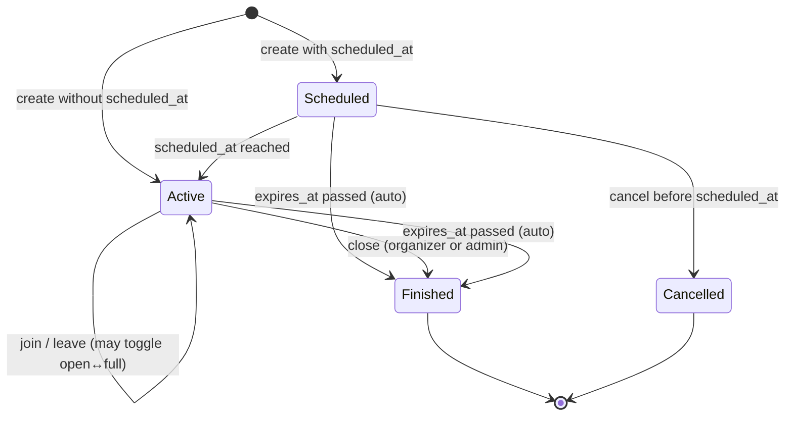

# Product Decisions & Specifications

This document is the official source of truth for approved product decisions, specifications, catalogs, statuses, dependencies, and scope boundaries in the project.

## Documentation Rules

* Every meaningful product/specification decision must be added to this document.
* Every future specification issue must update this document.
* Issues that depend on previous decisions must reference the relevant section.
* Do not change approved decisions silently.
* If a decision changes, add an update note explaining what changed and why.
* This document is intended for project team members, Codex, and future developers.
* This document is not a place for random ideas, temporary notes, or unapproved features.

---

# ISSUE-006 — Define Field Reporting Categories

## Type

Product decision / catalog definition.

## Background

There was no structured way to report problems with fields.

Before building a field reporting system, the official report categories must be defined.

## Goal

Create a fixed official catalog of field report categories.

## Decision

ISSUE-006 is a decision/specification task only.

No code changes are required for ISSUE-006.

The official field report category catalog is approved as follows:

| Hebrew Label  | Internal Key           | Meaning                                                                                         |
| ------------- | ---------------------- | ----------------------------------------------------------------------------------------------- |
| מיקום שגוי    | `wrong_location`       | The field exists, but the map location is incorrect.                                            |
| מגרש לא קיים  | `field_does_not_exist` | The field shown in the app does not exist in reality.                                           |
| מגרש סגור     | `field_closed`         | The field exists, but is closed and cannot currently be used.                                   |
| מגרש בשיפוצים | `under_renovation`     | The field exists but is temporarily under renovation or unusable.                               |
| מגרש פרטי     | `private_field`        | The field is private and not open to the public.                                                |
| כפילות מגרש   | `duplicate_field`      | The same field appears more than once in the app.                                               |
| מידע שגוי     | `wrong_information`    | Field details are incorrect, such as name, sport type, lighting, facilities, or other metadata. |
| אחר           | `other`                | The issue does not fit any of the defined categories.                                           |

## Acceptance Criteria

* All required categories are defined.
* No duplicate categories exist.
* Each category has a clear purpose.
* The catalog is approved for future development.

## Scope

Included:

* Define official categories.
* Define internal keys.
* Define category meanings.

Excluded:

* No database changes.
* No API endpoints.
* No frontend UI.
* No admin dashboard.
* No tests.

## Status

Approved.

---

# ISSUE-007 — Create Field Reports Database Schema

## Type

Database infrastructure specification.

## Dependency

Depends on ISSUE-006.

The `category` field must use the approved category catalog from ISSUE-006.

## Background

A field reporting system cannot be built without a dedicated database structure.

## Goal

Create the database foundation for storing field reports.

## Decision

Create a dedicated database table for field reports.

Table name:

`field_reports`

## Required Columns

| Column        | Type          | Required | Notes                                                   |
| ------------- | ------------- | -------- | ------------------------------------------------------- |
| `id`          | `uuid`        | yes      | Primary key.                                            |
| `field_id`    | `uuid`        | yes      | References `fields(id)`.                                |
| `user_id`     | `uuid`        | yes      | References `users(id)`.                                 |
| `category`    | `text`        | yes      | Must match one of the approved ISSUE-006 category keys. |
| `description` | `text`        | no       | Free text description from the reporting user.          |
| `status`      | `text`        | yes      | Default value: `open`.                                  |
| `created_at`  | `timestamptz` | yes      | Default value: `now()`.                                 |
| `reviewed_at` | `timestamptz` | no       | Nullable. Set when the report is reviewed.              |
| `reviewed_by` | `uuid`        | no       | Nullable. References `users(id)`.                       |

## Approved Category Values

The `category` column must allow only these values:

* `wrong_location`
* `field_does_not_exist`
* `field_closed`
* `under_renovation`
* `private_field`
* `duplicate_field`
* `wrong_information`
* `other`

## Approved Status Values

The `status` column must allow only these values:

| Label     | DB Value    |
| --------- | ----------- |
| Open      | `open`      |
| In Review | `in_review` |
| Resolved  | `resolved`  |
| Rejected  | `rejected`  |

## Constraints

* `category` must be one of the approved ISSUE-006 category values.
* `status` must be one of the approved status values.
* Invalid category values must be rejected.
* Invalid status values must be rejected.
* `reviewed_at` may be null.
* `reviewed_by` may be null.
* `status` must default to `open`.

## Recommended Indexes

Add useful indexes for future filtering and admin review:

* `field_id`
* `user_id`
* `status`
* `created_at`
* optionally `field_id, status`

## Implementation Details

Implemented as database/schema infrastructure only.

Migration file:

`backend/migrations/field_reports.sql`

Schema file:

`backend/schema.sql`

Implemented table:

`field_reports`

Implemented constraints:

* `category` is restricted to the approved ISSUE-006 category values.
* `status` is restricted to `open`, `in_review`, `resolved`, and `rejected`.
* `status` defaults to `open`.
* `field_id` references `fields(id)` and cascades on field deletion.
* `user_id` references `users(id)` and cascades on user deletion.
* `reviewed_by` references `users(id)` and is set to null if the reviewer user is deleted.
* `reviewed_at` is nullable.
* `reviewed_by` is nullable.

Implemented indexes:

* `idx_field_reports_field_id`
* `idx_field_reports_user_id`
* `idx_field_reports_status`
* `idx_field_reports_created_at`
* `idx_field_reports_field_id_status`

## Acceptance Criteria

* The `field_reports` table exists.
* The migration exists.
* The database schema is updated.
* Valid reports can be inserted.
* Reports can be selected after insert.
* Invalid categories are rejected.
* Invalid statuses are rejected.
* Default status is `open`.
* `reviewed_at` and `reviewed_by` can remain null.

## Scope

Included:

* Database migration.
* Schema update if the project keeps `schema.sql` in sync.
* Insert/select validation.
* Backend DB tests if the existing project test structure supports it.

Excluded:

* No frontend UI.
* No report button.
* No report modal.
* No API endpoints unless created in a separate issue.
* No admin dashboard.
* No notifications.
* No image uploads.
* No comments system.
* No severity system.
* No duplicate report aggregation.

## Status

Implemented.

---

# Global Rule For Future Specification Tasks

---

# ISSUE-008 — Create Submit Field Report API

## Type

Backend API implementation.

## Dependency

Depends on ISSUE-007.

The API writes to the `field_reports` table defined in ISSUE-007 and uses the approved ISSUE-006 category catalog.

## Goal

Allow an authenticated user to submit a field report.

## Decision

Create a backend endpoint:

`POST /field-reports`

The endpoint creates a field report with:

* `field_id` from the request.
* `user_id` from the authenticated user.
* `category` from the approved field report category catalog.
* optional `description`.
* `status` controlled by the database default.
* `created_at` controlled by the database.
* `reviewed_at` left null.
* `reviewed_by` left null.

## Request Body

Allowed client fields:

* `field_id`
* `category`
* `description`

Client-controlled review fields are not allowed:

* `status`
* `reviewed_at`
* `reviewed_by`

## Validation

* User must be authenticated.
* `field_id` must exist.
* `category` must be one of the approved ISSUE-006 category values.
* Invalid categories return a validation error.
* Missing fields return a not found error.
* Database insert failures return a clean API error.

## Scope

Included:

* Backend API endpoint.
* Request validation.
* Field existence validation.
* Authenticated user ownership.
* Backend tests for success and error cases.

Excluded:

* No frontend UI.
* No report button.
* No report modal.
* No admin dashboard.
* No notifications.
* No image uploads.
* No comments system.
* No severity system.
* No duplicate report aggregation.

## Status

Implemented.

---

# ISSUE-010 — Create Admin Field Reports Queue

## Type

Admin workflow / frontend and backend API implementation.

## Dependency

Depends on ISSUE-008.

The queue reads reports from the `field_reports` table defined in ISSUE-007 and displays categories from the approved ISSUE-006 catalog.

## Goal

Allow admins to view and triage user-submitted field reports from the existing admin panel.

## Decision

Create an admin-only field reports queue in the admin panel.

Backend endpoint:

`GET /admin/field-reports`

The endpoint is protected by the existing admin authorization requirement and returns reports sorted newest first.

Returned fields include:

* report id
* field id
* field name
* reporter user id
* reporter display name when available
* reporter email when available
* category
* description
* status
* created_at
* reviewed_at
* reviewed_by

## Admin Queue Display

The admin queue displays:

* Field Name
* Report Category
* Reporter
* Date
* Status
* Description

Reports are sorted newest first.

## Filters

The queue supports these status filters:

* All
* Open
* In Review
* Resolved
* Rejected

## Scope

Included:

* Admin-only backend list endpoint.
* Enriched field and reporter data for the queue.
* Admin panel queue UI.
* Status filters.
* Newest-first sorting.
* Backend and frontend tests, including 20-report display coverage.

Excluded:

* No schema changes.
* No frontend field report submission changes.
* No report status update actions.
* No report assignment workflow.
* No notifications.
* No image uploads.
* No duplicate report aggregation.

## Status

Implemented.

---

# ISSUE-011 - Field Report Resolution Workflow

## Decision

Admins can update the lifecycle status of existing field reports from the admin API.

## Backend API Contract

`PATCH /admin/field-reports/{report_id}/status`

Request body:

```json
{ "status": "in_review" }
```

Accepted update statuses:

* `in_review`
* `resolved`
* `rejected`

`open` remains the default creation status and a valid filter/list status, but admins do not set a report back to `open` through the resolution endpoint.

## Review Metadata

Every successful status update persists:

* `status`
* `reviewed_at`
* `reviewed_by`

`reviewed_by` is the authenticated admin user's `users.id`.

## Authorization

The endpoint uses the existing admin authorization requirement. Non-admin users cannot update report status.

## Scope

Included:

* Admin-only backend status update endpoint.
* Status validation.
* Database persistence through the existing `field_reports` table.
* Review metadata updates.
* Backend tests for allowed statuses, invalid status rejection, non-admin rejection, and persisted reviewer metadata.

Excluded:

* No schema changes.
* No frontend status action UI.
* No notifications.
* No report assignment workflow.
* No transition-history audit table.

## Status

Implemented.

---

# ISSUE-013 - Pre-Launch User Management Requirements

## Decision

Ban, Unban, and Suspend are required before launch.

Promote Admin and Demote Admin are not required as regular Admin UI features before launch. Admin role changes should remain manual or super-admin controlled until audit logging, stronger permission controls, and recovery safeguards exist.

## Source Document

See `docs/user-management-requirements.md`.

## Status

Decided.

---

# ISSUE-014 - Admin User List Display

## Decision

The Admin Users list displays User ID, Username, Email, Phone, Created Date, and Status.

The current users data model has no persisted account restriction/status field. Until Ban, Unban, or Suspend are implemented, the Admin Users list displays `Active` as an MVP account-status fallback for users without a real status value.

## Status

Implemented.

---

# ISSUE-015 - Admin User Moderation Actions

## Decision

Admin users can Ban, Unban, Suspend, and Unsuspend regular (non-admin) users. Every action writes an audit log row. Promote Admin and Demote Admin remain out of scope per ISSUE-013.

## DB Shape

### users table additions

* `status text not null default 'active'` — accepted values: `active`, `banned`, `suspended`.
* `restriction_reason text` — required for ban/suspend, cleared on unban/unsuspend.
* `restricted_at timestamptz` — when the current restriction was applied.
* `restricted_by uuid references users(id)` — which admin applied the current restriction.

### user_moderation_audit table

* `id uuid primary key`
* `target_user_id uuid not null references users(id)` — the user being moderated.
* `actor_user_id uuid references users(id)` — the admin performing the action.
* `action_type text not null` — accepted values: `ban`, `unban`, `suspend`, `unsuspend`.
* `reason text` — required for ban/suspend, optional for unban/unsuspend.
* `previous_status text not null` — status before the action.
* `new_status text not null` — status after the action.
* `created_at timestamptz not null default now()`.

## API Contract

* `POST /admin/users/{user_id}/ban` — body `{ "reason": "..." }` (required).
* `POST /admin/users/{user_id}/unban` — body `{ "reason": "..." }` (optional).
* `POST /admin/users/{user_id}/suspend` — body `{ "reason": "..." }` (required).
* `POST /admin/users/{user_id}/unsuspend` — body `{ "reason": "..." }` (optional).

All return `{ "message": "...", "user": { ... } }`.

## Enforcement

Banned and suspended users are blocked from all normal authenticated user workflows via `require_active_user`. Admin endpoints use `require_admin` which does not block restricted admins (admins are never the target of these actions).

## What is included

* Ban, Unban, Suspend, Unsuspend endpoints.
* Audit log table and per-action audit rows.
* Server-side restriction enforcement on all user routes.
* Admin UI actions (Ban/Suspend for active users, Unban for banned, Unsuspend for suspended).
* Hebrew and English labels.

## What is explicitly excluded

* Promote Admin.
* Demote Admin / Remove Admin.
* Role management UI.
* Suspension duration / auto-unsuspend.

## Dependencies

* ISSUE-013 (pre-launch user management decision).
* ISSUE-014 (admin user list display — now extended with real status).

## Status

Implemented.

---

# ISSUE-016 - Future Scheduled Game Cancellation

## Decision

Future scheduled games can be cancelled before their `scheduled_at` start time.

Cancellation is different from closing:

* `close` is an active or started game lifecycle action.
* `cancel` means a future scheduled game will not happen.

## Who can cancel

* The game creator/organizer can cancel their own future scheduled game before `scheduled_at`.
* Admins can cancel any future scheduled game before `scheduled_at`.
* Regular participants cannot cancel the game.

## Cancelled game behavior

* A cancelled game must not be hard deleted.
* A cancelled game remains available for future history, audit, and admin views.
* A cancelled game must not appear in active games.
* A cancelled game must not appear in upcoming joinable games.
* A cancelled game must not appear in field details as an available upcoming game.
* A cancelled game should use a clear `cancelled` status.

Future implementation should preserve:

* `cancelled_at`
* `cancelled_by`
* `cancelled_by_role` or equivalent actor context
* Optional cancellation reason

## Participant notifications

Participants should be notified when a future scheduled game is cancelled.

Notification rules:

* If the creator cancels, notify all participants except the cancelling creator.
* If an admin cancels, notify all participants and the creator.
* If there are no participants, cancellation still succeeds without notifications.

Notification type:

* `scheduled_game_cancelled`

Notification payload should include:

* `game_id`
* `field_id`
* `scheduled_at`
* `cancelled_by`
* `cancelled_by_role`, where available

## Open questions

None. ISSUE-016 leaves no open product questions about future scheduled game cancellation.

## Status

Decided.

---

# ISSUE-017 - Scheduled Game Cancellation Implementation

## Decision

Implements ISSUE-016 product decision. Future scheduled games can be cancelled before `scheduled_at` by the creator or an admin.

## DB Shape

### games table additions

* `cancelled_at timestamptz` — when the cancellation occurred.
* `cancelled_by uuid references users(id)` — who cancelled.
* `cancelled_by_role text` — `"creator"` or `"admin"`.
* `cancel_reason text` — optional free-text reason.

The existing `status` check constraint already includes `'cancelled'`. No constraint change needed.

## API Contract

* `POST /games/{game_id}/cancel` — creator cancels own future scheduled game. Body: `{ "reason": "..." }` (optional).
* `POST /admin/games/{game_id}/cancel` — admin cancels any future scheduled game. Body: `{ "reason": "..." }` (optional).

Both return `{ "message": "Game cancelled", "game": { ... } }`.

### Validation

* Game must be in `open` or `full` status.
* Game must have a `scheduled_at` value (non-scheduled games cannot be cancelled).
* `scheduled_at` must be in the future.
* Creator endpoint: caller must be `created_by`.
* Admin endpoint: caller must have admin role.

## Notification

* Type: `scheduled_game_cancelled`.
* Creator cancels: all participants except creator are notified.
* Admin cancels: all participants and creator are notified.
* No participants: cancellation still succeeds silently.
* Notification payload includes `game_id`, `field_id`, `scheduled_at`, `cancelled_by`, `cancelled_by_role`.

## Filtering

Cancelled games are automatically excluded from `/games/active`, `/games/upcoming`, and field details `upcoming_games` because these queries filter by `ACTIVE_GAME_STATUSES = ["open", "full"]`.

## Dependencies

* ISSUE-016 (product decision).

## Status

Implemented.

---

# ISSUE-019 - Game Lifecycle State Documentation

## Type

Product architecture documentation.

## Dependencies

* ISSUE-016 (cancellation product decision).
* ISSUE-017 (cancellation implementation).

## Goal

Define the official game lifecycle state model so all developers use consistent terminology and understand how games move through states.

## DB Status Values

The `games.status` column accepts exactly four values (enforced by check constraint):

| DB Status     | Terminal? | Description                                    |
| ------------- | --------- | ---------------------------------------------- |
| `open`        | No        | Game exists and has room for more players.     |
| `full`        | No        | Game exists and player count equals max.       |
| `finished`    | Yes       | Game has ended (expired, closed, or finished). |
| `cancelled`   | Yes       | Scheduled game was cancelled before start.     |

Code constant: `ACTIVE_GAME_STATUSES = ["open", "full"]`.

## Lifecycle States

The system uses six lifecycle concepts. Some are real DB statuses, some are derived from timestamps, and some are actions/events.

### 1. Scheduled (derived state)

**What it is:** A game that has not started yet.

**Nature:** Derived state, not a separate DB status. The DB status is `open` or `full`.

**Condition:** `scheduled_at` is not null AND `scheduled_at` is in the future AND `status` is `open` or `full`.

**Code:** `is_game_upcoming(game)` returns `True` when `scheduled_at > now`.

**Appears in:** `/games/upcoming` endpoint. Also visible in admin games list as an active game.

**Does NOT appear in:** `/games/active` endpoint (filtered out by `is_game_started` returning `False`).

**Timestamps:** `scheduled_at` is set at creation. `started_at` is set to `scheduled_at`. `expires_at` is set to `scheduled_at + 2 hours`.

**Exit transitions:**
* Time passes and `scheduled_at <= now` → game becomes **Active**.
* Creator or admin cancels before `scheduled_at` → game becomes **Cancelled**.
* `expires_at` passes (only possible if `expires_at` was not extended) → auto-finished to **Finished**.

### 2. Active (derived state)

**What it is:** A game currently in progress that players can join, leave, or interact with.

**Nature:** Derived state. The DB status is `open` or `full`.

**Condition:** `status` is `open` or `full` AND the game is not expired AND either `scheduled_at` is null (instant game) or `scheduled_at <= now`.

**Code:** `is_game_started(game)` returns `True` when `scheduled_at` is null or `scheduled_at <= now`. `is_game_expired(game)` returns `False`.

**Appears in:** `/games/active` endpoint. Also visible in admin games list.

**Available actions:** Join, Leave, Close, Extend.

**Timestamps:** `started_at` marks when the game began (either `now()` for instant games or `scheduled_at` for scheduled games). `expires_at` marks when the game auto-finishes (default: `started_at + 2 hours`).

**Exit transitions:**
* Organizer or admin closes the game → **Finished** (via Close action).
* `expires_at` passes → auto-finished to **Finished** (via `finish_expired_games`).
* Organizer extends → remains **Active** with updated `expires_at` (via Extend action).

### 3. Extended (action/event)

**What it is:** The act of pushing a game's end time further into the future.

**Nature:** An action/event, not a DB status or derived state. After extending, the game remains `open` or `full`.

**Condition:** Game must be active (status `open`/`full`, not expired). Only the organizer (`created_by`) or an admin can extend.

**Effect:** `expires_at` is updated to `current expires_at + 1 hour`. No status change occurs.

**API:** `POST /games/{game_id}/extend` (organizer), `POST /admin/games/{game_id}/extend` (admin).

**Notification:** `game_extended` notification sent to participants.

### 4. Finished (DB status)

**What it is:** A game that has ended, either naturally or by explicit close action.

**Nature:** Real DB status value (`finished`). Terminal state — no transitions out.

**Entry conditions (any of these):**
* Organizer calls `POST /games/{game_id}/close`.
* Admin calls `POST /admin/games/{game_id}/close`.
* `expires_at` passes and `finish_expired_games` auto-transitions the game.

**Appears in:** Admin finished games list. Does NOT appear in `/games/active` or `/games/upcoming`.

**Timestamps:** `expires_at` may or may not have passed. There is no dedicated `finished_at` column; the transition is inferred from the status change.

### 5. Closed (action)

**What it is:** The explicit action of ending a game early, before `expires_at`.

**Nature:** An action, not a separate DB status. The close action sets `status = 'finished'`.

**Who can close:**
* The game organizer (`created_by`) via `POST /games/{game_id}/close`.
* An admin via `POST /admin/games/{game_id}/close`.

**Precondition:** Game must be active (`open`/`full`, not expired). Checked by `ensure_game_is_actionable`.

**Result:** Game enters the **Finished** DB status. A `game_closed` notification is sent to participants.

**Difference from Finished:** "Closed" is how you get to "Finished" manually. "Finished" is also reached automatically when `expires_at` passes. Both result in the same terminal DB status `finished`.

### 6. Cancelled (DB status)

**What it is:** A scheduled game that was called off before its start time.

**Nature:** Real DB status value (`cancelled`). Terminal state — no transitions out.

**Condition:** Game must have `scheduled_at` in the future AND status must be `open` or `full` at the time of cancellation.

**Who can cancel:**
* The game organizer via `POST /games/{game_id}/cancel`.
* An admin via `POST /admin/games/{game_id}/cancel`.

**Cancellation metadata columns:**
* `cancelled_at` — when the cancellation occurred.
* `cancelled_by` — user ID of who cancelled.
* `cancelled_by_role` — `"creator"` or `"admin"`.
* `cancel_reason` — optional free text.

**Appears in:** Admin finished games list (alongside `finished` games). Does NOT appear in `/games/active` or `/games/upcoming`.

**Notification:** `scheduled_game_cancelled` sent to participants. Creator cancellation excludes the creator from notifications. Admin cancellation notifies all participants including the creator.

**Difference from Close/Finished:** Cancellation is only for future scheduled games that have not started. Closing is for active/started games. Both are terminal but use different DB status values (`cancelled` vs `finished`).

## Timestamp Roles

| Column         | Set when                                       | Purpose                                                     |
| -------------- | ---------------------------------------------- | ----------------------------------------------------------- |
| `scheduled_at` | Game creation (if scheduled)                   | Future start time. Null for instant games.                  |
| `started_at`   | Game creation                                  | `scheduled_at` for scheduled games, `now()` for instant.    |
| `expires_at`   | Game creation, updated on extend               | Auto-finish deadline. Default: `started_at + 2 hours`.      |
| `cancelled_at` | Cancellation action                            | When the game was cancelled. Null if not cancelled.         |

## Visibility Rules

| Query                  | Filter logic                                                          | Shows                        |
| ---------------------- | --------------------------------------------------------------------- | ---------------------------- |
| `/games/active`        | `status in (open, full)` AND not expired AND `is_game_started = True` | Currently playable games     |
| `/games/upcoming`      | `status in (open, full)` AND not expired AND `is_game_upcoming = True`| Future scheduled games       |
| `/admin/games?active`  | `status in (open, full)` AND not expired                              | All non-terminal games       |
| `/admin/games?finished`| `status in (finished, cancelled)`                                     | All ended/cancelled games    |
| Field upcoming games   | `status in (open, full)` for the field                                | Active + upcoming for field  |

Cancelled and finished games are automatically excluded from active/upcoming queries because they are not in `ACTIVE_GAME_STATUSES`.

## State Flow Diagram



## Key Clarifications

1. **Scheduled vs Active:** Both use DB status `open` or `full`. The difference is whether `scheduled_at` is in the future (Scheduled) or in the past/null (Active). There is no `scheduled` DB status value.

2. **Closed vs Finished:** "Closed" is the user action (`POST .../close`). "Finished" is the resulting DB status. A game can also become `finished` automatically when `expires_at` passes, without anyone explicitly closing it.

3. **Cancellation vs Close:** Cancellation applies only to future scheduled games before `scheduled_at`. Closing applies to active/started games. They produce different terminal DB statuses (`cancelled` vs `finished`) and different notifications (`scheduled_game_cancelled` vs `game_closed`).

4. **Extended is not a state:** Extending updates `expires_at` by +1 hour. The game remains `open` or `full`. There is no `extended` DB status.

5. **Auto-finish:** `finish_expired_games()` runs on every active/upcoming query. If `expires_at` has passed, the game is silently transitioned to `finished`. This is the garbage-collection mechanism for games that were never explicitly closed.

## Status

Documented.

---

For every future product decision, specification, catalog, status definition, database design decision, API contract decision, or scope decision:

1. Update this document.
2. Add the relevant issue number.
3. Document the decision.
4. Document dependencies.
5. Document accepted values, statuses, categories, or contracts.
6. Document what is included.
7. Document what is explicitly excluded.
8. Keep the document clean and structured.
9. Do not mix unapproved ideas into this file.
10. Treat this file as the official source of truth for the project.

---

# Codex Task Boundaries

For this task:

Do:

* Create `docs/product-decisions.md`.
* Add all content above.
* Keep formatting clean.
* Show which files changed.

Do not:

* Modify backend code.
* Modify frontend code.
* Modify migrations.
* Modify schema.
* Modify `.env` files.
* Add tests.
* Create new features.
* Change existing behavior.
